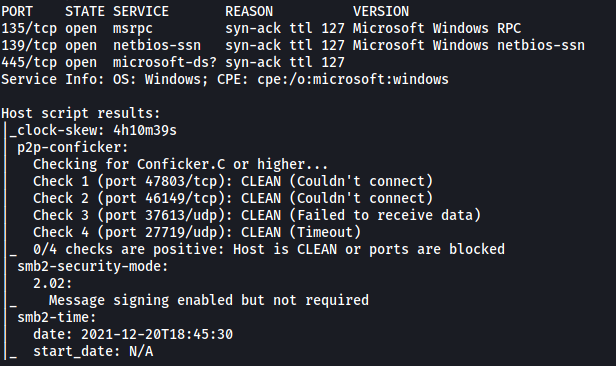
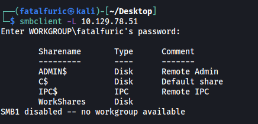
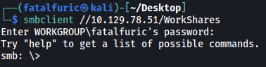
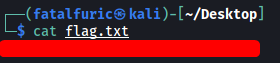

|  | Difficulty |  |  IP Address   |  | Room Link |  |
|--| :--------: |--|:------------: |--| :--------:|--|
|  |  Very Easy |  |  10.129.78.51 |  | [Dancing](https://app.hackthebox.com/starting-point) |  |

---

### [ What does the 3-letter acronym SMB stand for? ]

Server Message Block

---

### [ What port does SMB use to operate at? ]

445

---

### [ What network communication model does SMB use, architecturally speaking? ]

Client-Server Model

---

### [ What is the service name for port 445 that came up in our nmap scan? ]

Let's run an nmap scan on the target. We use `-sC` to load in standard scripts, `-sV` for version enumeration, `-vv` for increased verbosity and `-T4` for increased aggressiveness:

```
sudo nmap -sC -sV -vv -T4 10.129.78.51
```



From the scan, we can see that the service name for port 445 is **microsoft-ds**.

*(This is the name given to port 445 used by Samba)*

---

### [ What is the tool we use to connect to SMB shares from our Linux distribution? ]

smbclient

---

### [ What is the `flag` or `switch` we can use with the SMB tool to `list` the contents of the share? ]

`-L`

---

### [ What is the name of the share we are able to access in the end? ]

Let's use `smbclient` to list out the shares we can access:

```
smbclient -L 10.129.78.51
```



We can see that we are able to access the **WorkShares** share.

---

### [ What is the command we can use within the SMB shell to download the files we find? ]

Similar to FTP, we can use the `get` command to download files.

---

### [ Submit root flag ]

Let's log into the **WorkShares** share:

```
smbclient //10.129.78.51/WorkShares
```



There are 2 directories in the share: **Amy.J** and **James.P**

The **root flag** can be found in James.P!

We can use `get` to download it and read the flag locally:


