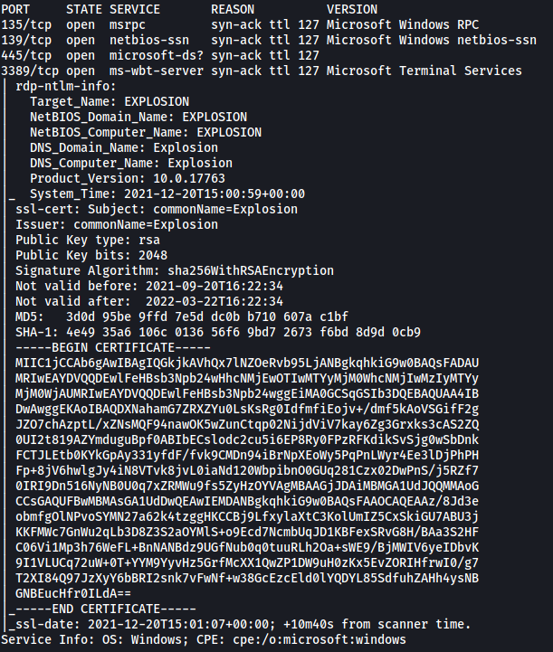
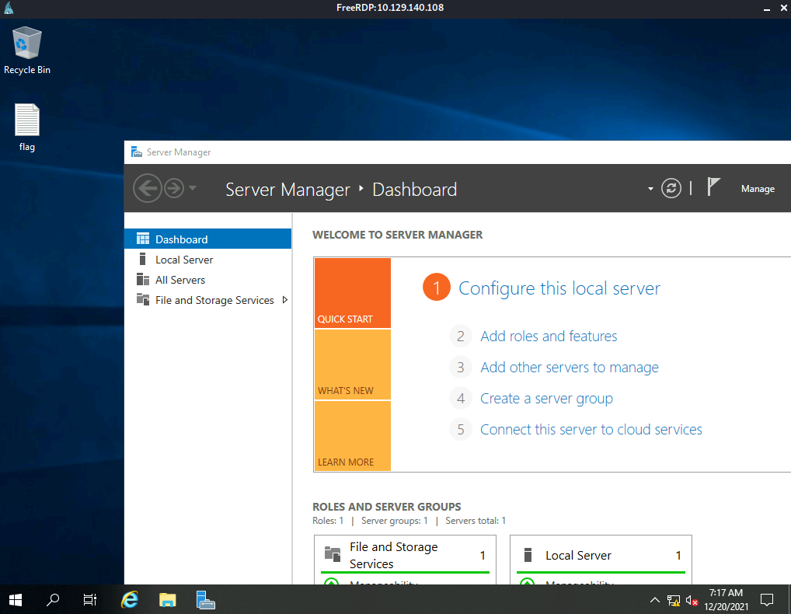
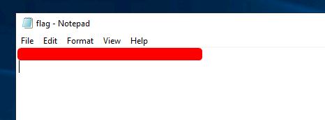

|  | Difficulty |  |  IP Address   |  | Room Link |  |
|--| :--------: |--|:------------: |--| :--------:|--|
|  |  Very Easy |  |10.129.140.108 |  | [Tier 0: Explosion](https://app.hackthebox.com/starting-point) |  |

---

### [ What does the 3-letter acronym RDP stand for? ]

Remote Desktop Protocol

---

### [ What is a 3-letter acronym that refers to interaction with the host through a command line interface? ]

CLI

---

### [ What about graphical user interface interactions? ]

GUI

---

### [ What is the name of an old remote access tool that came without encryption by default? ]

telnet

---

### [ What is the concept used to verify the identity of the remote host with SSH connections? ]

Public-key Cryptography

---

### [ What is the name of the tool that we can use to initiate a desktop projection to our host using the terminal? ]

xfreerdp

---

### [ What is the name of the service running on port 3389 TCP? ]

Let's run a basic nmap scan on our target machine. We use `-sC` to load in standard scripts, `-sV` for version enumeration, `-vv` for increased verbosity and `-T4` for increase aggressiveness:

```
sudo nmap -sC -sV -vv -T4 10.129.140.108
```



From the results, we can see that **ms-wbt-server** is running on port **3389**.

---

### [ What is the switch used to specify the target host's IP address when using xfreerdp? ]

`/v:`

---

### [ Submit root flag ]

Let's log into the machine using `xfreerdp`:

```
xfreerdp /u:Administrator /v:10.129.140.108
```

We use a commonly used username for Windows machines:

> Administrator 

As for the password, let's hope that password authentication is not enabled...



Nice, looks like we don't actually need to input a password to login!

The **root flag** can be found on the desktop:


