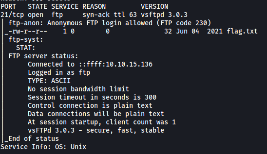
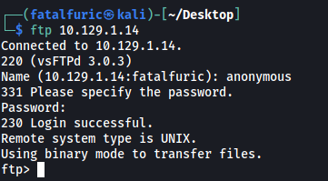
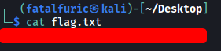

| Difficulty |  |  IP Address   |  |
| :--------: |--| :-----------: |--|
|  Very Easy |  |  10.129.1.14  |  |

---

### [ What does the 3-letter acronym FTP stand for? ]

File Transfer Protocol

---

### [ What communication model does FTP use, architecturally speaking? ]

Client-Server Model

---

### [ What is the name of one popular GUI FTP program? ]

Filezilla

---

### [ Which port is the FTP service active on usually? ]

By default, FTP runs on port **21 - TCP**.

---

### [ What acronym is used for the secure version of FTP? ]

SFTP

---

### [ What is the command we can use to test our connection to the target? ]

`ping`

---

### [ From your scans, what version is FTP running on the target? ]

We can run a basic nmap scan with:

```
sudo nmap -sC -sV -vv -T4 10.129.1.14
```

*-sC loads in standard nmap enumeration scripts*

*-sV carries out version enumeration*

*-vv is for increased verbosity*

*-T4 increases the aggressiveness of the scan, which improves the speed*



From the results, we can see that the version of FTP is **vsftpd 3.0.3** 

---

### [ From your scans, what OS type is running on the target? ]

Similarly, the scan reveals that the target is running **Unix**.

---

### [ Submit root flag ]

The nmap scan tells us that **anonymous login** is enabled on the FTP server. This means that we can log into the server without needing to authenticate ourselves. All we have to do is to use the username: **anonymous** and input a blank password.

```
ftp 10.129.1.14
```



And we're in!

The **root flag** can be found in the FTP server. We simply download it onto our local machine using `get` and read it locally:


