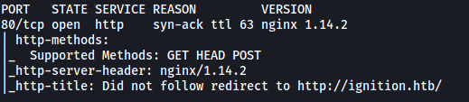
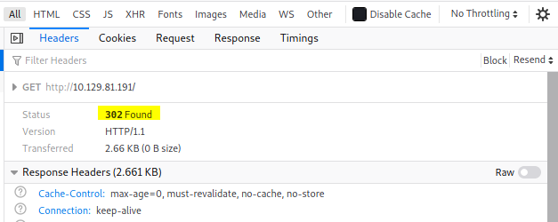
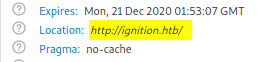
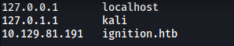
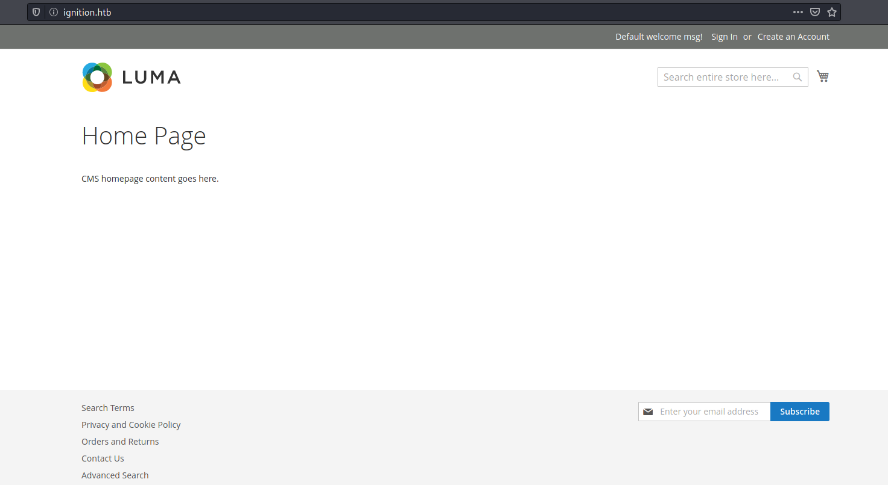
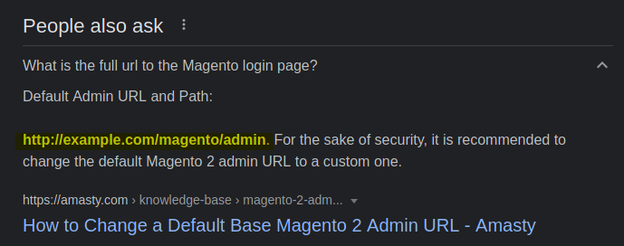
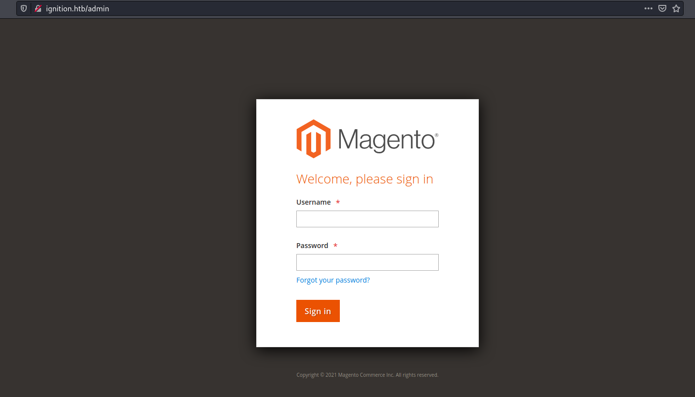
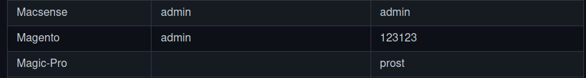
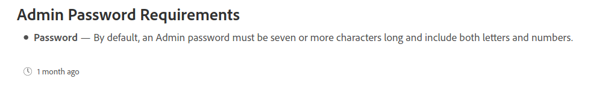
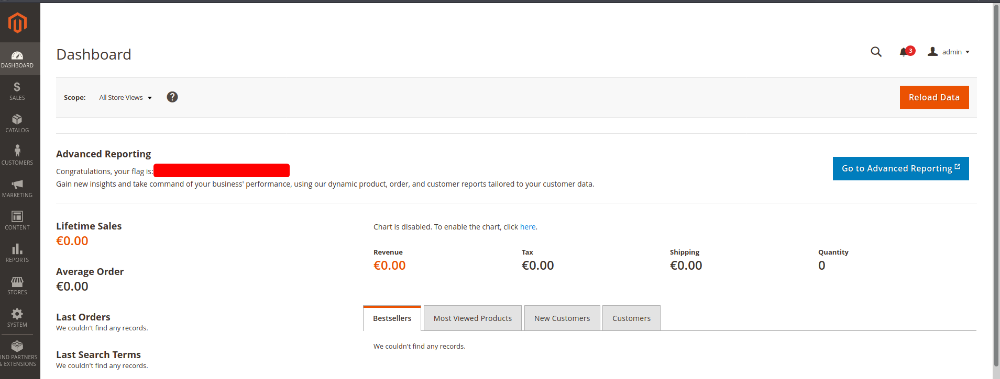

|  | Difficulty |  |  IP Address   |  | Room Link |  |
|--| :--------: |--|:------------: |--| :--------:|--|
|  |  Very Easy |  | 10.129.81.191 |  | [Tier 1: Ignition](https://app.hackthebox.com/starting-point) |  |

---

### [ Which service version is found to be running on port 80? ]

Let's run an nmap scan on the target machine. We load in standard scripts (-sC) and enable version enumeration (-sV).

```
sudo nmap -sC -sV -vv -T4 10.129.81.191
```



There is only 1 port open: **80 (HTTP)**

The service version running is: **nginx 1.14.2**

---

### [ What is the 3-digit HTTP status code returned when you visit http://{machine IP}/? ]



Status code: **302**

---

### [ What is the virtual host name the webpage expects to be accessed by? ]

From the **location** header of the request, we can see that we are redirected to: `http://ignition.htb/` 

*(The location header indicates a url to redirect the page to)*



Virtual host name: **ignition.htb**

---

### [ What is the full path to the file on a Linux computer that holds a local list of domain name to IP address pairs? ]

/etc/hosts

---

### [ What is the full URL to the Magento login page? ]

Let's update our /etc/hosts file accordingly:



Now if we visit `http://ignition.htb`, we are brought to the following page:



The website is using the **Magento** CMS.

We could use Gobuster to enumerate the Magento login page, but sometimes a simple Google search will suffice. Let's try searching for 'Magento login page url':



Looks like the login page can be found at **/admin**:



Yep that works!

Full url to Magento login page: `http://ignition.htb/admin`

---

### [ What password provides access as admin to Magento? ]

I first tried some common credentials like **admin:admin**. However those did not work.

Next, I checked what Magento's default admin credentials were from this [page](https://github.com/ihebski/DefaultCreds-cheat-sheet):



Unfortunately, the default credentials **admin:123123** did not work as well.

I then took a closer look at the [documentation](https://docs.magento.com/user-guide/stores/security-admin.html) for Magento: 



Looks like the password needs to be 'seven or more characters long' and include both 'letters and numbers'.

I then searched for passwords that were most commonly used, eventually coming across this [website](https://nordpass.com/most-common-passwords-list/).

I went down the list, trying all passwords that fit the password requirements.

The password that worked in the end was:

> qwerty123

---

### [ Submit root flag ]

With the password found, we can log into Magento.

The **root flag** can be found on the dashboard:


