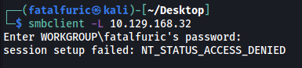
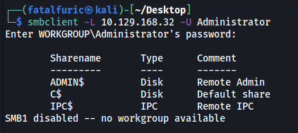
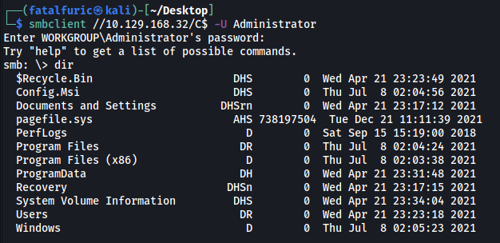
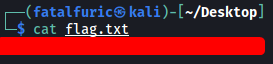

|  | Difficulty |  |  IP Address   |  | Room Link |  |
|--| :--------: |--|:------------: |--| :--------:|--|
|  |  Very Easy |  | 10.129.168.32 |  | [Tier 1: Tactics](https://app.hackthebox.com/starting-point) |  |

---

### [ Which Nmap switch can we use to enumerate machines when our packets are otherwise blocked by the Windows firewall? ]

`-Pn`

---

### [ What does the 3-letter acronym SMB stand for? ]

Server Message Block

---

### [ What port does SMB use to operate at? ]

445

---

### [ What command line argument do you give to `smbclient` to list available shares? ]

`-L`

---

### [ What character at the end of a share name indicates it's an administrative share? ]

***From wiki:** Administrative shares are hidden network shares created by Windows NT family of operating systems that allow system administrators to have remote access to every disk volume on a network-connected system. These shares may not be permanently deleted but may be disabled. Administrative shares cannot be accessed by users without administrative privileges.*

*The $ is appended to the end of the share to make it hidden.* 

Character: `$`

---

### [ Which Administrative share is accessible on the box that allows users to view the whole file system? ]

Let's try to use `smbclient` to list out the shares that we can access:

```
smbclient -L 10.129.168.32
```



Looks like we need to obtain a valid set of credentials.

I tried various combinations of common credentials, eventually finding out that **passwordless login** is enabled for the **Administrator** account. This means that no password is required to log into that account:

```
smbclient -L 10.129.168.32 -U Administrator
```

*(The -U option is used to specify the username to login as)*



The share that allows us to view the entire filesystem is **C$**

---

### [ What command can we use to download the files we find on the SMB Share? ]

`get`

---

### [ Which tool that is part of the Impacket collection can be used to get an interactive shell on the system? ]

I did some research, coming across this [website](https://www.sans.org/blog/psexec-python-rocks/).

Tool: **psexec.py**

---

### [ Submit root flag ]

Instead of using psexec.py from impacket, we can simply log into the SMB server directly using `smbclient`:

```
smbclient //10.129.168.32/C$ -U Administrator
```

Here, we are logging into the **C$** share, which will grant us access to the entire file system!



Once in, we can find the root flag in `C:\Users\Administrator\Desktop\`.

We download the **root flag** using the `get` command and then read it locally:


