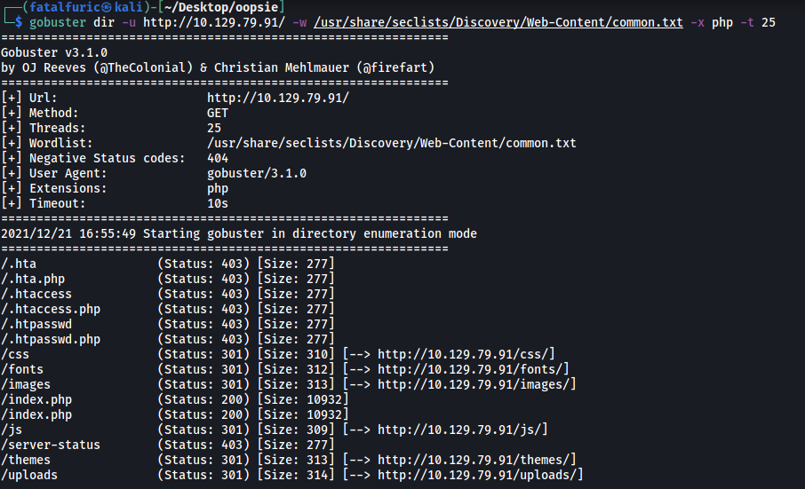
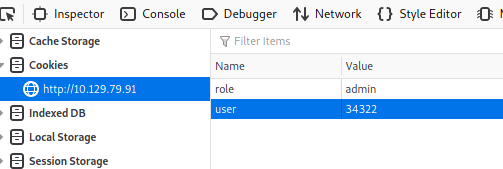

|  | Difficulty |  |  IP Address   |  | Room Link |  |
|--| :--------: |--|:------------: |--| :--------:|--|
|  |  Very Easy |  | 10.129.79.91  |  | [Tier 2: Oopsie](https://app.hackthebox.com/starting-point) |  | 

---

### [ With what kind of tool can intercept web traffic? ]

Proxy

---

### [ What is the path to the directory on the webserver that returns a login page? ]

As always, let's start off with a basic nmap scan on the target machine. We load in standard scripts (-sC) and enable version enumeration (-sV):

```
sudo nmap -sC -sV -vv -T4 10.129.79.91
```


Looks like ports **22 (SSH)** and **80 (HTTP)** are open.

Let's check out the HTTP website first:


Seems that we have some sort of automotive website.

Let's go ahead and run a Gobuster scan to enumerate any hidden directories. We make sure to check for **.php** files by using the `-x` option:

```
gobuster dir -u http://10.129.79.91/ -w /usr/share/seclists/Discovery/Web-Content/common.txt -x php -t 25
```



The scan does reveal some interesting directories, such as **/uploads**, but ultimately did not find any directory that led to a login page.

I tried some other wordlists but the results were the same. Hitting this dead-end, I decided to look at the source code of the main page:


At the bottom of the code, we actually find the directory that returns a login page!

Path: **/cdn-cgi/login**

---

### [ What can be modified in Firefox to get access to the upload page? ]

Cookie

---

### [ What is the access ID of the admin user? ]

Let's visit `http://http://10.129.79.91/cdn-cgi/login/`:


We don't have any valid admin credentials right now, so let's go ahead and login as a guest first.

After logging in, we are brought to this page:


There are a bunch of pages that we can access from here. However, the **Uploads** page is only accessible to the admin account.

Let's check out what cookies are assigned to us when we logged in. We can do so by checking the **Storage** section in Developer Tools (ctrl-shift-i):


As we can see, there are 2 cookies: **role** and **user**

We could try to change the value of **role** from 'guest' to 'admin', but we also have to change the value of **user** to the access ID of the admin user. If not, we won't be able to hijack the admin's account.

To find out the access ID of the admin, we can head over to the **Account** section of the web page:


On this page, we can see the access ID of the guest account being displayed. Pay attention to the URL:


An `id` parameter has been set to a value of **'2'**. Normally, the administrator account's ID will be the very first. So what if we set this `id` parameter to **'1'**?


The access ID of the admin is now displayed!

Admin access ID: **34322**

---

### [ On uploading a file, what directory does that file appear in on the server? ]

Let's now change our cookie values accordingly so that we get admin privileges:



With the cookies set, we refresh the page and can now access the **Upload** page:


Since we can upload files, let's try uploading a PHP reverse shell. I'll be using the reverse shell from [pentestmonkey](https://github.com/pentestmonkey/php-reverse-shell). I uploaded the file as 'rev.php':


Nice! We've managed to upload the script! Now we need to find where it has been uploaded to.

Remember the **/uploads** subdirectory from earlier? It would make sense that any files we upload would end up there. While we might not have the permissions to directly access it, what if we try to access a file that is within the directory?

Let's set up a netcat listener and visit the following url: `http://10.129.79.91/uploads/rev.php`


The reverse shell was opened and we're in!

Directory that file appears in: **/uploads**

---

### [ What is the file that contains the password that is shared with the robert user? ]

Looking around the machine, I managed to find some interesting files in **/var/www/html/cdn-cgi/login**:


What caught my eye was the **db.php** file. Let's check it out:


Sure enough, we have robert's mySQL credentials:

> robert : M3g4C0rpUs3r!

File that contains password: **db.php**

---

### [ What executable is run with the option "-group bugtracker" to identify all files owned by the bugtracker group? ]

`find`

---

### [ Regardless of which user starts running the bugtracker executable, what's user privileges will use to run? ]

We've found robert's mysql password. Perhaps this password is also his password on the machine? Let's try to `su` into his account.


Great, we're now in his account!

Using `id`, we can see that robert is part of the **bugtracker group**:


The room also mentions a **bugtracker executable**. Let's locate it on the machine using `find`:

```
find / -iname '*bugtracker*' 2>/dev/null
```


Looks like the executable is in /usr/bin. Let's check its permissions:


Interesting! Notice how the **SUID-bit** is set (-rw**s**r-...). Since the owner of the executable is root, this means that when any user runs the file, it will be run with root privileges.

---

### [ What SUID stands for? ]

Set Owner User ID

---

### [ What is the name of the executable being called in an insecure manner? ]

Let's take a look at the bugtracker executable using `ltrace`:

```
ltrace bugtracker
```

When prompted to input a bug ID, I inputted a test value of **'1'**:


`ltrace` shows us the library calls that are made during runtime of the bugtracker executable. We can see that the `cat` command is being called in an insecure manner.

---

### [ Submit user flag ]

On a side note, since we are already in robert's account, we can simply obtain the **user flag** in his home directory:


---

### [ Submit root flag ]

Going back to bugtracker, notice how our test value of **'1'** is appended to the end of `cat /root/reports/`. This introduces a vulnerability as we can carry out some simple directory traversal to read out the root flag from /root.

All we have to do is supply `../root.txt` to the executable. This will cause bugtracker to run `cat /root/reports/../root.txt`.

Let's try it out:


And we've got the **root flag**!
