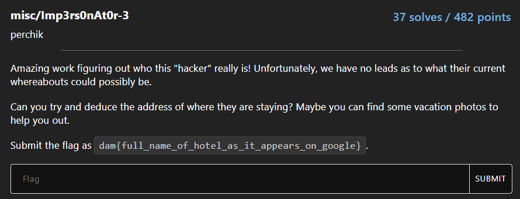
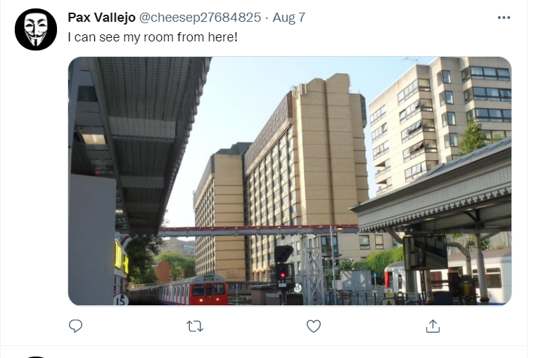
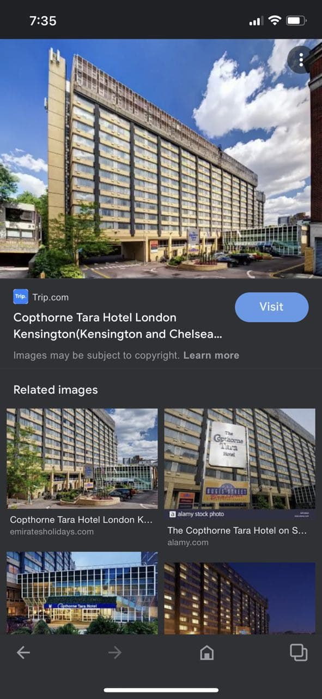

| Attachments |
| :---------: |
|     nil     |

---

### Challenge:

---

***Note:** This challenge is a continuation from Imp3rs0nAt0r-2.*

From Imp3rs0nAt0r-2, we managed to find the full name of the hacker:

> Pax Vallejo

We now need to do a bit of OSINT in order to find out where Pax is currently staying at. The challenge prompt tells us to find some vacation photos to help us out. This implies that Pax can most probably be found on some social media site where users normally upload photos.

After checking through most of the common social media sites, I stumbled across Pax's **Twitter** account:

Nice! He has also uploaded five different photos. The one that interests me the most is the first photo that he uploaded:

From the caption, we can tell that the building shown in the photo is the hotel that Pax is staying at!

At this point, my first thought was to use Google Maps to try and obtain the name of the hotel. I tried to use landmarks from the other photos to pinpoint the location of the building. One clue that I got was that the hotel was near the train tracks, and one of the other photos showed a train station: **Canary Wharf**. From there, I tried to search for nearby hotels, but could not find one that looked like the hotel that we are searching for.

I was unable to find the building, so I decided to forgo the use of Google Maps and use some image recognition software to identify the building instead. Fortunately for us, Google also provides a powerful tool called [Google Lens](https://lens.google/).

I loaded the photo into Google Lens, scrolled through the visual matches until I found this photo:

With that, we've found the hotel that Pax is staying at:

> Copthorne Tara Hotel London Kensington 

Flag: **dam{copthorne_tara_hotel_london_kensington}**

