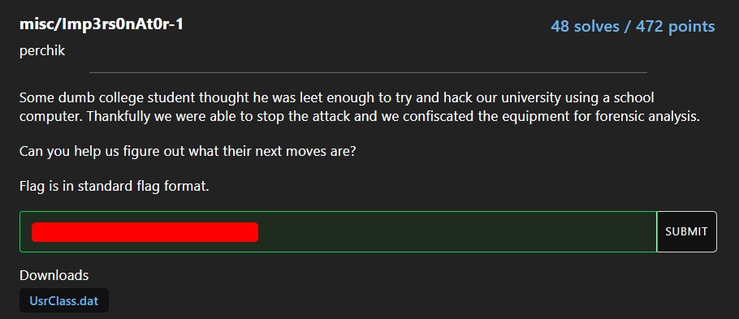
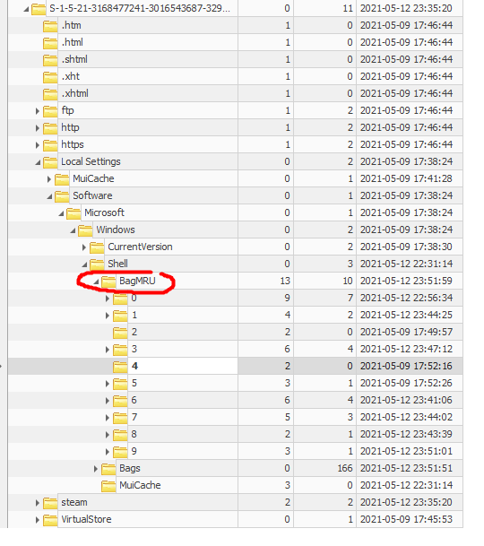
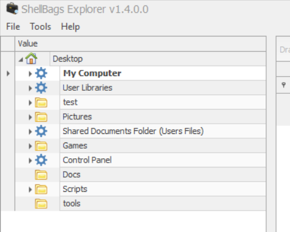
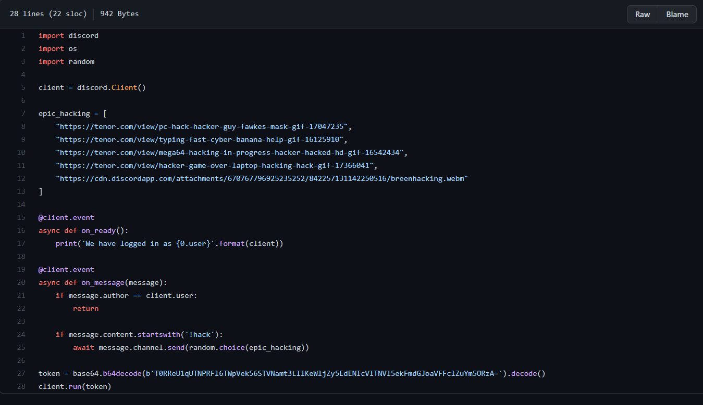

| Attachments |
| :---------: |
|[UsrClass.dat](../assets/files/DAM2021_Imp3rs0nAt0r-1/UsrClass.dat) |

---

### Challenge:



---

I first tried to find out what type of file **UsrClass.dat** was. Using `file`, I found out that it was a **Windows Registry File**:


---

*Windows Registry Files contains critical information related to how the operating system works. It is a database that contains windows settings, application settings, driver device information and so on. More information can be found [here](https://www.businessnewsdaily.com/10991-windows-10-registry.html).*

---

I then opened up the registry file using a tool called [RegistryExplorer](https://ericzimmerman.github.io/#!index.md). This allows us to view its contents.

I had no prior experience working with this type of files, so I honestly didn't really know what to look for at first. After digging around for a bit, I found some interesting data located in the **BagMRU** key:



The BagMRU key contained numerous numbered sub-keys. The values stored within these sub-keys caught my attention as I could make out names of programs and common directories:

**Example 1:**


**Example 2:**


After doing more research on the **BagMRU** and **Bags** keys, I came across this [article](https://www.hackingarticles.in/forensic-investigation-shellbags/).

It turns out that they are actually **Windows Shell Bags**, which are registry keys used to improve user experience and recall user's preferences when needed. With these shell bags, we can map out the folders that exist on the user's computer. As recommended by the article, I used a tool called [ShellBagsExplorer](https://ericzimmerman.github.io/#!index.md) to help us map out the file system.

After ShellBagsExplorer is done parsing through the registry file, we can see the various drives and folders that exist on the user's computer:



While we cannot actually see the contents of the files within the folders, I came across a few interesting folders in the user's **E: drive**:


From the **.git** sub-folders, I knew that these folders were actually Github repositories!  

I found them on Github created by a user called **nc-lvnp**:


I looked through all of the repositories, and the one that stood out was the **h4ckerman-3000-bot** repo.

---

*Note: Originally, we had to navigate to the history page for the **bot.py** file located within the repo so as to obtain an earlier commit. This earlier commit contained the **Discord Bot token** which we can use to move on with the challenge.*


*However, I guess there were some issues with the token during the CTF, so the mods eventually just included a working token in the latest version without hiding it.* 

---

**Contents of bot.py**



We can see that bot.py is actually a script that runs a basic Discord bot. At the bottom, we can see that the base64-encoded bot authentication token is actually exposed!


Decoding it gives us the bot token:

> ODQyMjQ3ODYzMjUzNzI5Mjkw.YJyicg.DtCHqYS5YyzAftbhiQErVnbnNG0

With this token, we can use the Discord API to find out more information about the hacker and his plans. To do so, I'll use the **discord.py** wrapper. Documentation can be found [here](https://discordpy.readthedocs.io/en/stable/api.html). 

**Test script to see if we can log in with the bot token:**

```python
import discord

client = discord.Client()

@client.event
async def on_ready():
    print('We have logged in as {0.user}'.format(client))

client.run('ODQyMjQ3ODYzMjUzNzI5Mjkw.YJyicg.DtCHqYS5YyzAftbhiQErVnbnNG0')
```

**Results:**


Nice! The token works and we are logged in as the bot **wtfisthis**. 

Next, we need to find out what guilds the bot is in.

**Enumerate guilds/servers that bot is in:**

```python
@client.event
async def on_ready():
    print('We have logged in as {0.user}'.format(client))
    print(list(client.guilds))
```

 **Results:**


Looks like the bot is in a guild called **h4cker's an0nymou5**. Now let's find out what channels exist within this guild.

**Enumerate channels using guild id:**

```python
@client.event
async def on_ready():
    print('We have logged in as {0.user}'.format(client))
    print(client.get_guild(842247340744376340).channels)
```

**Results:**


**We have a list of channels:**

* Text Channels
* Voice Channels
* g3n3ral
* t0p-53cr3t-l33t-h4x0r-ch4nn3l
* l33t-m3mz

The channel that really interests me is **t0p-53cr3t-l33t-h4x0r-ch4nn3l**. If there is any information relating to the hacker's plans, it would most probably be found here. With the channel id, we can dump the entire message history of the channel using the `history` [function](https://discordpy.readthedocs.io/en/stable/api.html#discord.Member.history).

**Dump out channel messages:**

```python
@client.event
async def on_ready():
    print('We have logged in as {0.user}'.format(client))
    channel = client.get_guild(842247340744376340).get_channel(842252598173892629)
    message_hist = await channel.history(limit=123).flatten()
    for i in message_hist:
        msg = await channel.fetch_message(i.id)
        print(i.author.name + " : " + msg.content)
```

**Snippet of results:**


And we have successfully obtained the discord messages that were sent between the hacker (nc-lvnp) and his hacker buddy (WholeWheatBagels). There were a lot of messages and I noticed an interesting message at the start of the chain:


There's a mention of an **attachment**, followed by a blank message. I guessed that the blank message actually contained the attachment file. We need to obtain the message id of that specific message before we can extract the attachment. Note that the attachment message is the fourth-last message in the 'message_hist' list.

**Obtain id of message with attachment:**

```python
@client.event
async def on_ready():
    print('We have logged in as {0.user}'.format(client))
    channel = client.get_guild(842247340744376340).get_channel(842252598173892629)
    message_hist = await channel.history(limit=123).flatten()
    print(message_hist[-4])
```

**Results:**


**Message id:** 

> 842536367761784853

Finally, we can extract the attachment using the **attachments** [attribute](https://discordpy.readthedocs.io/en/stable/api.html#discord.Message.attachments) of the Message object. 

```python
@client.event
async def on_ready():
    print('We have logged in as {0.user}'.format(client))
    channel = client.get_guild(842247340744376340).get_channel(842252598173892629)
    msg = await channel.fetch_message(842536367761784853)
    print(msg.attachments)
```

**Results:**


Clicking on the attachment url located in the result prompts us to download a text file:


And we have the flag! :smile:

