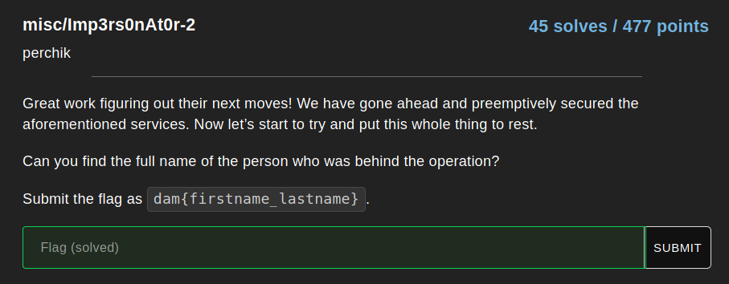
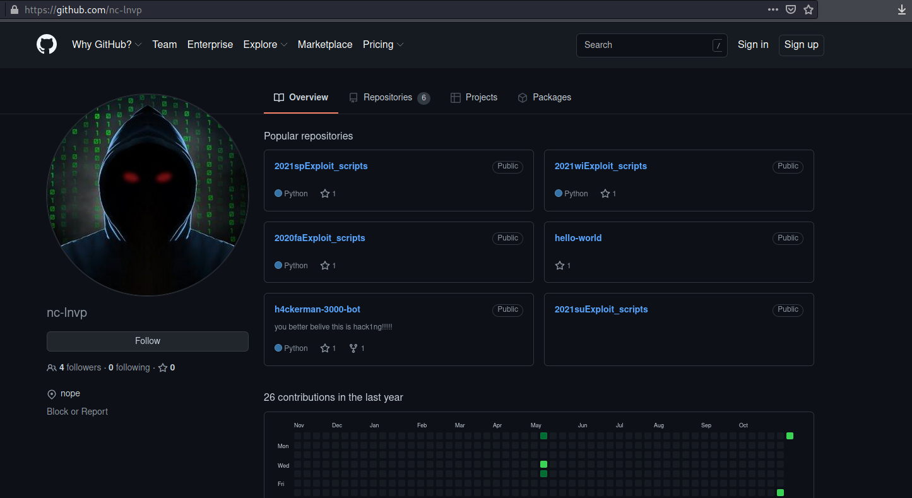
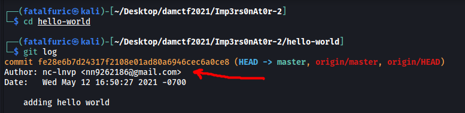
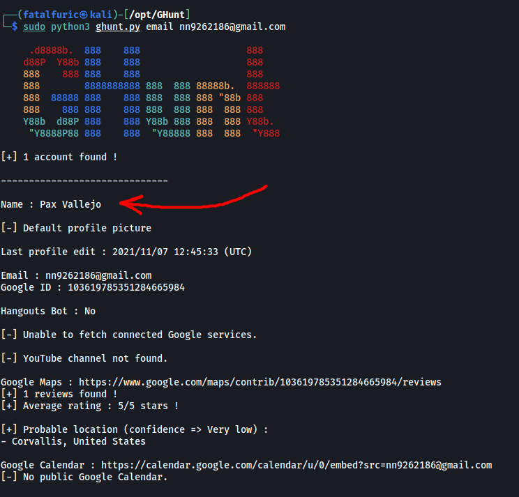

| Attachments |
| :---------: |
|     nil     |

---

### Challenge:



---

Looks like we have a nice little OSINT challenge on our hands!

***Note:** This challenge is a continuation from Imp3rs0nAt0r-1, but we do not need to fully complete the first part in order to solve this challenge.*

From Imp3rs0nAt0r-1, we managed to find the Github Page of the hacker, with username: **nc-lnvp**



I first tried checking if the username **nc-lnvp** existed on other services, such as Instagram and Facebook. I used tools like [sherlock](https://github.com/sherlock-project/sherlock) and [nexfil](https://github.com/thewhiteh4t/nexfil), but there were no promising results.

Next, I did a thorough look-through of the hacker's Github Repositories. Unfortunately, there was also nothing of interest.

After some time, I realized that the `git log` command actually reveals the email address of any Github user that pushes a commit to a repository! 

To test this, I cloned the **hello-world** repository onto my local machine. Next, while in the repository, I ran:

```
git log
```



And we've found the email address of nc-lnvp:

> nn9262186@gmail.com

We can use a nifty tool called [GHunt](https://github.com/mxrch/GHunt) to enumerate information that is associated with Gmail addresses:

```
python3 ghunt.py email nn9262186@gmail.com
```



With that, we have found the full name of the person who was behind the hacking operation: 

> pax vallejo

**Flag: dam{pax_vallejo}**

