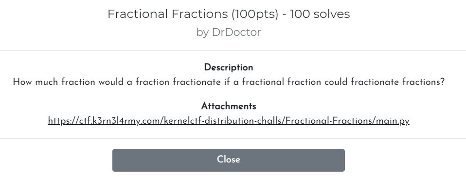
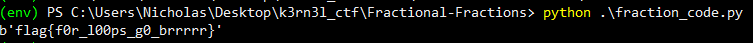

| Attachments |
| :---------: |
|[main.py](../assets/files/K3RN3LCTF2021-fractional_fractions/main.py)|

---

### Challenge:



---

### Analyzing the algorithm

**Contents of main.py:**

```python
from Crypto.Util.number import bytes_to_long
flag = str(bytes_to_long(open('flag.txt','rb').read()))
from fractions import Fraction
enc = Fraction(0/1)
for c in flag:
    enc += Fraction(int(c)+1)
    enc = 1/enc
print(enc)
#7817806454609461952471483475242846271662326/63314799458349217804506955537187514185318043
```

Let's understand how the encryption works:

1. We take in the flag as a string that contains a long number
2. We create a `Fraction` object called **enc**, with an initial value of 0
3. For each digit (c) in the flag, we do:
   1. enc = enc + c + 1
   2. enc = 1 / enc
4. The ciphertext is the resulting **enc** value

<br>

### Cracking the algorithm

From the code, we have the ciphertext: 

> 7817806454609461952471483475242846271662326 / 63314799458349217804506955537187514185318043

Here's what we can deduce from the algorithm:

* **c** must be a whole number from 0 - 9
* As such, enc = enc + c + 1 must always be > 0
* This means that enc = 1 / enc must be 0 < enc < 1

Now we just have to reverse the encryption and slowly obtain the value of  c for each round, until we reach enc = 0.

For each round, we would first inverse the value of enc.

Next, what's important to note is that we can obtain the value of c for that round by simple taking **enc - 1** and **rounding down** the value. 

To understand why this works, we look at the equation:

> enc_final = enc_initial + c + 1

We can rearrange it to be:

> enc_final - 1 = enc_initial + c

From our deductions earlier, we know that c must be a whole number and the intermediate values of enc must be 0 < enc < 1. Hence, this means that if for eg: enc_initial + c = 7.12435, then c must be the whole number 7 while enc is 0.123435.

This is why for each round, after inversing the value of enc, we minus 1 from it to get enc_initial + c. Next, we round down the value to obtain c as that is the nearest possible whole number.

**Code to obtain the flag:**

```python
import math
from Crypto.Util.number import long_to_bytes
from fractions import Fraction

ciphertext = Fraction(7817806454609461952471483475242846271662326, 63314799458349217804506955537187514185318043)

plaintext_int = ''

while ciphertext != Fraction(0):
    ciphertext = 1 / Fraction(ciphertext)
    plaintext_int = str(math.floor((ciphertext - 1))) + plaintext_int
    ciphertext = Fraction(ciphertext - math.floor(ciphertext))

print(long_to_bytes(int(plaintext_int)))
```

**Results:**



And we got the flag!

Flag: **flag{f0r_l00ps_g0_brrrrr}**

