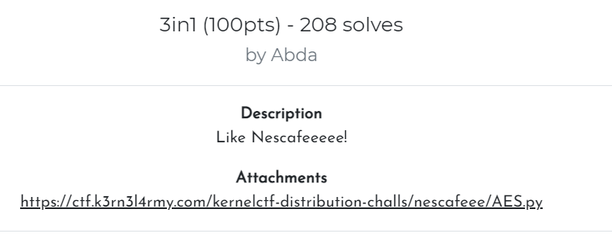
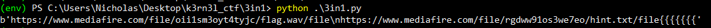
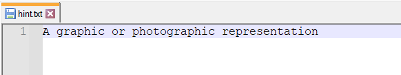
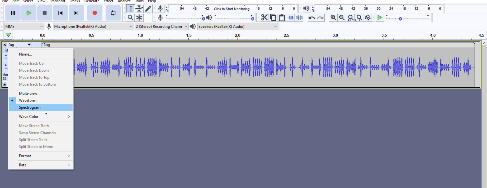
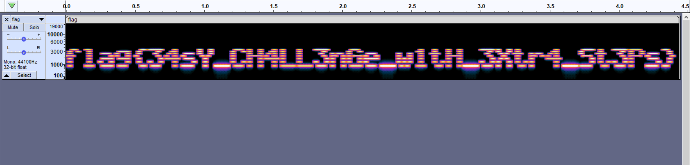

| Attachments |
| :---------: |
|[AES.py](../assets/files/K3RN3LCTF2021_3in1/AES.py)|

---

### Challenge:



---

**Contents of AES.py:**

```python
from Crypto.Cipher import AES    
from Crypto.Hash import SHA256


f = open('progress.txt', 'r')

password = ("abda")    
hash_obj = SHA256.new(password.encode('utf-8'))    
hkey = hash_obj.digest()

def encrypt(info):
    msg = info
    BLOCK_SIZE = 16
    PAD = "{"
    padding = lambda s: s + (BLOCK_SIZE - len(s) % BLOCK_SIZE) * PAD
    cipher = AES.new(hkey, AES.MODE_ECB)
    result = cipher.encrypt(padding(msg).encode('utf-8'))
    return result  

msg = f.read()
cipher_text = encrypt(msg)
print(cipher_text)

#Encrypted: b'\x1bkw\x00\x01#\x1dv\xd1\x1e\xfb\xba\xac_b\x02T\xfbZ\xca\xac8Y\\8@4\xba;\xe1\x11$\x19\xe8\x89t\t\xc8\xfd\x93\xd8-\xba\xaa\xbe\xf1\xa0\xab\x18\xa0\x12$\x9f\xdb\x08~\x81O\xf0y\xe9\xef\xc41\x1a$\x1cN3\xe8F\\\xef\xc1G\xeb\xdb\xa1\x93*F\x1b|\x1c\xec\xa3\x04\xbf\x8a\xd9\x16\xbc;\xd2\xaav6pWX\xc1\xc0o\xab\xd5V^\x1d\x11\xe4}6\xa4\x1b\\G\xd4e\xc2mP\xdb\x9b\x9f\xb0Z\xf12'
```

This challenge is very simple. All we have to do is to decrypt the ciphertext using AES and the password **'abda'**. We can use the AES module from [PyCrytodome](https://pycryptodome.readthedocs.io/en/stable/index.html) to do so:

```python
from Crypto.Cipher import AES
from Crypto.Hash import SHA256

cipher_text = b'\x1bkw\x00\x01#\x1dv\xd1\x1e\xfb\xba\xac_b\x02T\xfbZ\xca\xac8Y\\8@4\xba;\xe1\x11$\x19\xe8\x89t\t\xc8\xfd\x93\xd8-\xba\xaa\xbe\xf1\xa0\xab\x18\xa0\x12$\x9f\xdb\x08~\x81O\xf0y\xe9\xef\xc41\x1a$\x1cN3\xe8F\\\xef\xc1G\xeb\xdb\xa1\x93*F\x1b|\x1c\xec\xa3\x04\xbf\x8a\xd9\x16\xbc;\xd2\xaav6pWX\xc1\xc0o\xab\xd5V^\x1d\x11\xe4}6\xa4\x1b\\G\xd4e\xc2mP\xdb\x9b\x9f\xb0Z\xf12'

password = ("abda")
hash_obj = SHA256.new(password.encode('utf-8'))    
hkey = hash_obj.digest()

def decrypt(cipher_text):
    cipher = AES.new(hkey, AES.MODE_ECB)
    flag = cipher.decrypt(cipher_text)
    print(flag)

decrypt(cipher_text)
```

Doing so reveals the following decrypted plaintext:



The plaintext contains two links:

* `https://www.mediafire.com/file/oii1sm3oyt4tyjc/flag.wav/file`

* `https://www.mediafire.com/file/rgdww91os3we7eo/hint.txt/file`


The first link prompts us to download a WAV audio file. The audio itself sounds like gibberish and does not seem to contain any information or flags.

The second link prompts us to download a text file called **hint.txt**:



From the hint and considering the audio file that we have, I figured there was audio steganography at play here. One method of hiding data within audio files is hiding it within the **spectrogram** of the audio file.

*(A spectrogram is a **visual** representation of the spectrum of frequencies that make up the audio waveform)*


I loaded the audio file into Audacity and viewed the spectrogram:





And we have the flag!

Flag: **flag{34sY_CH4LL3nGe_w1tH_3Xtr4_St3Ps}**

