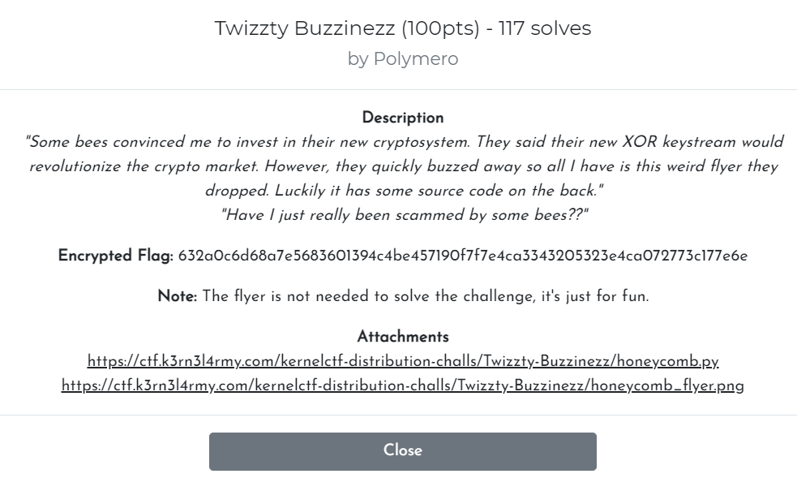
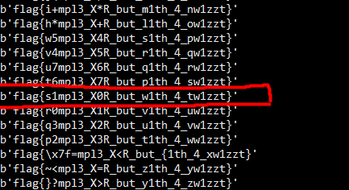

| Attachments |
| :---------: |
|[honeycomb.py](../assets/files/K3RN3LCTF2021-twizzty_buzzinezz/honeycomb.py)|

---

### Challenge:



---

### Analyzing the algorithm

**Contents of honeycomb.py:**

```python
#!/usr/bin/env python3
#
# Polymero
#

# Imports
import os

FLAG = b'flag{...REDACTED...}'

class HoneyComb:
    def __init__(self, key):
        self.vals = [i for i in key]
        
    def turn(self):
        self.vals = [self.vals[-1]] + self.vals[:-1]
        
    def encrypt(self, msg):
        keystream = []
        while len(keystream) < len(msg):
            keystream += self.vals
            self.turn()
        return bytes([msg[i] ^ keystream[i] for i in range(len(msg))]).hex()

hc = HoneyComb(os.urandom(6))

print(hc.encrypt(FLAG))
```

Let's understand how the encryption algorithm works:

1. The `HoneyComb` object is initiated with a byte string. The contents of this string will be copied over into a list called **vals**, where each element is a byte in the byte string.
2. The **FLAG** variable, which is also a byte string, is then passed into the `encrypt()` function of the HoneyComb object, where:
   1. An empty list called **keystream** is generated.
   2. While the length of **keystream** is less than the length of **FLAG**, it will:
      1. append **vals** to **keystream**
      2. run the **turn()** function, which 'rotates' the contents of **vals** leftwards (anti-clockwise)

   3. Once the length of keystream is >= length of the FLAG, it will **XOR** each element in FLAG with each element in keystream in order

3. The ciphertext is then returned in hex format

### Cracking the key

From the challenge, we have the ciphertext in hex:

> 632a0c6d68a7e5683601394c4be457190f7f7e4ca3343205323e4ca072773c177e6e

Without the original key that the HoneyComb object was initiated with, we will not be able to decrypt the ciphertext.

Fortunately for us, since we know that all flags have a standardized format: 

> flag{...}

We know that the first 5 characters in the plaintext is definitely: **'flag{'**

We also know that the key used to encrypt the flag is **6** bytes in length, from `hc = HoneyComb(os.urandom(6))`.

This means that **'flag{'** will be encrypted with the first 5 original bytes in the key, before any turn() is made. 

Since the encryption is done with just a simple XOR operation, we can find the first 5 bytes of the key by XORing the first 5 bytes of the plaintext ( 'flag{' ) with the first 5 bytes of the ciphertext.

To find out the 6th byte in the key, we can brute-force the value as it has a small range from 0-255.

**Find the first 5 bytes of the key:**

``` python
cipher_text = bytes.fromhex('632a0c6d68a7e5683601394c4be457190f7f7e4ca3343205323e4ca072773c177e6e')
known_flag = b'flag{'
known_cipher = cipher_text[:5]

# XOR the first 5 bytes of the key with 'flag{'
known_key = bytes(a ^ b for a, b in zip(known_flag, known_cipher))
known_key_list = list(known_key)
print(known_key_list)

# this gives us the first 5 bytes of the key: [5, 70, 109, 10, 19]
```

### Brute-force the decryption

To decrypt the ciphertext, we just reuse the encrypt() function from the `HoneyComb` class. We also brute-force the decryption by trying to decrypt the ciphertext with all possible values of the 6th key byte (0-255).

**Decrypt the ciphertext by brute-forcing the 6th bit of the key:**

```python
class HoneyComb:
    def __init__(self, key):
        self.vals = [i for i in key]
        
    def turn(self):
        self.vals = [self.vals[-1]] + self.vals[:-1]
        
    def encrypt(self, msg):
        keystream = []
        count = 0
        while len(keystream) < len(msg):
            count += 1
            keystream += self.vals
            self.turn()
        return bytes([msg[i] ^ keystream[i] for i in range(len(msg))]).hex()


# we have the following key stream: [5, 70, 109, 10, 19, i], where i is unknown

for i in range(256):
    hc = HoneyComb([5, 70, 109, 10, 19, i])
    result = hc.encrypt(cipher_text)
    print(bytes.fromhex(result))
```

**Results:**



After scanning through all of the results, I managed to find the flag!

Flag: **flag{s1mpl3_X0R_but_w1th_4_tw1zzt}**

