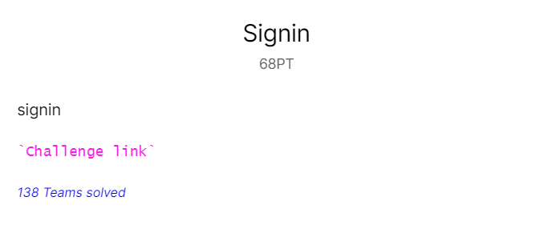
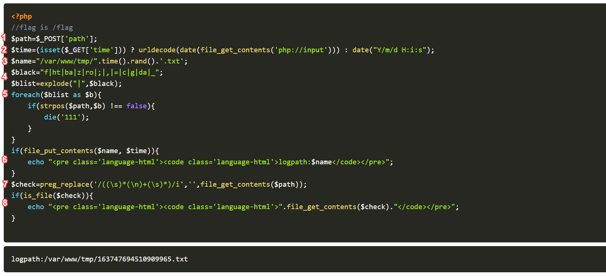
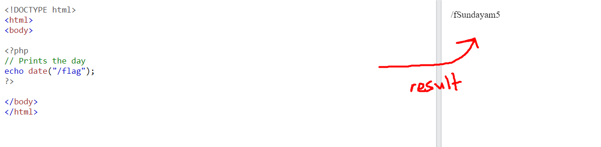
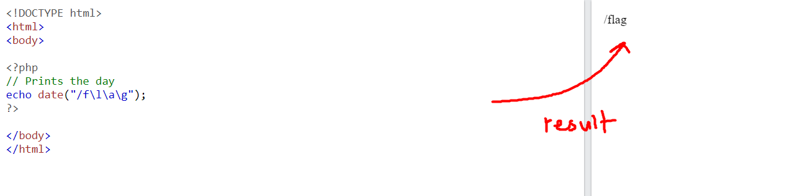
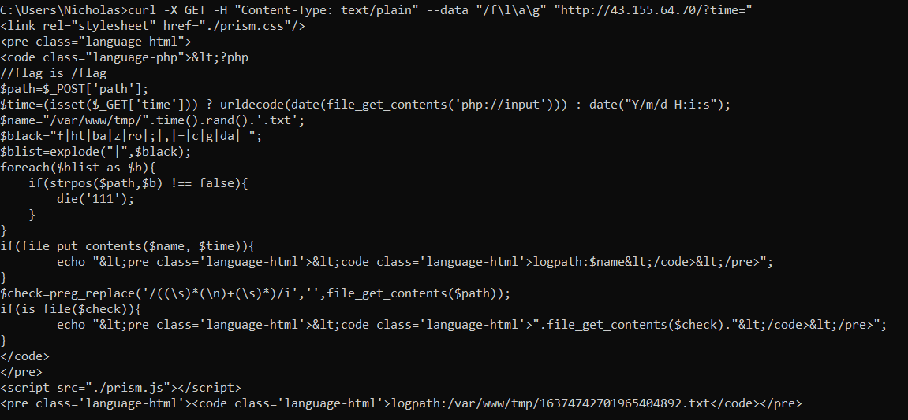
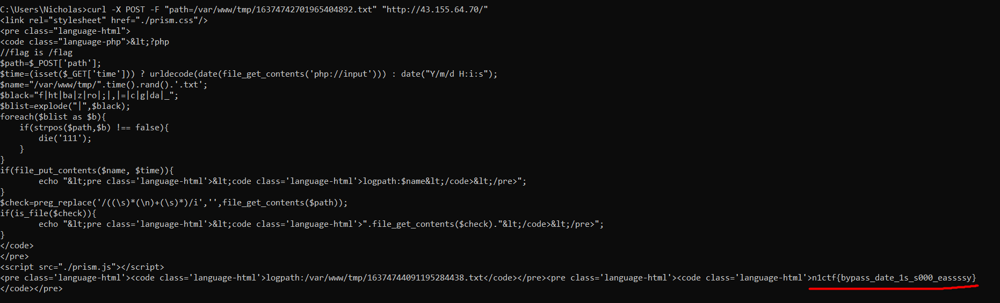

| Attachments |      Challenge link    |  |
| :---------: | :--------------------: |--|
|     nil     |  http://43.155.64.70/  |  |

---

### Challenge:



---

### Analyzing the code

Visiting the challenge link, we are greeted with a web page containing the PHP source code:



Let's understand how the code works:

1. The value stored in the 'path' parameter in a **POST** request to the web page is stored in the variable **$path**.

2. If the parameter 'time' in a **GET** request is set, the contents in the raw body of the request will be converted into a date() object, then stored in the variable **$time**. 

   Else, a date() object using the current time will be stored in the $time variable.

3. A randomized string in the format, '/var/www/tmp/RANDOM_VALUE.txt' is stored in the variable **$name**.

4. An array called **$blist** is created. This array functions as a blacklist, where it's elements are strings which are not allowed.

5. A check is done to see if any of the elements in the blacklist, **$blist**, is present within the **$path** variable. If there is a match, the code will stop running immediately. If not, continue on.

6. The contents of the **$time** variable is put into the file with the filename **$name**. The filename is then echoed onto the web page.

7. Using the preg_replace() function, all whitespaces will be removed from the contents of the file with the name stored in the variable **$path**. The result will be stored in the variable **$check**.

8. A check is done to see if a file with the filename, **$check**, exists. If there exists such a file, the contents of the file will be echoed onto the web page. 

---

### Plan of attack

We need to find a way to read the contents of the **/flag** file. Here's how we can make use of the PHP source code to do that.

Firstly, we make a **GET** request to the web page, with the **'time'** parameter being set. This is so that `urldecode(date(file_get_contents('php://input')))` will be triggered, which will take the contents of the raw body in the request.

In the raw body of the request, we will put the following payload: `/f\l\a\g`. This payload will be converted into a date() object, then stored in the **$time** variable.

The reason why we cannot simply pass in '/flag', is because the characters 'l', 'a' and 'g' are actually used in the constructor of the date() class. This will result in our '/flag' string being changed like so:



To have the string '/flag' stored in the **$time** variable untouched, we use the escape character **\\**:



With this, we have the string **'/flag'** stored in the **$time** variable.

The value stored in **$time** ('/flag') will then be written to a file with a randomized name (format: /var/www/tmp/RANDOM_VALUE.txt). This randomized name will then be echoed out onto the webpage. With that, we know the name of the file which contains the string **'/flag'**.

We then send a **POST** request to the web page with the form-data **'path=/var/www/tmp/THE_FILE_WE_GOT_EARLIER.txt'**. The contents of this file, which contains the string **'/flag'**, will be stored in the **$check** variable. Since there are no whitespaces present in the string, the preg_replace() function won't do anything.

There will then be a check for the file with the filename **'/flag'** , which will pass.

The contents of the file will then be echoed onto the webpage, giving us our flag!

---

### Execution

**GET request:**

```
curl -X GET -H "Content-Type: text/plain" --data "/f\l\a\g" "http://43.155.64.70/?time="
```

**Results:**



From the response, we know the file that was created:

> /var/www/tmp/16374742701965404892.txt

**POST request:**

```
curl -X POST -F "path=/var/www/tmp/16374742701965404892.txt" "http://43.155.64.70/"
```

**Results:**



Flag: **n1ctf{bypass_date_1s_s000_eassssy}**
