| Difficulty |  |  IP Address   |  |
| :--------: |--|:------------: |--|
|   Easy     |  | 10.10.198.36  |  |

---

### [ Deploy the machine and connect to our network ]

Done!

---

### [ Find the services exposed by the machine ]

Let's begin with a basic `nmap` scan on the target machine (all ports):

```
nmap --script vuln -sV -p- -vv 10.10.198.36 
```

**Results:**


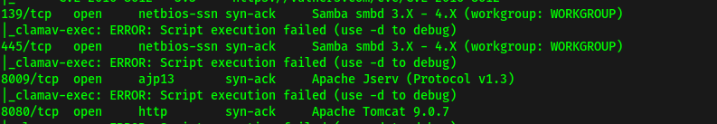

From the scan results, the ports open are: **22 (SSH)**, **80 (HTTP**), **139 & 445 (samba)**, **8009 (AJP)** and **8080 (HTTP)**.

---

### [ What is the name of the hidden directory on the web server(enter name without /)? ]

Let's visit the HTTP webserver running on port 80:

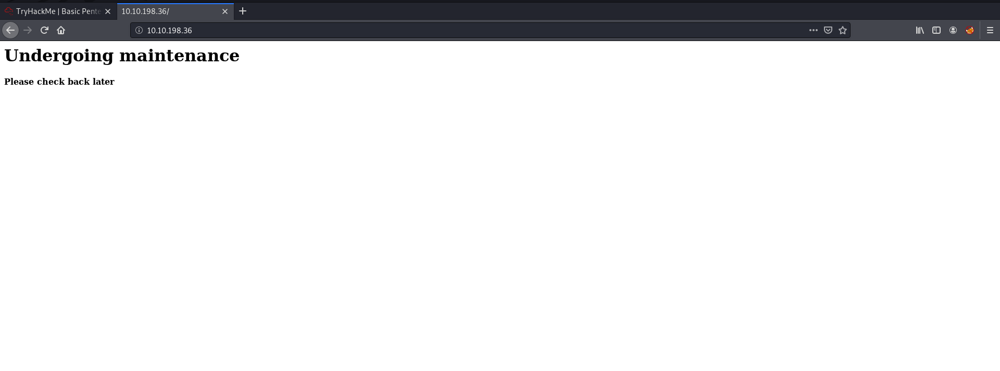

Looks like we have a site that is under maintenance.

Let's use `DirBuster` to try and enumerate any hidden directories. I'll be using their GUI tool to run the scan with their medium directory wordlist.

**Results:**

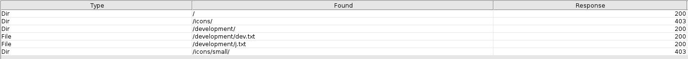

The hidden directory that was found is: **development**

*(An alternate method to find out about the 'development' directory is to use [Nikto](https://www.kali.org/tools/nikto/), which is a well-known vulnerability scanner)*

---

### [ User brute-forcing to find the username & password ]

Navigating to the **/development** directory, we see two files: **dev.txt** and **j.txt**:

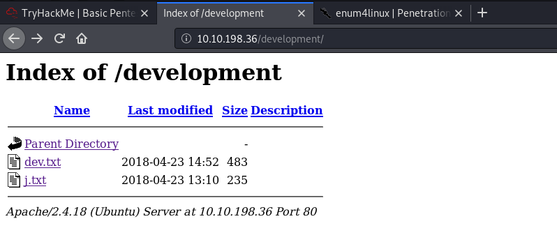

**dev.txt** tells us that [struts](https://struts.apache.org/) is configured and also reveals that there are two users: **K** and **J.** 

**j.txt** tells us that **J** has a non-secure password that can be easily cracked. Now we know who to target!

To find out the actual names of the users, we can use `enum4linux`, a tool that enumerates information from Windows and Samba systems. In this case, since we know that the server hosts Samba, we can use this tool to hopefully find out more information about the users on it.

```
enum4linux 10.10.198.36
```

**Results:**

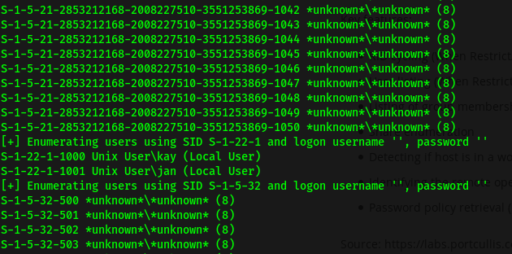

From the results of `enum4linux`, we now know that **jan** and **kay** are the two local users.

Next, we can use `hydra`, a powerful password-cracking tool, to brute-force our way into the **SSH** server. We shall target **jan** since we know that her password is insecure. The wordlist used is **rockyou.txt**.

```
hydra -l jan -P /usr/share/wordlists/rockyou.txt 10.10.198.36 -t 4 ssh
```

After awhile, `hydra` reveals that jan's password is **armando**

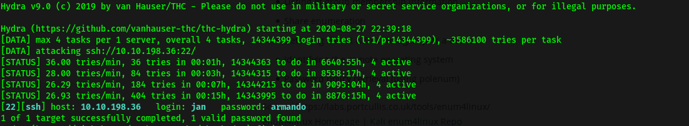

---

### [ What is the username? ]

Username: **jan**

---

### [ What is the password? ]

Password: **armando**

---

### [ What service do you use to access the server (answer in abbreviation in all caps)? ]

Service: **SSH**

---

### [ Enumerate the machine to find any vectors for privilege escalation ]

Now that we're in the target machine as **jan**, let's explore to see if there are any privilege escalation vectors.

jan's home directory had nothing on it, while kay had a **pass.bak** file, which is most probably a backup file:

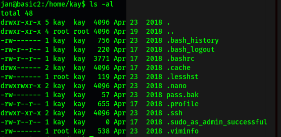

Unfortunately, that file is only readable by kay. 

Next, let's find out what **sudo privileges** jan has. This can be done by using `sudo -l`: 

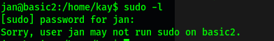

We realise that jan is not in the sudoers group and hence, cannot run sudo on the machine. We will have to find some other way to escalate our privileges.

To speed up the enumeration process, we can use [LinPEAS](https://github.com/carlospolop/PEASS-ng), a linux privilege-escalation script that helps us to find attack vectors and other useful information.

I transferred LinPEAS script over to the **/dev/shm** directory on the target machine as it is globally writeable. This was done with `scp` (on our local machine):

```
 scp linpeas.sh jan@10.10.198.36:/dev/shm
```

Once the transfer is done, we need to make sure that the script is executable:

```
chmod +x linpeas.sh
```

Finally, we can run it with `./linpeas.sh`.

The script will then proceed to enumerate important information in regards to the machine. Once it's done, we can look through the results to identify any potential privesc vectors:

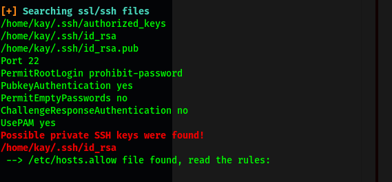

Looks LinPEAS managed to find kay's **private SSH keys**! 

---

### [ What is the name of the other user you found (all lower case)? ]

From our `enum4linux` scan earlier, we know that the other user is **kay**.

---

### [ If you have found another user, what can you do with this information? ]

Since we have found kay's private SSH key, we can use it to log into the SSH server as kay without needing to supply their password. 

---

### [ What is the final password you obtain? ]

At first, I tried to `scp` the key over to my local machine, but I realised that I could not as I did not have the appropriate permissions. 

However, a simple `ls -l` reveals that the key is readable by everyone:

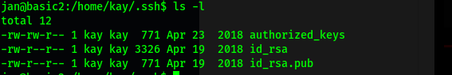

As such, we can `cat` out the key and manually copy its contents over to a file on our local machine. Once that is done, we can login to the SSH server with the following command:

```
ssh kay@10.10.198.36 -i id_rsa_kay
```

However, I was greeted with the following error message:

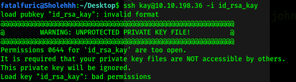

Turns out that SSH keys need to have their permissions set to **RW by Owner only**. Hence, we use the command:

```
chmod 600 id_rsa_kay   // 400 will work as well
```

which will set the correct permissions. 

Let's try logging in again:

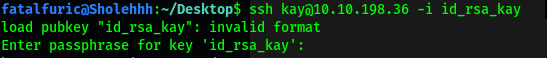

This time, we are greeted with a query for a passphrase. 

A passphrase just encrypts the key locally using AES-128, so that any attacker on your system will not be able to read the private key contents.

To crack the passphrase, we use the `ssh2john` tool by **John the Ripper**. This tool can be found as a Python file within the john directory in **/usr/share**. It translates the SSH key into a format that can be cracked by `john`:

```
/usr/share/john/ssh2john.py id_rsa_kay > forjohn.txt
```

We then use `john` on the output file with the rockyou.txt wordlist:

```
sudo john --wordlist=/usr/share/wordlists/rockyou.txt forjohn.txt
```

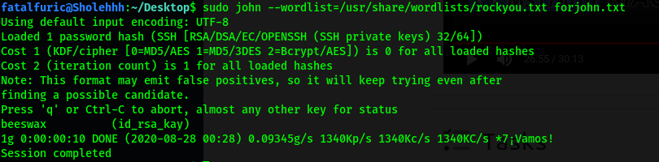

With that, we've managed to crack kay's password: **beeswax**

Now we can ssh into the server as kay. With that, we can finally read the **pass.bak** file, which gives us the final password:

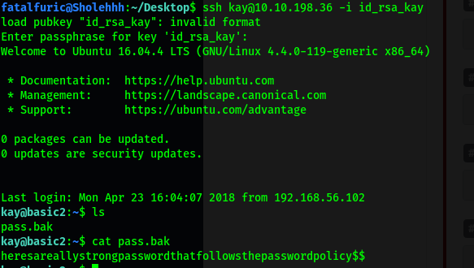

