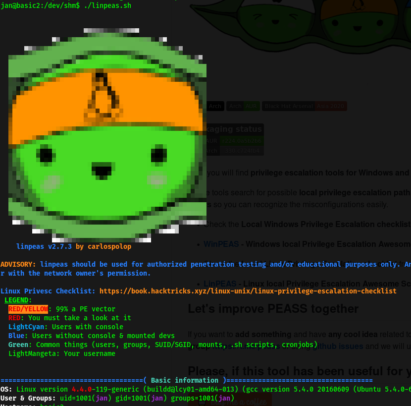

* Difficulty: Easy
* IP Address: 10.10.198.36

---

Let's first try navigating to the IP address in our browser to check if there is a HTTP server up. Doing so will bring us to this page:


Great, this means port **80** is definitely open. Let's now run a proper **nmap** scan on our target so that we can enumerate other services that are running on the machine:

```
nmap -sV -p- -vv --script vuln 10.10.198.36 
```

**Results:**


As we can see, the ports open are **22** (SSH), **80** (HTTP), **139** (samba), **445** (samba), **8009** and **8080**.

Next, let's start working on the HTTP webserver, starting off by using **DirBuster** to try and enumerate any hidden directories. With their medium directory wordlist, we find out that **development** is a directory that can be accessed.


*(An alternate method to find out about the 'development' directory is to use **Nikto**, which is a well-known vulnerability scanner)*

Navigating to the **development** directory, we see two files: **dev.txt** and **j.txt**.

**dev.txt** tells us that **struts** is configured and also reveals that there are two users: **K** and **J.** 

**j.txt** tells us that **j** has a non-secure password that can be easily cracked. Now we know who to target.


To find out the actual names of the users, we can use **Enum4Linux**, a tool for enumerating information from windows and samba systems. In this case, since we know that the server hosts samba, we can use this tool to hopefully find more information about the users on it.

```
enum4linux 10.10.198.36
```

**Results:**


*(NOTE: the command `enum4linux -a 10.10.198.36` can also be used)*

Hence, from the results of Enum4Linux, we now that **jan** and **kay** are the two local users.

Next, we can use **Hydra**, a password-cracking tool, to brute-force our way into the **SSH server** which is hosted on port 22. We shall use the username **jan** since we know that her password is insecure. The wordlist used is **rockyou.txt**. The command used is:

```
hydra -l jan -P /usr/share/wordlists/rockyou.txt 10.10.198.36 -t 4 ssh
```

After awhile, Hydra revealed that the password is **Armando**


Now, we can log into the SSH server as **jan** :smiling_imp: 

Let's explore!

Jan's home directory had nothing on it, while kay had a **pass.bak** file *(.bak is a type of backup file)*. Unfortunately, that file is only accessible by kay, which we do not know the password to. 


Next, let's find out what sudo privileges jan has. This can be done by using ```sudo -l```. 


We realise that jan is not in the sudoers group and hence, cannot run sudo on the machine. We will have to find some other way to escalate our privileges.

To speed up the enumeration process, we can use [linPEAS](https://github.com/carlospolop/PEASS-ng), a linux privilege-escalation script that helps us to find attack vectors and other useful information.

I first tried to ```scp``` the linpeas.sh file into **/home/jan**. However, I kept getting permission denied. I soon realized that only **root** can write into that directory. I then decided to scp to **/dev/shm** as it is globally writeable.

The command used is:

```
 scp linpeas.sh jan@10.10.198.36:/dev/shm
```

With the linpeas shell script successfully sent to the remote server, we make sure that linpeas.sh is an executable file:

```
chmod +x linpeas.sh
```

Then, we just have to run it with ```./linpeas.sh```. The linpeas.sh will then proceed to enumerate important information in regards to the machine. Once the script is done, we can look through the results to identify any possible privilege escalation vectors.



Upon inspecting the report, I noticed something potentially exploitable:


Kay's private SSH keys were found! That means that we can use it to log into the SSH server as Kay, without needing to supply a password. At first, I tried to ```scp``` the keys over to my local computer, but I realised that I could not as I did not have the correct permissions. 

However, a ```ls -l``` revealed that we can actually **read** the file as jan.


As such, we can simply copy the entirety of the key contents and save it into a new text file on our local machine. Once that is done, we can login to the SSH server with the following command:

```
ssh kay@10.10.198.36 -i id_rsa_kay
```

However, I was greeted with the following error message:


Turns out that ssh keys need to have their permissions set to **rw** by owner only. Hence, we use the command:

```
chmod 600 id_rsa_kay
```

which will set the correct permissions.

*NOTE: you can also use: chmod 400 (readable by owner only) or 600 (readable and writable by owner)*

We can now run the ssh command again:


This time, we are greeted with a query for a passphrase. A passphrase just encrypts the key locally using AES-128, so that any attacker on your system will not be able to read the private key contents.

To crack the passphrase, we use the `ssh2john` tool by **john the ripper**. This tool can be found as a Python file within the john directory in **/usr/share**. It translates the SSH key file into a file that can be cracked by john. The command used is:

```
/usr/share/john/ssh2john.py id_rsa_kay > forjohn.txt
```

We then use John on the **forjohn.txt** file with the rockyou.txt wordlist.

The command used is: 

```
sudo john --wordlist=/usr/share/wordlists/rockyou.txt forjohn.txt
```

John tells us that the password for user kay is "**beeswax"**.


Now we can ssh into the server as kay. With that, we can finally read the **pass.bak** file, which gives us the flag to the room.


