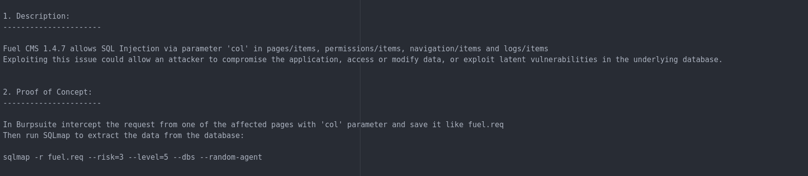
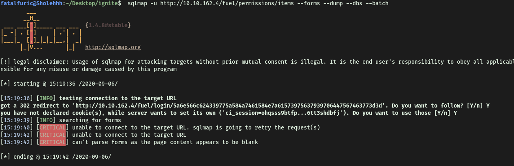
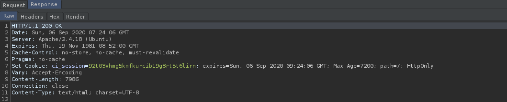
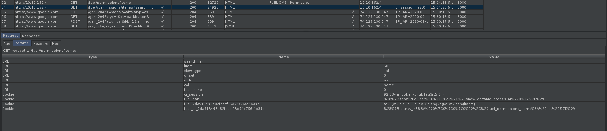
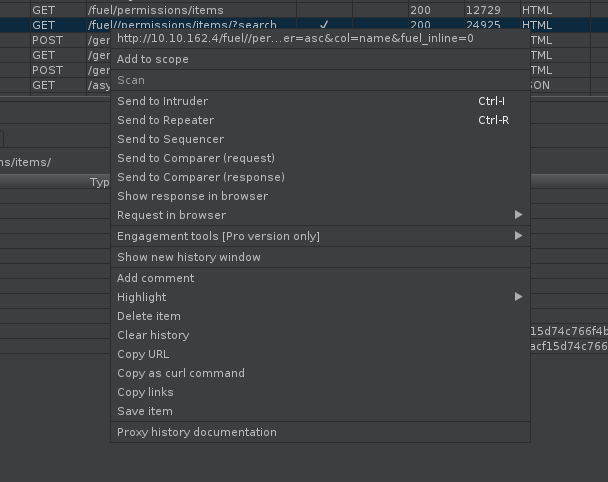
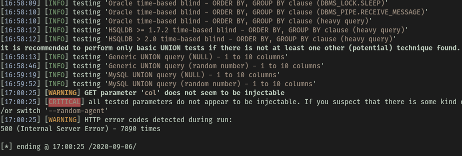
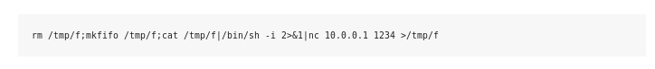

* Difficulty: Easy
* IP Address: 10.10.162.4

---

Firstly, let's run a basic **nmap** scan (only most common ports) on the machine:


From the results, we can see that only **port 80** is open, serving **Apache httpd 2.4.18**. An interesting to note is that there is a disallowed entry **/fuel/** in the **robots.txt** file.

Navigating to the IP in my browser, we can see a **FUEL CMS** webpage:


I first looked at the source code, but there wasn't any useful comments or other information that was left behind by the owner. I also made sure to check out the static files like the .css files, but nothing in there too.

I then proceeded to do a happy-path enumeration, clicking the various links the website had. While I was doing this, I also ran a **Gobuster directory scan** on the website, using dirbuster's medium-sized wordlist.

I found something useful during my happy-path enumeration. It seems that the default admin credentials for this service is **admin:admin**! We can note this down for now.

We can also access the login page by visiting the **/fuel/** directory (discovered by nmap earlier).


Fortunately, the admin did not change the default password! Hence, I was able to log in with the default credentials (admin:admin):


Clicking on "**Click here for your site documentation**" , we can see that the site is running **FUEL CMS 1.4**.


With the knowledge of the version number, we can start looking for an exploit using `searchsploit`. The command used is:

```
searchsploit fuel 1.4
```


The first exploit looked like something we could use as we have the username and password to become an authenticated user.

To copy the exploit, we can use the command:

```
searchsploit -m php/webapps/48741.txt
```

This mirrors the exploit onto our local machine. From there, we can simply view it with any text editor. Since this is a .txt file, it is not an executable file, but more of a guide on how to run the exploit on the site.

**Looking at the exploit:**



Seems like there is an SQL-injectable field in **pages/items**, **permissions/items**, **navigation/items** and **logs/items**, via the parameter **col**. Hence, we will be using `sqlmap` to automate the process of injection.

At first, I tried the usual sqlmap command:

```
sqlmap -u http://10.10.162.4/fuel/pages/items --forms --dump --dbs --batch
```

However, it was not working:



The reason why we were unable to locate the form was because sqlmap did not have the authentication to access the admin page. Thus, as seen from the "**got a 302 redirect to …./login/…**" message, sqlmap is actually being redirected to the login page instead. 

To allow sqlmap to access the admin page, we need to find out what is the cookie given to us after we log in as admin and pass that information along to sqlmap using the `--cookies` tag.

To do so, we can use **BurpSuite** to look at the response given by the server after we log in as admin:



Here, we can see that the authentication cookie: **ci_session=92t03vhmg5kmfkurcib19g3rt5t6lirn** has been given to our browser. Let's try sqlmap again.

Unfortunately, I was still having some errors with sqlmap. Hence, I decided to follow the exploit instructions more carefully. They instructed to intercept one of the affected pages with the **col** parameter via burp, and save it as a **req** file for sqlmap to work on. 



**No. 14** was the request that I saved. As we can see, under the **Params** tab, there is the **col** parameter. All we had to do then was to right-click on the entry, and click **Save item**.



I saved it as '**fuel.req**', and used sqlmap as follows:

 ```
 sqlmap -r fuel.req --dbs --dump --batch --level=5 --risk=3 -p "col"
 ```

***notes:***

*`-r` = load a HTTP request from a file*

*`--level` = number of checks to be done*

*`--risk` = type of checks (the higher the more riskier/heavier)*

*`-p` = sets the specific parameter to be tested (since col is specified to be the injectable param, then I would like to just focus on this)*

Unfortunately, the SQL Injection did not work...



I was unable to figure out why the exploit failed. Hitting this dead end, I decided to look at the other exploit that was provided by searchsploit.

This second exploit is supposed to let us gain remote code execution (RCE) on the machine.


It also seems to be a python script. Let's take a look at the code:


Seems like we just have to change the **url** to the victim's IP address. Also, the code runs the connection through burp proxy. We can remove that as we will not be using Burp proxy. Below are the changes made:


- **url** changed

- **raw_input()** changed to **input()**  -> for python3, input replaces raw_input

- **quote()** changed to **parse.quote()** -> for python3, we have to **import urllib.parse** and use **urllib.parse.quote()** instead

- **print r.text[0:dup]** changed to **print(r.text[0:dup])**

Running the exploit, we can see that it works:


Now we will try to set-up a **reverse shell**. Using **pentestmonkey's** [reverse shell cheatsheet](https://pentestmonkey.net/cheat-sheet/shells/reverse-shell-cheat-sheet), I found one that worked:



Running this command using the exploit allowed us to gain access into our target machine:


**The first flag can be found in www-data's home directory.**

---

To find any potential privesc attack vectors, we can navigate into the **/dev/shm** directory and download the **.linpeas.sh** script from our local machine. This will help speed up the process of finding such attack vectors.

Looking through the privesc enumeration results, we come across a very interesting file: **/var/www/html/fuel/modules/views/settings.php**! Let's take a look.


Exploring this file yielded nothing of interest. However, I decided to look around the neighbouring directories and files. 
After looking for a very long time, I finally found a file in **/var/www/html/fuel/application/config/database.php** that had the **root** password inside:


Hence, sometimes to find important information, we just have to be smart and think about which file might contain important information, and which file might not.

**With the root password, we can log in as root and obtain the final flag in root.txt.**

---

When I was trying to log in via '**su root**', an error "**must be run from a terminal**" kept popping up, disallowing me from logging in as root. Doing some research, this seems to be because the shell spawned from our reverse shell code is just a non-interactive shell, and not a fully-interactive TTY shell.

In order to upgrade the shell, we can use python:


Using this code in our shell, it easily upgrades to a more functional one that is similar to our terminal on our local machine. We can then ```su``` into the root account and obtain the root flag.


