|  | Difficulty |  |  IP Address   |  | Room Link |  |
|--| :--------: |--|:------------: |--| :--------:|--|
|  |   Easy     |  |  10.10.22.206 |  | [Bounty Hunter](https://tryhackme.com/room/cowboyhacker) |  |

### [ Deploy the machine. ]

Done!

---

### [ Find open ports on the machine. ]

Let's first run a basic `nmap` scan with standard scripts (`-sC`), version enumeration (`-sV`) and increased verbosity (`-vv`).

```
sudo nmap -sC -sV -vv 10.10.22.206
```

**Results:**

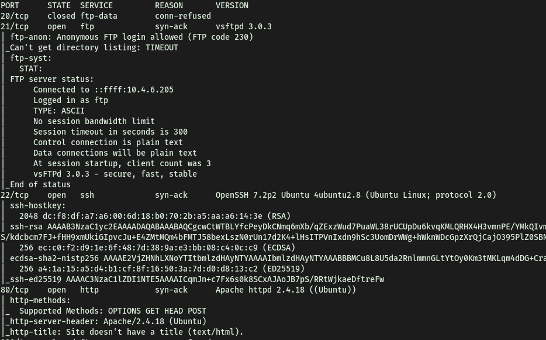

It seems like the machine is running **FTP (21)** with **anonymous-login** enabled, **SSH (22)** as well as **HTTP (80)**. Port 20 is also open, although that's just the FTP data transfer port.

---

### [ Who wrote the task list? ]

Let's take a look at the HTTP website:

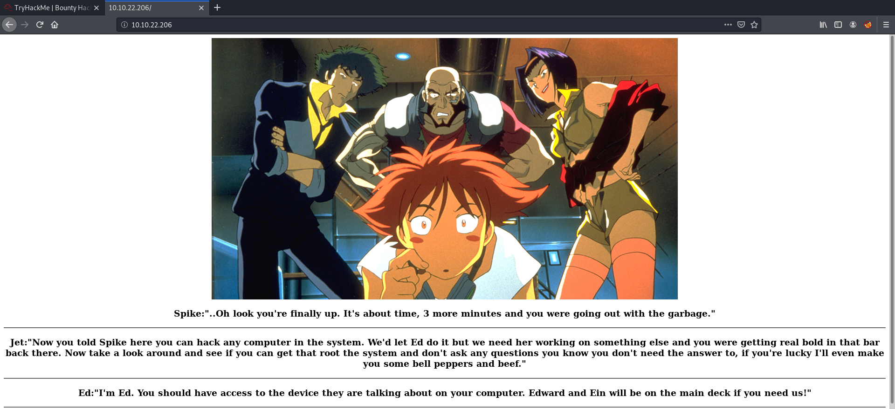

We are brought to a Cowboy Bebop themed webpage.

The first thing I did was to look for any low-hanging fruit, such as looking at the source code of the site and at the robots.txt file. However, I was unable to find anything of interest.

Next, let's run a `gobuster` directory scan on the site using Dirbuster's medium directory wordlist:

```
gobuster dir -u http://10.10.22.206/ -x php,html -w /usr/share/wordlists/dirbuster/directory-list-2.3-medium.txt
```

Unfortunately, Gobuster didn't reveal any useful directories.

Next, let's try connecting to the **FTP** server. Since anonymous login is enabled, we should be able to log in with the username: 

> anonymous

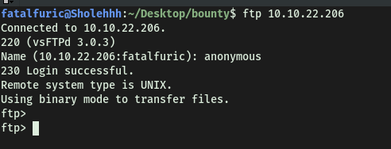

And we're in!

**Contents of FTP server:**

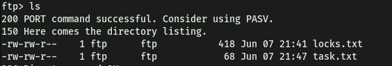

The FTP server contains 2 text files: **task.txt** and **locks.txt**. Let's download them to our local machine using the `get` command. 

**task.txt** gives us the answer to this task:

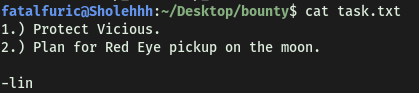

**lin** wrote the task list.

---

### [ What service can you bruteforce with the text file found? ]

Now let's take a look at **locks.txt**. It seems to be a password wordlist:

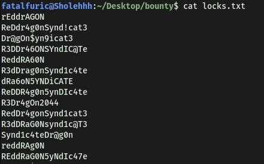

 Since we were unable to find a login page for the website with Gobuster, the only other service that we can try brute-forcing with this wordlist is **SSH**.

---

### [ What is the users password? ]

We will be using `hydra` to carry out the password brute-forcing. Since we have not encountered any other possible usernames during our enumeration, the username that we will use is **lin**.

```
hydra -l lin -P locks.txt 10.10.22.206 ssh
```

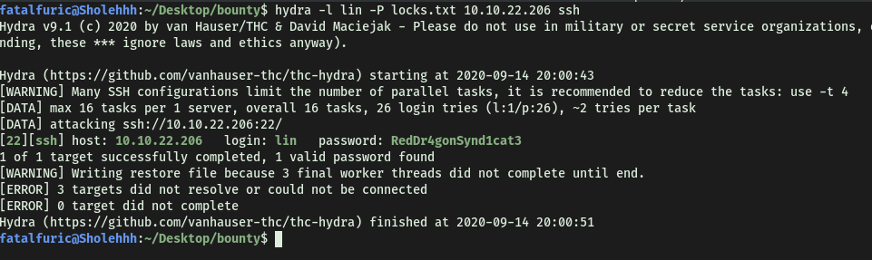

Looks like `hydra` managed to crack Lin's password: 

> RedDr4gonSynd1cat3

---

### [ Obtain user.txt ]

Now, we can log into the SSH server as lin:

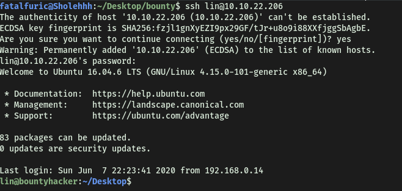

With that, we can obtain **user.txt** found in lin's home directory:

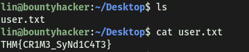

---

### [ Obtain Root.txt ]

Alright, now let's find a way to escalate our privileges.

First, we can check the **sudo privileges** on lin's account with `sudo -l`:

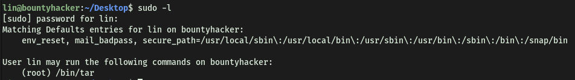

Interesting! Looks like we can run `/bin/tar` as root.

---

*[tar](https://man7.org/linux/man-pages/man1/tar.1.html) is an archiving program which can compress multiple files into a single one.*

---

I then went on [GTFOBins](https://gtfobins.github.io/gtfobins/tar/) to check if there were any ways we could exploit this program. Seems like we can exploit `tar` to open a shell:

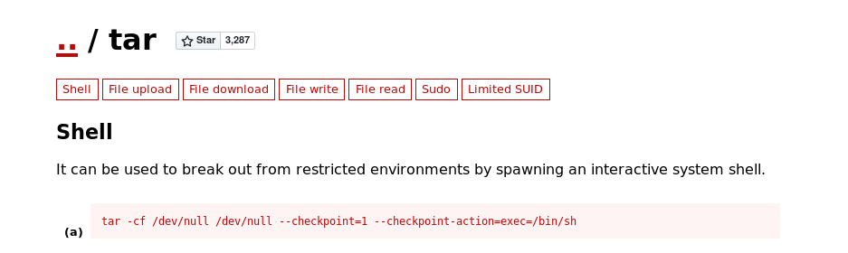

---

Instead of being a scr1pt k1dd13, I wanted to understand how the exploit works! 

The exploit uses the following command:

```
tar -cf /dev/null /dev/null --checkpoint=1 --checkpoint-action=exec=/bin/sh
```

The `-cf` option specified to create an archive file from the input files. Hence, if we run `tar -cf archive.tar foo` for example, we are just creating an archive file called 'archive.tar' from the file 'foo'. In our case, we are creating a file written to '/dev/null', from a file '/dev/null'. Since anything written to /dev/null is removed from the system, we are basically creating a non-existent archive from a non-existent file. The reason we have to do this is because in order for `tar` to run, it needs to have an input and output file. Hence, if we don’t want to actually create a new file, we just provide /dev/null for both input and output.

The real exploit comes from the `--checkpoint` tag: 

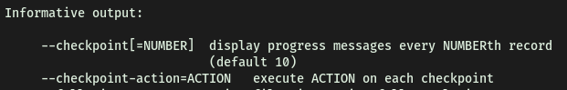

While creating the non-existent file, it will run the checkpoint action, which is where we can inject our commands! In this case, we simply inject `/bin/sh` to open up a new shell.

---

Bingo! Seems that if we run the exploit above with `sudo`, we can spawn a privileged shell by executing `/bin/sh` during the checkpoint.

To test this exploit, let's try running it normally. We can see a new shell is indeed spawned and we are logged in as lin:

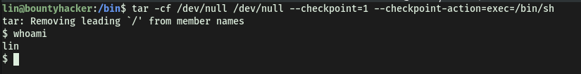

Now running the command with `sudo`, we are logged in as root:

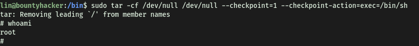

With that, we can now access /root and obtain **root.txt**:

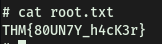

