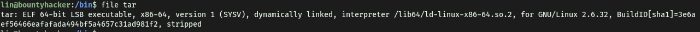

* Difficulty: Easy
* IP Address: 10.10.213.55

---

### [ Deploy the machine. ]

Done!

---

### [ Find open ports on the machine. ]

Let's first run a basic **nmap** scan with the `-sC`, `-sV` and `-vv` tags set. For initial results, we shall first run the scan against the top 1000 ports. After the results have come through, we can run the scan again, this time against ALL of the ports.

**Initial Nmap scan results:**


It seems like the machine is running **FTP** with **anonymous-login** enabled, **SSH** as well as a **HTTP website**.

Navigating to the website, we are brought to the following page:


---

### [ Who wrote the task list? ]

I decided to first work on the website. Looking at the source code, I was unable to find any interesting information. Let's run a **Gobuster** directory scan on the site, using **dirbuster's medium wordlist**. 

While Gobuster was running, we can try low-hanging fruit, like **/robots.txt** and **/login**. Unfortunately, they did not yield any meaningful results.

Next, let's try connecting to the **FTP server**. Since **anonymous login** is enabled, we should be able to log in with the username: **anonymous**.


And we're in! :smiling_imp:

**Contents of FTP directory:**


We can see that the FTP server holds the **task.txt** file in question. Let's download the file to our local machine using the ```get``` command. Looking at the file gives us the answer to this task:


**Lin** wrote the task list.

---

### [ What service can you bruteforce with the text file found? ]

Looking at the other downloaded text file, it seems like a wordlist for passwords! Since we were unable to find a login page for the website *(Gobuster has revealed nothing as of now)*, the only other service that we can try brute-forcing with this wordlist is **SSH**.


---

 ### [ What is the users password? ]

We will be using **Hydra** to carry out the password brute-forcing. Since we have not encountered any other possible usernames, the username that we will try will be **lin**.


Lin's password: **RedDr4gonSynd1cat3**

---

### [ Obtain user.txt ]

Now, we can log into the SSH server as **lin**.


With that, we can obtain the first flag.


---

### [ Obtain Root.txt ]

Let's do some basic privesc enumeration. First, we can check the **sudo privileges** on **lin's** account.


Interesting! We can run `/bin/tar` as root. This could be something that’s exploitable. Let's take a look at this file.

Using the ```file``` command, we can see that this **tar** file is an executable:



We can then look at [GTFOBins](https://gtfobins.github.io/gtfobins/tar/) to find out if there are ways we can exploit this file.


---

**EXTRA NOTE:**

Instead of just copy and pasting the command from Gtfobins, I wanted to understand how it works. The command is as follows:

```
tar -cf /dev/null /dev/null --checkpoint=1 --checkpoint-action=exec=/bin/sh
```

The `-cf` tag is just the standard tag for creating an archive file from the input files. Hence, if we run `tar -cf archive.tar foo` for example, we are just creating an archive file called **archive.tar** from the file **foo.** In our case, we are creating a file written to /dev/null, from a file /dev/null. Since anything written to /dev/null is basically removed from the system, we are basically creating a non-existent archive from a non-existent file. The reason we have to do this is because in order for tar to run, it needs to have an input and output file. Hence, if we don’t want to actually create a new file, we just provide /dev/null for both input and output.

The real exploit comes from the `--checkpoint` tag. 


While creating the non-existent file, it will run the checkpoint action. This is where we can inject our commands in! In this case, we simply inject `/bin/sh` to open up a new shell.

---

Bingo! Seems that if we run the above command, we can spawn an interactive system shell. Since we have sudo access, we can spawn a privileged shell.

To test this command, we try running it normally. We can see a new shell is indeed spawned, and we are logged in as lin.


Now running the command with **sudo**, we are logged in as root!


With that, we can access root's home directory and obtain the final flag.


