| Difficulty |
| ---------- |
|   Easy     |

---

### [ How many services are running under port 1000? ]

Running a basic **Nmap** scan (only top 1000 ports), we obtain the following results:

```
sudo nmap -sC -sV -vv 10.10.225.30
```

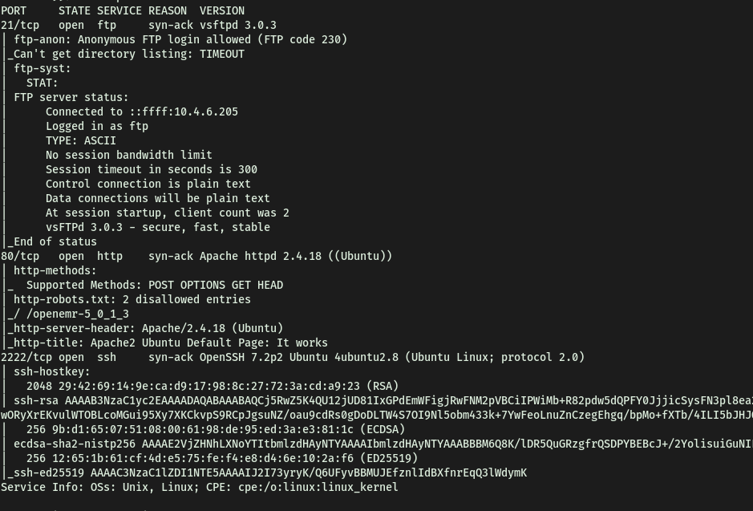

From the results, we can see that there are 3 ports open: **21 (FTP)**, **80 (HTTP)**, **2222 (SSH)**

No of services running under port 1000: **2**

---

### [ What is running on the higher port? ]

**SSH** is running on the higher port.

---

### [ What's the CVE you're using against the application? ] 

At first, I tried to see if there was any exploit associated with the FTP server (**vsftpd 3.0.3**). However, I was unable to find a relevant exploit.

Fortunately, my **Gobuster** scan (which I had running earlier) revealed that there was a directory on the HTTP webserver called **/simple**:

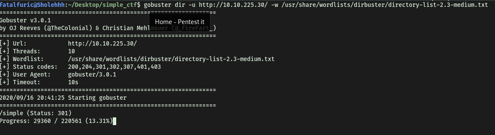

Navigating to the directory, we are brought to the following webpage:


Seems like a default **CMS Made Simple** page. 

*CMS Made Simple is a free, open source content management system to provide developers, programmers and site owners a web-based development and administration area.*

Scrolling down the page, we find out that the server is running **CMS Made Simple Version 2.2.8**:


With the version number, I then used `searchsploit` to search for exploits that we can use:

```
searchsploit cms made simple
```

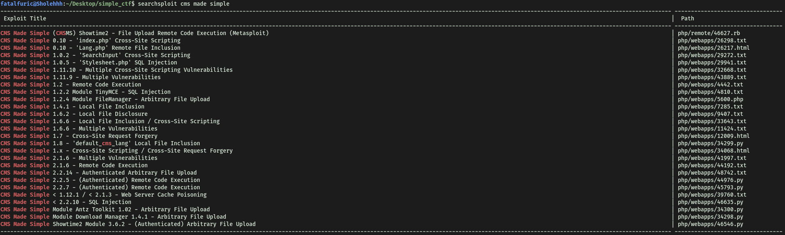

Based on the version we found out, the only possible exploit we can use is:

```
CMS Made Simple < 2.2.10 - SQL Injection
```

To find out the CVE number of this exploit, we can use the `--examine` option in `searchsploit`:

```
searchsploit php/webapps/46635.py --examine
```

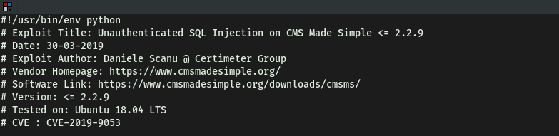

CVE we are using against the application: **CVE-2019-9053**

---

### [ To what kind of vulnerability is the application vulnerable? ]

From the exploit, we know that the application is vulnerable to **SQLi** (SQL Injection)

---

### [ What's the password? ]

Before running the exploit, I wanted to understand how it worked. 

From what I could gather, the exploit worked by achieving **unauthenticated blind time-based SQL injection** through the **m1_idlist** parameter within the **news** module.

What is **Blind SQL Injection**?

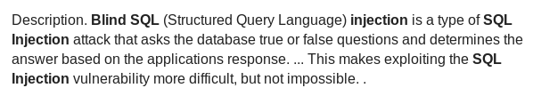

Below is a good example of how Blind SQL Injections work:

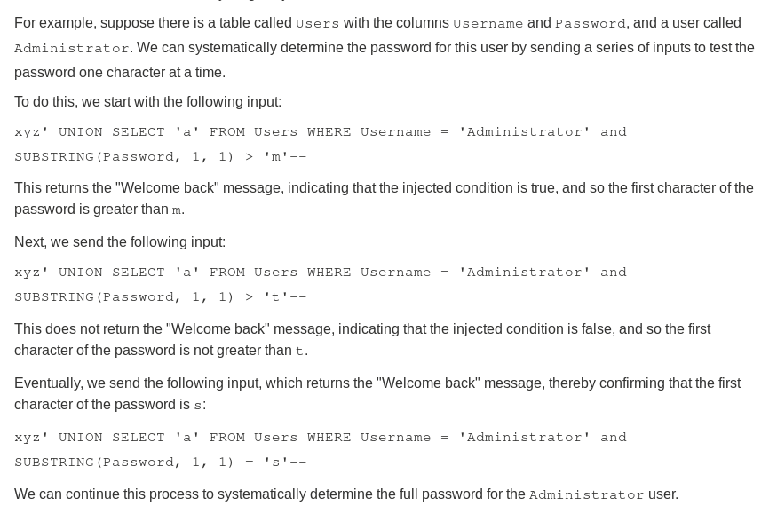

Hence, by injecting certain SQL commands into the m1_idlist parameter, we can obtain information like usernames, password hashes and even email addresses from the server!

If we take a look at the exploit, we can see how it works. 

**Base url *(options.url is the input by the user)*:**

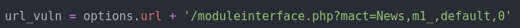

**SQL injection payload:**

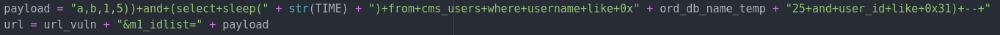

The entire process is repeated, with changing input from a dictionary of different characters:

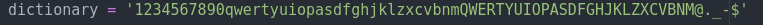

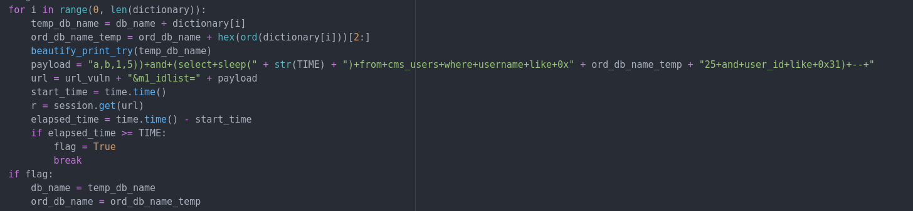

It repeats the SQL injection, checking for the response to determine whether the character inputted is correct, before forming the final result. In this case, the final result being the username!

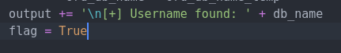

This logic applies for finding the passwords and email addresses as well.

After running the exploit, we managed to obtain the username, email address and password of the administrator:

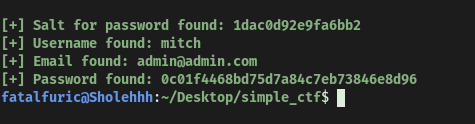

However, it seems that the password found has been **hashed** using MD5. It has also been **salted** and the exploit has managed to find the salt used. With all this information, let's now use `hashcat` to crack the password:

```
hashcat -a 0 -m 20 0c01f4468bd75d7a84c7eb73846e8d96:1dac0d92e9fa6bb2 /usr/share/wordlists/rockyou.txt
```

`-a` sets the attack mode. In this case, mode 0 = straight mode

`-m` sets the hash format. In this case, format 20 = md5(salt.pass)

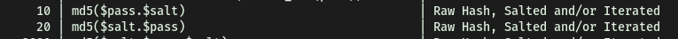

Even though we know that the salt prepends the password, in `hashcat`, the way we enter the salt & password combo must be - **hash:salt**

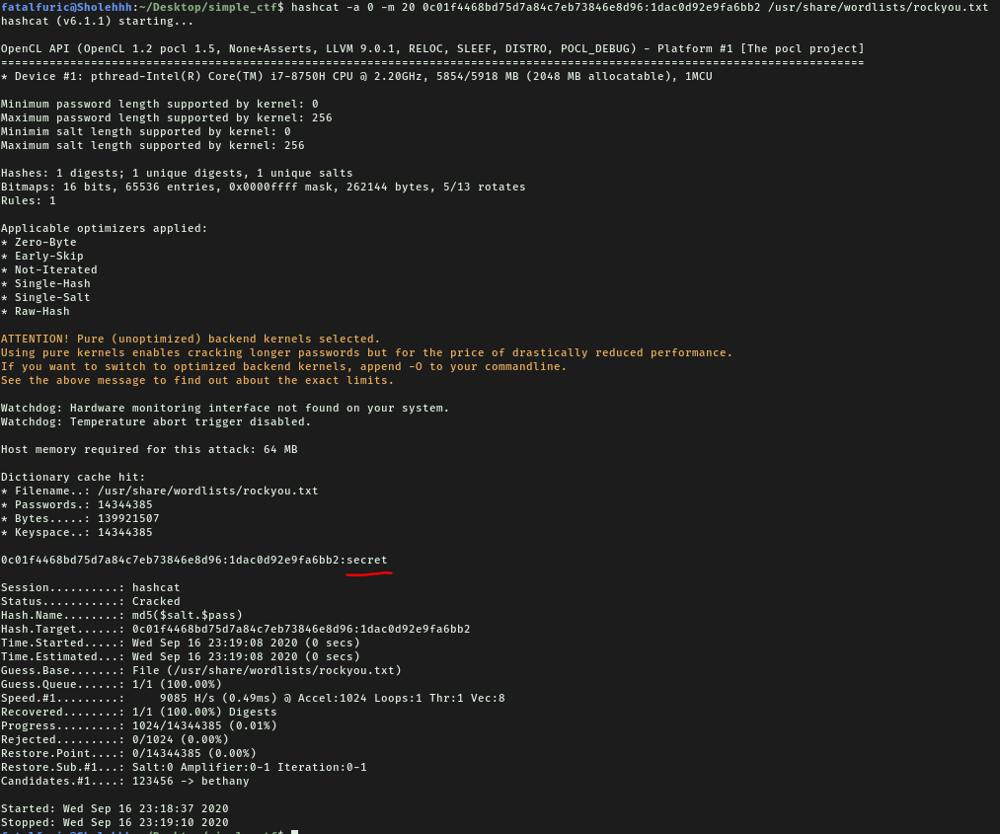

We've managed to crack the Password: **secret**

---

### [ Where can you login with the details obtained? ]

Since there was a SSH server running on port 2222, I tried to log in with our newfound credentials. Fortunately for us, it worked! 

We can log into **SSH** with the details obtained.

---

### [ What's the user flag? ]

After logging into the SSH server (using `-p` to specify port 2222), we can then easily retrieve **user.txt** located in mitch's **home** directory:

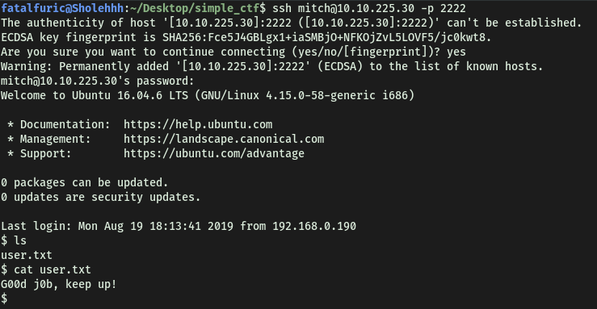

---

### [ Is there any other user in the home directory? What's its name? ]

If we take a look at the **/home** directory, we see that there is another user called **sunbath**:

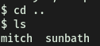

---

### [ What can you leverage to spawn a privileged shell? ]

Checking our **sudo privileges** with `sudo -l`, we see that we can actually run `vim` as root! Doing some research online, I found the following method to run shell commands from `vim`:

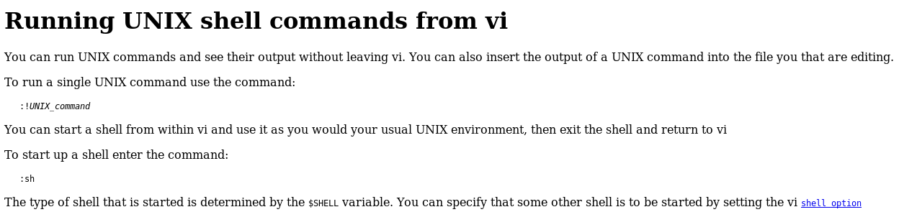

Hence, we can leverage `vim` to spawn a privileged shell.

---

### [ What's the root flag? ]

Let's use `vim` to open a shell!

Firstly, we execute vim with sudo: 

```
sudo vim
```

Now, any command that we run within `vim` will be run as root. Next, we press `esc` to activate command mode, before typing `:sh` to open up a shell:

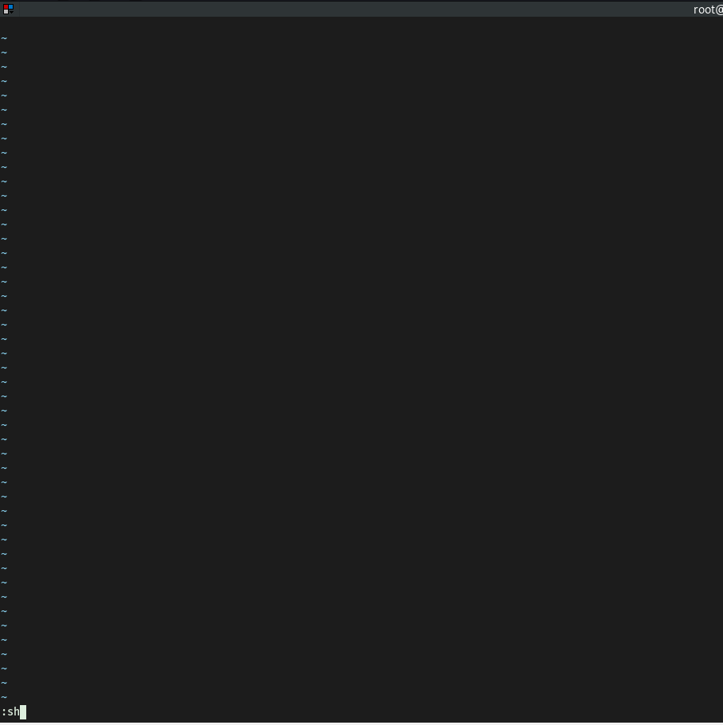

Once we hit enter, we see that a privileged shell has been opened!


With that, we can grab **root.txt** from **/root**:

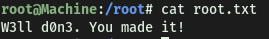

