##### IP Address: 10.10.63.185

---

### [ Deploy the machine ]

Done.

---

### Enumerate the machine and get all the important information

### [ How many open ports? ]

To find out what ports are open on our target machine, we can run a basic **nmap** scan (top 1000 ports).

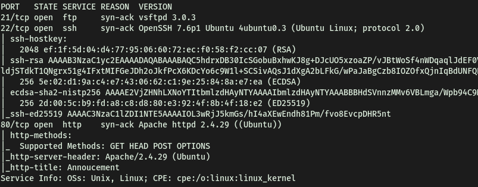

Seems like **ftp (21)**, **ssh (22)** and a **HTTP server (80)** is up and running.

**No of open ports: 3**

---

### [ How do you redirect yourself to a secret page? ]

Let's check out that webserver first.

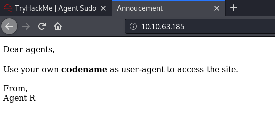

Interesting. Let's run a **Gobuster** directory brute-force attack to see if we can access a login page within the site. We can also try adding extensions to the search options, which we can do using the '**-x**' option. We can try checking if there also PHP or HTML files hidden within the web server. 

```
gobuster dir -u http://10.10.63.185/ -x php,html -w /usr/share/wordlists/dirbuster/directory-list-2.3-medium.txt
```

While Gobuster is running, we can also check the source code and console to see if there is any hidden information we can use. Unfortunately, there is no such hidden information found.

 <br>

Gobuster wasn't giving any promising results, so let's look more closely at the information given on the main page. They mention using the logging in to the webpage with the agent's name as the **user-agent**. I was able to find some useful information on this website: https://betanews.com/2017/03/22/user-agent-based-attacks-are-a-low-key-risk-that-shouldnt-be-overlooked/

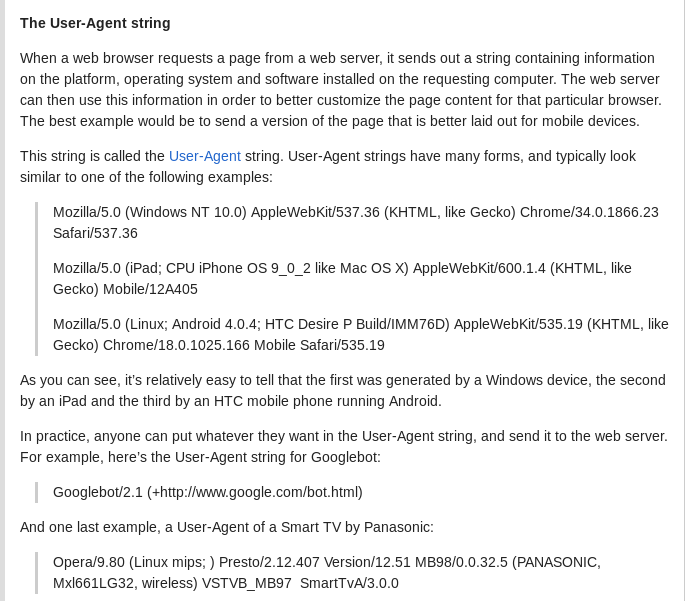

<br>

We are actually able to redirect ourselves to a secret page using the **user-agent** header!

---

### [ What is the agent name? ]

Let’s use **Burpsuite** to intercept the request and change the **user-agent** header. 

**Intercepted Request:**

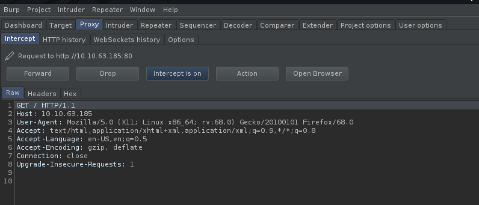

We can see the **User-Agent: Mozilla/5.0 (X11; Linux x86_64; rv:68.0) Gecko/20100101 Firefox/68.0**

We will send this to Burpsuite Repeater so that we can automate the process of changing the user-agent field. From the webpage, we know that there is an agent called **'Agent R'**. However, trying that, it seems like nothing happens.

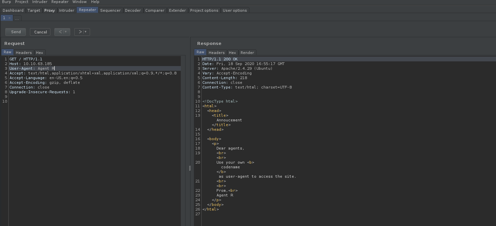

<br>

After trying out a few variations, I realized that we were supposed to change the field to '**R**'.

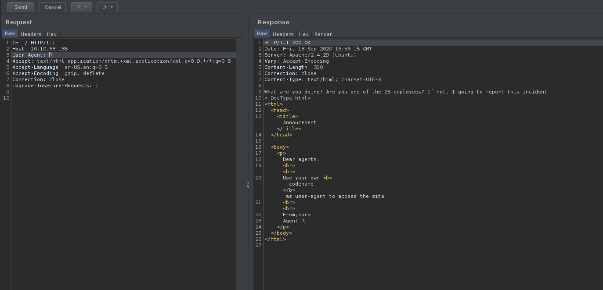

Thus, to access the agent's pages, we just have to change the user-agent to the agent's codename/letter accordingly. It is also mentioned that there are 25 employees. Minus 'R', that would account for the rest of the English alphabet. Does that mean that every letter has an existing agent page?

<br>

To find the other agent pages, we will brute-force through every alphabet using the '**Intruder**' module in Burpsuite.

Firstly, we send the intercepted request to Intruder. Then, we set a simple payload of all the alphabets in uppercase (A-Z). We then highlight the location in which we want Intruder to set the payload. In our case, that would be the User-Agent field. Once that is done, we can run the attack and look at the responses.

**Attack Running:**

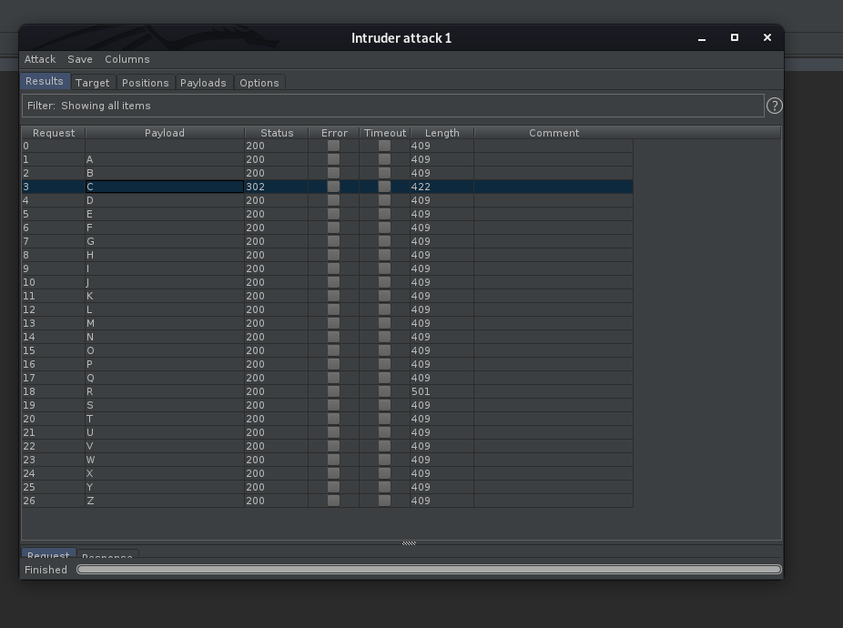

<br>

**Results**:

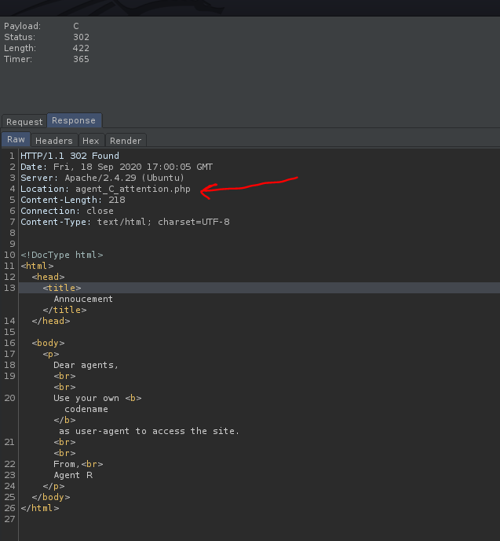

Nice! Turns out that when '**C**' is used as the user-agent, we get a redirect code from the webserver, bringing us to '**/agent_C_attention.php**'. Let's check that out:

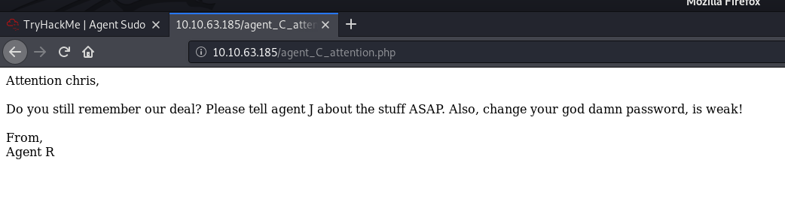

Now we know that agent C's real name is actually **Chris**.

Since it is mentioned that his password is weak, we can probably brute-force our way into the **ssh/ftp** server that is also running using Chris's account. 

We also note that **Agent J** is mentioned. Interesting stuff.

<br>

**Agent's name: chris**

---

### Done enumerate the machine? Time to brute your way out

### [ FTP password ]

First, let's try to see if anonymous login is enabled on the FTP server. This is a common misconfiguration on FTP machines.

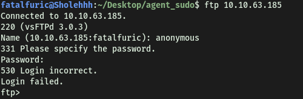

Looks like it's not. Since we know a potential username,**chris**, we can use **Hydra** to crack the password for the FTP server.

```
hydra -l chris -P /usr/share/wordlists/rockyou.txt -o ftp_pass ftp://10.10.54.221
```

**Results:**

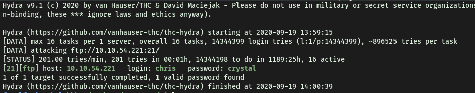

**Password found: crystal**

---

### [ Obtain the Zip file password ]

With the password cracked, we can now login as **chris** into the FTP server.

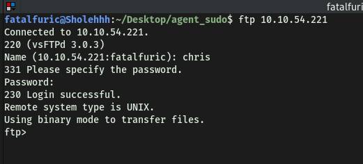

**Contents of the FTP server:**

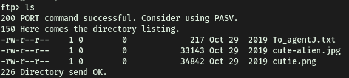

Using **pwd**, we can see that this is the root directory. Hence, looks like there isn't any further directories within the FTP server to enumerate. We can now download all of the files in the current directory to our local machine using the ```get``` command.

<br>

**To_agent.txt:**

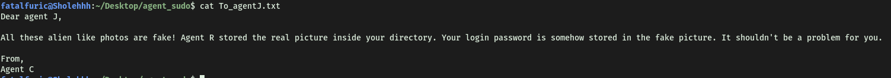

Clearly, there is some secret data embed within the photos.

Before trying to extract the data, let's conduct some basic checks. Firstly, I used the command ```strings``` to check for any human-readable strings within the image files. However, there was nothing of interest.

Next, I used **exiftool** to extract the metadata from the images. However, there was also nothing of interesting there. With that, we can move on to using **steganography** tools to extract any hidden data within the images.

<br>

 The process of trying to extract secret contents from the image files took quite some time, as this was the first time I am doing this. However, I learnt a lot and got to try various tools. The tools I tried were: **steghide**, **stegcracker**, **zsteg**, **binwalk**.

*Also I learned that **steghide** only works for **JPEG, BMP, WAV and AU** files. If we want to potentially extract data from **PNG** files, we can use another tool called **zsteg**.*

<br>

Next, I tried using **steghide**:

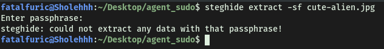

Looks like we need a passphrase. We can try inputting an empty passphrase, but it didn't work. Let's use **StegCracker** (https://github.com/Paradoxis/StegCracker) to try and crack the passphrase. Note that StegCracker is a python module, so it has to be run with ```python3 -m stegcracker …```

```
python3 -m stegcracker cute-alien.jpg
```

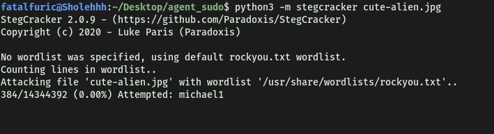

StegCracker ran for some time, but I soon stopped it as no passphrase was found.

<br>

Next, we can try working on the **cutie.png** file. I used **zsteg** to try and extract any hidden data from within the file. I also used the **-a** tag to denote to use all methods:

```
zsteg -a cutie.png
```

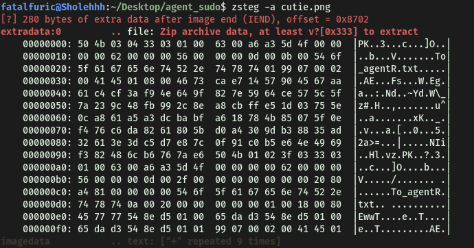

However, it was also unable to find any hidden data within the photo, as if there was, then there would be more content under the **imagedata** section. However, one interesting thing is that in the **extradata** section, it does mention '**file: Zip archive data…**' Is this the zip file that we have been looking for? With that said, I was unable to find out a way to extract it, if that really was the case.

<br>

Next, I tried using **binwalk,** which is another tool for searching binary files like images and audio files for embedded files and data. I will use the **-e** tag to automatically extract any hidden data.

```
binwalk -e cute-alien.jpg
```

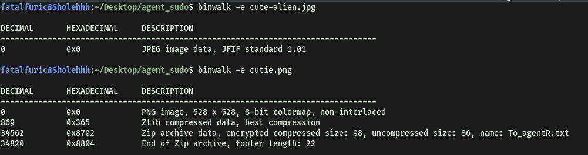

We did it! We managed to extract the zip file (**8702.zip**) within the **cutie.png** file. Let's try to open it:

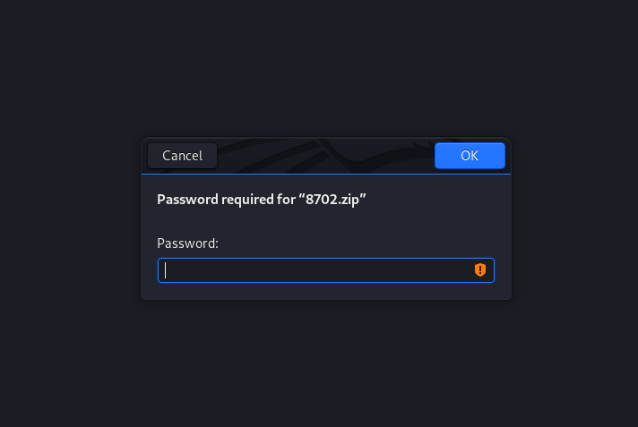

Looks like we need a password to unzip the file. We can use **John The Ripper** to try and brute-force this password. Firstly, we will need to use the **zip2john** tool to convert the zip file into one that can be cracked by John.

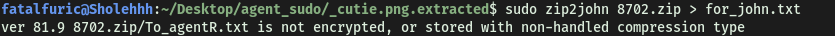

After this, we just have to run **John** on the **for_john.txt** file that was outputted.

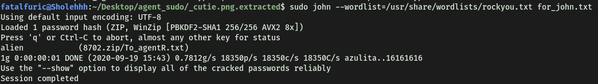

Using the **rockyou.txt** wordlist, we managed to obtain the zip file password: **alien**

---

### [ Obtain the steg password ]

After extracting the zip file, we managed to obtain the text file within: **To_agentR.txt**.

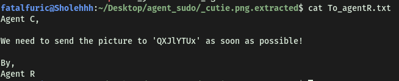

The weird phrase in the text file could be the passphrase of the **cute-alien.jpg** file.

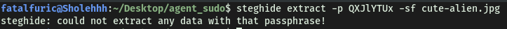

Oops… looks like it isn't.

 <br>

I figured that it was some sort of code then, but I was unsure of what encoding was used to create that phrase. I tried using **Crackstation** to see if it was a hash, but I should have known that it wasn’t based on the length itself. I then tried using **Caesar rotation ciphers**, but that didn't yield anything as well. 

In the end, after referring to a write-up, I realized it was just simple **base64 encoding**! We can decode it in the command-line:

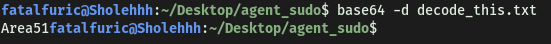

*Note: we have to put the phrase in a text file first.*

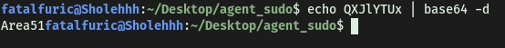

*This method can also be done.*

<br>

**Looks like we got the passphrase: Area51**

---

### [ Who is the other agent (in full name)? ]

We can use **Steghide** again to extract the hidden data within the **cute-alien.jpg** file.

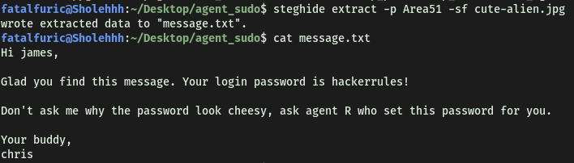

**We found agent J's name: James**

---

### [ SSH password ]

**His password is: hackerrules!**

---

### You know the drill.

### [ What is the user flag? ]

With James's username and password, we can log into the SSH server with his account:

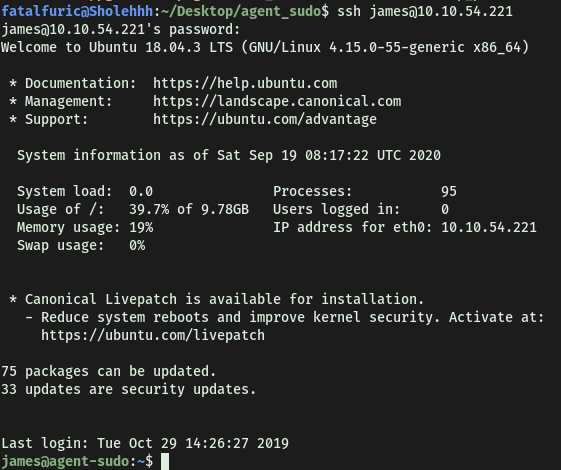

We're in!

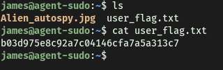

---

### [ What is the incident of the photo called? ]

I noticed another JPEG file called '**Alien_autospy.jpg**'. Seeing as python3 is installed on the remote machine, we can set up a simple python HTTP server and transfer that image file to my local machine. 

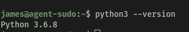

However, I wanted to practice using the ```scp``` command more. To download the image file from the SSH server with scp, we run the following command on our local machine:

```
scp james@10.10.54.221:/home/james/Alien_autospy.jpg /home/fatalfuric/Desktop/agent_sudo
```

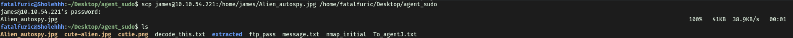

<br>

**Alien_autospy.jpg:**


<br>

First thing I thought to do was to use google reverse-image search. This was the following results:

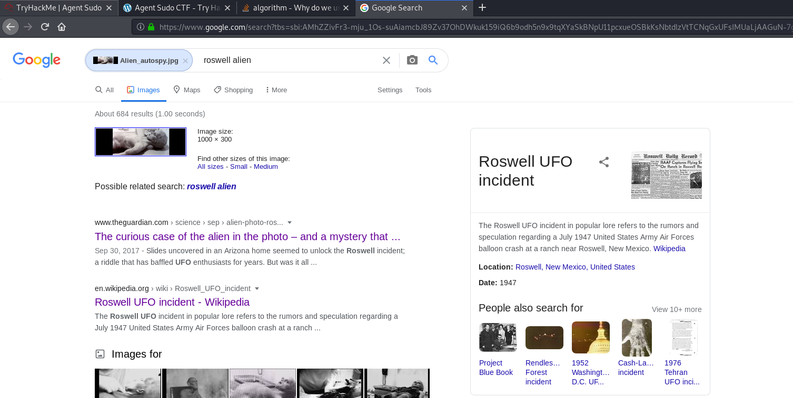

I tried inputting the answer as "**Roswell UFO incident**", but that was not it.

After looking at numerous different articles, I decided to use the hint, which mentioned **Fox News**. Searching for fox news articles on the matter, I came across this article:

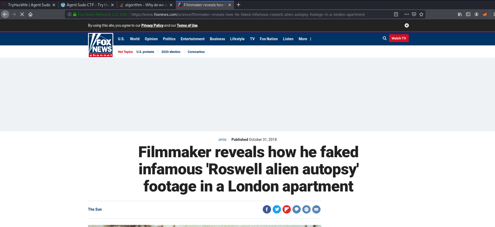

**Incident of the photo: Roswell Alien Autopsy**

---

### Enough with the extraordinary stuff? Time to get real.

### [ CVE number for the escalation (Format: CVE-xxxx-xxxx) ]

First, we can check the **sudo** privileges that James has on the machine:

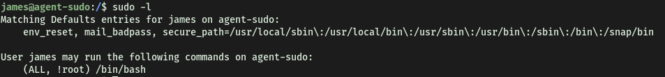

The '**(ALL, !root)**' tells us that James can run programs as any other users **OTHER THAN ROOT**. This means that he does not have the permission to run **/bin/bash** as root. Let's try it regardless:

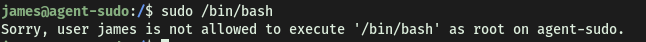

<br>

Expected. Doing a simple google search, we find the following exploit on **exploit-db**.

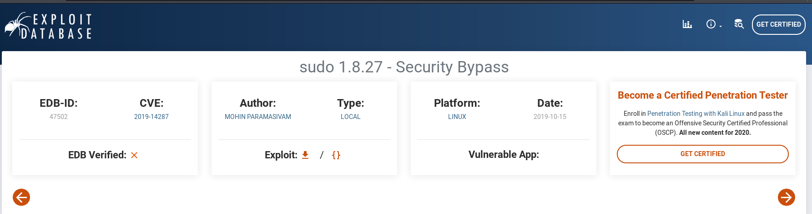

This is the exploit we will be using to allow us to run /bin/bash as root.

**CVE number: 2019-14287** 

---

### [ What is the root flag? ]

One thing to note is that this exploit only works for **Sudo < 1.2.28**. Let's check our sudo version on the remote machine. 

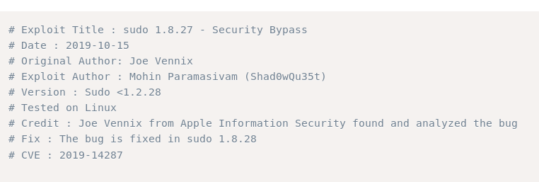

This can be done with '**sudo -V**'

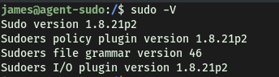

Looks like the exploit will work.

---

**How the exploit works:**

It works by using the **-u** option when running sudo, which specifies a user/user ID to run sudo as.

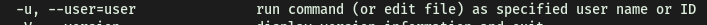

In this case, for these outdated versions of sudo, when we use **userid = -1**, sudo will incorrectly treat the userid as **0** instead. Since userid 0 belongs to root, that means that we will actually run the command as root.

---

Let's carry out the exploit:

(Note that when using ID as input, we need to use the **#** prefix)

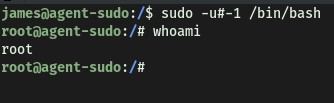

And we have root access!

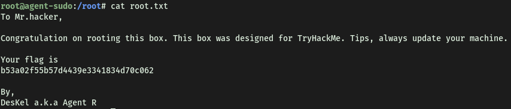

With that, we will be able to obtain the root flag and complete the room.

---

### [ (Bonus) Who is Agent R? ]

**DesKel**