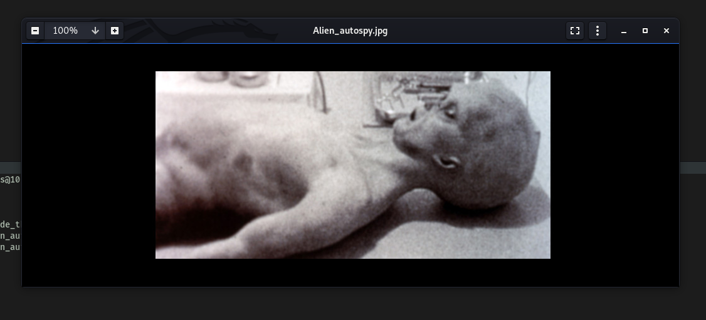

| Difficulty |  |  IP Address   |  |
| ---------- |--|:------------: |--|
|   Easy     |  |  10.10.63.185 |  |

---

### [ Deploy the machine ]

Done!

---

### Enumerate the machine and get all the important information
### [ How many open ports? ]

To find out what ports are open on our target machine, let's run a basic `nmap` scan (top 1000 ports):

```
sudo nmap -sC -sV -vv 10.10.63.185
```


Seems like **FTP (21)**, **SSH (22)** and **HTTP (80)** are up and running.

No of open ports: **3**

---

### [ How do you redirect yourself to a secret page? ]

Let's check out the HTTP webserver first. There is an interesting message on the main page:


Before doing any manual enumeration, let's run a `gobuster` directory scan to see if we can enumerate any hidden directories. We can also add extensions to our search options by using the `-x` option. In this case, let's see if there's any PHP or HTML files hidden within the web server. 

```
gobuster dir -u http://10.10.63.185/ -x php,html -w /usr/share/wordlists/dirbuster/directory-list-2.3-medium.txt
```

While Gobuster was running, I checked the site's source code to see if there was any hidden information we could use. Unfortunately, there was no such information found.

Since Gobuster wasn't returning any promising results, let's look more closely at the information given on the main page. 

They mention logging into the webpage with the agent's name as the **user-agent**. Doing some research online, I was able to find some [useful information](https://betanews.com/2017/03/22/user-agent-based-attacks-are-a-low-key-risk-that-shouldnt-be-overlooked/) on user-agents:


Looks like we should be able to redirect ourselves to the secret page using the **user-agent** header.

---

### [ What is the agent name? ]

Let’s use Burpsuite to intercept the request to the main page and change the user-agent header. 

**Intercepted Request:**


From the request, we can see the 'User-Agent' field: 

> User-Agent: Mozilla/5.0 (X11; Linux x86_64; rv:68.0) Gecko/20100101 Firefox/68.0

Let's send this request to Burpsuite Repeater so that we can automate the process of changing the user-agent. From the webpage, we know that there is an agent called **'Agent R'**. However, trying that as the user-agent, it seems like nothing happens:


We get back the same webpage.

After trying a couple of variations, I realized that we were supposed to change the field to just the letter **'R'**:


From the response (shown above), we can see that there is now a new message that pops up on the webpage.

Thus, to access the agent's pages, we just have to change the user-agent to the agent's codename/letter accordingly. It is also mentioned that there are 25 employees. Minus 'R', that would account for the rest of the English alphabet. Does that mean that every letter has an existing agent page?

To find the other agent pages, we can brute-force through every alphabet using the Intruder module in Burpsuite.

Firstly, we send the intercepted request to Intruder. Then, we set a simple payload of all the alphabets in uppercase (A-Z). We then highlight the location in which we want Intruder to set the payload. In our case, that would be the 'User-Agent' field. Once that is done, we can run the attack and look at the responses.

**Attack Running:**


**Results**:


Nice! Turns out that when **'C'** is used as the user-agent, we get a redirect from the webserver, bringing us to **'/agent_C_attention.php'**. 

Let's check that file out:


The file reveals that agent C's real name is actually **Chris**.

Since it is also mentioned that Chris' password is weak, we should target him when trying to crack any credentials later on.

Agent's name: **chris**

---

### Done enumerate the machine? Time to brute your way out

### [ FTP password ]

Now let's explore the FTP server. 

Firstly, we check if anonymous login is enabled on it. This is a common misconfiguration on FTP servers as it grants access without needing to authenticate.


Looks like anonymous access is not enabled. 

Since we know a potential username, 'chris', let's use `Hydra` to crack his password for the FTP server:

```
hydra -l chris -P /usr/share/wordlists/rockyou.txt -o ftp_pass ftp://10.10.63.185
```

**Results:**


After a short while, `hydra` successfully cracks Chris's password:

> crystal

---

### [ Obtain the Zip file password ]

With the password cracked, we can now login as chris into the FTP server:


**Contents of the FTP server:**


Listing all of the files on the server, we see that there isn't any further directories that we can explore. There are only a couple of images and a text file. Let's download all of these files to our local machine using the `get` command.

**To_agent.txt:**


'To_agent.txt' reveals that there is some secret data embed within the images. I tried some common steganography techniques to extract this data. 

Firstly, I used the `strings` command to check for any human-readable strings within the image files. However, there was nothing found. Next, I used `exiftool` to extract the metadata from the images. Once again, nothing of interest there as well. I then got to learn and try out various steganography tools. The tools I tried were: `steghide`, `stegcracker`, `zsteg` and `binwalk`.

*(Note: I learned that `steghide` only works for jpeg, bmp, wav and au files. If we want to extract data from png files, we must use `zsteg` instead)*

Let's use `steghide` on **cute-alien.jpg**:

```
steghide extract -sf cute-alien.jpg
```


Uh oh, looks like we need a passphrase!

I tried inputting an empty passphrase but it didn't work. Let's now use [StegCracker](https://github.com/Paradoxis/StegCracker) to crack the passphrase. 

Note that StegCracker is a Python module, so it has to be run with `python3 -m stegcracker FILE_NAME`.

```
python3 -m stegcracker cute-alien.jpg
```


StegCracker ran for some time but it was unable to find any passphrase.

Next, I tried using `zsteg` on the **cutie.png** file. The `-a` tag denotes to use all extraction methods:

```
zsteg -a cutie.png
```


Unfortunately, it was also unable to extract any hidden data within the image. With that said, one interesting thing is that in the 
'extradata' section, it did mention '**file: Zip archive data…**' Is this the zip file that we have been looking for?

Ultimately, `binwalk`, which is another tool that searches binary files for embedded data, was the one that saved the day:

```
binwalk -e cute-alien.jpg
```

*(`-e` specifies extraction mode)*


Nice! We managed to extract the zip file (8702.zip) embedded within the 'cutie.png' file. Let's open it:


Looks like we need a password to unzip the file. We can use `john` to try and brute-force this password. 

Firstly, we will need to use the `zip2john` tool to convert the zip file into a format that can be cracked by John:

```
sudo zip2john 8702.zip > for_john.txt
```


After this, we just have to run `john` on the output file:

```
sudo john --wordlist=/usr/share/wordlists/rockyou.txt for_john.txt
```


Using the classic rockyou.txt wordlist, we managed to obtain the zip file password:

> alien

---

### [ Obtain the steg password ]

With the zip file's password, we can extract the contents within it. 

It contained a text file called **To_agentR.txt**:


To_agentR.txt contained a strange phrase: 

> QXJlYTUx

Could this be the passphrase needed to extract the data embedded in the 'cute-alien.jpg' image?


Oops… looks like it isn't.

I figured that the phrase was probably encoded, but I was unsure of what encoding scheme was used. After messing around for a bit, I realized it was just simple base64-encoding! We can decode it on the command line:


An alternate method to decode the string:


Looks like we got the passphrase:

> Area51

---

### [ Who is the other agent (in full name)? ]

Let's use `steghide` with our newfound password to extract the data within the 'cute-alien.jpg' image:

```
steghide extract -p Area51 -sf cute-alien.jpg
```


There's a text file embedded within. From its contents, we find out agent J's name and password!

Agent J's name: **James**

---

### [ SSH password ]

Agent J's password: **hackerrules!**

---

### You know the drill.

### [ What is the user flag? ]

With James's credentials, we can now log into the SSH server with his account:


The **user flag** can be found in james' home directory:


---

### [ What is the incident of the photo called? ]

james' home directory contained another jpeg file called 'Alien_autospy.jpg'. Seeing as Python3 is installed on the remote machine:


We can set up a Simple Python HTTP Server and transfer the image over to our local machine. 

However, I wanted to practice using the `scp` command. To download the image file from the SSH server with scp, we run the following command on our local machine:

```
scp james@10.10.63.185:/home/james/Alien_autospy.jpg /home/fatalfuric/Desktop/agent_sudo
```

**Alien_autospy.jpg:**



Creepy. To find out the incident of this photo, my first thought was to use google reverse-image search. These were the results:


I tried inputting the answer as "**Roswell UFO incident**", but that was not it.

After looking at numerous different articles, I decided to use the hint, which mentioned 'Fox News'. Searching for Fox News articles on the subject matter, I came across this article:


Incident of the photo: **Roswell Alien Autopsy**

---

### Enough with the extraordinary stuff? Time to get real.

### [ CVE number for the escalation (Format: CVE-xxxx-xxxx) ]

Okay, now we need to escalate our privileges.

Let's check the **sudo privileges** that james has on the machine:


The `(ALL, !root)` tells us that james can run the specified program as any user **other than root**. In this case, this program is `/bin/bash`. 

Let's try running `sudo /bin/bash` regardless:


As expected, we can't. Doing some searching online, I found the following [exploit](https://www.exploit-db.com/exploits/47502) on Exploit-DB:


This is the exploit we will be using to allow us to escalate our privileges using `sudo`.

CVE number: **2019-14287** 

---

### [ What is the root flag? ]

One thing to note is that this exploit only works for **Sudo < 1.2.28**. 


Let's check our sudo version on the remote machine. This can be done with `sudo -V`:


Since our sudo version is 1.8.21, it looks like the exploit will work!

---

**How the exploit works:**

It works by using the `-u` option when running sudo, which specifies a user/user ID to run sudo as.


In this case, for outdated versions of sudo, when we use `userid = -1`, sudo will incorrectly treat the userid as `0` instead. Since userid 0 belongs to root, that means that we will actually run the command as root!

---

Let's carry out the exploit *(Note that when using ID as input, we need to use the `#` prefix)*:

```
sudo -u#-1 /bin/bash
```


With that, we've successfully opened a shell as root!

We can now obtain the **root flag** located in /root:


---

### [ (Bonus) Who is Agent R? ]

Agent R: **DesKel**

