| Difficulty |
| ---------- |
|   Easy     |

---

### Deploy the virtual machine on this task and explore the web application.

### [ What is the first ingredient Rick needs? ]

First, let's run a basic `nmap` scan (top 1000 ports) on the machine:

```
sudo nmap -sC -sV -vv 10.10.28.153
```

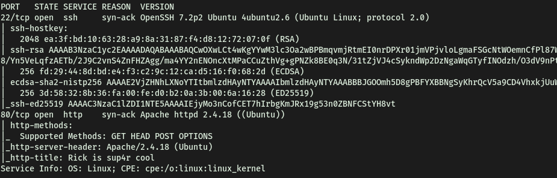

From the results of the scan, we see that **2** ports are open: **22 (SSH)** and **80 (HTTP)**

Let's check out that HTTP webserver:

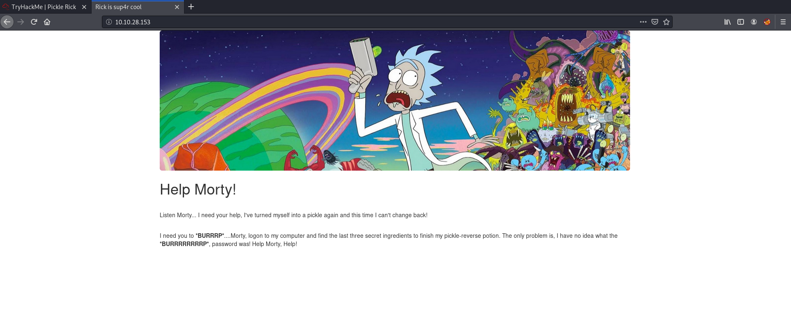

We are brought to a Rick and Morty themed page. The first thing we can do is to run a `gobuster` directory scan to enumerate any hidden directories. We'll also be checking for PHP files, which we can specify by using the `-x` option:

```
gobuster dir -u http://10.10.28.153/ -x php -w /usr/share/wordlists/dirbuster/directory-list-2.3-medium.txt
```

While Gobuster was working its magic, I went ahead and did some manual enumeration. I first looked at the source code of the site:

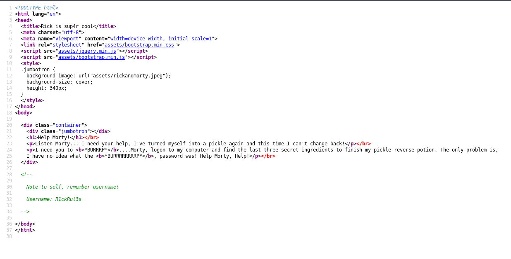

Interestingly enough, we find a username: **R1ckRul3s**

Next, I took a look at the **/robots.txt** file on the webserver:


It had a strange phrase: **Wubbalubbadubdub**. We'll take note of this phrase for now.

Checking back on our Gobuster scan, we see that it has managed to find two interesting directories: **/login.php** and **/portal.php**:

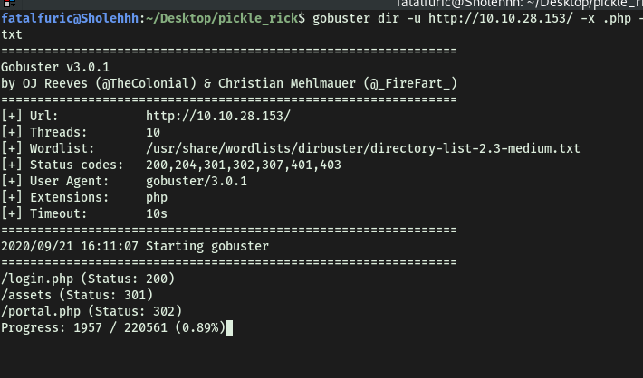

Let's check them out!

**/login.php** brings us to a login page:

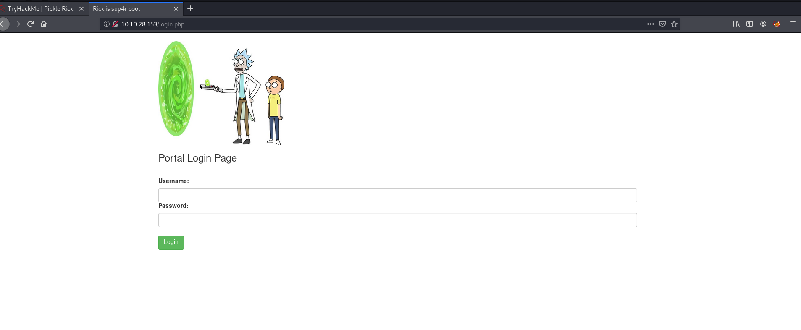

**/portal.php** just redirects us back to **/login.php**. My first thought was to try and brute-force some login credentials using the username that we found earlier. However, before committing to that, I had a thought. What if the strange phrase that we found in the **robots.txt** file earlier was actually the password? 

I tried logging in with **R1ckRul3s:Wubbalubbadubdub** and it worked! We are brought to a command panel:

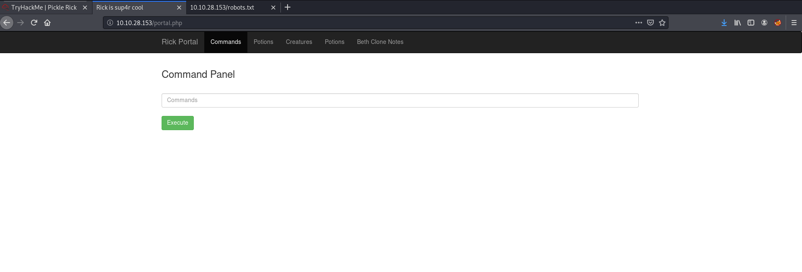

Could we execute shell commands on the target machine through this panel? Before testing this out, I tried to visit the other pages. However they all required us to be in **rick's** account in order to access them:

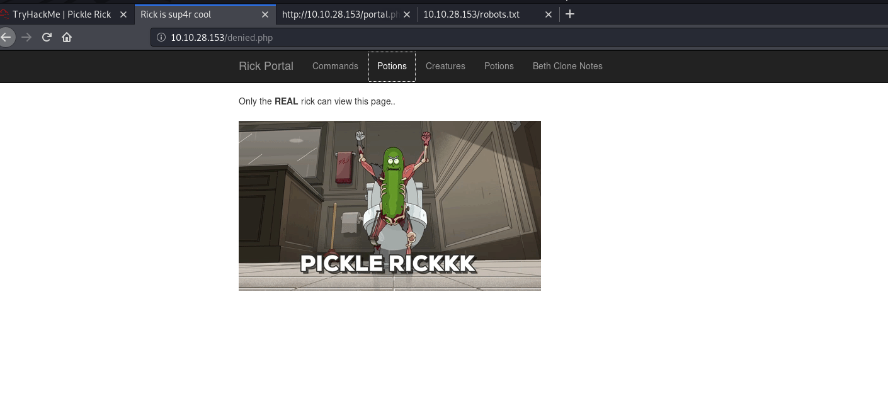

Let's try out that command panel. Running a simple `whoami` gives us:

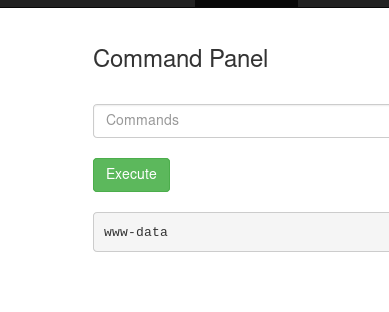

Nice! This proves that we can indeed inject commands here. Before doing so, I wanted to check the source code of this page in case I missed anything important:

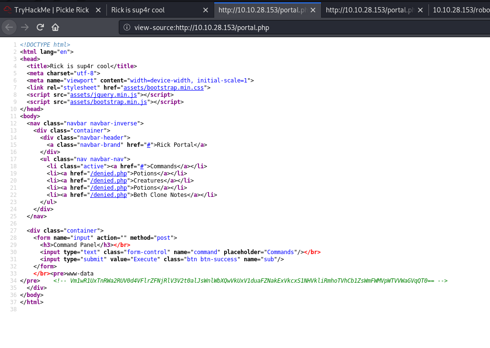

We get yet another strange phrase (in the green comment).

It seems that the phrase has been base64-encoded. After decoding it once, I realized that it has been base64-encoded multiple times in a row. Hence, after decoding and decoding, we find out that the phrase actually reads **"rabbit hole"**. What a rabbit hole indeed.

Alright, let's try executing some other commands. I first tried `ls`:

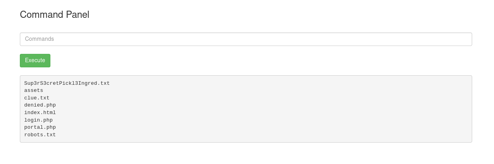

There is a file that interests me: **Sup3rS3cretPickl3Ingred.txt**

I tried to `cat` it:

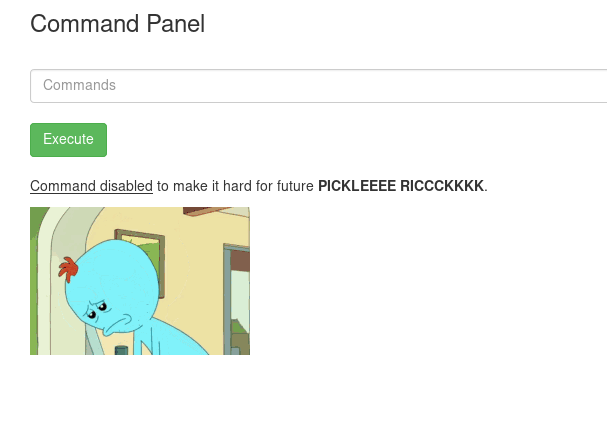

Hmmm no luck there. With that, let's try to set up a reverse shell so that we can explore more freely within the target machine! We begin by checking whether Python is installed on the target (`python3 -V`):

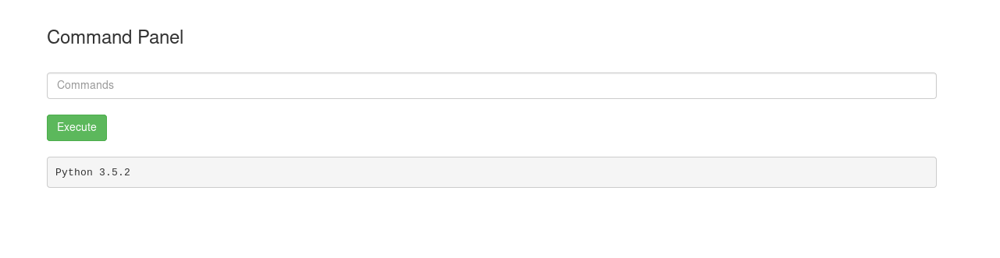

Great, looks like Python3 is installed.

Next, we'll be using **pentestmonkey's** [reverse shell cheatsheet](https://pentestmonkey.net/cheat-sheet/shells/reverse-shell-cheat-sheet) to find a Python-based reverse shell command:

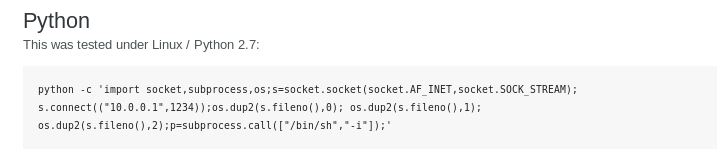

I set up a netcat listener on my local machine, ran the command above and successfully opened the reverse shell:

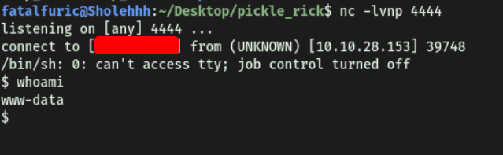

And we're in!

With that, we can obtain the first ingredient:

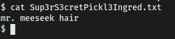

---

### [ Whats the second ingredient Rick needs? ]

There is another interesting file called **clue.txt**:


It tells us to look around the file system for the other ingredient. Doing just that, I found out that there are 2 users on the machine: **rick** and **ubuntu**:

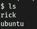

In rick's home directory, we find the second ingredient:

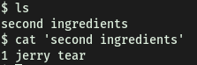

---

### [ Whats the final ingredient Rick needs? ]

Before continuing on, let's check out our **sudo privileges**:

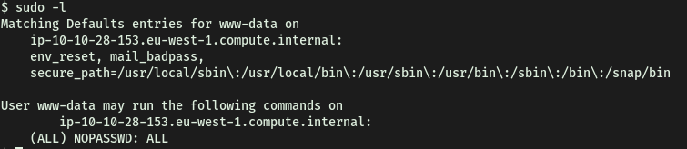

It turns out that we actually have **full sudo privileges**! This means that we can basically run any program or command as root.

I'm guessing the last ingredient will be found in the **/root** folder. Since we can run **sudo** with any command, we can just open up another bash shell as root:

```
sudo bash
```

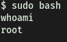

From there, we can obtain the last ingredient that is located in **/root**:

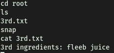

