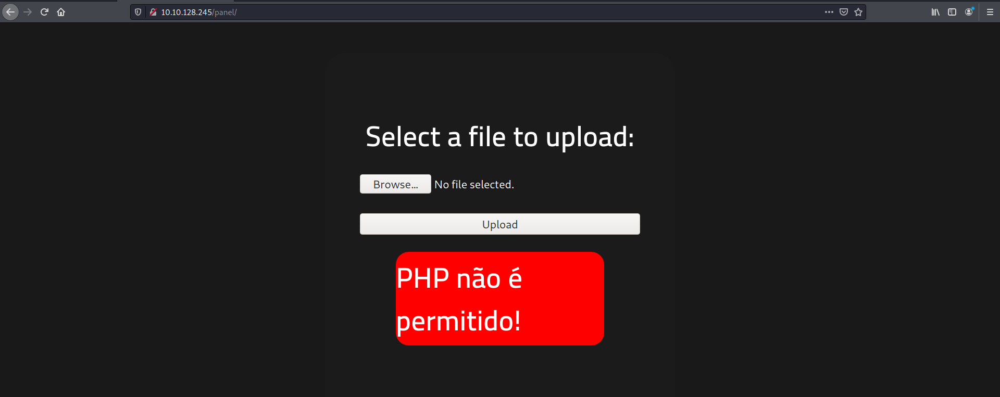

| Difficulty |  |  IP Address   |  |
| :--------: |--|:------------: |--|
|    Easy    |  | 10.10.128.245 |  |

---

As always, we start off with a basic `nmap` scan on the machine (top 1000 ports):

```
sudo nmap -sC -sV -vv 10.10.128.245 
```

**Results:**


From the scan, we can see that 2 ports are open: **22 (SSH)** and **80 (HTTP)**.

Let's visit the HTTP website. We are brought to the following webpage:


After trying out some low-hanging fruit (eg: source code, /robots.txt), I decided to use `gobuster` to enumerate possible directories that the webserver is hosting:

```
gobuster dir -u http://10.10.128.245 -x php,js -w /usr/share/wordlists/dirbuster/directory-list-2.3-medium.txt 
```

The `-x` option is used to indicate any extensions to add on to our attempts. In this case, we'll add .php and .js extensions as they are common file types used on webservers. After some time, I obtained the following results:


As we can see, there is an interesting directory called **/panel**. 

After accessing this directory, we are brought to the following page:


Looks like we have a page where we can upload files! 

My first thought was to upload a PHP script which sets up a reverse shell back to our machine. We'll use the PHP reverse shell script by [pentestmonkey](https://github.com/pentestmonkey/php-reverse-shell).

After downloading the PHP reverse shell, I uploaded it onto the webserver through the /panel webpage:



Uh oh. Looks like they do not allow for PHP files to be uploaded. We need to find a way to bypass this file upload restriction.

After doing some research, I came upon this [website](https://www.exploit-db.com/docs/english/45074-file-upload-restrictions-bypass.pdf) which had a lot of useful information on bypassing upload restrictions. From there, one way I learnt how web servers handled invalid file extensions was by using either a whitelist or blacklist.

---

*Blacklisting file extensions is when the server bans specific types of file extensions. Whitelisting file extensions is the opposite; specific types of file extensions are allowed.*

---

One way to bypass blacklists is to change the .php extension to something less common, yet will still allow the file to be run as a PHP file. One such extension is the **.phtml** extension. I tried changing the file extension to .phtml and uploaded the file onto the server.

Fortunately, this was all we needed to bypass the file restrictions! We can see that the file has been successfully uploaded onto the web server by checking the **/uploads** directory:


Now, when we click on our uploaded reverse shell file, the web server will execute it. However, before doing so, we need to set up a netcat server that will catch the incoming reverse shell connection. This can be done with the following command:

```
nc -lvnp 1234
```

Once the netcat server is set up, we then execute the uploaded PHP file and gain access!


Now that we're in the machine, we need to find the **user.txt** file. 

After manually searching through some directories, I decided to speed up the process by using the `find` command:

```
find / -name user.txt
```

The results show that the user.txt file is actually located in the /var/www/ directory:


With that, we have obtained the user flag!

---

Next, we need to find a way to escalate our privileges. 

Normally, I would import the LinPEAS enumeration script to help speed up and automate the process for me. However, the prompts given by the room state to search for files with the **SUID-bit** set. Hence, let's do a manual search using the `find` command:

```
find / -perm /u=s
```

From the results, we can see that strangely, the `Python` program has its SUID-bit set:


This means that when we run Python, we are actually running it as root!

To exploit this SUID-set Python binary, I looked on [GTFOBins](https://gtfobins.github.io/gtfobins/python/) to find out any exploits we could use. I came across this exploit:


Nice, this exploit will allow us to open a privileged shell! Since we already have an existing SUID binary for Python, we can skip the first command.

---

*After doing some research, I learnt what **os.execl()** does. It executes a new program which replaces the current process. The new executable is loaded into the current process and will have the same process id as the caller. In this case, since the caller is root, considering that python was run as root, we can then start up a new shell as root.* 

*The arguments to os.execl() indicate that we wish to replace the `/bin/sh` program with `sh -p`. The `-p` tag is used with `sh` to run in privileged mode.*

---

After running the exploit, we get a new shell as root!


We can then obtain the root flag located in /root.

