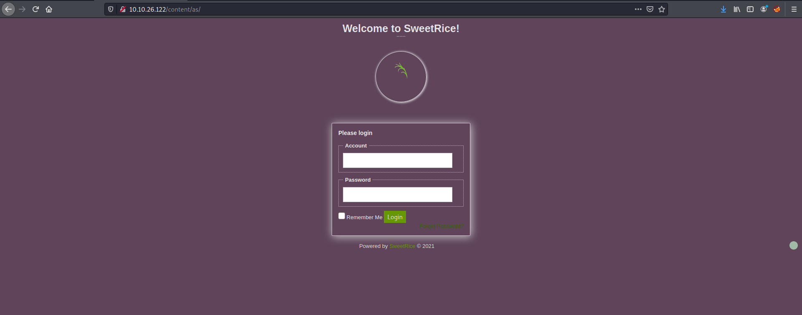
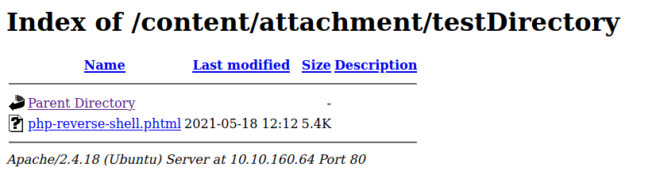

| Difficulty |  |  IP Address   |  |
| ---------- |--|:------------: |--|
|    Easy    |  |  10.10.26.122 |  |

---

First, let's run an `nmap` scan on the target machine so as to enumerate more information about the services running.

```
sudo nmap -sC -sV -vv 10.10.26.122
```

 **Results:**


As we can see, there are two services running on the target machine: **SSH (22)** and **HTTP (80)**.

Let's visit the HTTP web server:


We are brought to a default Apache2 homepage. 

Time to use `gobuster` to run a directory enumeration scan on the webserver:

```
gobuster dir -u http://10.10.26.122/ -x php,txt,js -w /usr/share/wordlists/dirbuster/directory-list-2.3-medium.txt
```

I also made sure to check for common extensions such as .php and .js.

Gobuster was quickly able to find a hidden directory called **/content**:


Visiting /content, I was brought to a webpage that seems to run off **SweetRice**, which is a website management system that I've never heard of. There were instructions on how to open the website and also some links to SweetRice documentation pages:


I proceeded to run Gobuster on this directory with the same settings as before. The results are as follows:


As we can see, there are a lot of sub-directories that we can explore. I looked through all of them and the 2 most interesting directories were the **/as** and **/inc** directories.

Going to the **/as** directory, we can actually see a login page!



Nice, this is probably a login page to an administrator dashboard. 

Now we just need to find a way to login. I tried some basic SQL injection payloads such as `' OR 1=1 --` , but they did not work. I next tried using `sqlmap` to help automate the process but it was unable to find the form located on this page. Hitting this deadend, I moved on to the /inc directory.

In the **/inc** directory, we can see that it contains many files and folders required for the running of the webpage. One folder that caught my attention was the **mysql_backup/** folder:


Sure enough, in the folder was a sql backup file:


This could be very useful as it may contain credentials that we can use to log into the dashboard. I downloaded the backup file and opened it in a text editor:


There's a huge wall of text, but line **79** reveals something very interesting:


Awesome! Looks like we have a username: 

> manager 

and a hashed password.

The password seems to be hashed using MD5. I'll use `john` to crack the hash:

```
echo 42f749ade7f9e195bf475f37a44cafcb > hash.txt

john --format=raw-md5 --wordlist=/usr/share/wordlists/rockyou.txt hash.txt
```

**Results:**


Nice! `john` managed to crack the administrator's password. The credentials of the administrator is:

> manager:Password123

With this credentials, we can log into the administrator dashboard:


And we're in! 

My first thought was to try uploading a malicious file onto the webserver, considering that we had access to all of those directories that contains those files. I'll be using the PHP reverse shell script that I already have stored on my computer (courtesy of [pentestmonkey](https://github.com/pentestmonkey/php-reverse-shell)).

Looking for a point where I could upload files, I came across the 'POST' > 'CREATE' buttons on the sidebar at the left of the dashboard. Clicking on them, I was brought to a form with an 'Add File' button:


I filled some dummy data into the fields of the form. When I clicked on the 'Add File' button, I was brought to another form:


We have a field where we can upload our reverse shell script! We also seem to be able to create a new directory as well. Maybe our uploaded file will be placed in this new directory? Let's test this out.

I uploaded the reverse shell file and created a new directory called **testDirectory**.

There didn't seem to be any errors after creating the post, so now I needed to find where this testDirectory folder was on the webserver. Looking back at the results of Gobuster from earlier, I noticed another interesting sub-directory called **/attachments**. This could be where the uploaded files were:


Yep, we can see our created directory. 

However, I realized that there were no files inside it. My guess was that there were some file upload restrictions that had been enforced by the web server. It probably detected that the file I wanted to upload was a PHP file and blocked it. Looks like I'll need to find some way to bypass these restrictions.

One way that I've learnt to do so is by simply changing the extension to a less common extension, such as **.phtml**. This works against file restrictions which used blacklists, as the developer might have forgotten to blacklist these uncommon extensions.

I changed the extension to .phtml and tried uploading to the same directory:



As we can see, the reverse shell script was successfully uploaded this time. 

I then used netcat to listen for incoming connections:

```
nc -lvnp 1234
```

With my netcat listener up and running, I clicked on the uploaded file to force the web server to execute it. With that, I was able to gain access into the server:


Exploring the machine, I found another user called **itguy**. The **user.txt** file can be found in this user's home directory.

---

Before continuing on with my privilege escalation, I upgraded the simple shell to a fully interactive TTY shell. This can be done with Python:

```
python -c 'import pty; pty.spawn("/bin/bash")'
```

Next, I needed to find a way to escalate my privileges. 

Firstly, since we discovered a password for the administrator account on SweetRice earlier, I was hoping that the itguy user would reuse this password. Thus, I tried to use **Password123** to log into itguy's ssh account. However, it did not work.

I then decided to use a privilege escalation script called [LinPEAS](https://github.com/carlospolop/PEASS-ng/tree/master/linPEAS) to help automate the process of finding privesc vectors. I transferred LinPEAS over to the target machine and ran it. Unfortunately, it was not able to detect any potential PE vectors. Looks like I will need to do some manual privesc instead.

The first thing I did was to check my **sudo privileges**. This can be done with `sudo -l`

**Results**


Looks like we can use `perl` to execute a file called **backup.pl** in itguy's home directory. The **NOPASSWD** also means that we will not be prompted for a password when running the program with sudo, which is great considering that we do not know the password of www-data.

Looking at the contents of backup.pl:


Looks like it calls another binary called **copy.sh** which can be found in the **/etc** directory. Since www-data does not have write permissions for backup.pl, we cannot directly edit it. Let's take a closer look at **copy.sh** instead.


Looks like the file tries to delete certain files using the `rm` command. The important thing to note about this binary is that it is actually writable by www-data!


I replaced copy.sh with my own bash code:

```
echo /bin/sh > copy.sh
```

Now, when we use `perl` to execute backup.pl, the copy.sh binary will be executed and `/bin/bash` will be run, thus spawning a new shell. Since I'll be using `sudo`, the shell spawned should be as **root**. 


We're logged in as root! **root.txt** can be found in **/root**.

