| Difficulty |  |  IP Address   |  |
| :--------: |--|:------------: |--|
|    Easy    |  |  10.10.166.33 |  |

---

**This writeup is for Task 11 of the 'Upload Vulnerabilities' room.**

---

Since the room is specifically about upload vulnerabilities, we know how we are supposed to go about compromising our target. 

We are asked to visit the website: http://jewel.uploadvulns.thm:

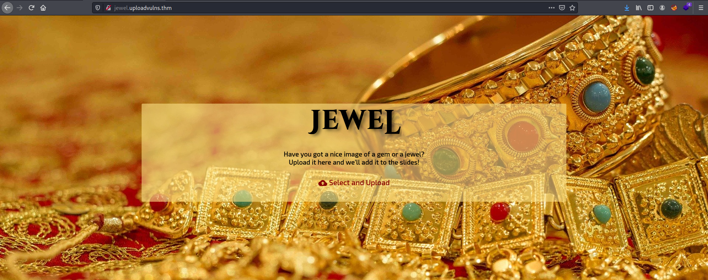

Looks like we have a simple page with the ability to upload a file. 

Since we will most probably be uploading a reverse shell to the server, we first need to find out where uploaded files are stored. 

To do so, let's use `gobuster` to enumerate any directories on the webserver which might contain uploaded files:

```
gobuster dir -u http://jewel.uploadvulns.thm -w /usr/share/wordlists/dirbuster/directory-list-2.3-medium.txt 
```

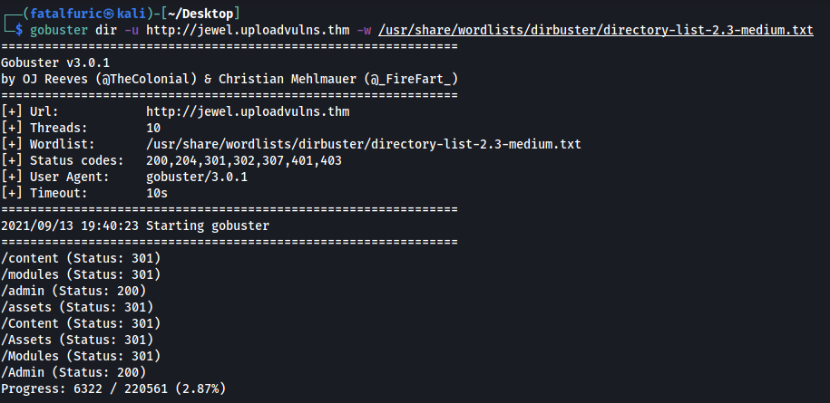

Gobuster returns a few directories of interest:

* **/content** - could be where our files are uploaded to?
* **/modules**
* **/admin**

Let's try to access these directories! We start off first with **/content**:

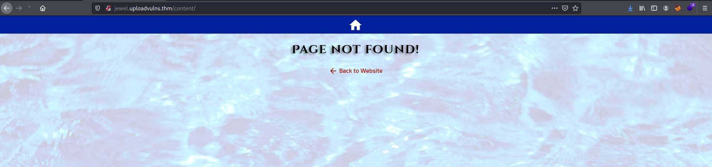

Hmmm... page not found. How about **/modules**?

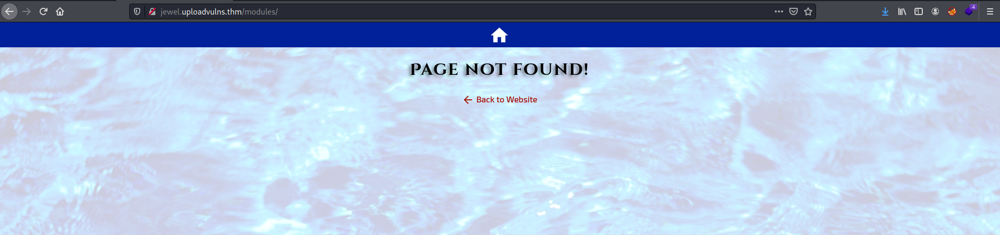

Page not found as well. Let's try visiting **/admin**:

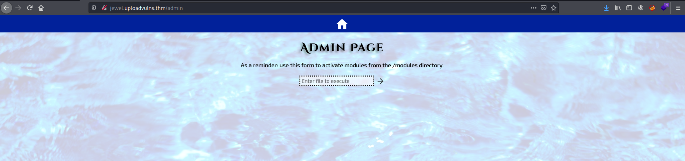

Interesting! Seems like we can enter a file name and the server will execute it. This is probably how we will end up executing our reverse shell later on. Also note that the server will execute files from the **/modules** directory. 

Unfortunately, we can't do much on this page right now as we do not know about any existing files in the /modules directory, nor have we uploaded any files of our own. 

Let's go back to the main page and try to enumerate more information about the file upload functionality. 

Firstly, we need to figure out what types of files the server will accept. To do so, we can try uploading different files and note which ones are allowed. Alternatively, a more efficient way would be to look at the source code and see if there is any validation being performed on the client-side. 

The source code is shown below:

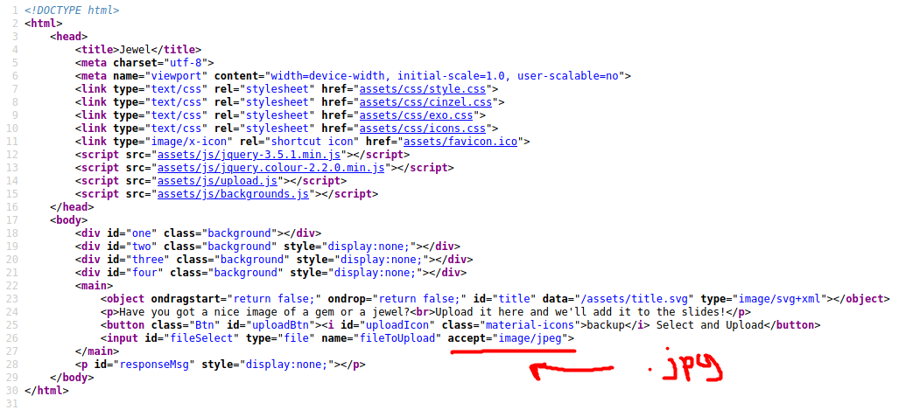

As we can see, seems like the server only accepts **jpg** files. To verify this, I tried uploading a jpeg image of a dog, as shown below:

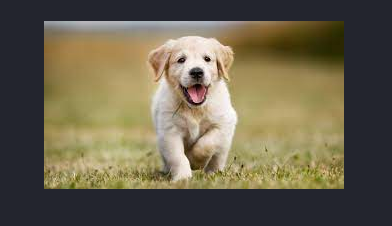


As expected, the file was uploaded successfully.

Next, we can try uploading a file of a different type. Let's try uploading a [PHP reverse shell script](https://github.com/pentestmonkey/php-reverse-shell). The file is named 'php-reverse-shell.php':

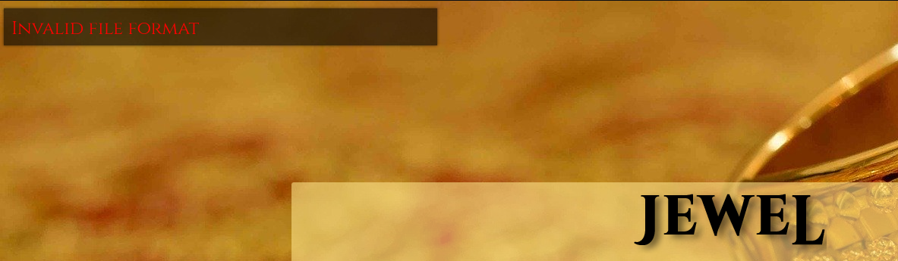

Unfortunately, the file was not allowed. 

Before we fully figure out the file validation measures set in place, let's first try to find a way to access our uploaded files. Since we cannot directly access **/content** or **/modules**, we need to think of another method.

From the main page, we know that the uploaded images are supposed to be used as part of the background slides. This means that the background has to be taken from somewhere on the webserver. To find out where, we can inspect the web page to locate the source of the background images. This is done using ctrl-shift-i (on firefox) and navigating to the 'Inspector' tab:

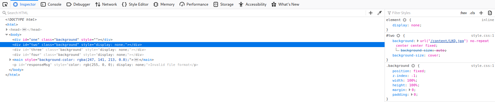

After clicking on the background element:

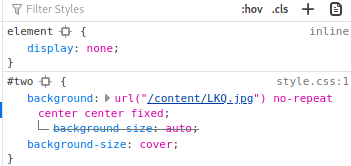

We can see that the background images are indeed taken from the **/content** directory. 

However, something important to note is that the name of the image file has been changed to a randomized three-character alphabetical string. This means that we cannot simply access our uploaded files using their original names ('dog.jpg' for eg). 

The CTF room actually provides us with a customized wordlist consisting of three-character alphabetical strings. We can use this wordlist with `gobuster` to find out the name of files that we have uploaded. Note that we have to specifically target the '/content' directory in our scan. Since we are dealing specifically with jpg files, we also have to use the `-x` tag to indicate the .jpg extension.

```
gobuster dir -u http://jewel.uploadvulns.thm/content -x jpg -w ~/Downloads/UploadVulnsWordlist.txt -t 250
```

*(Note: `-t` just indicates the number of threads to execute the task)*

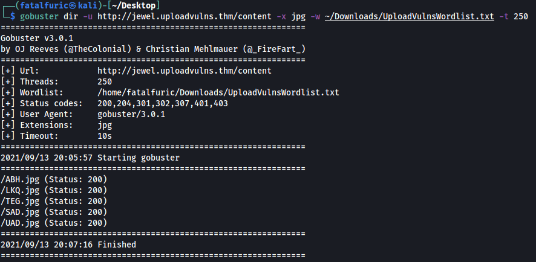

Looks like we managed to find the background images! 

If we visit **/content/TEG.jpg**, we can find the image of the dog that we uploaded earlier:

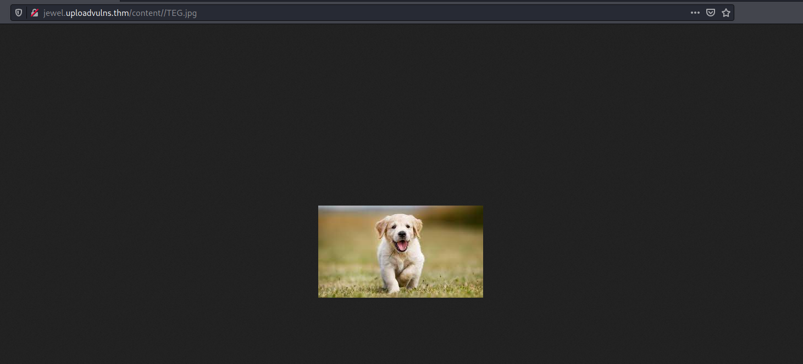

Great! Now we know where the files that we uploaded are being stored, as well as how they are stored.

Next, we need to enumerate the file upload validation measures that have been put in place by our target. There are two places where file validation can take place: **client-side** or **server-side**.

Let's start off with enumerating the client-side measures.

Looking back at the source code, we can see that there is a '**upload.js**' script that is loaded in: 

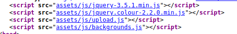

Clicking on this script, we can see that the server has indeed implemented 3 client-side validation measures:

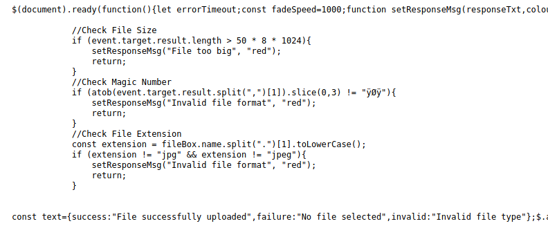

Upon uploading a file, the client's browser will check for the file size, magic number and the file extension. 

The great thing about these measures being implemented on the client-side is that we can simply intercept the 'login.js' file in Burpsuite (when the browser requests for it) and delete these checks before sending the file back to the client. This allows us to remove all of these validation measures without having to individually circumvent them.

---

*Before we can do this, we need to configure Burpsuite to intercept requests to Javascript files as it will not do so by default. To do so, go to: Proxy -> Options -> Intercept Client Requests.* 

*Edit the first entry (Match Type: File extension) and remove `^js$|`*

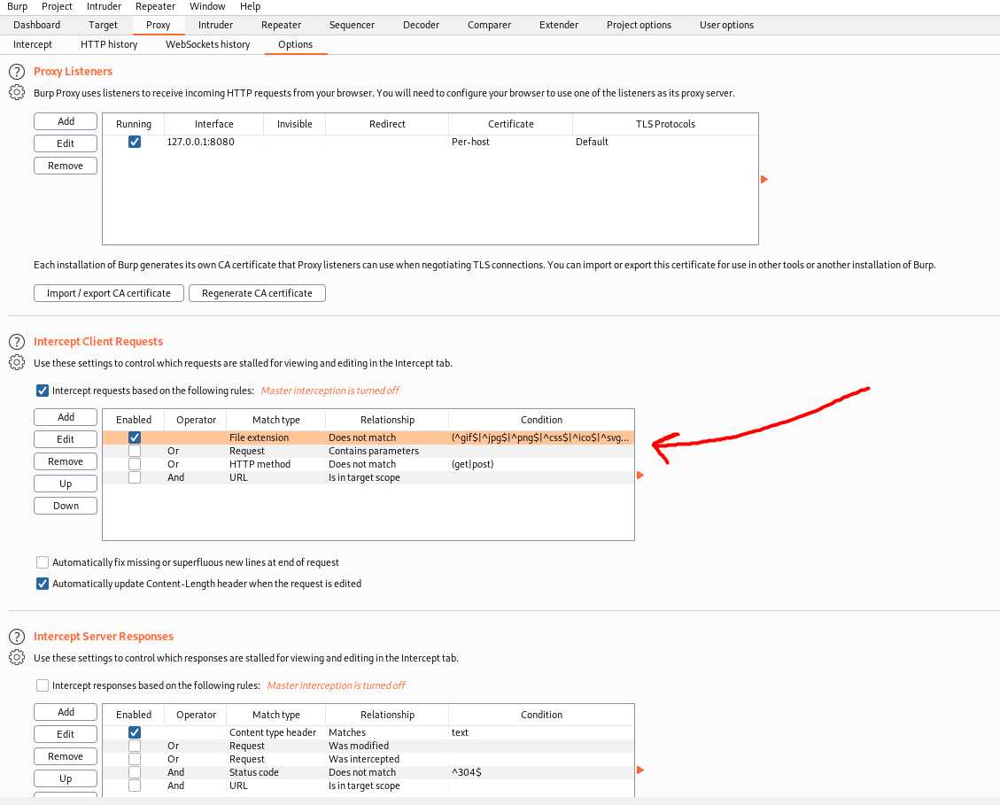

---

With Burpsuite set up to intercept the 'login.js' file, we can turn on our proxy and reload the page. Make sure to hard reload the page using ctrl-f5. If not, the browser will simply load the page from its cache instead of requesting upload.js again.

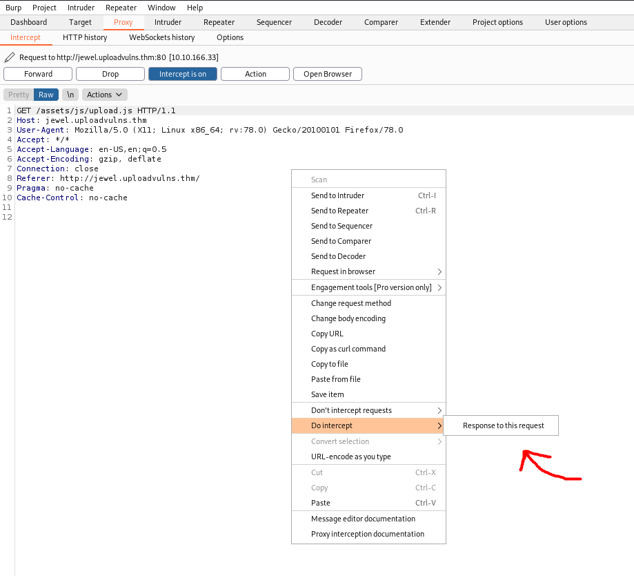

Here, we can see our client's request to /assets/js/upload.js. 

To intercept the 'upload.js' file, we right-click on the request, then click on: Do Intercept -> Response to this request

Now, we just forward the other requests until we get to the 'login.js' response:

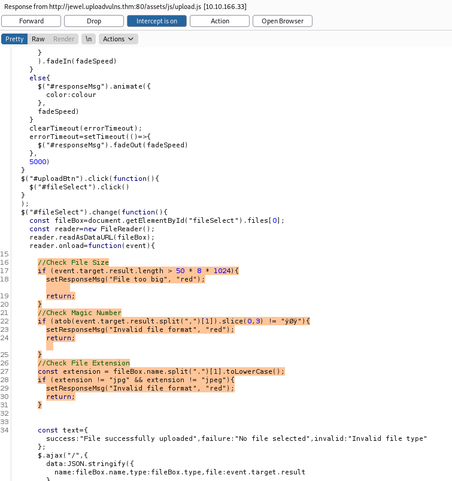

We can then delete the validation measures (highlighted above) from 'upload.js' before forwarding it to the client.

Nice, we have dealt with the client-side measures! 

Before working on the server-side measures, we need to craft our reverse shell payload. Not all servers use PHP, which means that our trusty PHP reverse shell might not always work. We need to find out what programming languages and frameworks are being used by our target web server. To do so, we can use a nifty extension called [Wappalyzer](https://www.wappalyzer.com/):

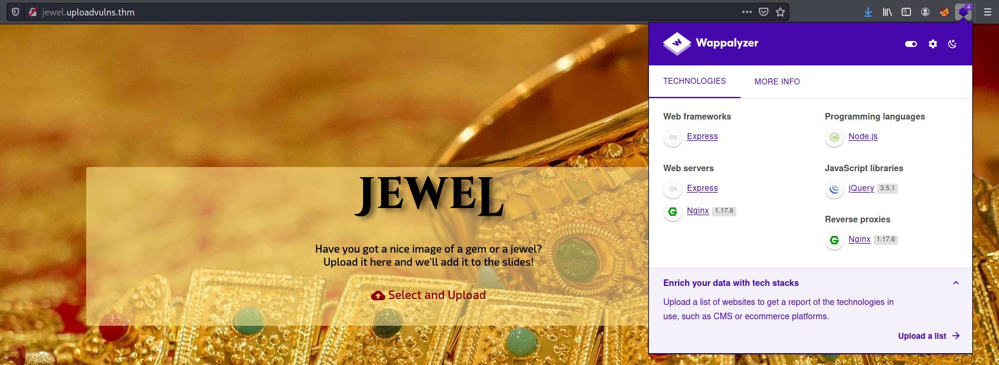

As we can see, the web server uses Node.js. Thus, we need to craft our reverse shell using **Javascript**.

We can use the following reverse shell script from [PayloadsAllTheThings](https://github.com/cyberheartmi9/PayloadsAllTheThings/blob/master/Methodology%20and%20Resources/Reverse%20Shell%20Cheatsheet.md):

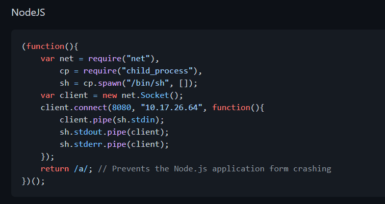

We copy the reverse shell script into a file called 'node-reverse-shell.js'.

We then try uploading this file onto the web server. Since we deleted all of the client-side file validation measures earlier on, there should not be any issues with our file length, format or extension.

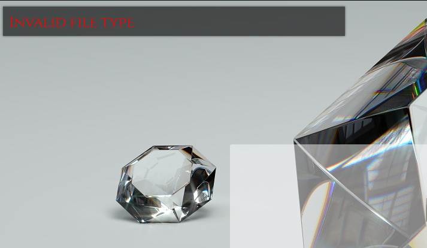

As we can see, we are still unable to upload the file. This is most probably due to some server-side measures in place. 

One possible measure is checking for the **mimetype** of the file. 

---

A [mimetype](https://developer.mozilla.org/en-US/docs/Web/HTTP/Basics_of_HTTP/MIME_types) is a standard that indicates the nature and format of a document, file or assortment of bytes.

---

To change the mimetype, let's try and upload our reverse shell again. This time, we intercept the upload request using Burpsuite:


We can see that the mimetype in the request is set to **application/x-javascript**. 

We now change this to the mimetype of jpeg files, which is **image/jpeg**:

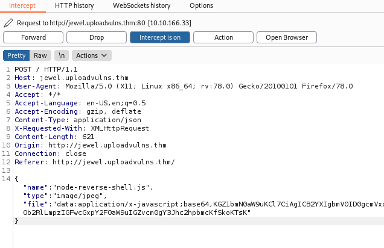

Now we forward the request and see if our upload worked:

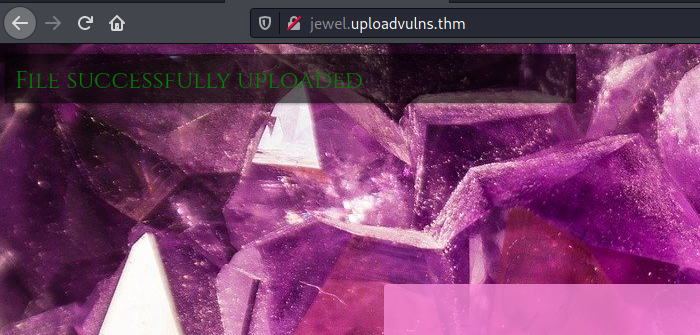

Great! We have successfully circumvented all of the file validation measures and uploaded our Node.js reverse shell. :smiley:

Now we need to find out what our payload is called on the web server. To do so, we re-run our `gobuster` scan like before:

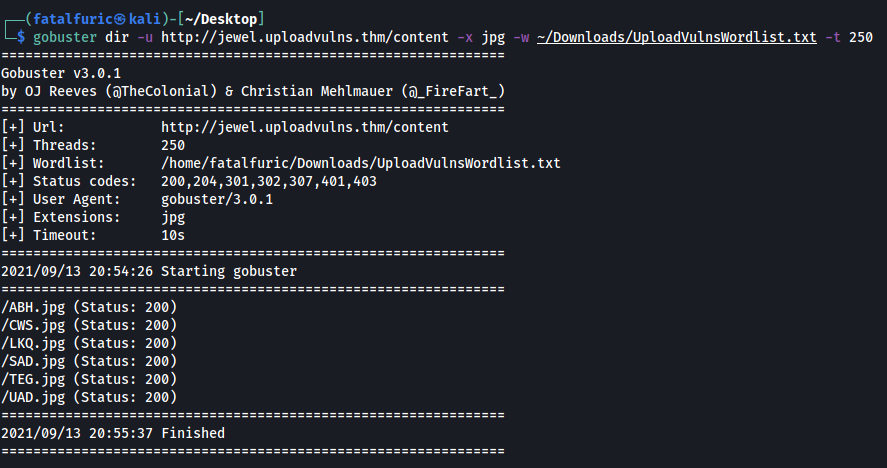

**CWS.jpg** should be our uploaded reverse shell as it was not present in our earlier `gobuster` scan. 

With the name of our uploaded reverse shell script, we just need to find out how to have the web server execute it. 

Let's first start up our netcat server.

```
nc -lvnp 1234
```

We should be able to execute our payload via the **/admin** page. 

Remember that the form on /admin executes files in the /modules directory, while our uploaded files are stored in the /content directory. Hence, a simple directory traversal is all we need in order to access our reverse shell file!

We just need to input **'../content/CWS.jpg'** into the form:

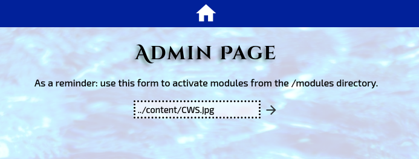

Our reverse shell is then successfully executed, allowing us to gain access into the target machine! 

With that, we are able to obtain the flag:

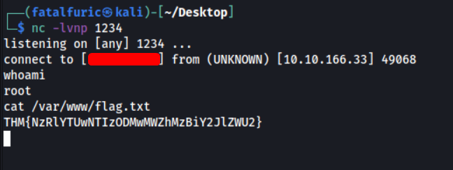

