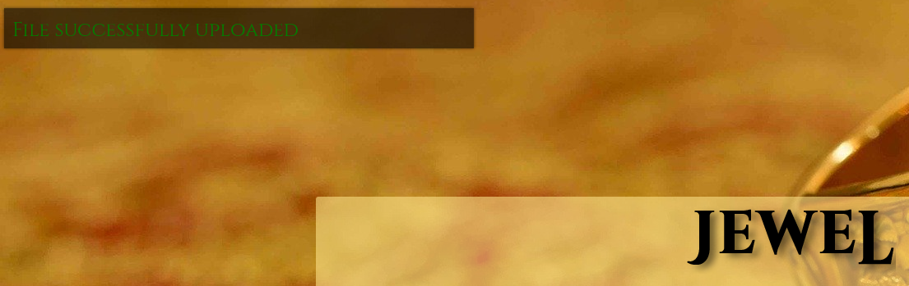

| Difficulty |
| ---------- |
|    Easy    |

---

**This writeup is for Task 11 of the 'Upload Vulnerabilities' room.**

---

Since the room is specifically about upload vulnerabilities, we know how we are supposed to go about compromising our target. We are asked to visit the website: http://jewel.uploadvulns.thm. Let's do that now and see what we get:


Looks like we have a simple page with the ability to upload a file. Since we will most probably be uploading a reverse shell of some sorts to the server, we need to first find out where uploaded files are stored. To do so, we will use `gobuster` to enumerate any directories on the web server (which might allow us to access our uploaded files).

To do so, we will use the following command:

```
gobuster dir -u http://jewel.uploadvulns.thm -w /usr/share/wordlists/dirbuster/directory-list-2.3-medium.txt 
```


As we can see from Gobuster's results, we have a few directories of interest:

* **content** - could be where our files are uploaded to?
* **modules**
* **admin**

Let's try to access these directories! We start off first with **/content**:


Hmmm... No luck here. How about **/modules**?


No luck here as well. Looks like getting a reverse shell won't be so easy after all. Let's try to visit **/admin** now:


Interesting. We can enter a file name and the server will execute it. This is probably how we will end up executing our reverse shell later on. Also note that the server will execute files from the **/modules** directory. Unfortunately, we can't do much on this page right now as we do not know about any existing files in the /modules directory, nor have we uploaded any files of our own. 

Let's go back to the main page and try to enumerate more information about the file upload functionality. Firstly, we need to figure out what types of files the server will accept. To do so, we can try uploading different files and note which ones are allowed. Alternatively, a more efficient way would be to look at the source code and see if there is any validation being performed on the client-side. The source code is shown below:


As we can see, seems like the server only accepts **.jpg** files. To verify that this holds true, I tried uploading a jpeg image of a dog, as shown below:




As expected, the file was uploaded successfully.

Next, we can try uploading a file of a different type. Let's try uploading a PHP reverse shell script (courtesy of [pentestmonkey](https://github.com/pentestmonkey/php-reverse-shell)). The file is named **"php-reverse-shell.php"**:


As expected, the file was not allowed. Before we go on further to fully figure out the file validation measures set in place by the web server, let's first try to figure out a way to access our uploaded files. Since we cannot directly access **/content** or **/modules**, we need to think of another way.

From the main page, we know that the uploaded images are supposed to be used as part of the background slides. This means that the background has to be taken from somewhere on the webserver. To find out where, we can inspect the web page to locate the source of the background images. This is done using **ctrl-shift-i** (on firefox) and navigating to the '**Inspector**' tab:


After clicking on the background element:


Interesting! We can see that the background images are indeed taken from the **/content** directory. However, something important to note is that the name of the image file has been changed to a randomized three-character alphabetical string. This means that we cannot simply access our uploaded files using "**/content/dog.jpg**" (for eg). The CTF room actually provides us with a customized wordlist consisting of three-character alphabetical strings. We can use this wordlist with `gobuster` to find out the name of files that have been uploaded. We have to specifically target the **/content** directory in our Gobuster command. Since we are dealing specifically with jpeg files, we also have to use the `-x` tag to indicate the .jpg extension.

The command to do so is:

```
gobuster dir -u http://jewel.uploadvulns.thm/content -x jpg -w ~/Downloads/UploadVulnsWordlist.txt -t 250
```

*(Note: `-t` just indicates the number of threads to execute the task)*


Looks like we managed to find the background images! 

If we visit **/content/TEG.jpg**, we can also find the image of the dog that we uploaded earlier.


Great! Now we know where the files that we uploaded are being stored, as well as how they are stored.

Next, we need to enumerate the file upload validation measures that have been put in place by our target. There are two places where file validation can take place: **client-side** or **server-side**. Hence, we need to figure out **where** and **what** measures are in place. Let's do that now.

Looking back at the source code of the web server, we can see that there is a '**upload.js**' script that is loaded in. There is a high chance that this script contains the client-side validation measures implemented by the web server.


Clicking on '**upload.js**', we can see that the server has indeed implemented three client-side validation measures:


Upon uploading a file, the client's browser will check for the **file size**, **magic number** and the **file extension**. The great thing about these measures being implemented on the client-side is that we can simply intercept the response in **Burpsuite**, then delete these checks from the response, before sending back to the client. Thus, we can remove all of these validation measures without having to individually circumvent them.

---

*Before we can do this, we need to configure Burpsuite to intercept requests to Javascript files as it will not do so by default. To do so, go to **Proxy** -> **Options** -> **Intercept Client Requests**. Edit the first entry (Match Type: File extension) and remove `^js$|`*


---

With **Burpsuite** set up, we can turn on our proxy and reload the page. Make sure to **hard reload** the page using **ctrl-f5** (instead of the usual f5). If not, the browser will simply load the page from its cache instead of requesting upload.js again.


Here, we can see our client's request to **/assets/js/upload.js**. Normally, what happens is that this javascript file will be returned to the client's browser and rendered. However, we want to intercept what is being returned and alter the code first. To do so, we right-click on the request, click on **Do Intercept** -> **Response to this request**.

Now, we just forward the requests until we get to the response:


Nice. We have managed to intercept the response and can simply delete the validation measures (highlighted above) before forwarding the response to the client.

We have dealt with the **client-side measures**, now we have to deal with measures on the **server-side**. However, before doing so, we need to craft our reverse shell payload. Not all servers use **PHP**, which means that our trusty php reverse shell might not always work. We need to find out what programming languages and frameworks are being used by our target web server. To do so, we can use a nifty extension called [Wappalyzer](https://www.wappalyzer.com/).


As we can see, the web server uses **Node.js**. Thus, we need to craft our reverse shell using **Javascript**.

We can use the following the reverse shell script from [PayloadsAllTheThings](https://github.com/cyberheartmi9/PayloadsAllTheThings/blob/master/Methodology%20and%20Resources/Reverse%20Shell%20Cheatsheet.md):


We then create a javascript file called '**node-reverse-shell.js**' and place the reverse shell code in. Also make sure to change the IP address and port number, which you will use to set up your netcat server later on.

With our payload crafted, we can try uploading it onto the web server. Since we deleted all of the client-side file validation measures earlier on, there should not be any issue with our file length, format or extension. Hence, we do not need to change the magic numbers of our files or the extension.


As we can see, we are still unable to upload the file, and this is most probably due to the server-side measures. One possible check is for the **mimetype** of the file. A [mimetype](https://developer.mozilla.org/en-US/docs/Web/HTTP/Basics_of_HTTP/MIME_types) is a standard that indicates the nature and format of a document, file or assortment of bytes.

To change the mimetype, let's try and upload our reverse shell again. This time, we intercept the upload request using **Burpsuite**:


We can see that the mimetype in the request is set to **application/x-javascript**. We now change this to the mimetype of jpeg files, which is **image/jpeg**.


Assuming that the mimetype check is the only validation done the server-side, then we do not need to change the name of the file being uploaded. 


Great! We have successfully circumvented all of the file validation measures and uploaded our Node.js reverse shell. :smiley:

Now we need to find out what our payload is called on the web server. To do so, we re-run our `gobuster` scan like before:


**CWS.jpg** should be our uploaded reverse shell as it was not present in our earlier `gobuster` scan. Now, we just need to find out how to have the web server execute it. Let's first start up our **netcat** server.

```
nc -lvnp 1234
```

We should be able to execute our payload via the **/admin** page. Remember that the form on the /admin page executes files in the **/modules** directory, while our uploaded files are stored in the **/content** directory. Hence, a simple **directory traversal** is all we need in order to access our reverse shell file!

We just need to input **'../content/CWS.jpg'** into the form:


Our reverse shell is then successfully executed, allowing us to gain remote code execution onto the web server! With that, we are able to obtain the flag and complete the challenge:


