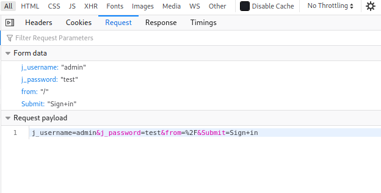

| Difficulty |  |  IP Address   |  |
| :--------: |--|:------------: |--|
|    Hard    |  |  10.10.43.10  |  |

---

### [ Basic Setup ]

Before working on the box, the room requested that we modify our hosts file to reflect **internal.thm**:


---

### [ User.txt Flag ]

Let's start off with a basic `nmap` scan on our target. We'll be running the scan with basic scripts loaded and version enumeration enabled. Since we do not care about how 'noisy' our scan is, we can crank up the aggressiveness using the `-T4` option.

```
sudo nmap -sC -sV -vv -T4 10.10.43.10
```

**Results:**


As we can see, there are only 2 ports open on the machine: **22 (SSH)** and **80 (HTTP)**

*(Note: I later conducted a full nmap scan on all ports. The results were the same)*

We'll leave the SSH server alone for now. Let's go ahead and take a look at that HTTP web server:


Looks like we have a basic Apache2 default webpage. 

We can try using `gobuster` to enumerate any directories that exist on this web server. I'll make sure to check for common filetypes such as php and txt files.

``` 
gobuster dir -u http://internal.thm/ -w /usr/share/wordlists/dirbuster/directory-list-2.3-medium.txt -x php,html,css,txt -t 100 
```

**Results:**


From the results, we can see a couple of directories on the web server. The directories that really interest me are **/blog** and **/phpmyadmin**. From the **/wordpress** directory, we can also tell that the WordPress service is being used.

Let's go ahead and navigate to these directories:

**/blog**


As suspected, we have a WordPress website! I ran another `gobuster` scan on the /blog directory so as to enumerate any other sub-directories. In the meantime, let's take a look at /phpmyadmin:

**/phpmyadmin**


Interesting! We have a login page that could potentially be susceptible to credential brute-forcing. However, before we go down this rabbit hole, let us first take a look at our Gobuster scan for the /blog directory. *(Note: In the end, the /phpadmin directory was not needed to solve the room.)*


After looking through all of the sub-directories, **/wp-login.php** stands out the most as it actually brings us to a WordPress login page:


We can actually use a nifty tool called [WPScan](https://github.com/wpscanteam/wpscan), which is a vulnerability scanner built specifically for WordPress websites. One of the features of WPScan is the ability to run a dictionary attack on the login page, which will hopefully enumerate a set of credentials that we can use to log into the WordPress dashboard.

Before we do that, we first need to guess what username the WordPress Administrator could be using. Fortunately for us, the error message when logging in with incorrect sets of credentials actually differs depending on whether that account exists or not.

> Username: test


> Username: admin


Hence, from the different error messages, we can deduce that **admin** is a valid username and there is currently an account associated with it. This is most likely the administrator's username.

---

*Alternatively, if we look at the /readme.html directory on the main site, we also find out that the username: 'admin' is the default username for the WordPress dashboard.*


---

Now that we have our admin username, let's go ahead and run the dictionary attack using `wpscan`:

```
wpscan --url http://internal.thm/blog/ -U admin -P /usr/share/wordlists/rockyou.txt
```

**Results:**


Nice! We have managed to obtain the administrator's password:

> my2boys

With that, let's log into the WordPress dashboard:


The first thing we can do is to look at the posts that the admin has uploaded previously:


Looks like there is a private post created which actually contains a set of credentials

> william : arnold147

I tried to use these credentials to log into the WordPress dashboard, the myphpadmin login page as well as the SSH server. Unfortunately, they all did not work. Hitting a dead-end, I decided to note these credentials down and move on.

I did some research online on how we can exploit the WordPress service, eventually coming across this [website](https://pentaroot.com/exploit-wordpress-backdoor-theme-pages/).

From the WordPress dashboard and WPScan, we know that the website is running a theme called 'Twenty Seventeen'. The use of such themes is a potential attack vector as we can actually leverage the **Theme Editor** to upload some malicious code onto the web server! In our case, we will be uploading a PHP reverse shell.

We first navigate to **Appearance** > **Theme Editor**:


Next, we have to find a theme file which we can edit. One file that is commonly used is the archive.php file:


All we have to do now is to delete all of the currently existing code and replace it with our own reverse shell code. We shall use the PHP Reverse Shell code provided by [pentestmonkey](https://github.com/pentestmonkey/php-reverse-shell).

**Replaced code:**


With the code replaced, we click on 'Update File' to save it.

Lastly, with a netcat listener up and running, we can then open the reverse shell by navigating to `http://internal.thm/blog/wp-content/themes/twentyseventeen/archive.php`


And we're in! :smiling_imp:


There is a user called **aubreanna**, but we are unable to access her home directory. Looks like we'll need to do some manual enumeration.

After searching through some of the common directories within the machine, I eventually found an interesting file in /opt:


Great! We now have aubreanna's password: 

> bubb13guM!@#123

This should be her credentials to her account on the machine. Let's try to SSH into her account:


With that, we are able to access aubreanna's home directory and obtain the **user flag**.

---

### [ Root.txt Flag ]

Apart from the user flag, there is also a text file called **jenkins.txt**:


It seems as if there is a Jenkins service running on a Docker container hosted by our target. We know this as the welcome message when we log into SSH actually reveals the IP address for docker0, which is 172.17.0.1:


Of course, we would not be able to directly access the container from our local machine, as the docker IP address is an internal IP address. Instead, we can use SSH tunnelling to grant us access through the target machine.

On our local machine, we run the following command:

```
ssh -L 9999:172.17.0.2:8080 aubreanna@10.10.43.10
```

This will set up a local SSH Reverse Tunnel, where all traffic to port 9999 of our local machine will be forwarded to port 8080 of 172.17.0.2, which can be reached via our target machine using aubreanna's account.

Once the tunnel is established, we then navigate to `localhost:9999` in our web browser:


And we have a Jenkins login page! We will use `hydra` to attempt to brute-force a working set of credentials. Let's try using **admin** as the username again.

Before running Hydra, we first need to find out some key information in the request made when we try to log into Jenkins. We can use the in-built network inspector in our web browsers to do so *(ctrl-shift-i on Firefox and Chrome)*.


From the request headers, we know that the request is a POST request. This means that we will use 'http-post-form' as the method in Hydra. We also see that the request is directed towards '/j_acegi_security_check'.



Next, from the form data of the request, we see that four parameters are sent: 'j_username', 'j_password', 'from' and 'Submit'.


Lastly, we see that the error message upon providing incorrect credentials is: 'Invalid username or password'

With these information, we can craft our `hydra` command:

```
hydra -s 9999 -l admin -P /usr/share/wordlists/rockyou.txt 127.0.0.1 http-post-form "/j_acegi_security_check:j_username=^USER^&j_password=^PASS^&from=%2F&Submit=Sign+in:Invalid username or password" -V
```

**Results:**


Nice! Hydra managed to obtain the password to the admin account:

> spongebob 

Now we can log in.

There are numerous ways to exploit Jenkins, many of them resulting in remote code execution. An easy way is to use the **Script Console** tool. This tool can be accessed via **Manage Jenkins** > **Script Console** from the left-hand sidebar.


With this tool, we can run Groovy code on the server. This means that we can set up a reverse shell yet again, granting us access into the Docker container running the Jenkins service.

We shall use the following Groovy [payload](https://gist.github.com/frohoff/fed1ffaab9b9beeb1c76):


With our netcat listener up and running, we run the code and gain access into the container running the Jenkins server.


Next, we can conduct some manual enumeration, starting off by checking some of the common directories where users can store files and other useful information. Since I managed to find user credentials in the /opt directory earlier on, I figured that would be the first place I would look:


Luckily for us, it seems as if there is a **note.txt** file located in the /opt directory. The file actually contains the credentials to access the root account on our target machine!


With that, we are able to log into the machine as root and obtain the **root flag** from /root.


