|  | Difficulty |  |  IP Address   |  | Room Link |  |
|--| :--------: |--|:------------: |--| :--------:|--|
|  |    Hard    |  | 10.10.172.68  |  | [Daily Bugle](https://tryhackme.com/room/dailybugle) |  |

### [ Access the web server, who robbed the bank? ]

Lets first run an `nmap` scan on our target machine so as to enumerate the services that are running on it.

```
sudo nmap -sC -sV -vv -T4 10.10.172.68
```

**Results:**

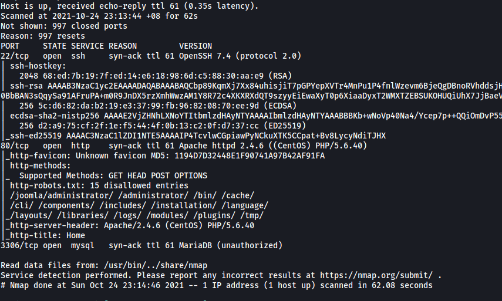

From the results of this basic scan (top 1000 ports), we can see that there are 2 ports open: **22 (SSH)** and **80 (HTTP)**

*(Note: I later ran a full nmap scan targeting all ports and it gave the same results)*

Let's go ahead and visit the HTTP Web server. We are greeted with the following blog post:

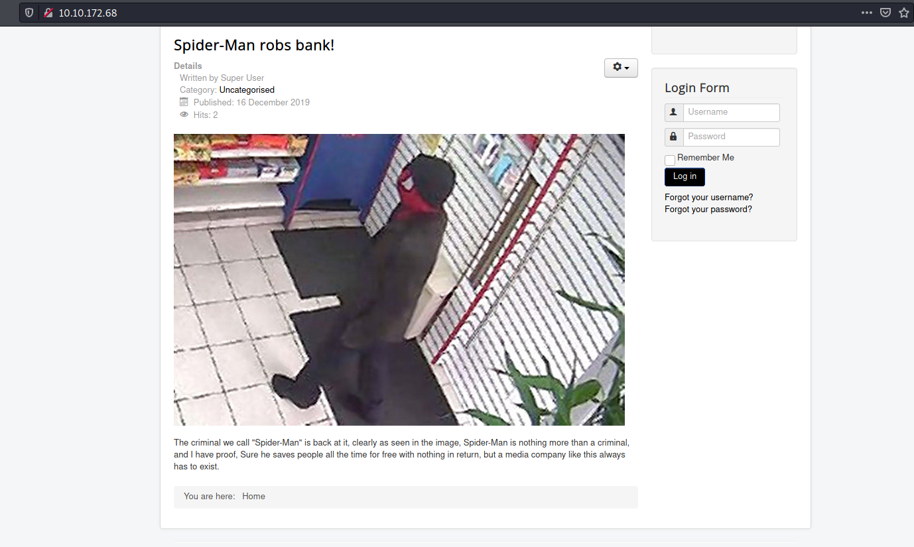

**Spiderman** robbed the bank.

---

### [ What is the Joomla version? ]

Since this webpage does not seem to contain anything of use to us, let's try to brute-force some hidden directories using `gobuster`. We  make sure to check for common filetypes such as php and txt files.

```
gobuster dir -u http://10.10.172.68/ -w /usr/share/wordlists/dirbuster/directory-list-2.3-medium.txt -x php,html,txt,css -t 100
```

**Results:**

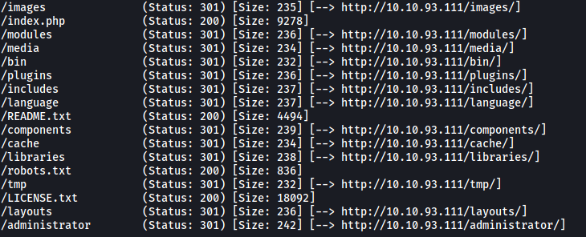

Looks like there is a whole slew of directories that we can check out, the most notable being **/administrator**. Let's take a look at that first:

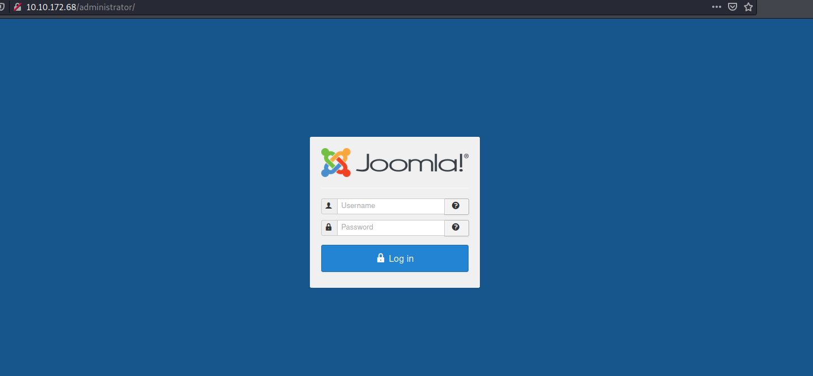

And we have a Joomla CMS login page. Before we can try exploiting this CMS service, we first need to find out what version of Joomla the web server is running. 

There are many ways to find out the version, one of them using a automated vulnerability scanner called [Joomscan](https://github.com/OWASP/joomscan). However, with a bit of careful digging, we can actually manually enumerate this information ourselves! The Joomla version can be found in the **/README.txt** directory:

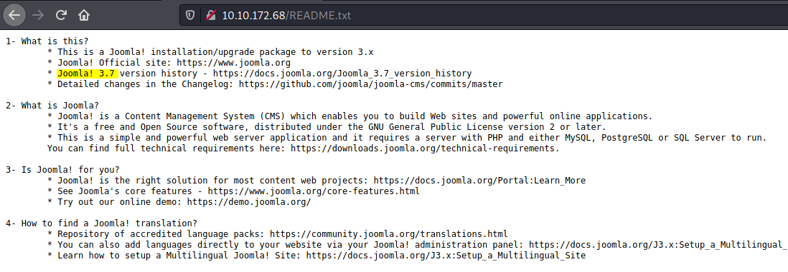

Joomla Version: **3.7.0**

---

### [ What is Jonah's cracked password? ]

Let's check if there are any publicly available exploits for Joomla Version 3.7.0. We can use `searchsploit` to do so:

```
searchsploit joomla 3.7.0
```

**Results:**

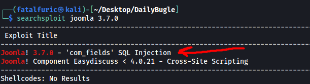

Sure enough, there is a very promising exploit that uses a vulnerable parameter within the Joomla service to launch an SQL injection attack, allowing us to dump out the entire backend database. By doing so, we will be able to gain access to critical information such as usernames and passwords.

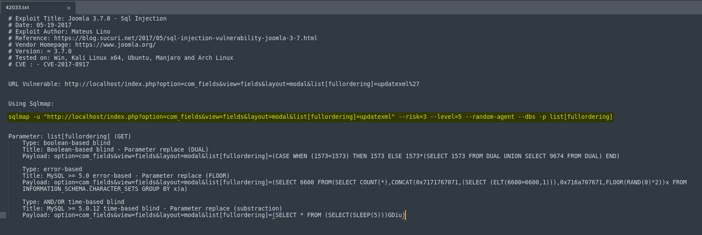

The exploit instructs us to use `sqlmap` to launch the SQL injection attack. We can simply use the command provided (highlighted above):

```
sqlmap -u "http://10.10.172.68/index.php?option=com_fields&view=fields&layout=modal&list[fullordering]=updatexml" --risk=3 --level=5 --random-agent --dbs -p list[fullordering] --batch
```

**Results:**

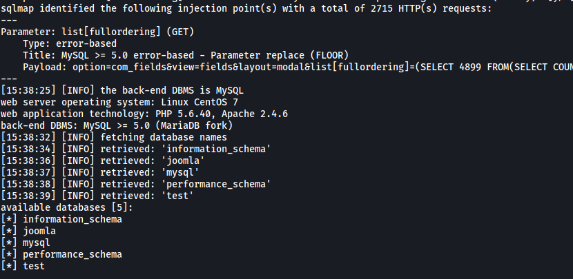

After quite some time (sqlmap can take awhile!),  we are able to enumerate the various databases stored on the backend. The database that we are particularly interested in is the **joomla** database.  

We then update our sqlmap command so as to enumerate the tables found within the 'joomla' database. To do so, we use the `-D` option to specify the database and `--tables` to dump out the table names: 

```
sqlmap -u "http://10.10.172.68/index.php?option=com_fields&view=fields&layout=modal&list[fullordering]=updatexml" --risk=3 --level=5 --random-agent --dbs -p list[fullordering] -D joomla --tables --batch
```

**Results:**

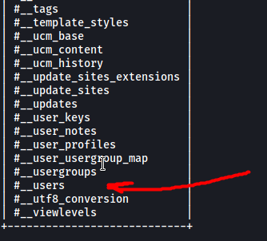

Once sqlmap is done, we find out that there are a total of 72 tables located within the 'joomla' database. Since we are trying to find out Jonah's password, the table that we are especially interested in is the **#__users** table. 

Now, we update our sqlmap command again so as to dump out the contents of this table. We use `-T` to specify the table and `--dump` to dump out all of the data.

```
sqlmap -u "http://10.10.172.68/index.php?option=com_fields&view=fields&layout=modal&list[fullordering]=updatexml" --risk=3 --level=5 --random-agent --dbs -p list[fullordering] -D joomla -T '#__users' --dump
```

At first, sqlmap was unable to retrieve the column names for the table and thus, could not dump all the table content. Fortunately for us, sqlmap allows us to run a common columns existence check using a wordlist. It also provides us with a default wordlist to use, which is all we need in this case.

**Results:**

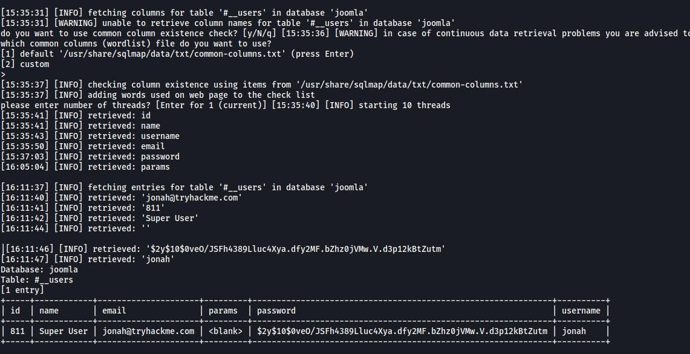

With that, we are able to enumerate the credentials of Jonah and obtain his hashed password:

> $2y$10$0veO/JSFh4389Lluc4Xya.dfy2MF.bZhz0jVMw.V.d3p12kBtZutm

To crack the password, we can use `john`. 

From the format of the hash, we know that it was hashed using the bcrypt algorithm. We save this hash to a text file and run `john` against it with the rockyou wordlist:

```
john hash.txt --wordlist=/usr/share/wordlists/rockyou.txt --format=bcrypt
```

**Results:**

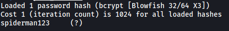

With that, we obtain Jonah's password:

> spiderman123

---

### [ What is the user flag? ]

With Jonah's credentials, we can log into Joomla CMS:

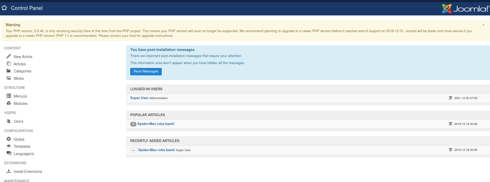

My first thought was to find a way to upload a reverse shell onto the server so that we can achieve remote code execution and gain an initial foothold onto the target machine. We will be using a [PHP reverse shell](https://github.com/pentestmonkey/php-reverse-shell).

After spending some time looking around the CMS service, I first tried uploading a reverse shell via the **Media** component (**Content** on the top bar > **Media**):

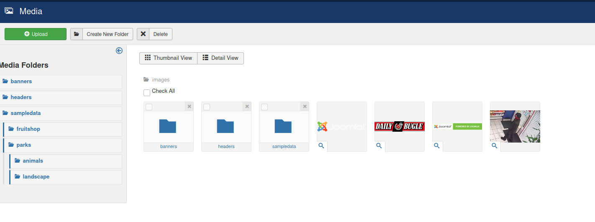

I was able to upload a test jpg file and access it by visiting the **/images** directory:

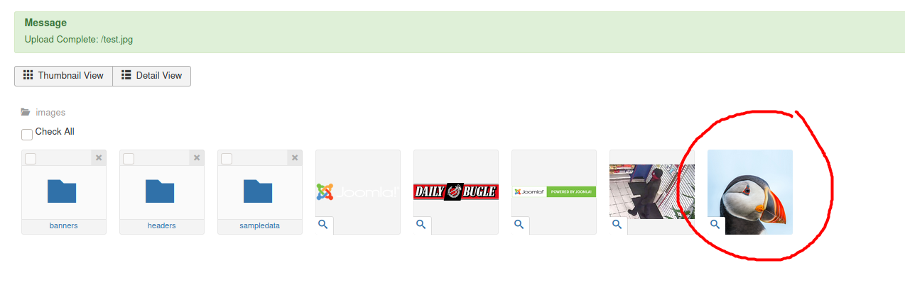

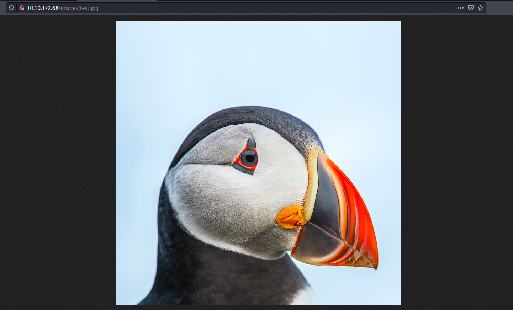

Great! At this point, I had found a way to access files that I had uploaded on the web server. This meant that I could execute any reverse shell scripts that I uploaded. Now the only issue was to circumvent the upload restrictions that were in place.

I tried many different techniques, such as changing the extension, changing the magic numbers found at the start of the reverse shell file and changing the MIME type by intercepting the upload request using Burpsuite. Unfortunately, all of these techniques did not work and I was unable to upload the reverse shell.

Later on, I found that I could disable the upload restrictions through the **Global Configuration**. I could also do things such as disable checking of MIME Types and providing .php as a legal extension:

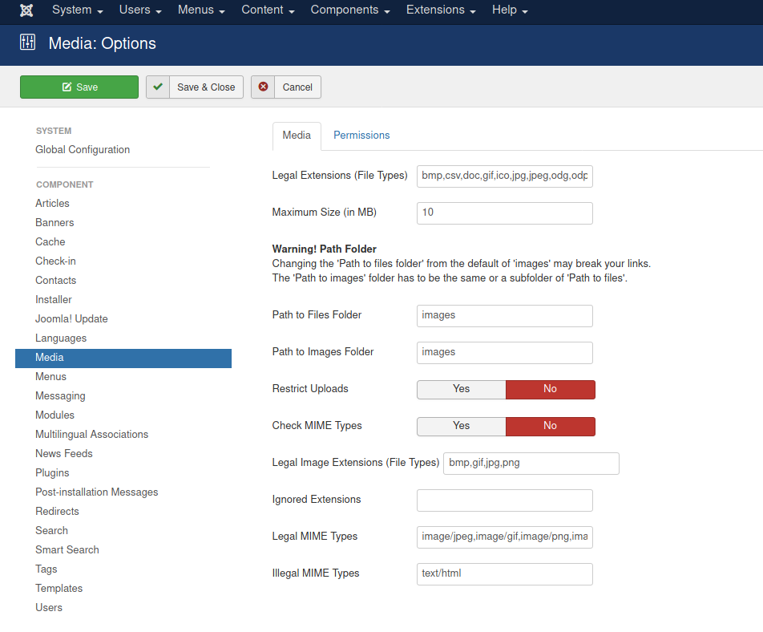

However, despite all of these configuration changes, I still could not upload the reverse shell. I spent quite awhile on this before I finally decided to move on and try a different approach.

Next, I noticed something interesting in the **Templates** component of the CMS. This can be accessed by going to **Extensions** on the top bar > **Templates** > **Templates**.

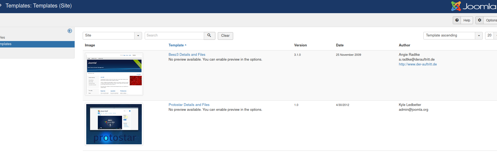

We click on the first template: **Beez3**:

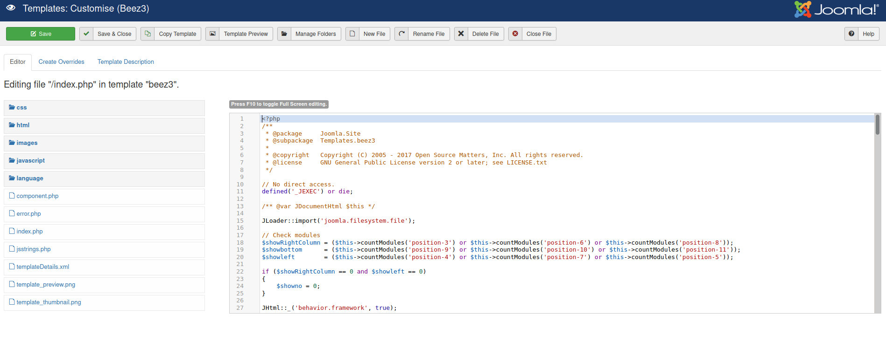

Looks like we have found a place where we can upload PHP code! 

We shall use the **error.php** file to hold our reverse shell. We simply replace its contents entirely with the reverse shell code:

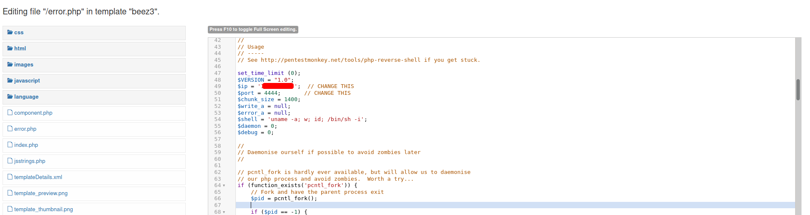

With a netcat listener up and running, we can access this reverse shell code by visiting `/templates/beez3/error.php`.

---

*I had a lot of trouble finding out where to access the template files within Joomla as my Gobuster scan did not actually reveal the /templates directory. In the end, I had to seek help from online writeups in order to discover about it. I find it strange that Gobuster did not manage to enumerate the directory as the word 'template' does indeed exist within the dirbuster's medium wordlist, which was used. Perhaps Gobuster is not completely reliable and might have missed out on that word.*

---

After accessing error.php, the reverse shell is opened and we gain access into the target machine:

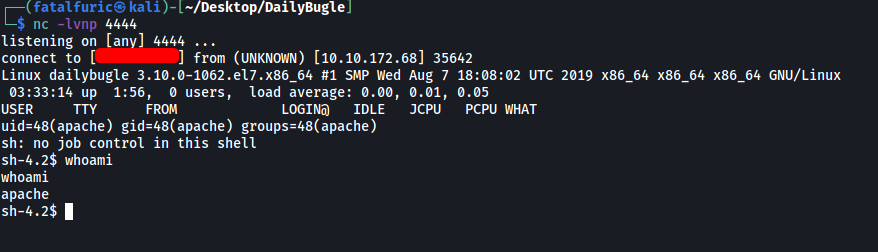

In the home directory, we can see that there is a user called **jjameson**:

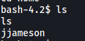

However, we are unable to access his home directory.

I then did some manual enumeration, looking through directories and searching for hidden files. I also tried to check for **sudo privileges** on the current account, but I could not do so as I did not know the user's password.

After some time, I decided to automate the process by using a tool called [LinPEAS](https://github.com/carlospolop/PEASS-ng/tree/master/linPEAS).

After downloading the program over to the target machine, I ran it and noticed something very interesting in the results:

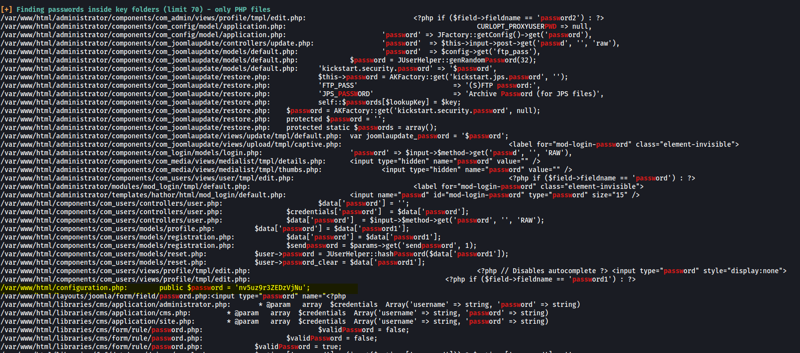

There is a password found within **configuration.php** located in the /var/www/html directory. Could this be the password to jjameson's account? Let's try:

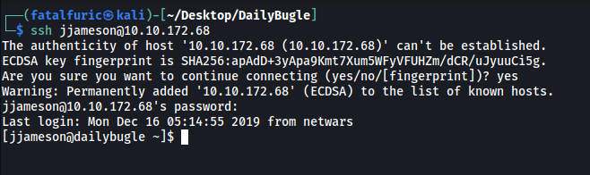

Great, it was indeed the password! We are able to log into jjameson's account.

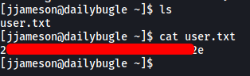

With that, we are able to obtain the **user flag** found within jjameson's home directory.

---

### [ What is the root flag? ]

Next, we need to find a way to escalate our privileges.

First, let's check out the **sudo privileges** on jjameson's account:

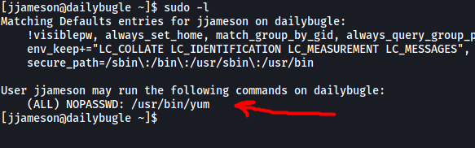

Interesting, it looks like we can run `yum` using sudo. The 'NOPASSWD' also indicates that we do not need to input the root password in order to run yum as root. This is most definitely our privilege escalation vector!

Looking at [GTFOBins](https://gtfobins.github.io/), we can find the following methods to exploit yum:

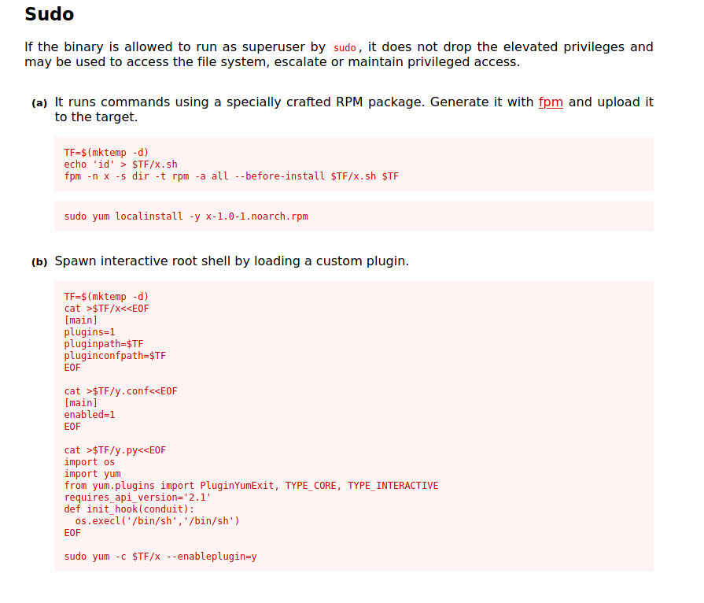

We'll use method b as method a requires us to download an external program called fpm onto the target machine, which is not the most convenient.

We simply copy-paste the commands provided in method b and execute them on our target machine:

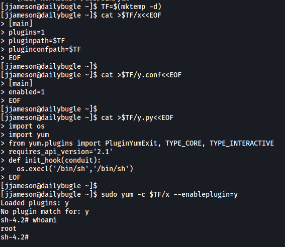

With that, we successfully spawn a root shell! We are then able to obtain the **root flag** located within /root:

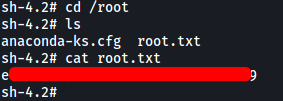

